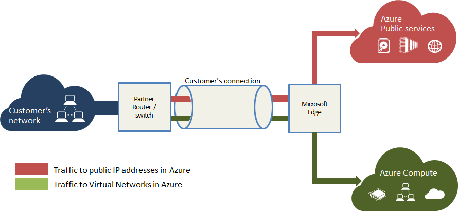

<properties 
   pageTitle="Introduction to ExpressRoute"
   description="This page provides an overview of the ExpressRoute service."
   documentationCenter="na"
   services="expressroute"
   authors="cherylmc"
   manager="adinah"
   editor="tysonn"/>
<tags 
   ms.service="expressroute"
   ms.devlang="na"
   ms.topic="article" 
   ms.tgt_pltfrm="na"
   ms.workload="infrastructure-services" 
   ms.date="04/29/2015"
   ms.author="cherylmc"/>

# ExpressRoute Technical Overview

Microsoft Azure ExpressRoute lets you create private connections between Microsoft datacenters and infrastructure that’s on your premises or in a co-location environment. With ExpressRoute, you can establish connections to Microsoft cloud services such as Microsoft Azure and Office 365 at an ExpressRoute partner co-location facility, or directly connect from your existing WAN network (such as a MPLS VPN provided by a network service provider).
 
ExpressRoute connections offer higher security, more reliability, faster speeds and lower latencies than typical connections over the Internet. In some cases, using ExpressRoute connections to transfer data between your on-premises network and Azure can also yield significant cost benefits. If you already have created a cross-premises connection from your on-premises network to Azure, you can migrate to an ExpressRoute connection while keeping your virtual network intact.

See the [ExpressRoute FAQ](expressroute-faqs.md) for more details.

## How does an ExpressRoute connection work?

In order to connect your WAN to Microsoft cloud services, you must order a dedicated circuit and have it enabled through a connectivity provider. There are two connectivity provider types to choose from: direct layer 3 through an exchange provider (EXP), or layer 3 through a network service provider (NSP). You can choose to enable one or both types of connectivity between your WAN and the Microsoft cloud.  

## Exchange Providers and Network Service Providers
ExpressRoute providers are classified as Network Service Providers (NSPs) and Exchange providers (EXPs).

|   |**Exchange Provider**|**Network Service Provider**|
|---|---|---|
|**Typical Connectivity model**| Point to point Ethernet links or Connectivity at a cloud exchange | Any to any connectivity through a telco VPN |
|**Supported Bandwidths**|200 Mbps, 500 Mbps, 1 Gbps and 10 Gbps|10 Mbps, 50 Mbps, 100 Mbps, 500 Mbps, 1 Gbps|
|**Connectivity Providers**|[Exchange Providers page](https://msdn.microsoft.com/library/azure/4da69a0f-8f52-49ea-a990-dacd4202150a#BKMK_EXP)|[Network Service Providers page](https://msdn.microsoft.com/library/azure/4da69a0f-8f52-49ea-a990-dacd4202150a#BKMK_NSP)|
|**Routing**|BGP sessions directly with customer edge routers| BGP sessions with telco|
|**Pricing**|[EXP pricing](http://azure.microsoft.com/pricing/details/expressroute/)|[NSP pricing](http://azure.microsoft.com/pricing/details/expressroute/)|

### Exchange Providers (EXPs)
We partner with cloud exchange service providers such as Equinix and TeleCity group, and also with point-to-point connectivity service providers such as Cole and Level 3, to offer connectivity between Azure and the customer’s premises. We offer circuit bandwidths from 200 Mbps to 10 Gbps (200 Mbps, 500 Mbps, 1 Gbps and 10 Gbps).

If you want a direct layer 3 connection through an exchange provider, you can do this one of 3 ways:

- You can be co-located with the cloud exchanges such as Equinix's Cloud Exchange or TeleCity's Cloud IX in the locations we offer services in. In such cases you will order redundant connectivity to the cloud exchange. 
- You can work with Ethernet providers such as Level 3 to have Ethernet circuits setup between your data centers and Microsoft. 
- You can work with your local connectivity provider to acquire redundant connectivity to the closest exchange provider facility and connect to the cloud exchange.

We do require you to have redundant connectivity me meet the requirements for our SLA. We do not support direct connectivity to the Microsoft edge. Dedicated circuits will always be enabled through an Ethernet provider or the local cloud exchange. While this sets up layer 2 connectivity between Microsoft and your network, we will not support extending the layer 2 domain. You must setup redundant routing sessions between your edge routers and the Microsoft edge routers to have layer 3 connectivity.

For more information about configuration and to see real-world examples, you can follow this step by step guidance: [Configure an ExpressRoute Connection through an EXP](expressroute-configuring-exps.md).

### Network Service Providers (NSPs)

We partner with Telcos such as AT&T, and British Telecom to offer connectivity between Azure and your WAN. We offer circuit bandwidths from 10 Mbps to 1 Gbps (10 Mbps, 50 Mbps, 100 Mbps, 500 Mbps, 1 Gbps). 

If you use VPN services from any of the network service providers we partner with, they can extend the networks into Azure without having to deploy any new hardware or making major configuration changes to your existing networks.

For more information about configuration and to see real-world examples, you can follow this step by step guidance: [Configure ExpressRoute circuits through NSPs](expressroute-configuring-nsps.md).

## ExpressRoute Peerings
The figure below provides a logical representation of connectivity between your WAN and Microsoft. You must order a “dedicated circuit” to connect your WAN to Microsoft through a connectivity provider (NSP / EXP). A “dedicated circuit” represents a logical connection between your WAN and Microsoft through the connectivity provider. You may order many dedicated circuits, each of them can be in the same or different regions and can be connected to your WAN through different service providers. 

A dedicated circuit will have multiple routing domains associated with it – public, private and Microsoft. Each of the routing domains are configured identically on a pair of routers (in active-active or loadsharing configuration) for high availability. 

### Private Peering
Azure compute services, namely virtual machines (IaaS) and cloud services (PaaS) deployed within a virtual network can be connected through the private peering domain. The private peering domain is considered to be a trusted extension of your core network into Microsoft Azure. You can setup bidirectional connectivity between your core network and Azure virtual networks (VNets). This will enable you to connect to virtual machines and cloud services directly on their private IP addresses.  

You can connect more than one virtual network to the private peering domain. Review the [FAQ page](expressroute-faqs.md) for information on limits and limitations. 
  

### Public Peering
Services such as Azure Storage, SQL databases and Websites are offered on public IP addresses. You can privately connect to services hosted on public IP addresses (including VIPs of your cloud services) through the public peering routing domain. You can connect the public peering domain to your extranet and connect to all Azure services on their public IP addresses from your WAN without having to connect through the internet. Connectivity is always initiated from your WAN to Microsoft Azure services. Microsoft Azure services will not be able to initiate connections into your network through this routing domain. Once public peering is enabled, you will be able to connect to all Azure services (we do not allow you to selectively pick services for which we advertise routes to). You can review the list of prefixes we advertise to you through this peering at [Microsoft Azure Datacenter IP Ranges](http://www.microsoft.com/en-us/download/details.aspx?id=41653) page. You can define custom route filters within your network to consume only the routes you need. 

Review the [FAQ page](expressroute-faqs.md) for more information on services supported through the public peering routing domain. 
 
### Microsoft Peering
Connectivity to all other Microsoft online services (such as Office 365 services) will be through the Microsoft peering. We enable bidirectional connectivity between your WAN and Microsoft cloud services through the Microsoft peering routing domain. You must connect to Microsoft cloud services only over public IP addresses that are owned by you or your connectivity provider and must adhere to all the rules we define. Review the [ExpressRoute prerequisites](expressroute-prerequisites.md) page for more information.

Review the [FAQ page](expressroute-faqs.md) for more information on services supported, costs and configuration details. Review the [ExpressRoute Locations](expressroute-locations.md) page for information on the list of connectivity providers offering Microsoft peering support.

The table below compares the three routing domains.

||**Private Peering**|**Public Peering**|**Microsoft Peering**|
|---|---|---|---|
|**Max. # prefixes supported per peering**|4000 by default, 10,000 with ExpressRoute Premium|4000 by default, 10,000 with ExpressRoute Premium|200|
|**IP address ranges supported**|Any valid IPv4 address within your WAN|Public IPv4 addresses owned by you or your connectivity provider|Public IPv4 ddresses owned by you or your connectivity provider|
|**AS Number Requirements**|Private and public AS numbers . Customer must own public AS number. | Private and public AS numbers . Customer must own public AS number.| Public AS numbers only. AS number must be validated against routing registries to validate ownership.|
|**Routing Interface IP adressess**|RFC1918 and public IP addresses|Public IP addresses registered to customers / NSP in routing registries.| Public IP addresses registered to customers / NSP in routing registries.|
|**MD5 Hash support**| Yes|Yes|Yes|

You can choose to enable one or more of the routing domains as part of their dedicated circuit. You can choose to have all the routing domains put on the same VPN (for NSP case) if they wish to ingest them into a single routing domain. You can also put them on different routing domains similar to the diagram above. The recommended configuration is that private peering is connected directly to the your core network, and the public and Microsoft peering links connected to your extranet.
 
If a you choose to have all three peering sessions, you must have three pairs of BGP sessions (one pair for each peering type). The BGP session pairs provide a highly available link. If you are connecting through EXPs, you will be responsible for configuring and managing routing (unless EXP offers to manage routing for you).If you choose to connect through NSPs, you can rely on the NSP to manage routing for you. You can learn more by reviewing the workflows for setting up ExpressRoute

- [Configure an ExpressRoute Connection through a Network Service Provider](expressroute-configuring-nsps.md)
- [Configure an ExpressRoute Connection through an Exchange Provider](expressroute-configuring-exps.md)

## Next Steps

- [ExpressRoute Service Providers and Locations](expressroute-locations.md) 
- [Configure an ExpressRoute Connection through a Network Service Provider](expressroute-configuring-nsps.md)
- [Configure an ExpressRoute Connection through an Exchange Provider](expressroute-configuring-exps.md)
