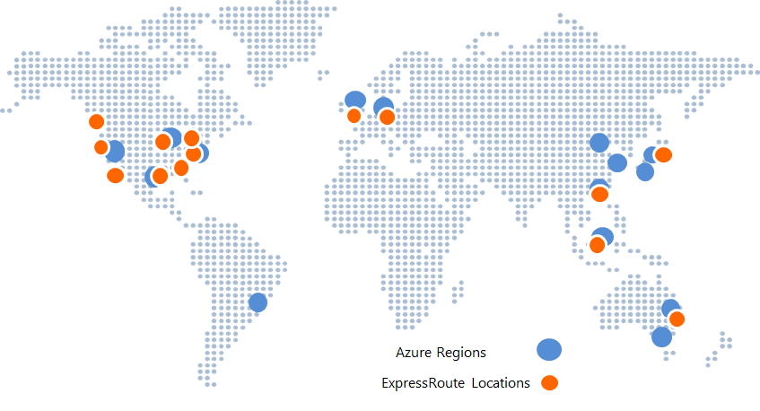

<properties
   pageTitle="ExpressRoute Locations"
   description="This page provides a detailed overview of locations where services are offered and how to connect to Azure regions."
   services="expressroute"
   documentationCenter="na"
   authors="cherylmc"
   manager="adinah"
   editor="tysonn" />
<tags 
   ms.service="expressroute"
   ms.devlang="na"
   ms.topic="article"
   ms.tgt_pltfrm="na"
   ms.workload="infrastructure-services"
   ms.date="04/29/2015"
   ms.author="cherylmc" />

# ExpressRoute Partners and Peering Locations
This table provides details on

1. ExpressRoute connectivity providers (EXPs and NSPs)
2. ExpressRoute geographical coverage
3. Microsoft cloud services supported over ExpressRoute
4. ExpressRoute System Integrators (SIs)

## ExpressRoute Connectivity Providers
ExpressRoute is supported across all Azure regions and locations. The map below provides a list of Azure regions and ExpressRoute locations. ExpressRoute locations refer to those where Microsoft peers with several service providers.
 

You will have access to Azure services across all regions within a geopolitical region if you connected to at least one ExpressRoute location within the geopolitical region. The table below provides a map of azure regions to ExpressRoute locations within a geopolitical region.

|**Geopolitical Region**|**Azure Regions**|**ExpressRoute Locations**|
|---|---|---|
|**US**|All US Regions - East US, West US,East US 2, Central US, South Central US, North Central US|Atlanta, Chicago, Dallas, Los Angeles, New York, Seattle, Silicon Valley, Washington DC|
|**South America**|Brazil South|Sao Paulo|
|**Europe**|North Europe, West Europe|Amsterdam, London|
|**Asia**|East Asia, Southeast Asia|Hong Kong, Singapore|
|**Japan**|Japan West, Japan East|Tokyo|
|**Australia**|Australia Southeast, Australia East|Sydney|

Connectivity across geopolitical regions is not supported. You can work with your connectivity provider to extend connectivity across geopolitical regions using their network.

### Exchange Provider (EXP) Locations
- See this [table](https://msdn.microsoft.com/library/azure/4da69a0f-8f52-49ea-a990-dacd4202150a#BKMK_EXP) for a list of Exchange Providers and locations where they are supported.
-  Visit the [Configure your EXP connection](expressroute-configuring-exps.md) for steps to set up your connection.

### Network Service Provider (NSP) Locations
- See this [table](https://msdn.microsoft.com/library/azure/4da69a0f-8f52-49ea-a990-dacd4202150a#BKMK_NSP) for a list of Network Service Providers and locations where they are supported.
- Visit [Configure your NSP connection](expressroute-configuring-nsps.md) for steps to set up your connection.

### Connectivity through service providers not listed above

If your connectivity provider is not in the list above sections, you can still create a connection.

- Check with your connectivity provider to see if they are connected to any of the Exchange providers in the listed EXP locations. You can check the links below to gather more information on services offered by Exchange Providers. Several connectivity providers are already connected to EXPs' Ethernet exchanges.
	- [Equinix Cloud Exchange](http://www.equinix.com/services/interconnection-connectivity/cloud-exchange/) 
	- [TeleCity CloudIX](http://www.telecitygroup.com/colocation-services/cloud-ix.htm)
- Have your connectivity provider extend your network to the Exchange location of choice.
	- Ensure that your connectivity provider extends your connectivity in a highly available manner so that there are no single points of failure.
	- Connectivity providers (specifically Ethernet providers) may require you to procure a pair of circuits to the Ethernet exchanges to ensure high availability 
- Order an ExpressRoute circuit through the Exchange provider to connect to Azure
	- Follow steps in [Configure your EXP connection](expressroute-configuring-exps.md) to set up connectivity.

|**Connectivity Provider**|**Exchange Providers**|**Peering Locations**|
|---|---|---|
|**[XO Communications](http://www.xo.com/)**|Equinix|Silicon Valley|

## ExpressRoute and Microsoft Cloud Services
The tables below provide details on connectivity providers and the list of Microsoft cloud services they support. Contact your service provider

**Exchange Providers (EXPs)**

|**Service Provider**|**Microsoft Azure Services**|**Office 365 Services**|
|---|---|---|
|**Aryaka**|Supported||
|**Colt Ethernet**|Supported||
|**Equinix**|Supported|Coming Soon|
|**InterCloud**|Supported||
|**Level 3 EVPL Service**|Supported||
|**TeleCity Group**|Supported||
|**Zayo Group**|Supported||

**Network Service Providers (NSPs)**

|**Service Provider**|**Microsoft Azure Services**|**Office 365 Services**|
|---|---|---|
|**AT&T**|Supported|Coming Soon|
|**British Telecom**|Supported|Coming Soon|
|**Colt IPVPN**|Supported||
|**Internet Initiative Japan Inc. - IIJ**|Supported||
|**Level3 IPVPN**|Supported||
|**Orange**|Supported|| 
|**SingTel**|Supported||
|**Tata Communications**|Supported||
|**Telstra Corporation**|Supported||
|**Verizon**|Supported|| 

## ExpressRoute System Integrators
Enabling private connectivity to fit your needs can be challenging based on the scale of your network. You can work with any of the System Integrators listed in the table below to assist you with onboarding to ExpressRoute. 

|**System Integrator**|**Continent**|
|---|---|
|**[Nimbo](http://www.nimbo.com/)**|US||
|**[Dotnet Solutions](http://www.dotnetsolutions.co.uk/)**|EMEA|

## Next Steps
- Verify that you meet the [ExpressRoute prerequisites](expressroute-prerequisites.md).
- Visit the [FAQ](expressroute-faqs.md) for more information.
- Select your provider and configure your connection. See 
[Configure your EXP connection](expressroute-configuring-exps.md) or [Configure your NSP connection](expressroute-configuring-nsps.md) for configuration information.