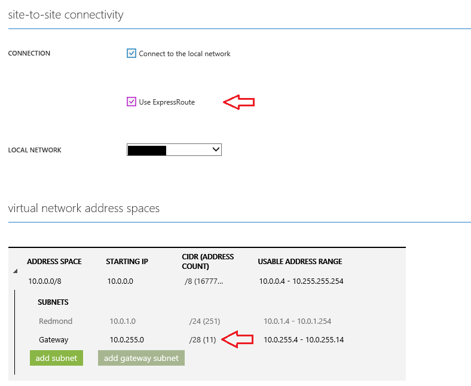

<properties
   pageTitle="Migrating your site-to-site VPN to ExpressRoute"
   description="This article will help you migrate your site-to-site VPN to ExpressRoute."
   services="expressroute"
   documentationCenter="na"
   authors="cherylmc"
   manager="adinah"
   editor="tysonn" />
<tags 
   ms.service="expressroute"
   ms.devlang="na"
   ms.topic="article"
   ms.tgt_pltfrm="na"
   ms.workload="infrastructure-services"
   ms.date="02/23/2015"
   ms.author="cherylmc" />
   
# Connection migration: from site-to-site VPN to ExpressRoute

Azure customers can connect to their virtual network in two ways: site-to-site VPN and ExpressRoute. The site-to-site VPN connection goes over the public Internet. IPsec is used to encrypt the network traffic. ExpressRoute is a private connection to Azure. You can connect to Azure either through an [Exchange Provider (EXP)](expressroute-exchange-providers.md) or a [Network Service Provider (NSP)](expressroute-network-service-providers.md).

If you already have a site-to-site VPN connection to your virtual network, you can follow the steps below to migrate it to connect through ExpressRoute.

1) Login to the Azure portal

2) In the navigation pane, click **NETWORKS** and click the virtual network that has the VPN connection

3) Click **DASHBOARD**. On the bottom of the page, click **DELETE GATEWAY**, then click **YES**.

  This step removed the site-to-site VPN gateway.

4) After the portal shows "THE GATEWAY WAS NOT CREATED" for the virtual network, click the **CONFIGURE** page.

a) Click the "Use ExpressRoute" checkbox

b) Change the CIDR for the gateway subnet to /28

5) On the bottom of the page, click **SAVE**, then click **YES**.

6) Click **DASHBOARD**. On the bottom of the page, click **CREATE GATEWAY**, then click **YES**. 

 This step created the ExpressRoute gateway
 
When the new gateway is created the virtual network is ready to connect to an ExpressRoute circuit. All the virtual machines in the virtual network are up and running throughout the process. There is no need to move or shut down them.

Go to the last step of the configuring ExpressRoute through [Exchange Providers](expressroute-configuring-exps.md) / [Network Service Providers](expressroute-configuring-nsps.md) tutorial to link your virtual network to the ExpressRoute circuit.

