# Cross-network connectivity

Fabrikam Inc. has a large physical presence and Azure deployment in East US. Fabrikam has a back-end connectivity between its on-premises and Azure deployments through ExpressRoute. Similarly, Contoso Ltd. has a presence and Azure deployment in West US. Contoso has a back-end connectivity between its on-premises and Azure deployments through ExpressRoute.  

Fabrikam Inc. acquires Contoso Ltd. Following the merger, Fabrikam wants to interconnect the networks. The following figure illustrates the scenario:

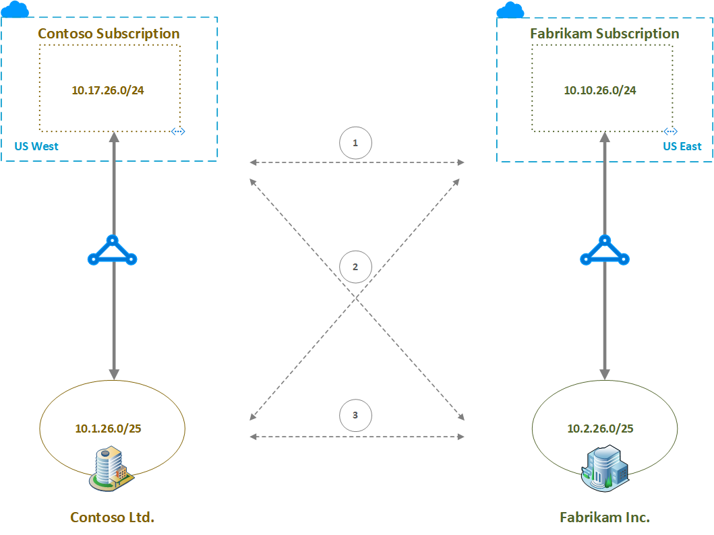

The dashed arrows in the middle of the above figure indicate the desired network interconnections. Specifically, there are three types cross connections desired: 

1. Fabrikam and Contoso virtual network cross connect
1. Cross regional on-premises and virtual network cross connects. That is, connecting Fabrikam on-premises network to Contoso virtual network and connecting Contoso on-premises network to Fabrikam virtual network.
1. Fabrikam and Contoso on-premises network cross connect

The following table shows the route table of the private peering of the ExpressRoute of Contoso Ltd., before the merger.

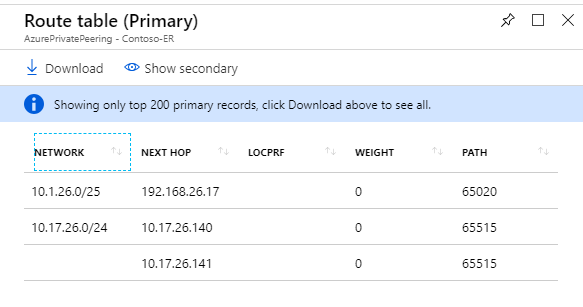

The following table shows the effective routes of a VM in the Contoso subscription, before the merger. Per the table, the VM on the VNet is aware of the VNet address space and the Contoso on-premises network, apart from the default ones.

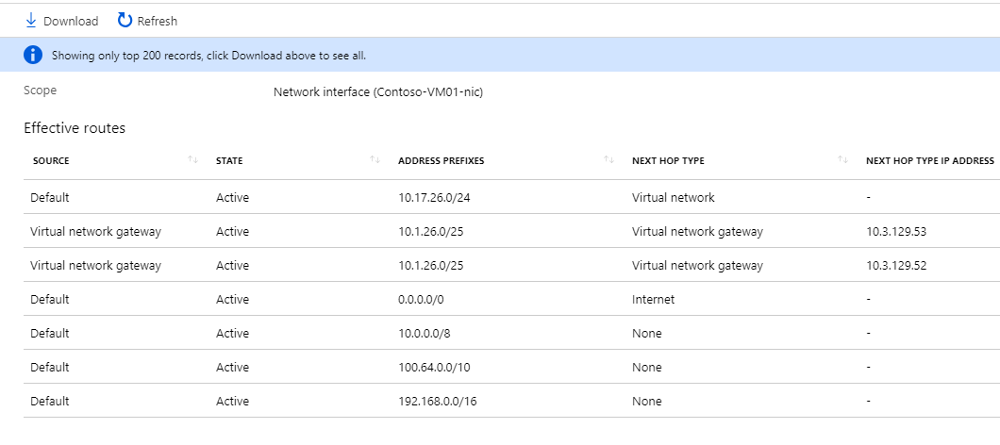

The following table shows the route table of the private peering of the ExpressRoute of Fabrikam Inc., before the merger.

The following table shows the effective routes of a VM in the Fabrikam subscription, before the merger. Per the table, the VM on the VNet is aware of the VNet address space and the Fabrikam on-premises network, apart from the default ones.

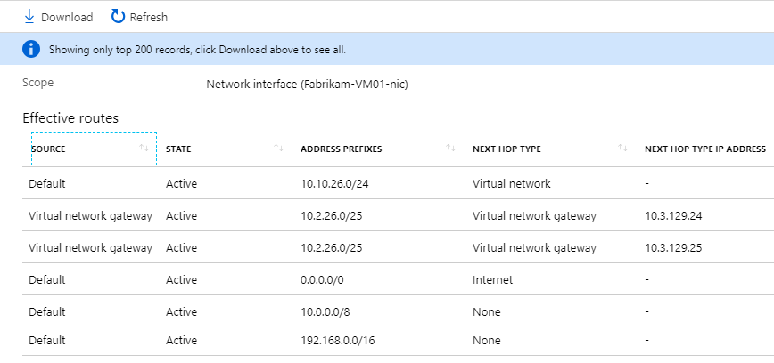

In this article, let's go through step by step and discuss how to achieve the desired cross connections using the following Azure network features:

* [Virtual network peering][Virtual network peering] 
* [Virtual network ExpressRoute connection][connection]
* [Global Reach][Global Reach] 

## Cross connecting VNets

Virtual network peering (VNet peering) provides the most optimal and the best network performance when connecting two virtual networks. VNet peering supports peering two VNets both within the same Azure region (commonly called VNet peering) and in two different Azure regions (commonly called Global VNet peering). 

Let's configure Global VNet peering between the VNets in Contoso and Fabrikam Azure subscriptions. For how to create the virtual network peering between two the virtual networks, see [Create a virtual network peering][Configure VNet peering] article.

The following picture shows the network architecture after configuring Global VNet peering.

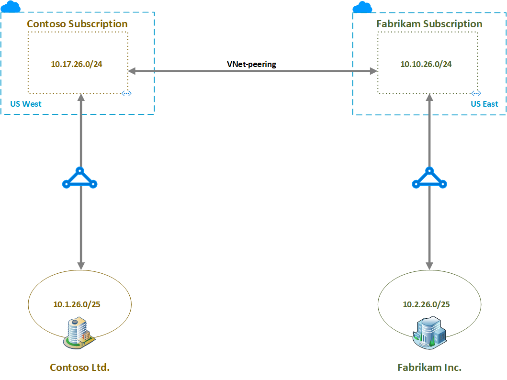

The following table shows the routes known to the Contoso subscription VM. Pay attention to the last entry of the table. This entry is the result of cross connecting the virtual networks.

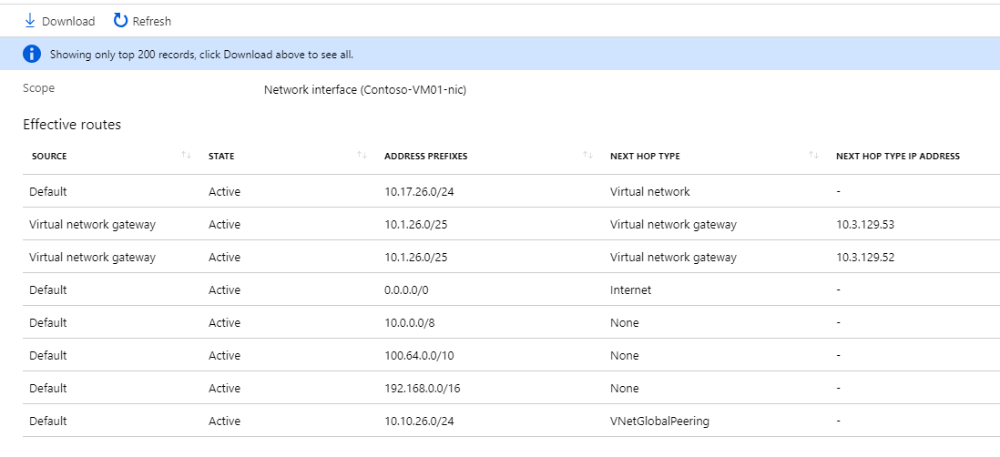

The following table shows the routes known to the Fabrikam subscription VM. Pay attention to the last entry of the table. This entry is the result of cross connecting the virtual networks.

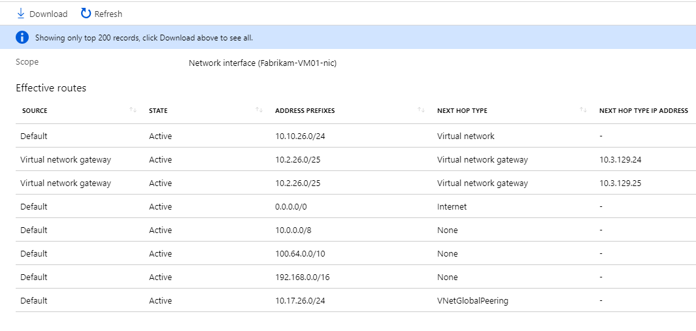

VNet peering directly links two virtual networks (see there are no next hop for *VNetGlobalPeering* entry in the two tables)

## Cross connecting VNets to the on-premises networks

We can connect an ExpressRoute circuit to multiple virtual networks. See [Subscription and service limits][Subscription limits] for the maximum number of virtual networks that can be connected to an ExpressRoute circuit. 

Let's connect Fabrikam ExpressRoute circuit to Contoso subscription VNet and similarly Contoso ExpressRoute circuit to Fabrikam subscription VNet to enable cross connectivity between virtual networks and the on-premises networks. To connect a virtual network to an ExpressRoute circuit in a different subscription, we need to create and use an authorization.  See the article: [Connect a virtual network to an ExpressRoute circuit][Connect-ER-VNet].

The following picture shows the network architecture after configuring the ExpressRoute cross connectivity to the virtual networks.

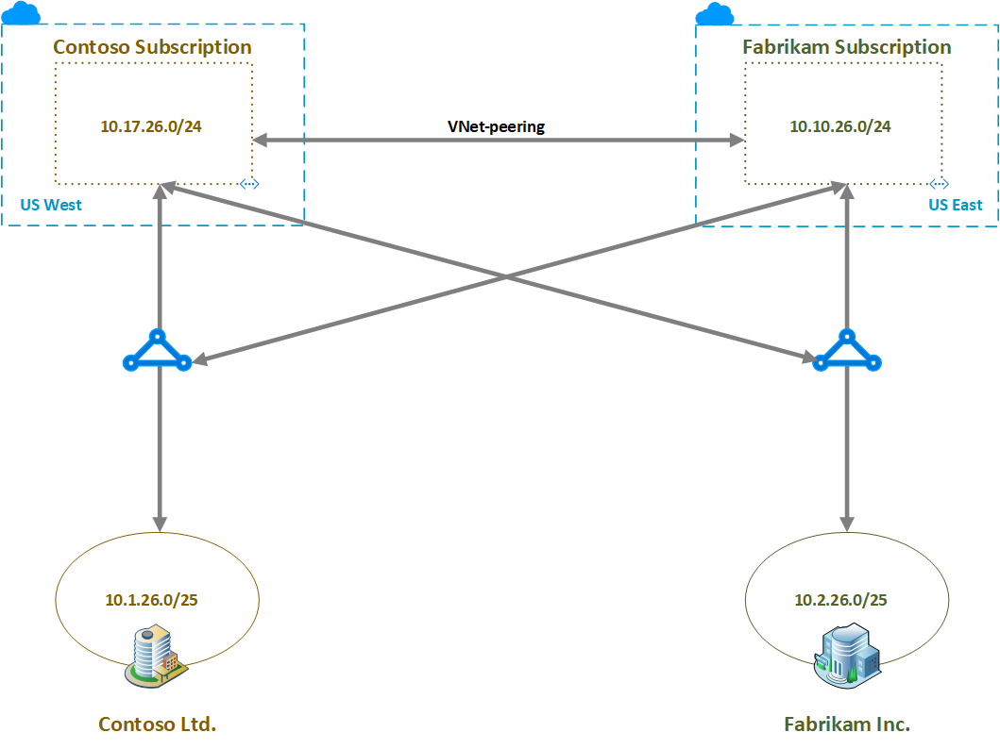

The following table shows the route table of the private peering of the ExpressRoute of Contoso Ltd., after cross connecting virtual networks to the on-premises networks via ExpressRoute. See that the route table has routes belonging to both the virtual networks.

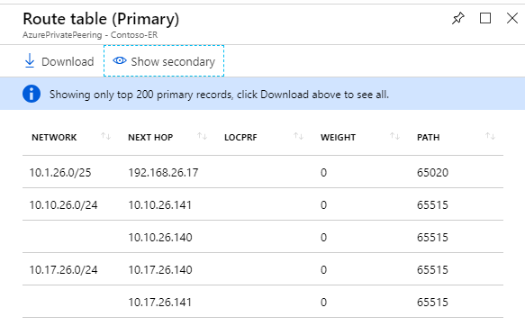

The following table shows the route table of the private peering of the ExpressRoute of Fabrikam Inc., after cross connecting virtual networks to the on-premises networks via ExpressRoute. See that the route table has routes belonging to both the virtual networks.

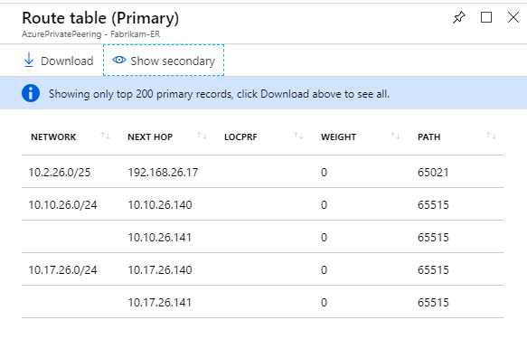

The following table shows the routes known to the Contoso subscription VM. Pay attention to *Virtual network gateway* entries of the table. The VM sees routes for both the on-premises networks.

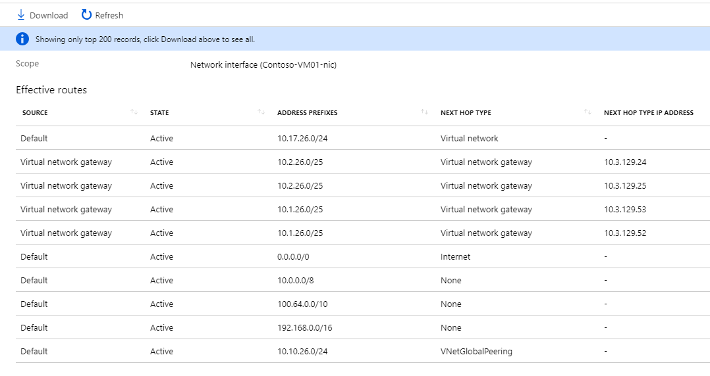

The following table shows the routes known to the Fabrikam subscription VM. Pay attention to *Virtual network gateway* entries of the table. The VM sees routes for both the on-premises networks.

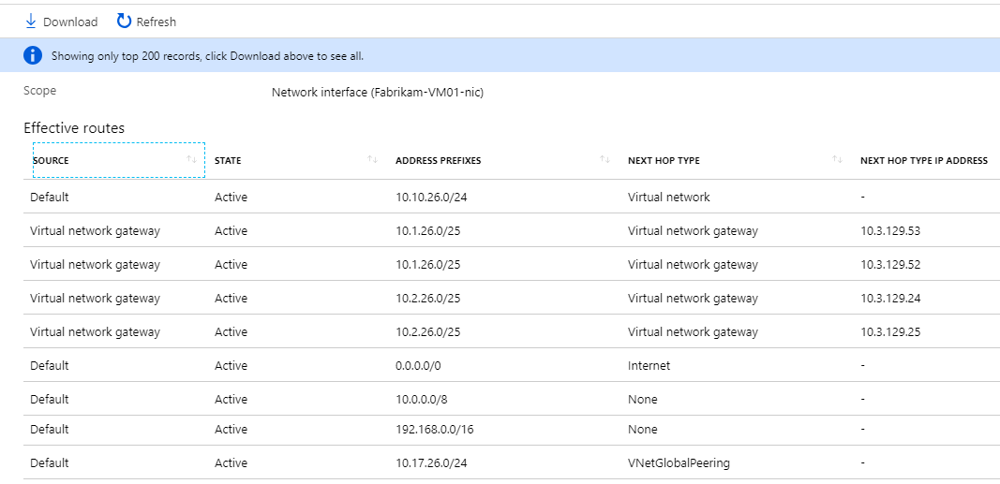

>[!NOTE]
>In either the Fabrikam and/or Contoso subscriptions you can also have spoke VNets to the respective hub VNet (a hub and spoke design is not illustrated in the architecture diagrams in this article). The cross connections between the hub VNet gateways to ExpressRoute will also allow communication between East and West hubs and spokes.
>

## Cross connecting on-premises networks

ExpressRoute Global Reach provides connectivity between on-premises networks that are connected to different ExpressRoute circuits. Let's configure Global Reach between Contoso and Fabrikam ExpressRoute circuits. Because the ExpressRoute circuits are in different subscriptions, we need to create and use an authorization. See [Configure ExpressRoute Global Reach][Configure Global Reach] article for step by step guidance.

The following picture shows the network architecture after configuring Global Reach.

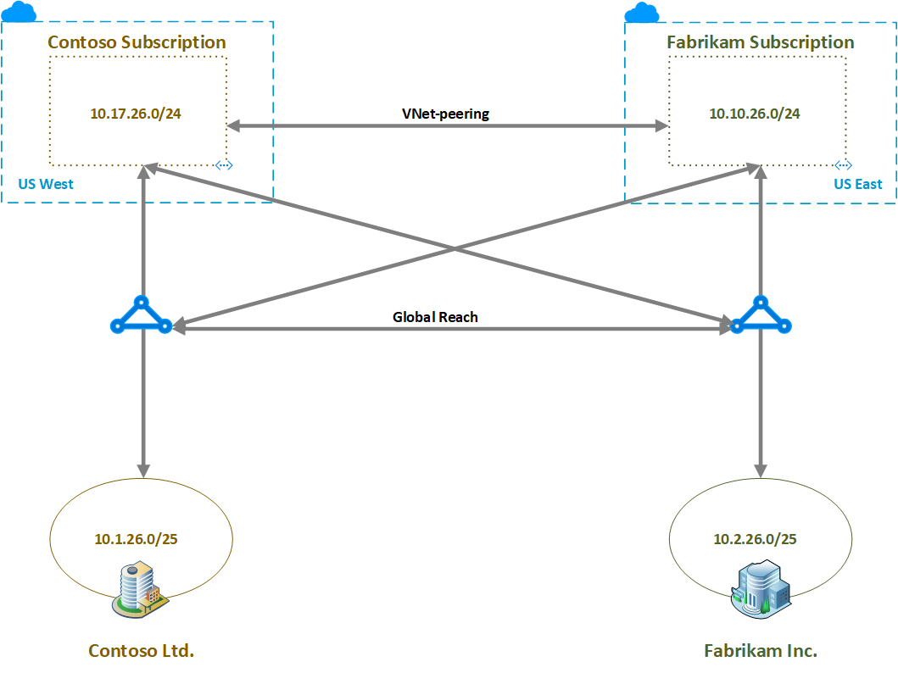

The following table shows the route table of the private peering of the ExpressRoute of Contoso Ltd., after configuring Global Reach. See that the route table has routes belonging to both the on-premises networks. 

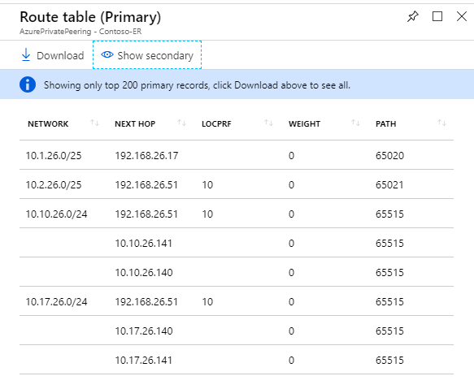

The following table shows the route table of the private peering of the ExpressRoute of Fabrikam Inc., after configuring Global Reach. See that the route table has routes belonging to both the on-premises networks.

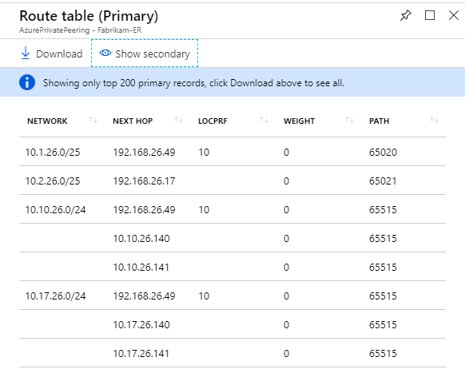

## Next steps

See [virtual network FAQ][VNet-FAQ], for any further questions on VNet and VNet-peering. See [ExpressRoute FAQ][ER-FAQ] for any further questions on ExpressRoute and virtual network connectivity.

Global Reach is rolled out on a country/region by country/region basis. To see if Global Reach is available in the countries/regions that you want, see [ExpressRoute Global Reach][Global Reach].

<!--Link References-->
[Virtual network peering]: ../virtual-network/virtual-network-peering-overview.md
[connection]: ./expressroute-howto-linkvnet-portal-resource-manager.md
[Global Reach]: ./expressroute-global-reach.md
[Configure VNet peering]: ../virtual-network/create-peering-different-subscriptions.md
[Configure Global Reach]: ./expressroute-howto-set-global-reach.md
[Subscription limits]: ../azure-resource-manager/management/azure-subscription-service-limits.md#networking-limits
[Connect-ER-VNet]: ./expressroute-howto-linkvnet-portal-resource-manager.md
[ER-FAQ]: ./expressroute-faqs.md
[VNet-FAQ]: ../virtual-network/virtual-networks-faq.md