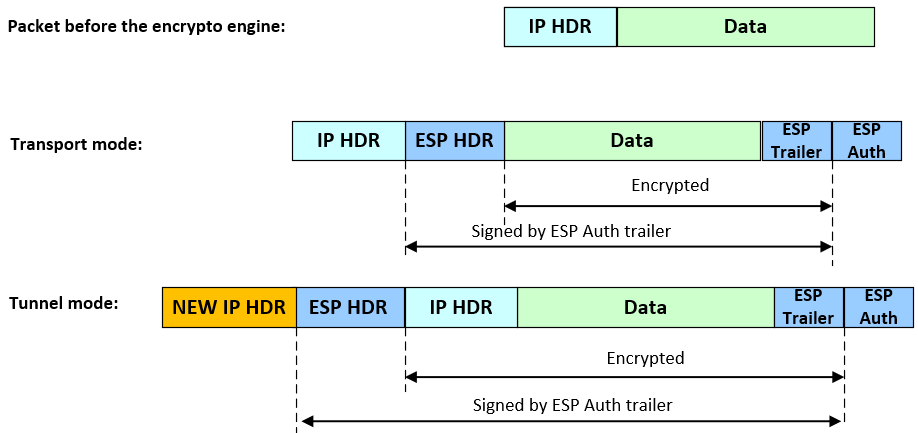
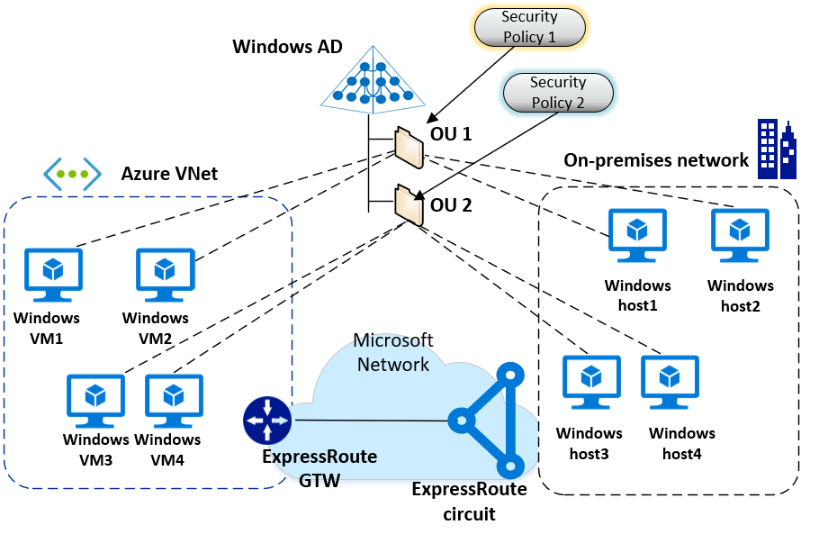

# Securing ExpressRoute private peering traffic

Traffic sent through ExpressRoute private peering is not encrypted by default. However, even though traffic is not encrypted by default, you can send encrypted traffic using a variety of configurations and modes. This article describes transport and tunnel modes.

* **Transport mode:** In most of cases, IPsec transport mode is used to encrypt the traffic between hosts. Encryption is between the on-premises hosts and the Azure VMs.
* **Tunnel mode:** IPsec tunnel mode is typically used to encrypt traffic between an on-premises VPN concentrator, and an Azure NVA (Network Virtual Appliance).

  

## Transport mode

 In most of cases, IPsec transport mode is used to encrypt the traffic between hosts. Encryption is between the on-premises hosts and the Azure VMs.

* The traffic between the on-premises host and the Azure VM is end-to-end encrypted.
* In ExpressRoute private peering, traffic doesn't traverse any NAT. IPsec transport mode can still work properly.
* IPsec transport mode has a larger MTU than tunnel mode.
* Transport mode works in cases where the IP addresses assigned to the hosts aren't required to be hidden. This scenario fits with ExpressRoute private peering transit.
* IPsec transport mode scales up better than transport mode because traffic doesn't transit through an NVA. Encryption runs on the host/Azure VM that establishes the IPsec communication. The encryption load is distributed.

### Managing Windows hosts using OUs and GPOs

If you are using Active Directory, you can use Organizational Units (OUs) and Group Policy Objects (GPO) to easily configure, manage, and maintain IPsec transport mode for Windows hosts, both on-premises hosts and Azure VMs. You can use Group Policy to assign and define the security policy associated with an OU.

Advantages to using OUs and GPOs:

* All computers in the same OU have the same security policies applied via GPO.
* You can easily change security policies by moving a computer to a different OU. The computer automatically inherits the new security policies.

This diagram shows Active Directory with two OUs (OU1 and OU2). Each OU is associated with a different security policy. The AD Domain Control can be localized on-premises, in an Azure VNet, or in both.

The encryption is agnostic to the location and can be established in any combination:

* Host (on-premises) to the Azure VM
* Azure VM-to-VM
* On-premises host-to-host

The following diagram shows traffic encryption between the on-premises hosts, and the Azure VMs. The encrypted traffic transits through ExpressRoute private peering. All the computers (on-premises and in the Azure VNet) are joined to the same Windows Active Directory and are managed through OU1. Security Policy 1 (with encryption) is applied to OU1 using a GPO. The IPsec tunnels are managed only at the OS level and are under the full control of administrator. ExpressRoute private peering won’t intervene in the encryption process.

## Tunnel mode

You can also use tunnel mode to encrypt traffic. IPsec tunnel mode is typically used to encrypt traffic between an on-premises VPN concentrator, and the Azure NVA (Network Virtual Appliance).

* The communication is encrypted only between the two IPsec gateways. The traffic in transit in ExpressRoute private peering is encrypted, but the communication between the Azure NVA and the destination VM is in cleartext. 
* In ExpressRoute private peering, you don't have NAT between the on-premises network and your Azure VNet. In this context, IPsec tunnel mode working well in the presence of NAT devices isn't an advantage.
* IPsec tunnel mode is based on the encapsulation of IP packet in IP. This results in a reduction of MTU.
* In IPsec tunnel model, only the IP addresses assigned to the two endpoints of the IPsec tunnel are transmitted in clear text. The content of inner IP packet is obfuscated. This is different from IPsec transport mode, which hides information regarding address spaces assigned to the on-premises networks and the Azure VMs. 
* The Azure NVAs have a cap on total throughput. In ExpressRoute private peering, transit through an NVA might introduce a bottleneck with intensive traffic.

## Next steps

For more information about ExpressRoute, see the [ExpressRoute FAQ](expressroute-faqs.md).