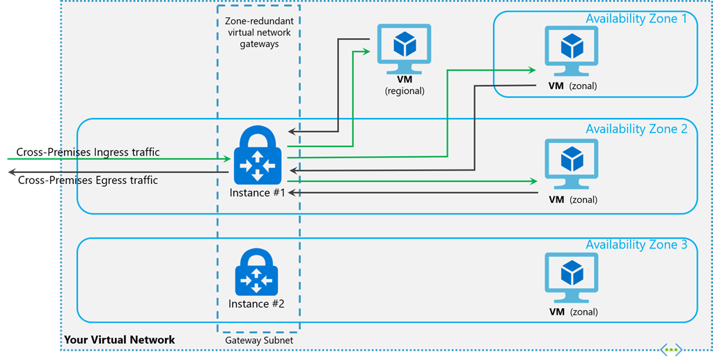

# About ExpressRoute virtual network gateways

To connect your Azure virtual network and your on-premises network using ExpressRoute, you must first create a virtual network gateway. A virtual network gateway serves two purposes: exchange IP routes between the networks and route network traffic. This article explains different gateway types, gateway SKUs, and estimated performance by SKU. This article also explains ExpressRoute [FastPath](#fastpath), a feature that enables the network traffic from your on-premises network to bypass the virtual network gateway to improve performance.

## Gateway types

When you create a virtual network gateway, you need to specify several settings. One of the required settings, `-GatewayType`, specifies whether the gateway is used for ExpressRoute, or VPN traffic. The two gateway types are:

* **Vpn** - To send encrypted traffic across the public Internet, you use the gateway type 'Vpn'. This type of gateway is also referred to as a VPN gateway. Site-to-Site, Point-to-Site, and VNet-to-VNet connections all use a VPN gateway.

* **ExpressRoute** - To send network traffic on a private connection, you use the gateway type 'ExpressRoute'. This type of gateway is also referred to as an ExpressRoute gateway and is used when configuring ExpressRoute.

Each virtual network can have only one virtual network gateway per gateway type. For example, you can have one virtual network gateway that uses `-GatewayType` Vpn, and one that uses `-GatewayType` ExpressRoute.

## <a name="gwsku"></a>Gateway SKUs

[!INCLUDE [expressroute-gwsku-include](../../includes/expressroute-gwsku-include.md)]

If you want to upgrade your gateway to a higher capacity gateway SKU, you can use the `Resize-AzVirtualNetworkGateway` PowerShell cmdlet or perform the upgrade directly in the ExpressRoute virtual network gateway configuration page in the Azure portal. The following upgrades are supported:

- Standard to High Performance
- Standard to Ultra Performance
- High Performance to Ultra Performance
- ErGw1Az to ErGw2Az
- ErGw1Az to ErGw3Az
- ErGw2Az to ErGw3Az
- Default to Standard

Additionally, you can downgrade the virtual network gateway SKU. The following downgrades are supported:
- High Performance to Standard
- ErGw2Az to ErGw1Az

For all other downgrade scenarios, you need to delete and recreate the gateway. Recreating a gateway incurs downtime.

### <a name="gatewayfeaturesupport"></a>Feature support by gateway SKU

The following table shows the features supported across each gateway type.

|Gateway SKU|VPN Gateway and ExpressRoute coexistence|FastPath|Max Number of Circuit Connections|
| --- | --- | --- | --- |
|**Standard SKU/ERGw1Az**|Yes|No|4|
|**High Perf SKU/ERGw2Az**|Yes|No|8
|**Ultra Performance SKU/ErGw3Az**|Yes|Yes|16

>[!NOTE]
> The maximum number of ExpressRoute circuits from the same peering location that can connect to the same virtual network is 4 for all gateways.
>

### <a name="aggthroughput"></a>Estimated performances by gateway SKU

[!INCLUDE [expressroute-gateway-preformance-include](../../includes/expressroute-gateway-performance-include.md)]

## <a name="gwsub"></a>Gateway subnet

Before you create an ExpressRoute gateway, you must create a gateway subnet. The gateway subnet contains the IP addresses that the virtual network gateway VMs and services use. When you create your virtual network gateway, gateway VMs are deployed to the gateway subnet and configured with the required ExpressRoute gateway settings. Never deploy anything else into the gateway subnet. The gateway subnet must be named 'GatewaySubnet' to work properly. Naming the gateway subnet 'GatewaySubnet' lets Azure know to deploy the virtual network gateway VMs and services into this subnet.

>[!NOTE]
>[!INCLUDE [vpn-gateway-gwudr-warning.md](../../includes/vpn-gateway-gwudr-warning.md)]
>

When you create the gateway subnet, you specify the number of IP addresses that the subnet contains. The IP addresses in the gateway subnet are allocated to the gateway VMs and gateway services. Some configurations require more IP addresses than others. 

When you're planning your gateway subnet size, refer to the documentation for the configuration that you're planning to create. For example, the ExpressRoute/VPN Gateway coexist configuration requires a larger gateway subnet than most other configurations. Further more, you may want to make sure your gateway subnet contains enough IP addresses to accommodate possible future configurations. While you can create a gateway subnet as small as /29, we recommend that you create a gateway subnet of /27 or larger (/27, /26 etc.). If you plan on connecting 16 ExpressRoute circuits to your gateway, you **must** create a gateway subnet of /26 or larger. If you're creating a dual stack gateway subnet, we recommend that you also use an IPv6 range of /64 or larger. This set up accommodates most configurations.

The following Resource Manager PowerShell example shows a gateway subnet named GatewaySubnet. You can see the CIDR notation specifies a /27, which allows for enough IP addresses for most configurations that currently exist.

```azurepowershell-interactive
Add-AzVirtualNetworkSubnetConfig -Name 'GatewaySubnet' -AddressPrefix 10.0.3.0/27
```

[!INCLUDE [vpn-gateway-no-nsg](../../includes/vpn-gateway-no-nsg-include.md)]

### <a name="zrgw"></a>Zone-redundant gateway SKUs

You can also deploy ExpressRoute gateways in Azure Availability Zones. This configuration physically and logically separates them into different Availability Zones, protecting your on-premises network connectivity to Azure from zone-level failures.



Zone-redundant gateways use specific new gateway SKUs for ExpressRoute gateway.

* ErGw1AZ
* ErGw2AZ
* ErGw3AZ

The new gateway SKUs also support other deployment options to best match your needs. When creating a virtual network gateway using the new gateway SKUs, you can deploy the gateway in a specific zone. This type of gateway is referred to as a zonal gateway. When you deploy a zonal gateway, all the instances of the gateway are deployed in the same Availability Zone.

## <a name="fastpath"></a>FastPath

ExpressRoute virtual network gateway is designed to exchange network routes and route network traffic. FastPath is designed to improve the data path performance between your on-premises network and your virtual network. When enabled, FastPath sends network traffic directly to virtual machines in the virtual network, bypassing the gateway.

For more information about FastPath, including limitations and requirements, see [About FastPath](about-fastpath.md).

## Connectivity to private endpoints

The ExpressRoute virtual network gateway facilitates connectivity to private endpoints deployed in the same virtual network as the virtual network gateway and across virtual network peers. 

> [!IMPORTANT]
> * Throughput and control plane capacity may be half compared to connectivity to non-private-endpoint resources.
> * During a maintenance period, you may experience intermittent connectivity issues to private endpoint resources.

### Private endpoint connectivity and planned maintenance events

Private endpoint connectivity is stateful. When a connection to a private endpoint is established over ExpressRoute private peering, inbound and outbound connections are routed through one of the backend instances of the gateway infrastructure. During a maintenance event, backend instances of the virtual network gateway infrastructure are rebooted one at a time. This could result in intermittent connectivity issues during the maintenance event.

To prevent or reduce the impact of connectivity issues with private endpoints during maintenance activities, we recommend that you adjust the TCP time-out value to a value between 15-30 seconds on your on-premises applications. Examine the requirements of your application to test and configure the optimal value.

## Route Server

The creation or deletion of an Azure Route Server from a virtual network that has a Virtual Network Gateway (either ExpressRoute or VPN) may cause downtime until the operation is completed.

## <a name="resources"></a>REST APIs and PowerShell cmdlets

For more technical resources and specific syntax requirements when using REST APIs and PowerShell cmdlets for virtual network gateway configurations, see the following pages:

| **Classic** | **Resource Manager** |
| --- | --- |
| [PowerShell](/powershell/module/servicemanagement/azure) |[PowerShell](/powershell/module/az.network#networking) |
| [REST API](/previous-versions/azure/reference/jj154113(v=azure.100)) |[REST API](/rest/api/virtual-network/) |

## VNet-to-VNet connectivity

By default, connectivity between virtual networks is enabled when you link multiple virtual networks to the same ExpressRoute circuit. Microsoft recommends not using your ExpressRoute circuit for communication between virtual networks. Instead, it's recommended to use [virtual network peering](../virtual-network/virtual-network-peering-overview.md). For more information about why VNet-to-VNet connectivity isn't recommended over ExpressRoute, see [connectivity between virtual networks over ExpressRoute](virtual-network-connectivity-guidance.md).

### Virtual network peering

A virtual network with an ExpressRoute gateway can have virtual network peering with up to 500 other virtual networks. Virtual network peering without an ExpressRoute gateway may have a higher peering limitation.

## Next steps

For more information about available connection configurations, see [ExpressRoute Overview](expressroute-introduction.md).

For more information about creating ExpressRoute gateways, see [Create a virtual network gateway for ExpressRoute](expressroute-howto-add-gateway-resource-manager.md).

For more information about configuring zone-redundant gateways, see [Create a zone-redundant virtual network gateway](../../articles/vpn-gateway/create-zone-redundant-vnet-gateway.md).

For more information about FastPath, see [About FastPath](about-fastpath.md).
