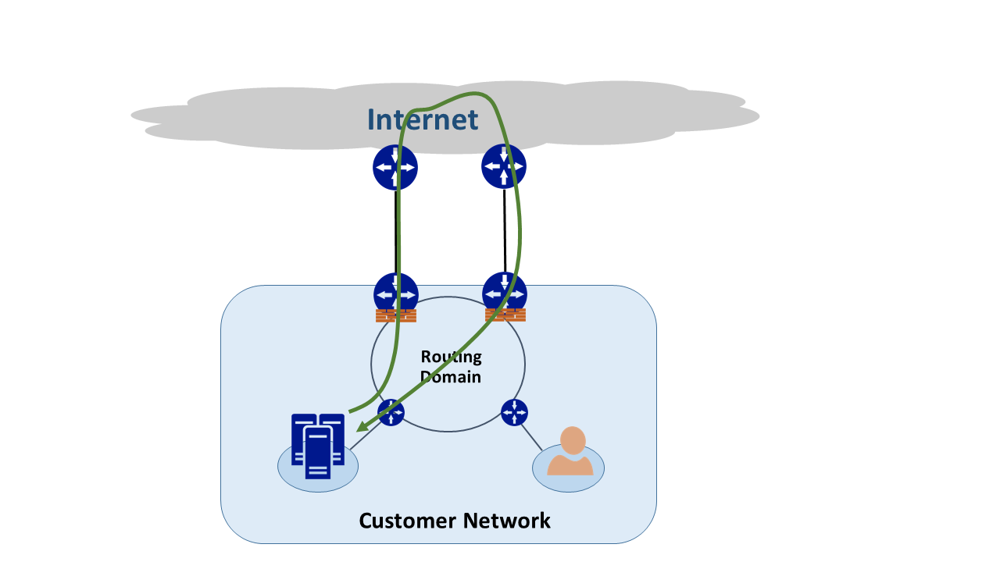
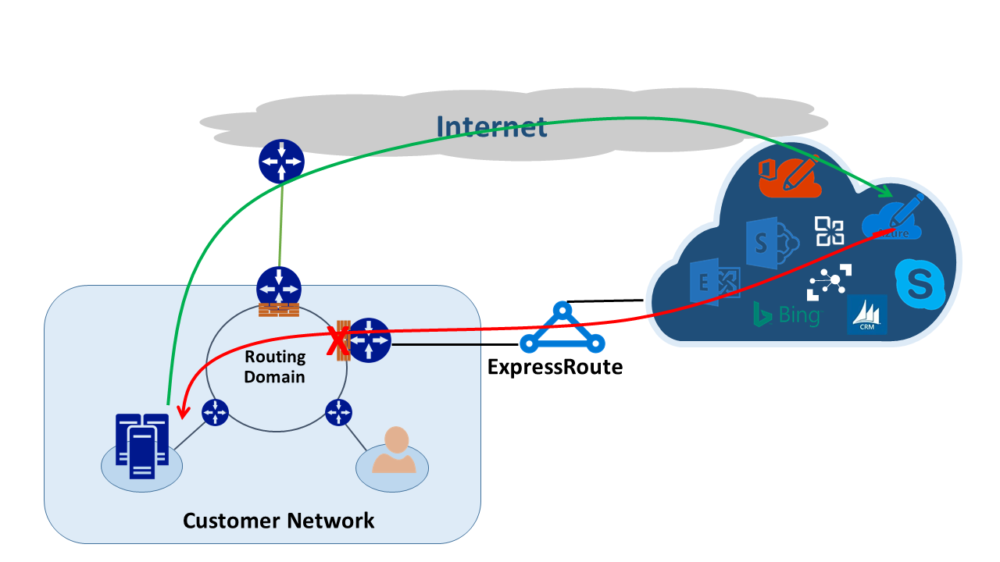
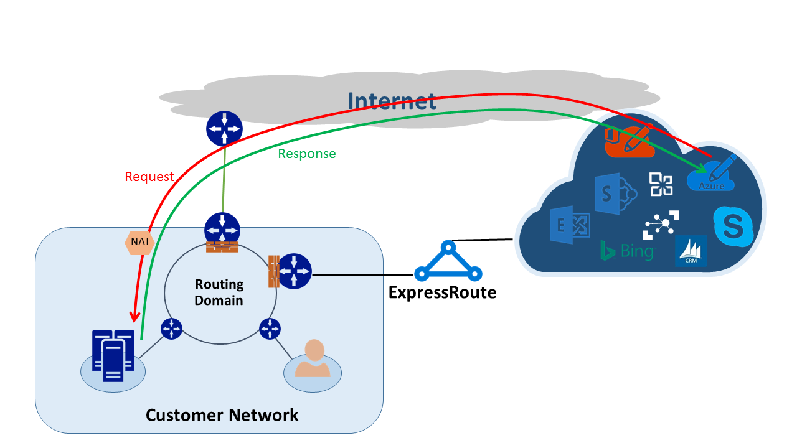

# Asymmetric routing with multiple network paths

This article explains how network traffic might take different paths when multiple routes are available between network source and destination.

There are two concepts you need to know to understand asymmetric routing. The first is the effect of multiple network paths. The other is how devices, like a firewall  keep state. These types of devices are called stateful devices. When these two factors are combined, they can create a scenario in which network traffic gets dropped by the stateful device.  The traffic is dropped because it didn't detect that the traffic originated from itself.

## Multiple network paths

When an enterprise network has only one link to the internet through an internet service provider, all traffic to and from the internet travels the same path. It's common that companies purchase multiple circuits to create redundant paths to improve network uptime. With this type of configuration it's possible that traffic goes out one link to the internet and returns through a different link. This scenario is commonly known as asymmetric routing. In asymmetric routing, the return network traffic takes a different path from the original out going flow.

Although asymmetric routing usually occurs when going to the internet. It also happens when a combination of multiple paths gets introduced. The first example is when you have an internet path and a private path that goes to the same destination. The second example is when you have multiple private paths that are also going to the same destination.

Each router along the path between the source and destination computes the best path to take to reach the destination. The router determines of best possible path based on two main factors:

* Routing between external networks is based on a routing protocol, Border Gateway Protocol (BGP). BGP takes advertisements from neighbors and runs them through a series of steps to determine the best path to the intended destination. It stores the best path in its routing table.
* The length of a subnet mask associated with a route influences routing paths. If a router receives multiple advertisements for the same IP address, the router selects the path with the longer subnet mask because it's considered a more specific route.

## Stateful devices

Routers look at the IP header of a packet for routing purposes. Some devices look even deeper inside the packet. Typically, these devices look at Layer 4 - Transmission Control Protocol (TCP) or User Datagram Protocol (UDP), or even Layer 7 (Application Layer) headers. These kinds of devices are either security devices or bandwidth-optimization devices. 

A firewall is a common example of a stateful device. A firewall permits or rejects packets to pass through its interfaces based on various criteria. These criteria include but aren't limited to protocol, TCP/UDP port, and URL headers. This level of packet inspection can put a heavy processing load on the device. 

To improve performance, the firewall inspects the first packet of a flow. If it allows the packet to pass through its interfaces, it keeps the flow information in its state table. Any ensuing packets related to this flow are then allowed based on the initial determination. A packet that is part of an existing flow may arrive at the firewall of which it didn't originate from. Since it has no prior state information about the initial flow, the firewall drops the packet.

## Asymmetric routing with ExpressRoute

When you connect to Microsoft through Azure ExpressRoute, your network changes like this:

* You have multiple links to Microsoft. One link is your existing Internet connection, and the other is through your ExpressRoute connection. Certain traffic destined for Microsoft might go through the internet connection but return over your ExpressRoute connection. The same can also happen when traffic goes over ExpressRoute but return over the internet path.
* You received more specific IP addresses from the ExpressRoute circuit. So when traffic from your network goes to Microsoft for services offered through ExpressRoute, your routers always prefer the ExpressRoute connection.

To understand the effect of how these two changes have on a network, let’s consider some scenarios. As an example, you have a circuit to the internet and you consume all Microsoft services through the internet. The traffic from your network to and from Microsoft traverses the same internet link and passes through a firewall. The firewall records the flow when it sees the first packet. Every ensuing packets of that conversation are permitted because the flow exists in the state table.

You then bring up an ExpressRoute circuit to consume services offered by Microsoft over ExpressRoute. All other services from Microsoft are consumed over the internet. You deploy a separate firewall at your edge that is connected to ExpressRoute connection. Microsoft advertises more specific prefixes to your network over ExpressRoute for certain services. Your routing infrastructure chooses ExpressRoute as the preferred path for those prefixes. 

If you don't advertise your public IP addresses to Microsoft over ExpressRoute. Microsoft communicates with your public IP addresses through the internet. Traffic sent from your network to Microsoft uses the ExpressRoute connection but the return traffic from Microsoft uses the internet path. When the firewall at your edge sees a response packet for a flow that it doesn't know about, it drops those packets.

If you choose to advertise the same network address translation (NAT) pool for ExpressRoute and for the internet. You see similar issues with the clients in your network on private IP addresses. Requests for services like Windows Update will go through the internet because IP addresses for these services aren't advertised over ExpressRoute. However, the return traffic comes back through ExpressRoute. Since Microsoft received an IP address with the same subnet mask from the internet and ExpressRoute, the preferred path is always ExpressRoute. If a firewall or another stateful device on your network edge facing the ExpressRoute connection has no prior information about a flow, it drops those packets.

## Asymmetric routing solutions
You have two available options to solve the problem of asymmetric routing. The first is through routing, and the second is by using a source-based NAT (SNAT).

### Routing
Make sure your public IP addresses are advertised to appropriate wide area network (WAN) links. For example, if you want to use the internet for authentication traffic and ExpressRoute for your mail traffic. Don't advertise your Active Directory Federation Services (AD FS) public IP addresses over ExpressRoute. Also be sure not to expose your on-premises AD FS server to IP addresses that the router receives over ExpressRoute. Routes received over ExpressRoute are more specific so they make ExpressRoute the preferred path for authentication traffic to Microsoft. If you don't pay attention to how routing is done in your network asymmetric routing problems can arise.

If you want to use ExpressRoute for authentication, make sure you're advertising AD FS public IP addresses over ExpressRoute without NAT. When configured this way, the traffic that originates from Microsoft goes to your on-premises AD FS server will go over ExpressRoute. The return traffic from your network that goes to Microsoft uses ExpressRoute because it's the preferred route over the internet.

### Source-based NAT
Another way to solve the asymmetric routing problem is by using SNAT. For example, you choose not to advertise the public IP address of an on-premises Simple Mail Transfer Protocol (SMTP) server over ExpressRoute. Instead you intend to use the internet for this type of communication. A request originating from Microsoft that goes to your on-premises SMTP server traverses the internet. You SNAT the incoming request to an internal IP address. The return traffic from the SMTP server goes to the edge firewall (which you use for NAT) instead of through ExpressRoute. As the result, the return traffic takes the internet path.

## Asymmetric routing detection
Traceroute is the best way to make sure that your network traffic is traversing the expected path. If you expect traffic from your on-premises SMTP server to Microsoft to take the internet path, the expected traceroute is from the SMTP server to Microsoft 365. The result validates that traffic is indeed leaving your network toward the internet and not toward ExpressRoute.

