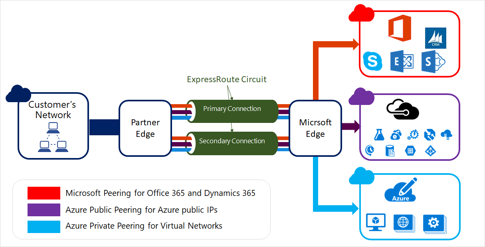
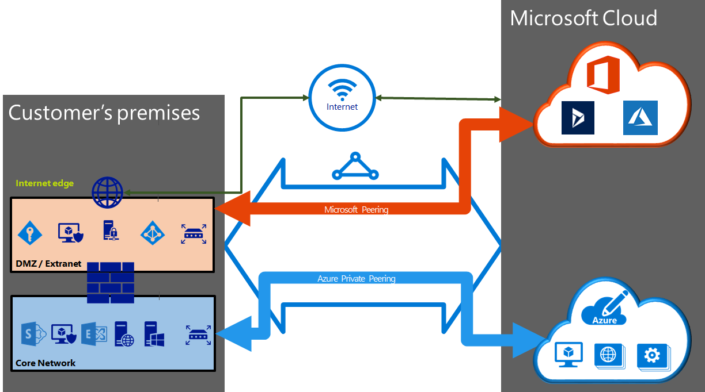

# ExpressRoute circuits and peering

ExpressRoute circuits connect your on-premises infrastructure to Microsoft through a connectivity provider. This article helps you understand ExpressRoute circuits and routing domains/peering. The following figure shows a logical representation of connectivity between your WAN and Microsoft.

> [!IMPORTANT]
> Azure public peering has been deprecated and is not available for new ExpressRoute circuits. New circuits support Microsoft peering and private peering.  
>

## ExpressRoute circuits

An ExpressRoute circuit represents a logical connection between your on-premises infrastructure and Microsoft cloud services through a connectivity provider. You can order multiple ExpressRoute circuits. Each circuit can be in the same or different regions, and can be connected to your premises through different connectivity providers.

ExpressRoute circuits do not map to any physical entities. A circuit is uniquely identified by a standard GUID called as a service key (s-key). The service key is the only piece of information exchanged between Microsoft, the connectivity provider, and you. The s-key is not a secret for security purposes. There is a 1:1 mapping between an ExpressRoute circuit and the s-key.

New ExpressRoute circuits can include two independent peerings: Private peering and Microsoft peering. Whereas existing ExpressRoute circuits may contain three peerings: Azure Public, Azure Private and Microsoft. Each peering is a pair of independent BGP sessions, each of them configured redundantly for high availability. There is a 1:N (1 <= N <= 3) mapping between an ExpressRoute circuit and routing domains. An ExpressRoute circuit can have any one, two, or all three peerings enabled per ExpressRoute circuit.

Each circuit has a fixed bandwidth (50 Mbps, 100 Mbps, 200 Mbps, 500 Mbps, 1 Gbps, 10 Gbps) and is mapped to a connectivity provider and a peering location. The bandwidth you select is shared across all circuit peerings

### Quotas, limits, and limitations

Default quotas and limits apply for every ExpressRoute circuit. Refer to the [Azure Subscription and Service Limits, Quotas, and Constraints](../azure-resource-manager/management/azure-subscription-service-limits.md) page for up-to-date information on quotas.

## ExpressRoute peering

An ExpressRoute circuit has multiple routing domains/peerings associated with it: Azure public, Azure private, and Microsoft. Each peering is configured identically on a pair of routers (in active-active or load sharing configuration) for high availability. Azure services are categorized as *Azure public* and *Azure private* to represent the IP addressing schemes.

### Azure private peering

Azure compute services, namely virtual machines (IaaS) and cloud services (PaaS), that are deployed within a virtual network can be connected through the private peering domain. The private peering domain is considered to be a trusted extension of your core network into Microsoft Azure. You can set up bi-directional connectivity between your core network and Azure virtual networks (VNets). This peering lets you connect to virtual machines and cloud services directly on their private IP addresses.  

You can connect more than one virtual network to the private peering domain. Review the [FAQ page](expressroute-faqs.md) for information on limits and limitations. You can visit the [Azure Subscription and Service Limits, Quotas, and Constraints](../azure-resource-manager/management/azure-subscription-service-limits.md) page for up-to-date information on limits.  Refer to the [Routing](expressroute-routing.md) page for detailed information on routing configuration.

### Microsoft peering

[!INCLUDE [expressroute-office365-include](../../includes/expressroute-office365-include.md)]

Connectivity to Microsoft online services (Office 365 and Azure PaaS services) occurs through Microsoft peering. We enable bi-directional connectivity between your WAN and Microsoft cloud services through the Microsoft peering routing domain. You must connect to Microsoft cloud services only over public IP addresses that are owned by you or your connectivity provider and you must adhere to all the defined rules. For more information, see the [ExpressRoute prerequisites](expressroute-prerequisites.md) page.

See the [FAQ page](expressroute-faqs.md) for more information on services supported, costs, and configuration details. See the [ExpressRoute Locations](expressroute-locations.md) page for information on the list of connectivity providers offering Microsoft peering support.

## Peering comparison

The following table compares the three peerings:

[!INCLUDE [peering comparison](../../includes/expressroute-peering-comparison.md)]

You may enable one or more of the routing domains as part of your ExpressRoute circuit. You can choose to have all the routing domains put on the same VPN if you want to combine them into a single routing domain. You can also put them on different routing domains, similar to the diagram. The recommended configuration is that private peering is connected directly to the core network, and the public and Microsoft peering links are connected to your DMZ.

Each peering requires separate BGP sessions (one pair for each peering type). The BGP session pairs provide a highly available link. If you are connecting through layer 2 connectivity providers, you are responsible for configuring and managing routing. You can learn more by reviewing the [workflows](expressroute-workflows.md) for setting up ExpressRoute.

## ExpressRoute health

ExpressRoute circuits may be monitored for availability, connectivity to VNets and bandwidth utilization using [Network Performance Monitor](https://docs.microsoft.com/azure/networking/network-monitoring-overview) (NPM).

NPM monitors the health of Azure private peering and Microsoft peering. Check out our [post](https://azure.microsoft.com/blog/monitoring-of-azure-expressroute-in-preview/) for more information.

## Next steps

* Find a service provider. See [ExpressRoute service providers and locations](expressroute-locations.md).
* Ensure that all prerequisites are met. See [ExpressRoute prerequisites](expressroute-prerequisites.md).
* Configure your ExpressRoute connection.
  * [Create and manage ExpressRoute circuits](expressroute-howto-circuit-portal-resource-manager.md)
  * [Configure routing (peering) for ExpressRoute circuits](expressroute-howto-routing-portal-resource-manager.md)
