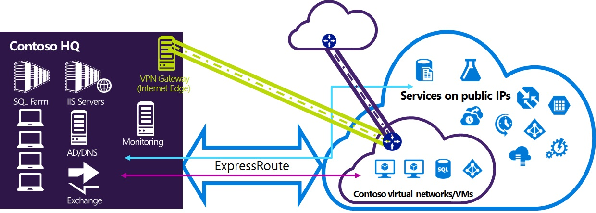

<properties
   pageTitle="Configure Expressroute and Site-to-Site VPN connections to coexist"
   description="This tutorial walks you through configuring ExpressRoute and a Site-to-Site VPN connection to coexist."
   documentationCenter="na"
   services="expressroute"
   authors="cherylmc"
   manager="adinah"
   editor="tysonn" />
<tags
   ms.service="expressroute"
   ms.devlang="na"
   ms.topic="article" 
   ms.tgt_pltfrm="na"
   ms.workload="infrastructure-services"
   ms.date="06/24/2015"
   ms.author="cherylmc"/>

# Configure ExpressRoute and Site-to-Site VPN connections to coexist

You can now connect ExpressRoute and Site-to-Site VPN to the same virtual network. This means that, by configuring both connectivity types, you can create a high availability solution or extend your network connectivity. There are two different scenarios and two different configuration procedures to choose from. 

### Scenarios

There are two different scenarios. The figure below shows both scenarios.

- **Scenario 1**- If you have one local network, ExpressRoute will be the active link, and your Site-to-Site VPN would be the backup. If the ExpressRoute connection fails, the Site-to-Site VPN connection becomes active. This scenario is most appropriate for high availability.

- **Scenario 2**- If you have two local networks, you can connect one to Azure via ExpressRoute, and the other via Site-to-Site VPN. In this case, both connections are active at the same time. This would be an example of extending connectivity.

### Configuration procedures

There are two separate configuration procedures to choose from. The configuration procedure you select will depend on whether you already have an existing virtual network that you want to connect to, or if you want to create a new virtual network.

- [Create a new virtual network and gateways for ExpressRoute and Site-to-Site coexisting connections](#create-a-new-virtual-network-and-gateways-for-expressroute-and-site-to-site-coexisting-connections): 
	If you don’t already have a virtual network, this procedure will walk you through creating a new virtual network and creating new ExpressRoute and Site-to-Site VPN connections.

- [Configure your existing virtual network for ExpressRoute and Site-to-Site VPN coexisting connections](#configure-your-existing-virtual-network-for-expressroute-and-site-to-site-coexisting-connections): 
	You may already have a virtual network in place with an existing Site-to-Site VPN connection or ExpressRoute connection. Creating a coexist connection will require you to delete your gateway, and then reconfigure it. 
	This means you will have downtime for your internal connections while you delete and recreate your gateway and connections, but you will not need to migrate any of your VMs or services to a new virtual network. Your VMs and services would still be able to communicate out through the load balancer while you configure your gateway if they are configured to do so. This procedure will walk you through deleting the gateway, and then creating new ExpressRoute and Site-to-Site VPN connections.

### Notes and limitations

- Both the ExpressRoute gateway and the Site-to-Site VPN gateway must be either a Standard or HighPerformance gateway SKU. For information about gateway SKUs, see [Gateway SKUs](../vpn-gateway/vpn-gateway-about-vpngateways.md).
- If your local network is connected to both ExpressRoute and a Site-to-Site VPN (Scenario 1), you should have a static route configured in your local network to route the Site-to-Site VPN connection to the public Internet. 
- You must create the ExpressRoute gateway first, before you add the Site-to-Site VPN gateway.
- You won’t be able to route (via Azure) between your local network connected via Site-to-Site VPN and your local network connected via ExpressRoute.

## Create a new virtual network and gateways for ExpressRoute and Site-to-Site coexisting connections

1. Verify that you have the latest version of the PowerShell cmdlets. You can download and install the latest PowerShell cmdlets from the PowerShell section of the [Download page](http://azure.microsoft.com/downloads/).
2. Create a schema for your virtual network. For more information about working with the network configuration file, see [Configure a virtual network using a network configuration file](../virtual-network/virtual-networks-using-network-configuration-file.md). For more information about the configuration schema, see [Azure Virtual Network Configuration Schema](https://msdn.microsoft.com/library/azure/jj157100.aspx).

	When you create your schema, make sure you use the following values:

	- The gateway subnet for the virtual network must be /27 (or a shorter prefix).
	- The gateway connection type is "Dedicated".

		      <VirtualNetworkSite name="MyAzureVNET" Location="Central US">
		        <AddressSpace>
		          <AddressPrefix>10.17.159.192/26</AddressPrefix>
		        </AddressSpace>
		        <Subnets>
		          <Subnet name="Subnet-1">
		            <AddressPrefix>10.17.159.192/27</AddressPrefix>
		          </Subnet>
		          <Subnet name="GatewaySubnet">
		            <AddressPrefix>10.17.159.224/27</AddressPrefix>
		          </Subnet>
		        </Subnets>
		        <Gateway>
		          <ConnectionsToLocalNetwork>
		            <LocalNetworkSiteRef name="MyLocalNetwork">
		              <Connection type="Dedicated" />
		            </LocalNetworkSiteRef>
		          </ConnectionsToLocalNetwork>
		        </Gateway>
		      </VirtualNetworkSite>

3. After creating and configuring your xml schema file, you'll upload the file. This will create your virtual network.

	Use the following cmdlet to upload your file, replacing the value with your own.

	`Set-AzureVNetConfig -ConfigurationPath 'C:\NetworkConfig.xml'`
4. Create an ExpressRoute gateway. Be sure to specify the GatewaySKU as *Standard* or *HighPerformance* and the GatewayType as *DynamicRouting*. 

	Use the sample below, substituting the values for your own.

	`New-AzureVNetGateway -VNetName MyAzureVNET -GatewayType DynamicRouting -GatewaySKU HighPerformance`

5. Link the ExpressRoute gateway to the ExpressRoute circuit. After this step has been completed, the connection between your on-premises network and Azure, through ExpressRoute, is established.

	`New-AzureDedicatedCircuitLink -ServiceKey <service-key> -VNetName MyAzureVNET`

6. Next, create your Site-to-Site VPN gateway. The GatewaySKU must be *Standard* or *HighPerformance* and the GatewayType must be *DynamicRouting*.

	`New-AzureVirtualNetworkGateway -VNetName MyAzureVNET -GatewayName S2SVPN -GatewayType DynamicRouting -GatewaySKU  HighPerformance`

	To retrieve the virtual network gateway settings, including the gateway ID and the public IP, use the `Get-AzureVirtualNetworkGateway` cmdlet. 

		Get-AzureVirtualNetworkGateway
		
		GatewayId            : 348ae011-ffa9-4add-b530-7cb30010565e
		GatewayName          : S2SVPN
		LastEventData        :
		GatewayType          : DynamicRouting
		LastEventTimeStamp   : 5/29/2015 4:41:41 PM
		LastEventMessage     : Successfully created a gateway for the following virtual network: GNSDesMoines
		LastEventID          : 23002
		State                : Provisioned
		VIPAddress           : 104.43.x.y
		DefaultSite          :
		GatewaySKU           : HighPerformance
		Location             :
		VnetId               : 979aabcf-e47f-4136-ab9b-b4780c1e1bd5
		SubnetId             :
		EnableBgp            : False
		OperationDescription : Get-AzureVirtualNetworkGateway
		OperationId          : 42773656-85e1-a6b6-8705-35473f1e6f6a
		OperationStatus      : Succeeded

7. Create a local site VPN gateway entity. This command doesn’t configure your on-premises VPN gateway. Rather, it allows you to provide the local gateway settings, such as the public IP and the on-premises address space, so that the Azure VPN gateway can connect to it. 

	**Important:** The local site for the site-to-site VPN is not defined in the netcfg. Instead, you must use this cmdlet to specify the local site parameters. You cannot define it using the Management Portal or the netcfg file.

	Use the following sample, replacing the values with your own:

	`New-AzureLocalNetworkGateway -GatewayName MyLocalNetwork -IpAddress <local-network- gateway-public-IP> -AddressSpace <local-network-address-space>`

	To retrieve the virtual network gateway settings, including the gateway ID and the public IP, use the `Get-AzureVirtualNetworkGateway` cmdlet. See the example below:

		Get-AzureLocalNetworkGateway
		
		GatewayId            : 532cb428-8c8c-4596-9a4f-7ae3a9fcd01b
		GatewayName          : MyLocalNetwork
		IpAddress            : 23.39.x.y
		AddressSpace         : {10.1.2.0/24}
		OperationDescription : Get-AzureLocalNetworkGateway
		OperationId          : ddc4bfae-502c-adc7-bd7d-1efbc00b3fe5
		OperationStatus      : Succeeded

8. Link the Site-to-Site VPN gateway on Azure to the local gateway. 

	In this example, connectedEntityId is the local gateway ID, which you can find by running `Get-AzureLocalNetworkGateway`. You can find virtualNetworkGatewayId by using the `Get-AzureVirtualNetworkGateway` cmdlet. After this step, the connection between your local network and Azure via the Site-to-Site VPN connection is established.

	`New-AzureVirtualNetworkGatewayConnection -connectedEntityId <local-network-gateway-id> -gatewayConnectionName Azure2Local -gatewayConnectionType IPsec -sharedKey abc123 -virtualNetworkGatewayId <azure-s2s-vpn-gateway-id>`

## Configure your existing virtual network for ExpressRoute and Site-to-Site coexisting connections

If you have an existing virtual network connected via either ExpressRoute or Site-to-Site VPN connection, to enable both connections to connect to the existing virtual network, you must first delete the existing gateway. This means your local premises will lose the connection to your virtual network over the gateway while you are working on this configuration. 

**Before you begin configuration:** Verify that you have enough IP addresses left in your virtual network so that you can increase the gateway subnet size.

1. Make sure that you have the latest version of the PowerShell cmdlets. You can download and install the latest PowerShell cmdlets from the PowerShell section of the [Download page](http://azure.microsoft.com/downloads/).
 
2. Delete the existing Site-to-Site gateway. Use the following cmdlet, replacing the values with your own.

	`Remove-AzureVNetGateway –VnetName MyAzureVNET`

2. Export the virtual network schema. Use the following PowerShell cmdlet, replacing the values with your own.

	`Get-AzureVNetConfig –ExportToFile “C:\NetworkConfig.xml”`
3. Edit the network configuration file schema so that the gateway subnet is /27 (or a shorter prefix). For more information about working with the network configuration file, see [Configure a Virtual Network using a network configuration file](../virtual-network/virtual-networks-using-network-configuration-file.md). For more information about the configuration schema, see [Azure Virtual Network Configuration Schema](https://msdn.microsoft.com/library/azure/jj157100.aspx).

	**Example:**

          <Subnet name="GatewaySubnet">
            <AddressPrefix>10.17.159.224/27</AddressPrefix>
          </Subnet>
4. If your previous gateway was a Site-to-Site VPN, you must also change the connection type to **Dedicated**.

		         <Gateway>
		          <ConnectionsToLocalNetwork>
		            <LocalNetworkSiteRef name="MyLocalNetwork">
		              <Connection type="Dedicated" />
		            </LocalNetworkSiteRef>
		          </ConnectionsToLocalNetwork>
		        </Gateway>
5. At this point, your configuration is ready to proceed with **Step 3** in the article, [Create a new virtual network and gateways for ExpressRoute and Site-to-Site coexisting connections](#create-a-new-virtual-network-and-gateways-for-expressroute-and-site-to-site-coexisting-connections).

## Next Steps
	
Learn more about ExpressRoute. See the [ExpressRoute Overview](../expressroute/expressroute-introduction.md).

Learn more about VPN Gateways. See [About VPN Gateways](../vpn-gateway/vpn-gateway-about-vpngateways.md).

