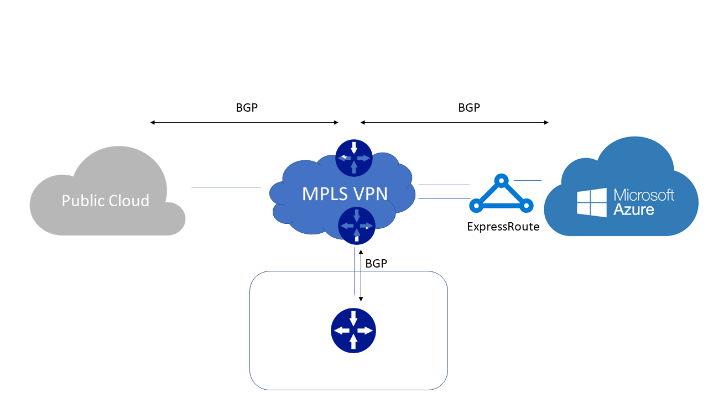

# Connecting Azure with public clouds

Many enterprises are pursuing a multi-cloud strategy because of business and technical goals. These include cost, flexibility, feature availability, redundancy, data sovereignty etc. This strategy helps them leverage best of both clouds. 

This approach also poses challenges for the enterprise in terms of network and application architecture. Some of these challenges are latency and data throughput. To address these challenges customers are looking to connect to multiple clouds directly. Some service providers provide a solution to connect multiple cloud providers for the customers. In other cases, customer can deploy their own router to connect multiple public clouds.
## Connectivity via ExpressRoute
ExpressRoute lets customers extend their on-premises networks into the Microsoft cloud over a private connection facilitated by a connectivity provider. With ExpressRoute, customers can establish connections to Microsoft cloud services.

There are three ways to connect via ExpressRoute.

1. Layer3 provider
2. Layer2 provider
3. Direct connection

### Layer3 Provider

Layer3 providers are commonly known as IP VPN or MPLS VPN providers. Customers leverage these providers for multipoint connectivity between their data centers, branches and the cloud. Customers connect to the L3 provider via BGP or via static default route. Service provider advertises routes between the customer sites, datacenters and public cloud. 
 
When connecting through Layer3 provider, Microsoft will advertise customer VNET routes to the service provider over BGP. The provider can have two different implementations.

Provider may be landing each cloud provider in a separate VRF, if traffic from all the cloud providers will reach at customer router. If customer is running BGP with service provider, then these routes will be re-advertised to other cloud providers by default. 

If service provider is landing all the cloud providers in the same VRF, then routes will be advertised to other cloud providers from the service provider directly. This is assuming standard BGP operation where eBGP routes are advertised to other eBGP neighbors by default.

Each public cloud has different prefix limit so while distributing the routes service provider should take caution in distributing the routes.

### Layer2 Provider and Direct connection

Although physical connectivity in both models is different, but at layer3 BGP is established directly between MSEE and the customer router. For ExpressRoute Direct customer connects to MSEE directly. While in case of Layer2, service provider extends VLAN from customer premises to the cloud. Customers run BGP on top of layer2 network to connect their DCs to the cloud.

In both cases, customer will have point-to-point connections to each of the public clouds. Customer will establish separate BGP connection to each public cloud. Routes received by one cloud provider will be advertised to other cloud provider by default. Each cloud provider has different prefix limit so while advertising the routes customer should take care of these limits. Customer can use usual BGP knobs with Microsoft while advertising routes from other public clouds.

## Direct connection with ExpressRoute

Customers can choose to connect ExpressRoute directly to the cloud provider's direct connectivity offering. Two cloud providers will be connected back to back and BGP will be established directly between their routers. This type of connection is available with Oracle today.

## Site-to-site VPN

Customers can leverage Internet to connect their instances in Azure with other public clouds. Almost all the cloud providers offer site-to-site VPN capabilities. However, there could be incompatibilities because of lack of certain variants. For example, some cloud providers only support IKEv1 so there is a VPN termination endpoint required in that cloud. For those cloud providers supporting IKEv2 a direct tunnel can be established between VPN gateways at both cloud providers.

Site-to-site VPN is not considered a high throughput and low latency solution. However, it can be used as a backup to physical connectivity.

## Next steps
See [ExpressRoute FAQ][ER-FAQ] for any further questions on ExpressRoute and virtual network connectivity.

See [Set up direct connection between Azure and Oracle Cloud][ER-OCI] for connectivity between Azure and Oracle

<!--Link References-->
[ER-FAQ]: https://docs.microsoft.com/azure/expressroute/expressroute-faqs
[ER-OCI]: https://docs.microsoft.com/azure/virtual-machines/workloads/oracle/configure-azure-oci-networking

