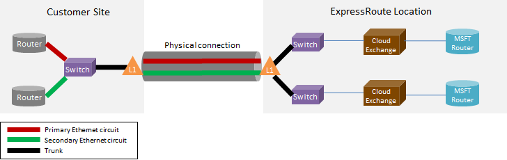

<properties
   pageTitle="ExpressRoute FAQ"
   description="The ExpressRoute FAQ contains information about Supported Azure Services, Cost, Data and Connections, SLA, Providers and Locations, Bandwidth, and additional Technical Details."
   documentationCenter="na"
   services="expressroute"
   authors="cherylmc"
   manager="carmonm"
   editor=""/>
<tags
   ms.service="expressroute"
   ms.devlang="na"
   ms.topic="article" 
   ms.tgt_pltfrm="na"
   ms.workload="infrastructure-services"
   ms.date="06/13/2016"
   ms.author="cherylmc"/>

# ExpressRoute FAQ

## What is ExpressRoute?
ExpressRoute is an Azure service that lets you create private connections between Microsoft datacenters and infrastructure that’s on your premises or in a colocation facility. ExpressRoute connections do not go over the public Internet, and offer higher security, reliability and speeds with lower latencies than typical connections over the Internet.

### What are the benefits of using ExpressRoute and private network connections?
ExpressRoute connections do not go over the public Internet, and offer higher security, reliability and speeds with lower and consistent latencies than typical connections over the Internet. In some cases, using ExpressRoute connections to transfer data between on-premises devices and Azure can yield significant cost benefits.

### What Microsoft cloud services are supported over ExpressRoute?
ExpressRoute supports most Microsoft Azure services today including Office 365.  Look for updates on general availability soon.

### Where is the service available?
See this page for service location and availability: [ExpressRoute partners and locations](expressroute-locations.md).

### How can I use ExpressRoute to connect to Microsoft if I don’t have partnerships with one of the ExpressRoute-carrier partners?
You can select a regional carrier and land Ethernet connections to one of the supported exchange provider locations. You can then peer with Microsoft at the provider location. Check the last section of [ExpressRoute partners and locations](expressroute-locations.md) to see if your service provider is present in any of the exchange locations. You can then order an ExpressRoute circuit through the service provider to connect to Azure.

### How much does ExpressRoute cost?
Check [pricing details](https://azure.microsoft.com/pricing/details/expressroute/) for pricing information.

### If I pay for an ExpressRoute circuit of a given bandwidth, does the VPN connection I purchase from my network service provider have to be the same speed?
No. You can purchase a VPN connection of any speed from your service provider. However, your connection to Azure will be limited to the ExpressRoute circuit bandwidth that you purchase.

### If I pay for an ExpressRoute circuit of a given bandwidth, do I have the ability to burst up to higher speeds if required?
Yes. ExpressRoute circuits are configured to support cases where you can burst up to two times the bandwidth limit you procured for no additional cost. Check with your service provider if they support this capability.

### Can I use the same private network connection with Virtual Network and other Azure services simultaneously?
Yes. An ExpressRoute circuit, once setup will allow you to access services within a virtual network and other Azure services simultaneously. You will connect to virtual networks over the private peering path and other services over the public peering path.

### Does ExpressRoute offer a Service Level Agreement (SLA)?
Please refer to the [ExpressRoute SLA page](https://azure.microsoft.com/support/legal/sla/) for more information.

## Supported services
Most Azure services are supported over ExpressRoute.

- Connectivity to virtual machines and cloud services deployed in virtual networks are supported over the private peering path.
- Azure Websites are supported over the public peering path.
- Office 365 is supported over the Microsoft peering path.
- All other services are accessible over the public peering path. The exceptions are as follows.

	**The following services are not supported:**

	- CDN
	- Visual Studio Team Services Load Testing
	- Multi-factor Authentication
	- Traffic Manager

## Data and connections

### Are there limits on the amount of data that I can transfer using ExpressRoute?
We do not set a limit on the amount of data transfer. Refer to [pricing details](https://azure.microsoft.com/pricing/details/expressroute/) for information on bandwidth rates.

### What connection speeds are supported by ExpressRoute?
Supported bandwidth offers:

|50 Mbps, 100 Mbps, 200 Mbps, 500 Mbps, 1Gbps, 2 Gbps,  5 Gbps, 10Gbps|

### Which service providers are available?
See [ExpressRoute partners and locations](expressroute-locations.md) for the list of service providers and locations.

## Technical details

### What are the technical requirements for connecting my on-premises location to Azure?
Please see [ExpressRoute prerequisites page](expressroute-prerequisites.md) for requirements.

### Are connections to ExpressRoute redundant?
Yes. Each Express Route circuit has a redundant pair of cross connections configured to provide high availability.

### Will I lose connectivity if one of my ExpressRoute links fail?
You will not lose connectivity if one of the cross connections fails. A redundant connection is available to support the load of your network. You can additionally create multiple circuits in a different peering location to achieve failure resilience.

### If I'm not co-located at a cloud exchange and my service provider offers point-to-point connection, do I need to order two physical connections between my on-premises network and Microsoft? 
No, you only need one physical connection if your service provider can establish two Ethernet virtual circuits over the physical connection. The physical connection (e.g. an optical fiber) is terminated on a layer 1 (L1) device (see image below). The two Ethernet virtual circuits are tagged with different VLAN IDs, one for the primary circuit and one for the secondary. Those VLAN IDs are in the outer 802.1Q Ethernet header. The inner 802.1Q Ethernet header (not shown) is mapped to a specific [ExpressRoute routing domain](expressroute-circuit-peerings.md). 

### Can I extend one of my VLANs to Azure using ExpressRoute?
No. We do not support layer 2 connectivity extensions into Azure.

### Can I have more than one ExpressRoute circuit in my subscription?
Yes. You can have more than one ExpressRoute circuit in your subscription. The default limit on the number of dedicated circuits is set to 10. You can contact Microsoft Support to increase the limit if needed.

### Can I have ExpressRoute circuits from different service providers?
Yes. You can have ExpressRoute circuits with many service providers. Each ExpressRoute circuit will be associated with one service provider only.

### How do I connect my virtual networks to an ExpressRoute circuit
The basic steps are outlined below.

- You must establish an ExpressRoute circuit and have the service provider enable it.
- You or the provider must configure the BGP peering(s).
- You must link the virtual network to the ExpressRoute circuit.

See [ExpressRoute workflows for circuit provisioning and circuit states](expressroute-workflows.md) for more information.

### Are there connectivity boundaries for my ExpressRoute circuit?
Yes. [ExpressRoute partners and locations](expressroute-locations.md) page provides an overview of the connectivity boundaries for an ExpressRoute circuit. Connectivity for an ExpressRoute circuit is limited to a single geopolitical region. Connectivity can be expanded to cross geopolitical regions by enabling the ExpressRoute premium feature.

### Can I link to more than one virtual network to an ExpressRoute circuit?
Yes. You can link up to 10 virtual networks to an ExpressRoute circuit.

### I have multiple Azure subscriptions that contain virtual networks. Can I connect virtual networks that are in separate subscriptions to a single ExpressRoute circuit?
Yes. You can authorize up to 10 other Azure subscriptions to use a single ExpressRoute circuit. This limit can be increased by enabling the ExpressRoute premium feature.

For more details, see [Sharing an ExpressRoute circuit across multiple subscriptions](expressroute-howto-linkvnet-arm.md).

### Are virtual networks connected to the same circuit isolated from each other?
No. All virtual networks linked to the same ExpressRoute circuit are part of the same routing domain and are not isolated from each other from a routing perspective. If you need route isolation, you’ll need to create a separate ExpressRoute circuit.

### Can I have one virtual network connected to more than one ExpressRoute circuit?
Yes. You can link a single virtual network with up to 4 ExpressRoute circuits. They must be ordered through 4 different [ExpressRoute locations](expressroute-locations.md).

### Can I access the internet from my virtual networks connected to ExpressRoute circuits?
Yes. If you have not advertised default routes (0.0.0.0/0) or internet route prefixes through the BGP session, you will be able to connect to the internet from a virtual network linked to an ExpressRoute circuit.

### Can I block internet connectivity to virtual networks connected to ExpressRoute circuits?
Yes. You can advertise default routes (0.0.0.0/0) to block all internet connectivity to virtual machines deployed within a virtual network and route all traffic out through the ExpressRoute circuit. Note that if you advertise default routes, we will force traffic to services offered over public peering (such as Azure storage and SQL DB) back to your premises. You will have to configure your routers to return traffic to Azure through the public peering path or over the internet.

### Can virtual networks linked to the same ExpressRoute circuit talk to each other?
Yes. Virtual machines deployed in virtual networks connected to the same ExpressRoute circuit can communicate with each other.

### Can I use site-to-site connectivity for virtual networks in conjunction with ExpressRoute?
Yes. ExpressRoute can coexist with site-to-site VPNs.

### Can I move a virtual network from site-to-site / point-to-site configuration to use ExpressRoute?
Yes. You will have to create an ExpressRoute gateway within your virtual network. There will be a small downtime associated with the process.

### What do I need to connect to Azure storage over ExpressRoute?
You must establish an ExpressRoute circuit and configure routes for public peering.

### Are there limits on the number of routes I can advertise?
Yes. We accept up to 4000 route prefixes for private peering and 200 each for public peering and Microsoft peering. You can increase this to 10,000 routes for private peering if you enable the ExpressRoute premium feature.

### Are there restrictions on IP ranges I can advertise over the BGP session?
We do not accept private prefixes (RFC1918) in the Public and Microsoft peering BGP session.

### What happens if I exceed the BGP limits?
BGP sessions will be dropped. They will be reset once the prefix count goes below the limit.

### What is the ExpressRoute BGP hold time? Can it be adjusted?
The hold time is 180. The keep-alive messages are sent every 60 seconds. These are fixed settings on the Microsoft side that cannot be changed.

### After I advertise the default route (0.0.0.0/0) to my virtual networks, I can't activate Windows running on my Azure VMs. How to I fix this?
The following steps will help Azure recognize the activation request:

1. Establish the public peering for your ExpressRoute circuit.
2. Perform a DNS lookup and find the IP address of **kms.core.windows.net**
3. Then do one of the following two items so that the Key Management Service will recognize that the activation request comes from Azure and will honor the request.
	- On your on-premises network, route the traffic destined for the IP address (obtained in step 2) back to Azure via the public peering.
	- Have your NSP provider hair-pin the traffic back to Azure via the public peering.

### Can I change the bandwidth of an ExpressRoute circuit?
Yes. You can increase the bandwidth of an ExpressRoute circuit without having to tear it down. You will have to follow up with your connectivity provider to ensure that they update the throttles within their networks to support the bandwidth increase. You will however not be able to reduce the bandwidth of an ExpressRoute circuit. Having to lower the bandwidth will mean a tear down and recreation of an ExpressRoute circuit.

### How do I change the bandwidth of an ExpressRoute circuit?
You can update the bandwidth of the ExpressRoute circuit using the update dedicated circuit API and PowerShell cmdlet.

## ExpressRoute Premium

### What is ExpressRoute premium?
ExpressRoute premium is a collection of features listed below.

 - Increased routing table limit from 4000 routes to 10,000 routes for private peering.
 - Increased number of VNets that can be connected to the ExpressRoute circuit (default is 10). See table below for more details.
 - Global connectivity over the Microsoft core network. You will now be able to link a VNet in one geopolitical region with an ExpressRoute circuit in another region. **Example:** You can link a VNet created in Europe West to an ExpressRoute circuit created in Silicon Valley.
 - Connectivity to Office 365 services and CRM Online.

### How many VNets can I link to an ExpressRoute circuit if I enabled ExpressRoute premium?
The table below provides the increased limits for the number of VNets you can link to an ExpressRoute circuit. Default limit is 10.

**Limits for circuits**

| **Circuit Size** | **Number of VNet links for default setup** | **Number of VNet Links with ExpressRoute Premium** |
|--------------|----------------------------------------|-----------------------------------------------|
| 50 Mbps      | 10                                     | 10                                            |
| 100 Mbps     | 10                                     | 20                                            |
| 200 Mbps     | 10                                     | 25                                            |
| 500 Mbps     | 10                                     | 40                                            |
| 1 Gbps       | 10                                     | 50											|
| 2 Gbps	   | 10										| 60											|
| 5 Gbps       | 10                                		| 75											|
| 10 Gbps      | 10                                		| 100                                          |

### How do I enable ExpressRoute premium?
ExpressRoute premium features can be enabled when the feature is enabled and can be shut down by updating the circuit state. You can enable ExpressRoute premium at circuit creation time or can call the update dedicated circuit API / PowerShell cmdlet to enable ExpressRoute premium.

### How do I disable ExpressRoute premium?
You can disable ExpressRoute premium by calling the update dedicated circuit API / PowerShell cmdlet You must ensure that you have scaled your connectivity needs to meet the default limits before you disable ExpressRoute premium. We will fail request to disable ExpressRoute premium if your utilization scales beyond the default limits.

### Can I pick and choose the features I want from the premium feature set?
No. You will not be able to pick the features you need. We enable all features when you turn on ExpressRoute premium.

### How much does ExpressRoute premium cost?
Refer to [pricing details](https://azure.microsoft.com/pricing/details/expressroute/) for cost.

### Do I pay for ExpressRoute premium in addition to standard ExpressRoute charges?
Yes. ExpressRoute premium charges apply on top of ExpressRoute circuit charges and charges required by the connectivity provider.

## ExpressRoute and Office 365 Services and CRM Online

[AZURE.INCLUDE [expressroute-office365-include](../../includes/expressroute-office365-include.md)]

### How do I create an ExpressRoute circuit to connect to Office 365 services and CRM Online?

1. Review the  [ExpressRoute prerequisites page](expressroute-prerequisites.md) page to make sure you meet the requirements.
2. Review the list of service providers and locations at [ExpressRoute partners and locations](expressroute-locations.md) to ensure that your connectivity needs are met.
3. Plan your capacity requirements by reviewing [Network planning and performance tuning for Office 365](http://aka.ms/tune/).
4. Follow the steps listed in the workflows below to setup connectivity [ExpressRoute workflows for circuit provisioning and circuit states](expressroute-workflows.md).

>[AZURE.IMPORTANT] Ensure that you have enabled ExpressRoute premium add-on when configuring connectivity to Office 365 services and CRM Online.

### Do I need to enable Azure Public Peering to connect to Office 365 services and CRM Online?
No, you only need to enable Microsoft Peering. Authentication traffic to Azure AD will be sent through Microsoft Peering. 

### Can my existing ExpressRoute circuits support connectivity to Office 365 services and CRM Online?
Yes. Your existing ExpressRoute circuit can be configured to support connectivity to Office 365 services. Ensure that you have sufficient capacity to connect to Office 365 services and make sure that you have enabled premium add-on. [Network planning and performance tuning for Office 365](http://aka.ms/tune/) will help you plan your connectivity needs. Also, see [Create and modify an ExpressRoute circuit](expressroute-howto-circuit-classic.md).

### What Office 365 services can be accessed over an ExpressRoute connection?

Refer to [Office 365 URLs and IP address ranges](http://aka.ms/o365endpoints) page for an up to date list of services supported over ExpressRoute.

### How much does ExpressRoute for Office 365 services and CRM Online cost?
Office 365 services and CRM Online requires premium add-on to be enabled. The [pricing details page](https://azure.microsoft.com/pricing/details/expressroute/) provides details of costs for ExpressRoute.

### What regions is ExpressRoute for Office 365 supported in?
Refer to [ExpressRoute partners and locations](expressroute-locations.md) for more information on the list of partners and locations where ExpressRoute is supported.

### Can I access Office 365 over the internet even if ExpressRoute was configured for my organization?
Yes. Office 365 service endpoints are reachable through the internet even though ExpressRoute has been configured for your network. If you are in a location that is configured to connect to Office 365 services through ExpressRoute, you will connect through ExpressRoute.

### Can Dynamics AX Online be accessed over an ExpressRoute connection?
No, it is not supported.
