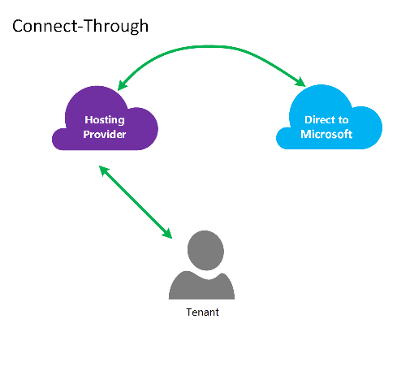
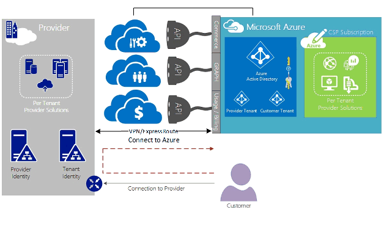
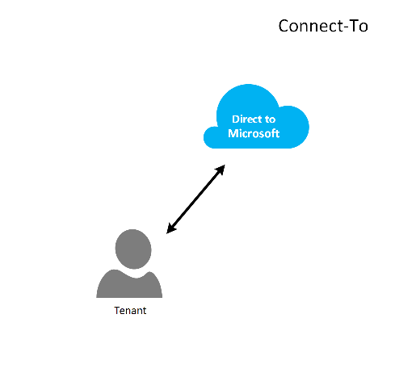
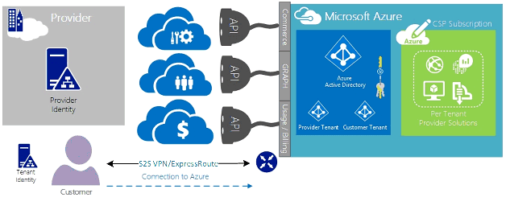
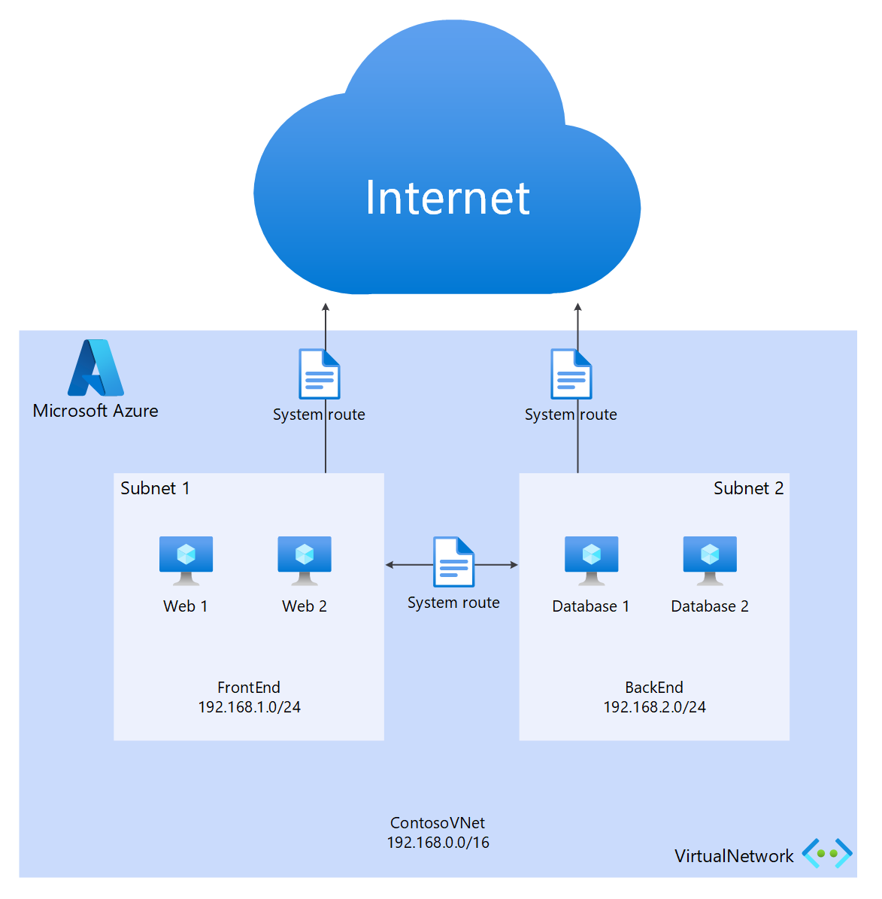
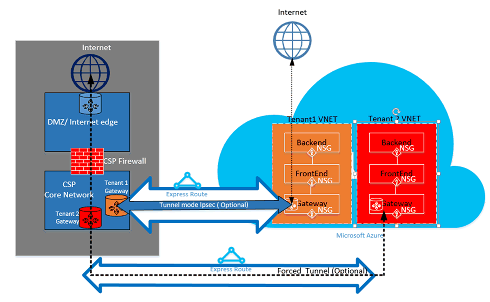

# ExpressRoute for Cloud Solution Providers (CSP)

Microsoft provides hyper-scale services for traditional resellers and distributors (CSP) to be able to rapidly provision new services and solutions for your customers without the need to invest in developing these new services. To allow the Cloud Solution Provider (CSP) the ability to directly manage these new services, Microsoft provides programs and APIs that allow the CSP to manage Microsoft Azure resources on behalf of your customers. One of those resources is ExpressRoute. ExpressRoute allows the CSP to connect existing customer resources to Azure services. ExpressRoute is a high-speed private communications link to services in Azure. 

ExpressRoute is composed of a pair of circuits for high availability that are attached to a single customer's subscription(s) and can't be shared by multiple customers. Each circuit should be terminated in a different router to maintain the high availability.

> [!NOTE]
> There are limits to the bandwidth and number of connections possible on each ExpressRoute circuit. If a single customer's needs exceed these limits, they will require multiple ExpressRoute circuits for their hybrid network implementation.
> 

Microsoft Azure provides a growing number of services that you can offer to your customers. ExpressRoute helps you and your customers take advantage of these services by providing high-speed low latency access to the Microsoft Azure environment.

## Microsoft Azure management

Microsoft provides CSPs with APIs to manage the Azure customer subscriptions by allowing programmatic integration with your own Service Management systems. Supported management capabilities can be found [here](/previous-versions/windows/mt844538(v=win.10)).

## Microsoft Azure resource management

The contract you have with your customer determines how the subscription will be managed. The CSP can directly manage the creation and maintenance of resources or the customer can maintain control of the Microsoft Azure subscription and create the Azure resources as they need. If your customer manages the creation of resources in their Microsoft Azure subscription, they use one of two models: “*Connect-Through*” model, or “*Direct-To*” model. These models are described in detail in the following sections.  

### Connect-through model

  

In the connect-through model, the CSP creates a direct connection between your datacenter and your customer’s Azure subscription. The direct connection is made using ExpressRoute, connecting your network with Azure. Then your customer connects to your network. This scenario requires that the customer passes through the CSP network to access Azure services. 

If your customer has other Azure subscriptions not managed by you, they would use the public Internet or their own private connection to connect to those services provisioned under the non-CSP subscription. 

For CSP managing Azure services, it's assumed that the CSP has a previously established customer identity store, which would then be replicated into Microsoft Entra ID for management of their CSP subscription through Administrate-On-Behalf-Of (AOBO). Key drivers for this scenario include where a given partner or service provider has an established relationship with the customer, the customer is consuming provider services currently or the partner has a desire to provide a combination of provider-hosted and Azure-hosted solutions to provide flexibility and address customer challenges that can't be satisfied by CSP alone. This model is illustrated in the following **figure**.

### Connect-to model

In the Connect-To model, the service provider creates a direct connection between their customer’s datacenter and the CSP provisioned Azure subscription using ExpressRoute over the customer’s (customer) network.

> [!NOTE]
> For ExpressRoute the customer would need to create and maintain the ExpressRoute circuit.  
> 

This connectivity scenario requires that the customer connects directly through a customer network to access CSP-managed Azure subscription, using a direct network connection that is created, owned, and managed either wholly or in part by the customer. For these customers, it's assumed that the provider doesn't currently have a customer identity store established, and the provider would assist the customer in replicating their current identify store into Microsoft Entra ID for management of their subscription through AOBO. Key drivers for this scenario include where a given partner or service provider has an established relationship with the customer, the customer is consuming provider services currently, or the partner has a desire to provide services that are based solely on Azure-hosted solutions without the need for an existing provider datacenter or infrastructure.

The choices between these two options are based on your customer’s needs and your current need to provide Azure services. The details of these models and the associated role-based access control, networking, and identity design patterns are covered in details in the following links:

* **Azure role-based access control (Azure RBAC)** – Azure RBAC is based on Microsoft Entra ID.  For more information on Azure RBAC, see [here](../role-based-access-control/role-assignments-portal.md).
* **Networking** – Covers the various articles of networking in Microsoft Azure.
* **Microsoft Entra ID** – Microsoft Entra ID provides the identity management for Microsoft Azure and third-party SaaS applications. For more information about Microsoft Entra ID, see [here](../active-directory/index.yml).  

## Network speeds
ExpressRoute supports network speeds from 50 Mb/s to 10 Gb/s. This allows customers to purchase the amount of network bandwidth needed for their unique environment.

> [!NOTE]
> Network bandwidth can be increased as needed without disrupting communications, but to reduce the network speed requires tearing down the circuit and recreating it at the lower network speed.  
> 
> 

ExpressRoute supports the connection of multiple VNets to a single ExpressRoute circuit for better utilization of the higher-speed connections. A single ExpressRoute circuit can be shared among multiple Azure subscriptions owned by the same customer.

## Configuring ExpressRoute
ExpressRoute can be configured to support three types of traffic ([routing domains](#expressroute-routing-domains)) over a single ExpressRoute circuit. This traffic is segregated into private peering, Microsoft peering, and public peering (deprecated). You can choose one or all types of traffic to be sent over a single ExpressRoute circuit or use multiple ExpressRoute circuits depending on the size of the ExpressRoute circuit and isolation required by your customer. The security posture of your customer may not allow public traffic and private traffic to traverse over the same circuit.

### Connect-through model
In a connect-through configuration, you're responsible for all of the networking underpinnings to connect your customer's datacenter resources to the subscriptions hosted in Azure. Each of your customers that want to use Azure capabilities need their own ExpressRoute connection, which will be managed by  you. You use the same methods the customer would use to procure the ExpressRoute circuit. You follow the same steps outlined in the article [ExpressRoute workflows](expressroute-workflows.md) for circuit provisioning and circuit states. You'll then configure the Border Gateway Protocol (BGP) routes to control the traffic flowing between the on-premises network and Azure VNet.

### Connect-to model
In a connect-to configuration, your customer already has an existing connection to Azure or will initiate a connection to the internet service provider linking ExpressRoute from their own datacenter directly to Azure, instead of your datacenter. To begin the provisioning process, your customer follows the steps as described in the Connect-Through model, above. Once the circuit has been established, your customer needs to configure the on-premises routers to be able to access both your network and Azure VNets.

You can assist with setting up the connection and configuring the routes to allow the resources in your datacenter(s) to communicate with the client resources in your datacenter, or with the resources hosted in Azure.

## ExpressRoute routing domains
ExpressRoute offers two routing domains for new circuits: private peering and Microsoft peering. Each of the routing domains is configured with identical routers in active-active configuration for high availability. For more details on ExpressRoute routing domains, look [here](expressroute-circuit-peerings.md).

You can define custom routes filters to allow only the route(s) you want to allow or need. For more information or to, see how to make these changes see article: [Create and modify routing for an ExpressRoute circuit using PowerShell](expressroute-howto-routing-classic.md) for more details about routing filters.

> [!NOTE]
> For Microsoft Peering, connectivity must be through a public IP address owned by the customer or CSP and must adhere to all defined rules. For more information, see the [ExpressRoute Prerequisites](expressroute-prerequisites.md) page.  
> 
> 

## Routing
ExpressRoute connects to the Azure networks through the Azure Virtual Network Gateway. Network gateways provide routing for Azure virtual networks.

Creating Azure Virtual Networks also creates a default routing table for the VNet to direct traffic to/from the subnets of the VNet. If the default route table is insufficient for the solution, custom routes can be created to route outgoing traffic to custom appliances or to block routes to specific subnets or external networks.

### Default routing
The default route table includes the following routes:

* Routing within a subnet
* Subnet-to-subnet within the virtual network
* To the Internet
* Virtual network-to-virtual network using VPN gateway
* Virtual network-to-on-premises network using a VPN or ExpressRoute gateway

  

### User-defined routing (UDR)
User-defined routes allow the control of traffic outbound from the assigned subnet to other subnets in the virtual network or over one of the other predefined gateways (ExpressRoute; internet or VPN). The default system routing table can be replaced with a user-defined routing table that replaces the default routing table with custom routes. With user-defined routing, customers can create specific routes to appliances such as firewalls or intrusion detection appliances, or block access to specific subnets from the subnet hosting the user-defined route. For an overview of User-Defined Routes look [here](../virtual-network/virtual-networks-udr-overview.md). 

## Security
Depending on which model is in use, Connect-To or Connect-Through, your customer defines the security policies in their VNet or provides the security policy requirements to the CSP to define to their VNets. The following security criteria can be defined:

1. **Customer Isolation**—The Azure platform provides customer isolation by storing Customer ID and VNet info in a secure database, which is used to encapsulate each customer’s traffic in a GRE tunnel.
2. **Network Security Group (NSG)** rules are for defining allowed traffic into and out of the subnets within VNets in Azure. By default, the NSG contains Block rules to block traffic from the Internet to the VNet and Allow rules for traffic within a VNet. For more information about Network Security Groups, look [here](https://azure.microsoft.com/blog/network-security-groups/).
3. **Force tunneling**—This is an option to redirect internet bound traffic originating in Azure to be redirected over the 
   ExpressRoute connection to the on premises datacenter. For more information about Forced tunneling, look [here](expressroute-routing.md#advertising-default-routes).  
4. **Encryption**—Even though the ExpressRoute circuits are dedicated to a specific customer, there's the possibility that the network provider could be breached, allowing an intruder to examine packet traffic. To address this potential, a customer or CSP can encrypt traffic over the connection by defining IPSec tunnel-mode policies for all traffic flowing between the on premises resources and Azure resources (refer to the optional Tunnel mode IPSec for Customer 1 in Figure 5: ExpressRoute Security, above). The second option would be to use a firewall appliance at each the end point of the ExpressRoute circuit. This requires another third-party firewall VMs/Appliances to be installed on both ends to encrypt the traffic over the ExpressRoute circuit.

  

## Next steps
The Cloud Solution Provider service provides you with a way to increase your value to your customers without the need for expensive infrastructure and capability purchases, while maintaining your position as the primary outsourcing provider. Seamless integration with Microsoft Azure can be accomplished through the CSP API, allowing you to integrate management of Microsoft Azure within your existing management frameworks.  

Additional Information can be found at the following links:

[Azure in Cloud Solution Provider program](/azure/cloud-solution-provider).  
[Get ready to transact as a Cloud Solution Provider](https://partner.microsoft.com/solutions/cloud-reseller-pre-launch).  
[Microsoft Cloud Solution Provider resources](https://partner.microsoft.com/solutions/cloud-reseller-resources).
