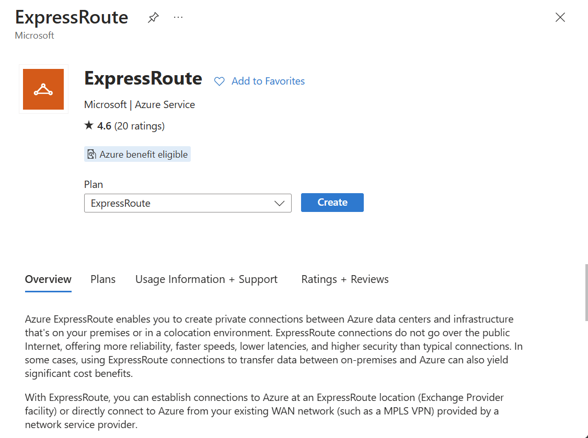
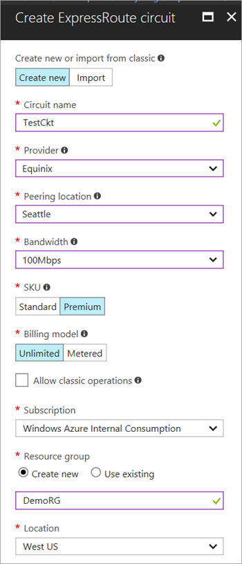
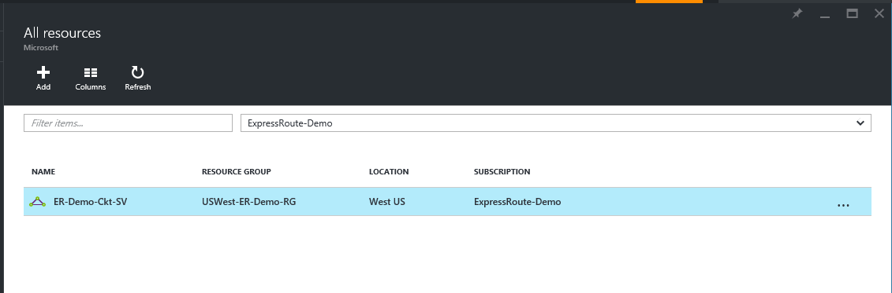
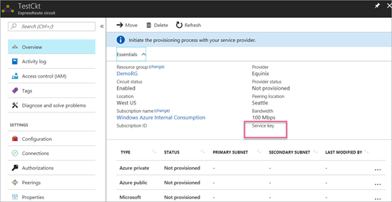
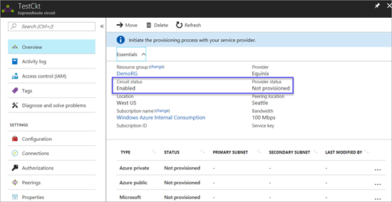
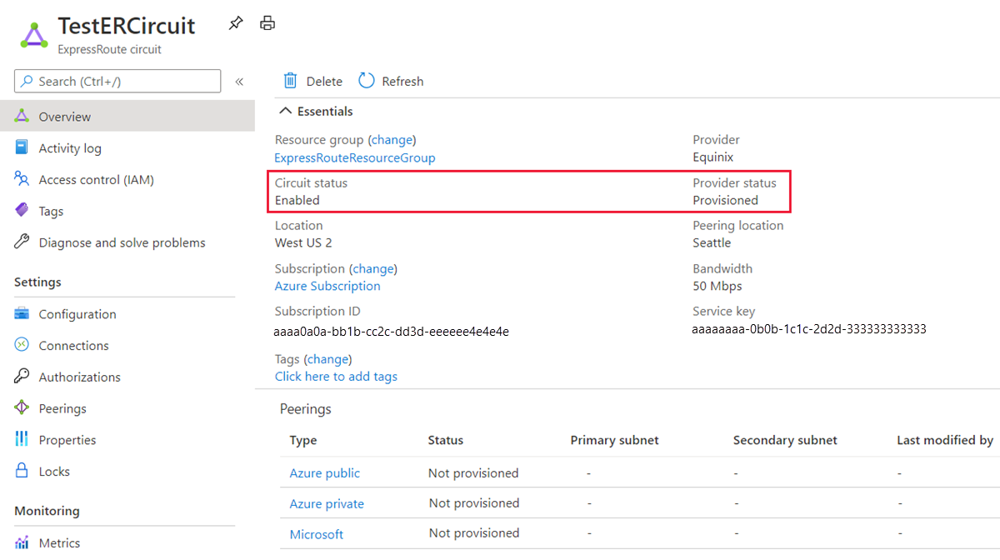
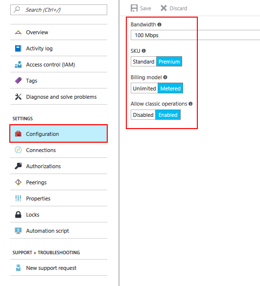

# Tutorial: Create and modify an ExpressRoute circuit

> [!div class="op_single_selector"]
> * [Azure portal](expressroute-howto-circuit-portal-resource-manager.md)
> * [PowerShell](expressroute-howto-circuit-arm.md)
> * [Azure CLI](howto-circuit-cli.md)
> * [Azure Resource Manager template](expressroute-howto-circuit-resource-manager-template.md)
> * [Video - Azure portal](https://azure.microsoft.com/documentation/videos/azure-expressroute-how-to-create-an-expressroute-circuit)
> * [PowerShell (classic)](expressroute-howto-circuit-classic.md)
>

This article helps you create an ExpressRoute circuit using the Azure portal and the Azure Resource Manager deployment model. You can also check the status, update, delete, or deprovision a circuit.

## Before you begin

* Review the [prerequisites](expressroute-prerequisites.md) and [workflows](expressroute-workflows.md) before you begin configuration.
* Ensure that you have access to the [Azure portal](https://portal.azure.com).
* Ensure that you have permissions to create new networking resources. Contact your account administrator if you do not have the right permissions.
* You can [view a video](https://azure.microsoft.com/documentation/videos/azure-expressroute-how-to-create-an-expressroute-circuit) before beginning in order to better understand the steps.

## Create and provision an ExpressRoute circuit

### 1. Sign in to the Azure portal

From a browser, navigate to the [Azure portal](https://portal.azure.com) and sign in with your Azure account.

### 2. Create a new ExpressRoute circuit

> [!IMPORTANT]
> Your ExpressRoute circuit is billed from the moment a service key is issued. Ensure that you perform this operation when the connectivity provider is ready to provision the circuit.

You can create an ExpressRoute circuit by selecting the option to create a new resource. 

1. On the Azure portal menu or from the **Home** page, select **Create a resource**. Select **Networking** > **ExpressRoute**, as shown in the following image:

   

2. After you click **ExpressRoute**, you'll see the **Create ExpressRoute circuit** page. When you're filling in the values on this page, make sure that you specify the correct SKU tier (Standard, or Premium) and data metering billing model (Unlimited or Metered).

   

   * **Tier** determines whether an ExpressRoute standard or an ExpressRoute premium add-on is enabled. You can specify **Standard** to get the standard SKU or **Premium** for the premium add-on.
   * **Data metering** determines the billing type. You can specify **Metered** for a metered data plan and **Unlimited** for an unlimited data plan. Note that you can change the billing type from **Metered** to **Unlimited**.

     > [!IMPORTANT]
     > You can't change the type from **Unlimited** to **Metered**.

   * **Peering Location** is the physical location where you are peering with Microsoft.

     > [!IMPORTANT]
     > The Peering Location indicates the [physical location](expressroute-locations.md) where you are peering with Microsoft. This is **not** linked to "Location" property, which refers to the geography where the Azure Network Resource Provider is located. While they are not related, it is a good practice to choose a Network Resource Provider geographically close to the Peering Location of the circuit.

### 3. View the circuits and properties

**View all the circuits**

You can view all the circuits that you created by selecting **All resources** on the left-side menu.

**View the properties**

You can view the properties of the circuit by selecting it. On the **Overview** page for your circuit, the service key appears in the service key field. You must copy the service key for your circuit and pass it down to the service provider to complete the provisioning process. The circuit service key is specific to your circuit.

### 4. Send the service key to your connectivity provider for provisioning

On this page, **Provider status** provides information on the current state of provisioning on the service-provider side. **Circuit status** provides the state on the Microsoft side. For more information about circuit provisioning states, see the [Workflows](expressroute-workflows.md#expressroute-circuit-provisioning-states) article.

When you create a new ExpressRoute circuit, the circuit is in the following state:

Provider status: Not provisioned 
Circuit status: Enabled

The circuit changes to the following state when the connectivity provider is in the process of enabling it for you:

Provider status: Provisioning 
Circuit status: Enabled

For you to be able to use an ExpressRoute circuit, it must be in the following state:

Provider status: Provisioned 
Circuit status: Enabled

### 5. Periodically check the status and the state of the circuit key

You can view the properties of the circuit that you're interested in by selecting it. Check the **Provider status** and ensure that it has moved to **Provisioned** before you continue.

### 6. Create your routing configuration

For step-by-step instructions, refer to the [ExpressRoute circuit routing configuration](expressroute-howto-routing-portal-resource-manager.md) article to create and modify circuit peerings.

> [!IMPORTANT]
> These instructions only apply to circuits that are created with service providers that offer layer 2 connectivity services. If you're using a service provider that offers managed layer 3 services (typically an IP VPN, like MPLS), your connectivity provider configures and manages routing for you.

### 7. Link a virtual network to an ExpressRoute circuit

Next, link a virtual network to your ExpressRoute circuit. Use the [Linking virtual networks to ExpressRoute circuits](expressroute-howto-linkvnet-arm.md) article when you work with the Resource Manager deployment model.

## Getting the status of an ExpressRoute circuit

You can view the status of a circuit by selecting it and viewing the Overview page.

## Modifying an ExpressRoute circuit

You can modify certain properties of an ExpressRoute circuit without impacting connectivity. You can modify the bandwidth, SKU, billing model and allow classic operations on the **Configuration** page. For information on limits and limitations, see the [ExpressRoute FAQ](expressroute-faqs.md).

You can perform the following tasks with no downtime:

* Enable or disable an ExpressRoute Premium add-on for your ExpressRoute circuit.
* Increase the bandwidth of your ExpressRoute circuit, provided there is capacity available on the port.

  > [!IMPORTANT]
  > Downgrading the bandwidth of a circuit is not supported.

* Change the metering plan from *Metered Data* to *Unlimited Data*.

  > [!IMPORTANT]
  > Changing the metering plan from Unlimited Data to Metered Data is not supported.

* You can enable and disable *Allow Classic Operations*.
  > [!IMPORTANT]
  > You may have to recreate the ExpressRoute circuit if there is inadequate capacity on the existing port. You cannot upgrade the circuit if there is no additional capacity available at that location.
  >
  > Although you can seamlessly upgrade the bandwidth, you cannot reduce the bandwidth of an ExpressRoute circuit without disruption. Downgrading bandwidth requires you to deprovision the ExpressRoute circuit and then reprovision a new ExpressRoute circuit.
  >
  > Disabling the Premium add-on operation can fail if you're using resources that are greater than what is permitted for the standard circuit.

To modify an ExpressRoute circuit, click **Configuration**.

## Deprovisioning and deleting an ExpressRoute circuit

You can delete your ExpressRoute circuit by selecting the **delete** icon. Note the following information:

* You must unlink all virtual networks from the ExpressRoute circuit. If this operation fails, check whether any virtual networks are linked to the circuit.
* If the ExpressRoute circuit service provider provisioning state is **Provisioning** or **Provisioned** you must work with your service provider to deprovision the circuit on their side. We continue to reserve resources and bill you until the service provider completes deprovisioning the circuit and notifies us.
* If the service provider has deprovisioned the circuit (the service provider provisioning state is set to **Not provisioned**), you can delete the circuit. This stops billing for the circuit.

## Next steps

After you create your circuit, continue with the following next steps:

* [Create and modify routing for your ExpressRoute circuit](expressroute-howto-routing-portal-resource-manager.md)
* [Link your virtual network to your ExpressRoute circuit](expressroute-howto-linkvnet-arm.md)
