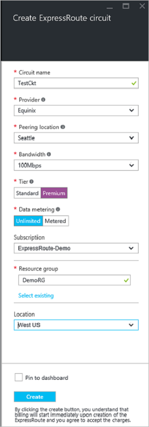
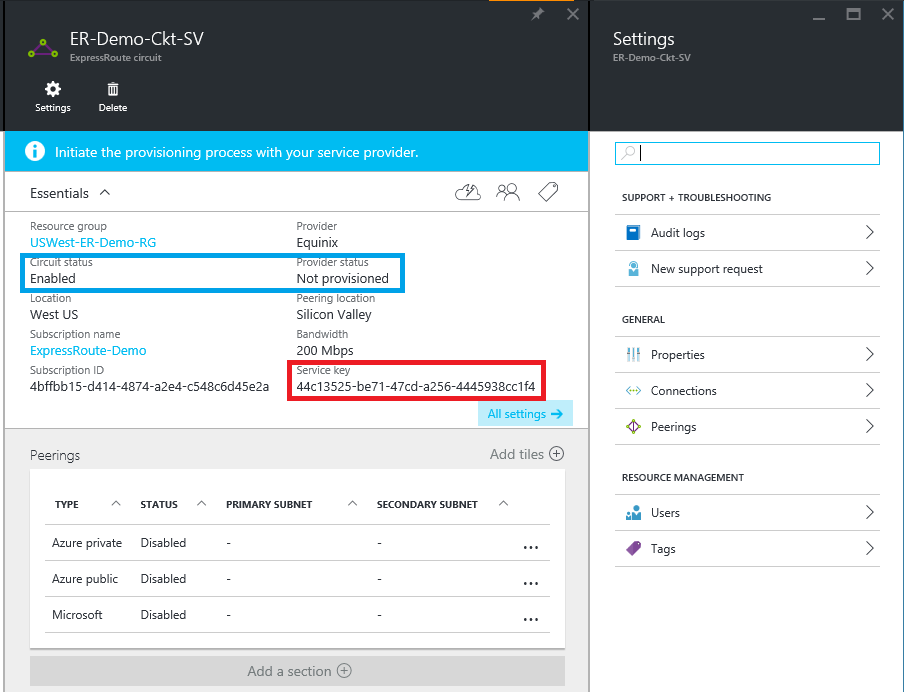
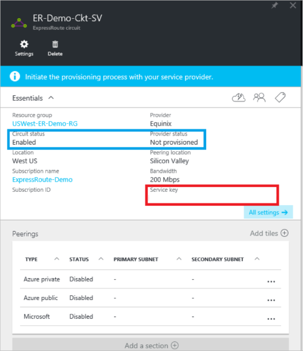
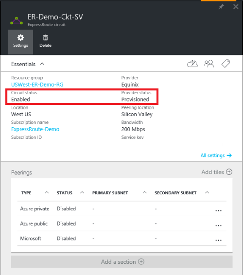

<properties
   pageTitle="Create and modify an ExpressRoute circuit by using Resource Manager and the Azure portal | Microsoft Azure"
   description="This article describes how to create, provision, verify, update, delete, and deprovision an ExpressRoute circuit."
   documentationCenter="na"
   services="expressroute"
   authors="cherylmc"
   manager="carmonm"
   editor=""
   tags="azure-resource-manager"/>
<tags
   ms.service="expressroute"
   ms.devlang="na"
   ms.topic="article"
   ms.tgt_pltfrm="na"
   ms.workload="infrastructure-services"
   ms.date="07/19/2016"
   ms.author="cherylmc"/>

# Create and modify an ExpressRoute circuit

> [AZURE.SELECTOR]
[Azure Portal - Resource Manager](expressroute-howto-circuit-portal-resource-manager.md)
[PowerShell - Resource Manager](expressroute-howto-circuit-arm.md)
[PowerShell - Classic](expressroute-howto-circuit-classic.md)

This article describes how to create an Azure ExpressRoute circuit by using the Azure portal and the Azure Resource Manager deployment model. The following steps also show you how to check the status of the circuit, update it, or delete and deprovision it.

**About Azure deployment models**

[AZURE.INCLUDE [vpn-gateway-clasic-rm](../../includes/vpn-gateway-classic-rm-include.md)] 

## Before you begin

- Review the [prerequisites](expressroute-prerequisites.md) and [workflows](expressroute-workflows.md) before you begin configuration.
- Ensure that you have access to the [Azure portal](https://portal.azure.com).
- Ensure that you have permissions to create new networking resources. Contact your account administrator if you do not have the right permissions.

## Create and provision an ExpressRoute circuit

### 1. Sign in to the Azure portal

From a browser, navigate to the [Azure portal](http://portal.azure.com) and sign in with your Azure account.

### 2. Create a new ExpressRoute circuit

>[AZURE.IMPORTANT] Your ExpressRoute circuit will be billed from the moment a service key is issued. Ensure that you perform this operation when the connectivity provider is ready to provision the circuit.

1. You can create an ExpressRoute circuit by selecting the option to create a new resource. Click **New** > **Networking** > **ExpressRoute**, as shown in the following image:

	

2. After you click **ExpressRoute**, you'll see the **Create ExpressRoute circuit** blade. When you're filling in the values on this blade, make sure that you specify the correct SKU tier and data metering.

	- **Tier** determines whether an ExpressRoute standard or an ExpressRoute premium add-on is enabled. You can specify **Standard** to get the standard SKU or **Premium** for the premium add-on.

	- **Data metering** determines the billing type. You can specify **Metered** for a metered data plan and **Unlimited** for an unlimited data plan. Note that you can change the billing type from **Metered** to **Unlimited**, but you can't change the type from **Unlimited** to **Metered**.

	

### 3. View the circuits and properties

**View all the circuits**

You can view all the circuits that you created by selecting **All resources** on the left-side menu.
	

**View the properties**

	You can view the properties of the circuit by selecting it. On this blade, note the service key for the circuit. You must copy the circuit key for your circuit and pass it down to the service provider to complete the provisioning process. The circuit key is specific to your circuit.

### 4. Send the service key to your connectivity provider for provisioning

On this blade, **Provider status** provides information on the current state of provisioning on the service-provider side. **Circuit status** provides the state on the Microsoft side. For more information about circuit provisioning states, see the [Workflows](expressroute-workflows.md#expressroute-circuit-provisioning-states) article.

When you create a new ExpressRoute circuit, the circuit will be in the following state:

Provider status: Not provisioned 
Circuit status: Enabled

The circuit will change to the following state when the connectivity provider is in the process of enabling it for you:

Provider status: Provisioning 
Circuit status: Enabled

For you to be able to use an ExpressRoute circuit, it must be in the following state:

Provider status: Provisioned 
Circuit status: Enabled

### 5. Periodically check the status and the state of the circuit key

You can view the properties of the circuit that you're interested in by selecting it. Check the **Provider status** and ensure that it has moved to **Provisioned** before you continue.

### 6. Create your routing configuration

For step-by-step instructions, refer to the [ExpressRoute circuit routing configuration](expressroute-howto-routing-portal-resource-manager.md) article to create and modify circuit peerings.

>[AZURE.IMPORTANT] These instructions only apply to circuits that are created with service providers that offer layer 2 connectivity services. If you're using a service provider that offers managed layer 3 services (typically an IP VPN, like MPLS), your connectivity provider will configure and manage routing for you.

### 7. Link a virtual network to an ExpressRoute circuit

Next, link a virtual network to your ExpressRoute circuit. Use the [Linking virtual networks to ExpressRoute circuits](expressroute-howto-linkvnet-arm.md) article when you work with the Resource Manager deployment model.

## Getting the status of an ExpressRoute circuit

You can view the status of a circuit by selecting it. 

## Modifying an ExpressRoute circuit

You can modify certain properties of an ExpressRoute circuit without impacting connectivity. At this time, you cannot modify ExpressRoute circuit properties by using the Azure portal. However, you can use PowerShell to modify circuit properties. For more information, see the section [Modifying an ExpressRoute circuit by using PowerShell](expressroute-howto-circuit-arm.md#modify).

You can do the following with no downtime:

- Enable or disable an ExpressRoute premium add-on for your ExpressRoute circuit.

- Increase the bandwidth of your ExpressRoute circuit. Note that downgrading the bandwidth of a circuit is not supported. 

- Change the metering plan from Metered Data to Unlimited Data. Note that changing the metering plan from Unlimited Data to Metered Data is not supported.

-  You can enable and disable **Allow Classic Operations**.

For more information on limits and limitations, refer to the [ExpressRoute FAQ](expressroute-faqs.md).

## Deleting and deprovisioning an ExpressRoute circuit

You can delete your ExpressRoute circuit by selecting the **delete** icon. Note the following:

- You must unlink all virtual networks from the ExpressRoute circuit. If this operation fails, check whether any virtual networks are linked to the circuit.

- If the ExpressRoute circuit service provider provisioning state is enabled, the status moves to **Disabling** from an enabled state. You must work with your service provider to deprovision the circuit on their side. We will continue to reserve resources and bill you until the service provider completes deprovisioning the circuit and notifies us.

- If the service provider has deprovisioned the circuit (the service provider provisioning state is set to **Not provisioned**) before you run the previous cmdlet, we will deprovision the circuit and stop billing you.

## Next steps

After you create your circuit, make sure that you do the following:

- [Create and modify routing for your ExpressRoute circuit](expressroute-howto-routing-portal-resource-manager.md)
- [Link your virtual network to your ExpressRoute circuit](expressroute-howto-linkvnet-arm.md)
