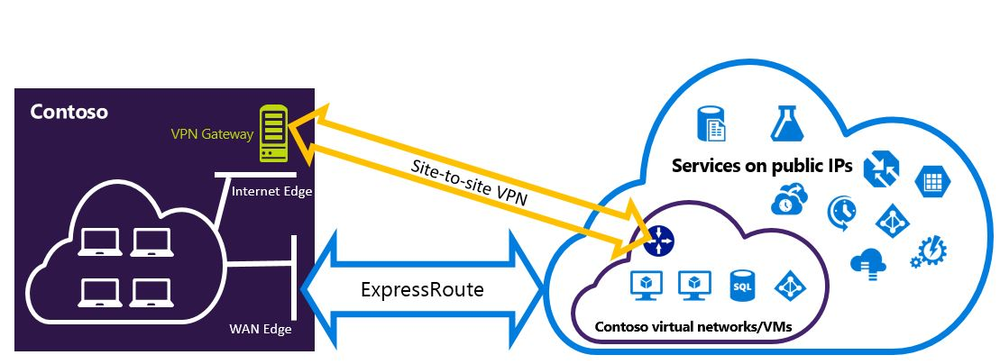

# Configure ExpressRoute and Site-to-Site coexisting connections (classic)
> [!div class="op_single_selector"]
> * [PowerShell - Resource Manager](expressroute-howto-coexist-resource-manager.md)
> * [PowerShell - Classic](expressroute-howto-coexist-classic.md)
> 
> 

This article helps you configure ExpressRoute and Site-to-Site VPN connections that coexist. Having the ability to configure Site-to-Site VPN and ExpressRoute has several advantages. You can configure Site-to-Site VPN as a secure failover path for ExpressRoute, or use Site-to-Site VPNs to connect to sites that are not connected through ExpressRoute. We will cover the steps to configure both scenarios in this article. This article applies to the classic deployment model. This configuration is not available in the portal.

[!INCLUDE [expressroute-classic-end-include](../../includes/expressroute-classic-end-include.md)]

**About Azure deployment models**

[!INCLUDE [vpn-gateway-classic-rm](../../includes/vpn-gateway-classic-rm-include.md)]

> [!IMPORTANT]
> ExpressRoute circuits must be pre-configured before you follow the instructions below. Make sure that you have followed the guides to [create an ExpressRoute circuit](expressroute-howto-circuit-classic.md) and [configure routing](expressroute-howto-routing-classic.md) before you follow the steps below.
> 
> 

## Limits and limitations
* **Transit routing is not supported.** You cannot route (via Azure) between your local network connected via Site-to-Site VPN and your local network connected via ExpressRoute.
* **Point-to-site is not supported.** You can't enable point-to-site VPN connections to the same VNet that is connected to ExpressRoute. Point-to-site VPN and ExpressRoute cannot coexist for the same VNet.
* **Forced tunneling cannot be enabled on the Site-to-Site VPN gateway.** You can only "force" all Internet-bound traffic back to your on-premises network via ExpressRoute.
* **Basic SKU gateway is not supported.** You must use a non-Basic SKU gateway for both the [ExpressRoute gateway](expressroute-about-virtual-network-gateways.md) and the [VPN gateway](../vpn-gateway/vpn-gateway-about-vpngateways.md).
* **Only route-based VPN gateway is supported.** You must use a route-based [VPN Gateway](../vpn-gateway/vpn-gateway-about-vpngateways.md).
* **Static route should be configured for your VPN gateway.** If your local network is connected to both ExpressRoute and a Site-to-Site VPN, you must have a static route configured in your local network to route the Site-to-Site VPN connection to the public Internet.
* **ExpressRoute gateway must be configured first.** You must create the ExpressRoute gateway first before you add the Site-to-Site VPN gateway.

## Configuration designs
### Configure a Site-to-Site VPN as a failover path for ExpressRoute
You can configure a Site-to-Site VPN connection as a backup for ExpressRoute. This applies only to virtual networks linked to the Azure private peering path. There is no VPN-based failover solution for services accessible through Azure public and Microsoft peerings. The ExpressRoute circuit is always the primary link. Data will flow through the Site-to-Site VPN path only if the ExpressRoute circuit fails. 

> [!NOTE]
> While ExpressRoute circuit is preferred over Site-to-Site VPN when both routes are the same, Azure will use the longest prefix match to choose the route towards the packet's destination.
> 
> 

### Configure a Site-to-Site VPN to connect to sites not connected through ExpressRoute
You can configure your network where some sites connect directly to Azure over Site-to-Site VPN, and some sites connect through ExpressRoute. 

> [!NOTE]
> You cannot a configure a virtual network as a transit router.
> 
> 

## Selecting the steps to use
There are two different sets of procedures to choose from in order to configure connections that can coexist. The configuration procedure that you select will depend on whether you have an existing virtual network that you want to connect to, or you want to create a new virtual network.

* I don't have a VNet and need to create one.
  
    If you don’t already have a virtual network, this procedure will walk you through creating a new virtual network using the classic deployment model and creating new ExpressRoute and Site-to-Site VPN connections. To configure, follow the steps in the article section [To create a new virtual network and coexisting connections](#new).
* I already have a classic deployment model VNet.
  
    You may already have a virtual network in place with an existing Site-to-Site VPN connection or ExpressRoute connection. The article section [To configure coexisting connections for an already existing VNet](#add) will walk you through deleting the gateway, and then creating new ExpressRoute and Site-to-Site VPN connections. Note that when creating the new connections, the steps must be completed in a very specific order. Don't use the instructions in other articles to create your gateways and connections.
  
    In this procedure, creating connections that can coexist will require you to delete your gateway, and then configure new gateways. This means you will have downtime for your cross-premises connections while you delete and recreate your gateway and connections, but you will not need to migrate any of your VMs or services to a new virtual network. Your VMs and services will still be able to communicate out through the load balancer while you configure your gateway if they are configured to do so.

## To create a new virtual network and coexisting connections
This procedure will walk you through creating a VNet and create Site-to-Site and ExpressRoute connections that will coexist.

1. You'll need to install the latest version of the Azure PowerShell cmdlets. See [How to install and configure Azure PowerShell](/powershell/azure/overview) for more information about installing the PowerShell cmdlets. Note that the cmdlets that you'll use for this configuration may be slightly different than what you might be familiar with. Be sure to use the cmdlets specified in these instructions. 
2. Create a schema for your virtual network. For more information about the configuration schema, see [Azure Virtual Network configuration schema](https://msdn.microsoft.com/library/azure/jj157100.aspx).
   
    When you create your schema, make sure you use the following values:
   
   * The gateway subnet for the virtual network must be /27 or a shorter prefix (such as /26 or /25).
   * The gateway connection type is "Dedicated".
     
             <VirtualNetworkSite name="MyAzureVNET" Location="Central US">
               <AddressSpace>
                 <AddressPrefix>10.17.159.192/26</AddressPrefix>
               </AddressSpace>
               <Subnets>
                 <Subnet name="Subnet-1">
                   <AddressPrefix>10.17.159.192/27</AddressPrefix>
                 </Subnet>
                 <Subnet name="GatewaySubnet">
                   <AddressPrefix>10.17.159.224/27</AddressPrefix>
                 </Subnet>
               </Subnets>
               <Gateway>
                 <ConnectionsToLocalNetwork>
                   <LocalNetworkSiteRef name="MyLocalNetwork">
                     <Connection type="Dedicated" />
                   </LocalNetworkSiteRef>
                 </ConnectionsToLocalNetwork>
               </Gateway>
             </VirtualNetworkSite>
3. After creating and configuring your xml schema file, upload the file. This will create your virtual network.
   
    Use the following cmdlet to upload your file, replacing the value with your own.
   
        Set-AzureVNetConfig -ConfigurationPath 'C:\NetworkConfig.xml'
4. Create an ExpressRoute gateway. Be sure to specify the GatewaySKU as *Standard*, *HighPerformance*, or *UltraPerformance* and the GatewayType as *DynamicRouting*.
   
    Use the following sample, substituting the values for your own.
   
        New-AzureVNetGateway -VNetName MyAzureVNET -GatewayType DynamicRouting -GatewaySKU HighPerformance
5. Link the ExpressRoute gateway to the ExpressRoute circuit. After this step has been completed, the connection between your on-premises network and Azure, through ExpressRoute, is established.
   
        New-AzureDedicatedCircuitLink -ServiceKey <service-key> -VNetName MyAzureVNET
6. Next, create your Site-to-Site VPN gateway. The GatewaySKU must be *Standard*, *HighPerformance*, or *UltraPerformance* and the GatewayType must be *DynamicRouting*.
   
        New-AzureVirtualNetworkGateway -VNetName MyAzureVNET -GatewayName S2SVPN -GatewayType DynamicRouting -GatewaySKU  HighPerformance
   
    To retrieve the virtual network gateway settings, including the gateway ID and the public IP, use the `Get-AzureVirtualNetworkGateway` cmdlet.
   
        Get-AzureVirtualNetworkGateway
   
        GatewayId            : 348ae011-ffa9-4add-b530-7cb30010565e
        GatewayName          : S2SVPN
        LastEventData        :
        GatewayType          : DynamicRouting
        LastEventTimeStamp   : 5/29/2015 4:41:41 PM
        LastEventMessage     : Successfully created a gateway for the following virtual network: GNSDesMoines
        LastEventID          : 23002
        State                : Provisioned
        VIPAddress           : 104.43.x.y
        DefaultSite          :
        GatewaySKU           : HighPerformance
        Location             :
        VnetId               : 979aabcf-e47f-4136-ab9b-b4780c1e1bd5
        SubnetId             :
        EnableBgp            : False
        OperationDescription : Get-AzureVirtualNetworkGateway
        OperationId          : 42773656-85e1-a6b6-8705-35473f1e6f6a
        OperationStatus      : Succeeded
7. Create a local site VPN gateway entity. This command doesn’t configure your on-premises VPN gateway. Rather, it allows you to provide the local gateway settings, such as the public IP and the on-premises address space, so that the Azure VPN gateway can connect to it.
   
   > [!IMPORTANT]
   > The local site for the Site-to-Site VPN is not defined in the netcfg. Instead, you must use this cmdlet to specify the local site parameters. You cannot define it using either portal, or the netcfg file.
   > 
   > 
   
    Use the following sample, replacing the values with your own.
   
        New-AzureLocalNetworkGateway -GatewayName MyLocalNetwork -IpAddress <MyLocalGatewayIp> -AddressSpace <MyLocalNetworkAddress>
   
   > [!NOTE]
   > If your local network has multiple routes, you can pass them all in as an array.  $MyLocalNetworkAddress = @("10.1.2.0/24","10.1.3.0/24","10.2.1.0/24")  
   > 
   > 

    To retrieve the virtual network gateway settings, including the gateway ID and the public IP, use the `Get-AzureVirtualNetworkGateway` cmdlet. See the following example.

        Get-AzureLocalNetworkGateway

        GatewayId            : 532cb428-8c8c-4596-9a4f-7ae3a9fcd01b
        GatewayName          : MyLocalNetwork
        IpAddress            : 23.39.x.y
        AddressSpace         : {10.1.2.0/24}
        OperationDescription : Get-AzureLocalNetworkGateway
        OperationId          : ddc4bfae-502c-adc7-bd7d-1efbc00b3fe5
        OperationStatus      : Succeeded

1. Configure your local VPN device to connect to the new gateway. Use the information that you retrieved in step 6 when configuring your VPN device. For more information about VPN device configuration, see [VPN Device Configuration](../vpn-gateway/vpn-gateway-about-vpn-devices.md).
2. Link the Site-to-Site VPN gateway on Azure to the local gateway.
   
    In this example, connectedEntityId is the local gateway ID, which you can find by running `Get-AzureLocalNetworkGateway`. You can find virtualNetworkGatewayId by using the `Get-AzureVirtualNetworkGateway` cmdlet. After this step, the connection between your local network and Azure via the Site-to-Site VPN connection is established.

        New-AzureVirtualNetworkGatewayConnection -connectedEntityId <local-network-gateway-id> -gatewayConnectionName Azure2Local -gatewayConnectionType IPsec -sharedKey abc123 -virtualNetworkGatewayId <azure-s2s-vpn-gateway-id>

## To configure coexisting connections for an already existing VNet
If you have an existing virtual network, check the gateway subnet size. If the gateway subnet is /28 or /29, you must first delete the virtual network gateway and increase the gateway subnet size. The steps in this section will show you how to do that.

If the gateway subnet is /27 or larger and the virtual network is connected via ExpressRoute, you can skip the steps below and proceed to ["Step 6 - Create a Site-to-Site VPN gateway"](#vpngw) in the previous section.

> [!NOTE]
> When you delete the existing gateway, your local premises will lose the connection to your virtual network while you are working on this configuration.
> 
> 

1. You'll need to install the latest version of the Azure Resource Manager PowerShell cmdlets. See [How to install and configure Azure PowerShell](/powershell/azure/overview) for more information about installing the PowerShell cmdlets. Note that the cmdlets that you'll use for this configuration may be slightly different than what you might be familiar with. Be sure to use the cmdlets specified in these instructions. 
2. Delete the existing ExpressRoute or Site-to-Site VPN gateway. Use the following cmdlet, replacing the values with your own.
   
        Remove-AzureVNetGateway –VnetName MyAzureVNET
3. Export the virtual network schema. Use the following PowerShell cmdlet, replacing the values with your own.
   
        Get-AzureVNetConfig –ExportToFile “C:\NetworkConfig.xml”
4. Edit the network configuration file schema so that the gateway subnet is /27 or a shorter prefix (such as /26 or /25). See the following example. 
   
   > [!NOTE]
   > If you don't have enough IP addresses left in your virtual network to increase the gateway subnet size, you need to add more IP address space. For more information about the configuration schema, see [Azure Virtual Network configuration schema](https://msdn.microsoft.com/library/azure/jj157100.aspx).
   > 
   > 
   
          <Subnet name="GatewaySubnet">
            <AddressPrefix>10.17.159.224/27</AddressPrefix>
          </Subnet>
5. If your previous gateway was a Site-to-Site VPN, you must also change the connection type to **Dedicated**.
   
                 <Gateway>
                  <ConnectionsToLocalNetwork>
                    <LocalNetworkSiteRef name="MyLocalNetwork">
                      <Connection type="Dedicated" />
                    </LocalNetworkSiteRef>
                  </ConnectionsToLocalNetwork>
                </Gateway>
6. At this point, you'll have a VNet with no gateways. To create new gateways and complete your connections, you can proceed with [Step 4 - Create an ExpressRoute gateway](#gw), found in the preceding set of steps.

## Next steps
For more information about ExpressRoute, see the [ExpressRoute FAQ](expressroute-faqs.md)

