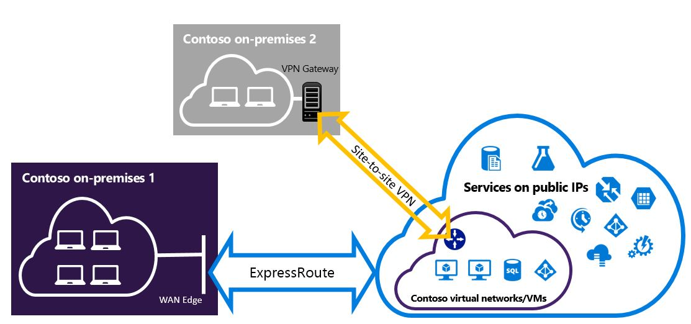

# Configure ExpressRoute and Site-to-Site coexisting connections using PowerShell
> [!div class="op_single_selector"]
> * [PowerShell - Resource Manager](expressroute-howto-coexist-resource-manager.md)
> * [PowerShell - Classic](expressroute-howto-coexist-classic.md)
> 
> 

Configuring Site-to-Site VPN and ExpressRoute coexisting connections has several advantages:

* You can configure a Site-to-Site VPN as a secure failover path for ExpressRoute. 
* Alternatively, you can use Site-to-Site VPNs to connect to sites that are not connected through ExpressRoute. 

The steps to configure both scenarios are covered in this article. This article applies to the Resource Manager deployment model and uses PowerShell. You can also configure these scenarios using the Azure Portal, although documentation is not yet available.

>[!NOTE]
>If you want to create a Site-to-Site VPN over an ExpressRoute circuit, please see [this article](site-to-site-vpn-over-microsoft-peering.md).
>

## Limits and limitations
* **Transit routing is not supported.** You cannot route (via Azure) between your local network connected via Site-to-Site VPN and your local network connected via ExpressRoute.
* **Basic SKU gateway is not supported.** You must use a non-Basic SKU gateway for both the [ExpressRoute gateway](expressroute-about-virtual-network-gateways.md) and the [VPN gateway](../vpn-gateway/vpn-gateway-about-vpngateways.md).
* **Only route-based VPN gateway is supported.** You must use a route-based [VPN Gateway](../vpn-gateway/vpn-gateway-about-vpngateways.md).
* **Static route should be configured for your VPN gateway.** If your local network is connected to both ExpressRoute and a Site-to-Site VPN, you must have a static route configured in your local network to route the Site-to-Site VPN connection to the public Internet.

## Configuration designs
### Configure a Site-to-Site VPN as a failover path for ExpressRoute
You can configure a Site-to-Site VPN connection as a backup for ExpressRoute. This connection applies only to virtual networks linked to the Azure private peering path. There is no VPN-based failover solution for services accessible through Azure Microsoft peering. The ExpressRoute circuit is always the primary link. Data flows through the Site-to-Site VPN path only if the ExpressRoute circuit fails. To avoid asymmetrical routing, your local network configuration should also prefer the ExpressRoute circuit over the Site-to-Site VPN. You can prefer the ExpressRoute path by setting higher local preference for the routes received the ExpressRoute. 

> [!NOTE]
> While ExpressRoute circuit is preferred over Site-to-Site VPN when both routes are the same, Azure will use the longest prefix match to choose the route towards the packet's destination.
> 
> 


### Configure a Site-to-Site VPN to connect to sites not connected through ExpressRoute
You can configure your network where some sites connect directly to Azure over Site-to-Site VPN, and some sites connect through ExpressRoute. 



> [!NOTE]
> You cannot configure a virtual network as a transit router.
> 
> 

## Selecting the steps to use
There are two different sets of procedures to choose from. The configuration procedure that you select depends on whether you have an existing virtual network that you want to connect to, or you want to create a new virtual network.

* I don't have a VNet and need to create one.
  
    If you don’t already have a virtual network, this procedure walks you through creating a new virtual network using Resource Manager deployment model and creating new ExpressRoute and Site-to-Site VPN connections. To configure a virtual network, follow the steps in [To create a new virtual network and coexisting connections](#new).
* I already have a Resource Manager deployment model VNet.
  
    You may already have a virtual network in place with an existing Site-to-Site VPN connection or ExpressRoute connection. In this scenario if the gateway subnet mask is /28 or smaller (/28, /29, etc.), you have to delete the existing gateway. The [To configure coexisting connections for an already existing VNet](#add) section walks you through deleting the gateway, and then creating new ExpressRoute and Site-to-Site VPN connections.
  
    If you delete and recreate your gateway, you will have downtime for your cross-premises connections. However, your VMs and services will still be able to communicate out through the load balancer while you configure your gateway if they are configured to do so.

## <a name="new"></a>To create a new virtual network and coexisting connections
This procedure walks you through creating a VNet and Site-to-Site and ExpressRoute connections that will coexist.

1. Install the latest version of the Azure PowerShell cmdlets. For information about installing the cmdlets, see [How to install and configure Azure PowerShell](/powershell/azure/overview). The cmdlets that you use for this configuration may be slightly different than what you might be familiar with. Be sure to use the cmdlets specified in these instructions.

2. Log in to your account and set up the environment.

  ```powershell
  Connect-AzureRmAccount
  Select-AzureRmSubscription -SubscriptionName 'yoursubscription'
  $location = "Central US"
  $resgrp = New-AzureRmResourceGroup -Name "ErVpnCoex" -Location $location
  $VNetASN = 65515
  ```
3. Create a virtual network including Gateway Subnet. For more information about creating a virtual network, see [Create a virtual network](../virtual-network/manage-virtual-network.md#create-a-virtual-network). For more information about creating subnets, see [Create a subnet](../virtual-network/virtual-network-manage-subnet.md#add-a-subnet)
   
   > [!IMPORTANT]
   > The Gateway Subnet must be /27 or a shorter prefix (such as /26 or /25).
   > 
   > 
   
    Create a new VNet.

  ```powershell
  $vnet = New-AzureRmVirtualNetwork -Name "CoexVnet" -ResourceGroupName $resgrp.ResourceGroupName -Location $location -AddressPrefix "10.200.0.0/16"
  ```
   
    Add subnets.

  ```powershell
  Add-AzureRmVirtualNetworkSubnetConfig -Name "App" -VirtualNetwork $vnet -AddressPrefix "10.200.1.0/24"
  Add-AzureRmVirtualNetworkSubnetConfig -Name "GatewaySubnet" -VirtualNetwork $vnet -AddressPrefix "10.200.255.0/24"
  ```
   
    Save the VNet configuration.

  ```powershell
  $vnet = Set-AzureRmVirtualNetwork -VirtualNetwork $vnet
  ```
4. <a name="vpngw"></a>Next, create your Site-to-Site VPN gateway. For more information about the VPN gateway configuration, see [Configure a VNet with a Site-to-Site connection](../vpn-gateway/vpn-gateway-create-site-to-site-rm-powershell.md). The GatewaySku is only supported for *VpnGw1*, *VpnGw2*, *VpnGw3*, *Standard*, and *HighPerformance* VPN gateways. ExpressRoute-VPN Gateway coexist configurations are not supported on the Basic SKU. The VpnType must be *RouteBased*.

  ```powershell
  $gwSubnet = Get-AzureRmVirtualNetworkSubnetConfig -Name "GatewaySubnet" -VirtualNetwork $vnet
  $gwIP = New-AzureRmPublicIpAddress -Name "VPNGatewayIP" -ResourceGroupName $resgrp.ResourceGroupName -Location $location -AllocationMethod Dynamic
  $gwConfig = New-AzureRmVirtualNetworkGatewayIpConfig -Name "VPNGatewayIpConfig" -SubnetId $gwSubnet.Id -PublicIpAddressId $gwIP.Id
  New-AzureRmVirtualNetworkGateway -Name "VPNGateway" -ResourceGroupName $resgrp.ResourceGroupName -Location $location -IpConfigurations $gwConfig -GatewayType "Vpn" -VpnType "RouteBased" -GatewaySku "VpnGw1"
  ```
   
    Azure VPN gateway supports BGP routing protocol. You can specify ASN (AS Number) for that Virtual Network by adding the -Asn switch in the following command. Not specifying that parameter will default to AS number 65515.

  ```powershell
  $azureVpn = New-AzureRmVirtualNetworkGateway -Name "VPNGateway" -ResourceGroupName $resgrp.ResourceGroupName -Location $location -IpConfigurations $gwConfig -GatewayType "Vpn" -VpnType "RouteBased" -GatewaySku "VpnGw1" -Asn $VNetASN
  ```
   
    You can find the BGP peering IP and the AS number that Azure uses for the VPN gateway in $azureVpn.BgpSettings.BgpPeeringAddress and $azureVpn.BgpSettings.Asn. For more information, see [Configure BGP](../vpn-gateway/vpn-gateway-bgp-resource-manager-ps.md) for Azure VPN gateway.
5. Create a local site VPN gateway entity. This command doesn’t configure your on-premises VPN gateway. Rather, it allows you to provide the local gateway settings, such as the public IP and the on-premises address space, so that the Azure VPN gateway can connect to it.
   
    If your local VPN device only supports static routing, you can configure the static routes in the following way:

  ```powershell
  $MyLocalNetworkAddress = @("10.100.0.0/16","10.101.0.0/16","10.102.0.0/16")
  $localVpn = New-AzureRmLocalNetworkGateway -Name "LocalVPNGateway" -ResourceGroupName $resgrp.ResourceGroupName -Location $location -GatewayIpAddress *<Public IP>* -AddressPrefix $MyLocalNetworkAddress
  ```
   
    If your local VPN device supports the BGP and you want to enable dynamic routing, you need to know the BGP peering IP and the AS number that your local VPN device uses.

  ```powershell
  $localVPNPublicIP = "<Public IP>"
  $localBGPPeeringIP = "<Private IP for the BGP session>"
  $localBGPASN = "<ASN>"
  $localAddressPrefix = $localBGPPeeringIP + "/32"
  $localVpn = New-AzureRmLocalNetworkGateway -Name "LocalVPNGateway" -ResourceGroupName $resgrp.ResourceGroupName -Location $location -GatewayIpAddress $localVPNPublicIP -AddressPrefix $localAddressPrefix -BgpPeeringAddress $localBGPPeeringIP -Asn $localBGPASN
  ```
6. Configure your local VPN device to connect to the new Azure VPN gateway. For more information about VPN device configuration, see [VPN Device Configuration](../vpn-gateway/vpn-gateway-about-vpn-devices.md).

7. Link the Site-to-Site VPN gateway on Azure to the local gateway.

  ```powershell
  $azureVpn = Get-AzureRmVirtualNetworkGateway -Name "VPNGateway" -ResourceGroupName $resgrp.ResourceGroupName
  New-AzureRmVirtualNetworkGatewayConnection -Name "VPNConnection" -ResourceGroupName $resgrp.ResourceGroupName -Location $location -VirtualNetworkGateway1 $azureVpn -LocalNetworkGateway2 $localVpn -ConnectionType IPsec -SharedKey <yourkey>
  ```
 

8. If you are connecting to an existing ExpressRoute circuit, skip steps 8 & 9 and, jump to step 10. Configure ExpressRoute circuits. For more information about configuring ExpressRoute circuit, see [create an ExpressRoute circuit](expressroute-howto-circuit-arm.md).


9. Configure Azure private peering over the ExpressRoute circuit. For more information about configuring Azure private peering over the ExpressRoute circuit, see  [configure peering](expressroute-howto-routing-arm.md)

10. <a name="gw"></a>Create an ExpressRoute gateway. For more information about the ExpressRoute gateway configuration, see [ExpressRoute gateway configuration](expressroute-howto-add-gateway-resource-manager.md). The GatewaySKU must be *Standard*, *HighPerformance*, or *UltraPerformance*.

  ```powershell
  $gwSubnet = Get-AzureRmVirtualNetworkSubnetConfig -Name "GatewaySubnet" -VirtualNetwork $vnet
  $gwIP = New-AzureRmPublicIpAddress -Name "ERGatewayIP" -ResourceGroupName $resgrp.ResourceGroupName -Location $location -AllocationMethod Dynamic
  $gwConfig = New-AzureRmVirtualNetworkGatewayIpConfig -Name "ERGatewayIpConfig" -SubnetId $gwSubnet.Id -PublicIpAddressId $gwIP.Id
  $gw = New-AzureRmVirtualNetworkGateway -Name "ERGateway" -ResourceGroupName $resgrp.ResourceGroupName -Location $location -IpConfigurations $gwConfig -GatewayType "ExpressRoute" -GatewaySku Standard
  ```
11. Link the ExpressRoute gateway to the ExpressRoute circuit. After this step has been completed, the connection between your on-premises network and Azure, through ExpressRoute, is established. For more information about the link operation, see [Link VNets to ExpressRoute](expressroute-howto-linkvnet-arm.md).

  ```powershell
  $ckt = Get-AzureRmExpressRouteCircuit -Name "YourCircuit" -ResourceGroupName "YourCircuitResourceGroup"
  New-AzureRmVirtualNetworkGatewayConnection -Name "ERConnection" -ResourceGroupName $resgrp.ResourceGroupName -Location $location -VirtualNetworkGateway1 $gw -PeerId $ckt.Id -ConnectionType ExpressRoute
  ```

## <a name="add"></a>To configure coexisting connections for an already existing VNet
If you have a virtual network that has only one virtual network gateway (let's say, Site-to-Site VPN gateway) and you want to add another gateway of a different type (let's say, ExpressRoute gateway), check the gateway subnet size. If the gateway subnet is /27 or larger, you can skip the steps below and follow the steps in the previous section to add either a Site-to-Site VPN gateway or an ExpressRoute gateway. If the gateway subnet is /28 or /29, you have to first delete the virtual network gateway and increase the gateway subnet size. The steps in this section show you how to do that.

1. You'll need to install the latest version of the Azure PowerShell cmdlets. For more information about installing cmdlets, see [How to install and configure Azure PowerShell](/powershell/azure/overview). The cmdlets that you use for this configuration may be slightly different than what you might be familiar with. Be sure to use the cmdlets specified in these instructions. 
2. Delete the existing ExpressRoute or Site-to-Site VPN gateway.

  ```powershell 
  Remove-AzureRmVirtualNetworkGateway -Name <yourgatewayname> -ResourceGroupName <yourresourcegroup>
  ```
3. Delete Gateway Subnet.

  ```powershell
  $vnet = Get-AzureRmVirtualNetwork -Name <yourvnetname> -ResourceGroupName <yourresourcegroup> Remove-AzureRmVirtualNetworkSubnetConfig -Name GatewaySubnet -VirtualNetwork $vnet
  ```
4. Add a Gateway Subnet that is /27 or larger.
   
   > [!NOTE]
   > If you don't have enough IP addresses left in your virtual network to increase the gateway subnet size, you need to add more IP address space.
   > 
   > 

  ```powershell
  $vnet = Get-AzureRmVirtualNetwork -Name <yourvnetname> -ResourceGroupName <yourresourcegroup>
  Add-AzureRmVirtualNetworkSubnetConfig -Name "GatewaySubnet" -VirtualNetwork $vnet -AddressPrefix "10.200.255.0/24"
  ```
   
    Save the VNet configuration.

  ```powershell
  $vnet = Set-AzureRmVirtualNetwork -VirtualNetwork $vnet
  ```
5. At this point, you have a virtual network with no gateways. To create new gateways and set up the connections, follow the steps in the previous section.

## To add point-to-site configuration to the VPN gateway
You can follow the steps below to add Point-to-Site configuration to your VPN gateway in a co-existence setup.

1. Add VPN Client address pool.

  ```powershell
  $azureVpn = Get-AzureRmVirtualNetworkGateway -Name "VPNGateway" -ResourceGroupName $resgrp.ResourceGroupName
  Set-AzureRmVirtualNetworkGatewayVpnClientConfig -VirtualNetworkGateway $azureVpn -VpnClientAddressPool "10.251.251.0/24"
  ```
2. Upload the VPN root certificate to Azure for your VPN gateway. In this example, it's assumed that the root certificate is stored in the local machine where the following PowerShell cmdlets are run.

  ```powershell
  $p2sCertFullName = "RootErVpnCoexP2S.cer" 
  $p2sCertMatchName = "RootErVpnCoexP2S" 
  $p2sCertToUpload=get-childitem Cert:\CurrentUser\My | Where-Object {$_.Subject -match $p2sCertMatchName} 
  if ($p2sCertToUpload.count -eq 1){write-host "cert found"} else {write-host "cert not found" exit} 
  $p2sCertData = [System.Convert]::ToBase64String($p2sCertToUpload.RawData) Add-AzureRmVpnClientRootCertificate -VpnClientRootCertificateName $p2sCertFullName -VirtualNetworkGatewayname $azureVpn.Name -ResourceGroupName $resgrp.ResourceGroupName -PublicCertData $p2sCertData
  ```

For more information on Point-to-Site VPN, see [Configure a Point-to-Site connection](../vpn-gateway/vpn-gateway-howto-point-to-site-rm-ps.md).

## Next steps
For more information about ExpressRoute, see the [ExpressRoute FAQ](expressroute-faqs.md).
