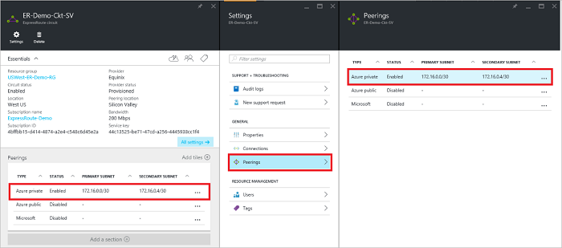
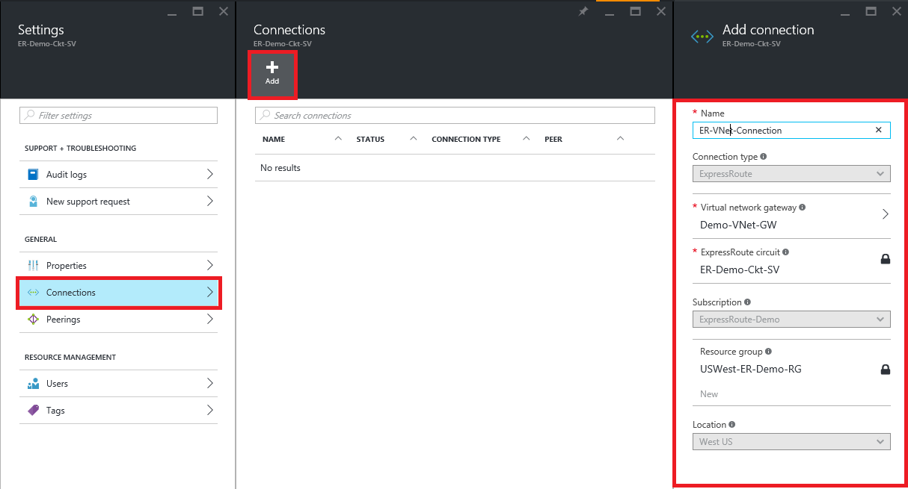
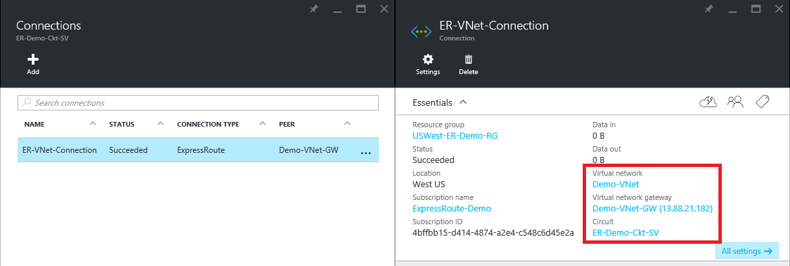
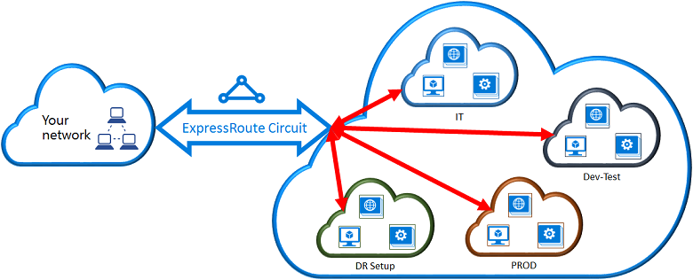
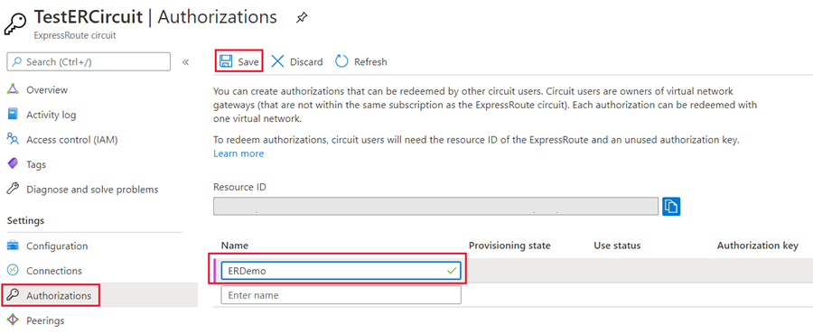
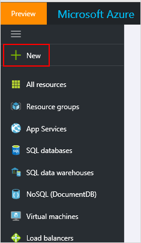
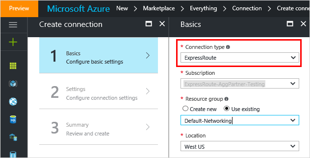
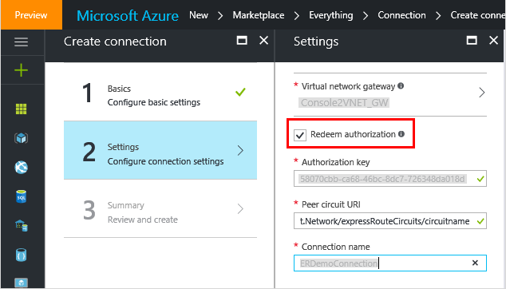

# Connect a virtual network to an ExpressRoute circuit
> [!div class="op_single_selector"]
> * [Resource Manager - Azure portal](expressroute-howto-linkvnet-portal-resource-manager.md)
> * [Resource Manager - PowerShell](expressroute-howto-linkvnet-arm.md)
> * [Classic - PowerShell](expressroute-howto-linkvnet-classic.md)
> * [Video - Azure portal](http://azure.microsoft.com/documentation/videos/azure-expressroute-how-to-create-a-connection-between-your-vpn-gateway-and-expressroute-circuit)
> 
>  

This article helps you link virtual networks (VNets) to Azure ExpressRoute circuits by using the Resource Manager deployment model and the Azure portal. Virtual networks can either be in the same subscription, or they can be part of another subscription.

## Before you begin
* Review the [prerequisites](expressroute-prerequisites.md), [routing requirements](expressroute-routing.md), and [workflows](expressroute-workflows.md) before you begin configuration.
* You must have an active ExpressRoute circuit.
  
  * Follow the instructions to [create an ExpressRoute circuit](expressroute-howto-circuit-portal-resource-manager.md) and have the circuit enabled by your connectivity provider.
  * Ensure that you have Azure private peering configured for your circuit. See the [Configure routing](expressroute-howto-routing-portal-resource-manager.md) article for routing instructions.
  * Ensure that Azure private peering is configured and the BGP peering between your network and Microsoft is up so that you can enable end-to-end connectivity.
  * Ensure that you have a virtual network and a virtual network gateway created and fully provisioned. Follow the instructions to [create a virtual network gateway for ExpressRoute](expressroute-howto-add-gateway-resource-manager.md). A virtual network gateway for ExpressRoute uses the GatewayType 'ExpressRoute', not VPN.

* You can link up to 10 virtual networks to a standard ExpressRoute circuit. All virtual networks must be in the same geopolitical region when using a standard ExpressRoute circuit. 
* You can link a virtual network outside of the geopolitical region of the ExpressRoute circuit, or connect a larger number of virtual networks to your ExpressRoute circuit if you enabled the ExpressRoute premium add-on. Check the [FAQ](expressroute-faqs.md) for more details on the premium add-on.
* You can [view a video](http://azure.microsoft.com/documentation/videos/azure-expressroute-how-to-create-a-connection-between-your-vpn-gateway-and-expressroute-circuit) before beginning to better understand the steps.

## Connect a virtual network in the same subscription to a circuit

### To create a connection

> [!NOTE]
> BGP configuration information will not show up if the layer 3 provider configured your peerings. If your circuit is in a provisioned state, you should be able to create connections.
>

1. Ensure that your ExpressRoute circuit and Azure private peering have been configured successfully. Follow the instructions in [Create an ExpressRoute circuit](expressroute-howto-circuit-arm.md) and [Configure routing](expressroute-howto-routing-arm.md). Your ExpressRoute circuit should look like the following image:

	
   
2. You can now start provisioning a connection to link your virtual network gateway to your ExpressRoute circuit. Click **Connection** > **Add** to open the **Add connection** blade, and then configure the values.

      

3. After your connection has been successfully configured, your connection object will show the information for the connection.

     

### To delete a connection
You can delete a connection by selecting the **Delete** icon on the blade for your connection.

## Connect a virtual network in a different subscription to a circuit
You can share an ExpressRoute circuit across multiple subscriptions. The figure below shows a simple schematic of how sharing works for ExpressRoute circuits across multiple subscriptions.

- Each of the smaller clouds within the large cloud is used to represent subscriptions that belong to different departments within an organization.
- Each of the departments within the organization can use their own subscription for deploying their services, but they can share a single ExpressRoute circuit to connect back to your on-premises network.
- A single department (in this example: IT) can own the ExpressRoute circuit. Other subscriptions within the organization can use the ExpressRoute circuit.

	> [!NOTE]
	> Connectivity and bandwidth charges for the dedicated circuit will be applied to the ExpressRoute circuit owner. All virtual networks share the same bandwidth.
	> 
	>

### Administration - circuit owners and circuit users

The 'circuit owner' is an authorized Power User of the ExpressRoute circuit resource. The circuit owner can create authorizations that can be redeemed by 'circuit users'. Circuit users are owners of virtual network gateways that are not within the same subscription as the ExpressRoute circuit. Circuit users can redeem authorizations (one authorization per virtual network).

The circuit owner has the power to modify and revoke authorizations at any time. Revoking an authorization results in all link connections being deleted from the subscription whose access was revoked.

### Circuit owner operations

**To create a connection authorization**

The circuit owner creates an authorization. This results in the creation of an authorization key that can be used by a circuit user to connect their virtual network gateways to the ExpressRoute circuit. An authorization is valid for only one connection.

1. In the ExpressRoute blade, Click **Authorizations** and then type a **name** for the authorization and click **Save**.

	

2. Once the configuration is saved, copy the **Resource ID** and the **Authorization Key**.

	

**To delete a connection authorization**

You can delete a connection by selecting the **Delete** icon on the blade for your connection.

### Circuit user operations

The circuit user needs the resource ID and an authorization key from the circuit owner. 

**To redeem a connection authorization**

1.	Click the **+New** button.

	

2.	Search for **"Connection"** in the Marketplace, select it, and click **Create**.

	

3.	Make sure the **Connection type** is set to "ExpressRoute".

4.	Fill in the details, then click **OK** in the Basics blade.

	

5.	In the **Settings** blade, Select the **Virtual network gateway** and check the **Redeem authorization** check box.

6.	Enter the **Authorization key** and the **Peer circuit URI** and give the connection a name. Click **OK**.

	

7. Review the information in the **Summary** blade and click **OK**.

**To release a connection authorization**

You can release an authorization by deleting the connection that links the ExpressRoute circuit to the virtual network.

## Next steps
For more information about ExpressRoute, see the [ExpressRoute FAQ](expressroute-faqs.md).
