<properties
   pageTitle="How to configure routing for an ExpressRoute circuit using the Azure Portal | Microsoft Azure"
   description="This article walks you through the steps for creating and provisioning the private, public and Microsoft peering of an ExpressRoute circuit. This article also shows you how to check the status, update, or delete peerings for your circuit."
   documentationCenter="na"
   services="expressroute"
   authors="cherylmc"
   manager="carmonm"
   editor=""
   tags="azure-resource-manager"/>
<tags
   ms.service="expressroute"
   ms.devlang="na"
   ms.topic="hero-article" 
   ms.tgt_pltfrm="na"
   ms.workload="infrastructure-services"
   ms.date="07/19/2016"
   ms.author="cherylmc"/>

# Create and modify routing for an ExpressRoute circuit

> [AZURE.SELECTOR]
[Azure Portal - Resource Manager](expressroute-howto-routing-portal-resource-manager.md)
[PowerShell - Resource Manager](expressroute-howto-routing-arm.md)
[PowerShell - Classic](expressroute-howto-routing-classic.md)

This article walks you through the steps to create and manage routing configuration for an ExpressRoute circuit using the Azure portal and the Resource Manager deployment model.

**About Azure deployment models**

[AZURE.INCLUDE [vpn-gateway-clasic-rm](../../includes/vpn-gateway-classic-rm-include.md)] 

## Configuration prerequisites

- Make sure that you have reviewed the [prerequisites](expressroute-prerequisites.md) page, the [routing requirements](expressroute-routing.md) page, and the [workflows](expressroute-workflows.md) page before you begin configuration.
- You must have an active ExpressRoute circuit. Follow the instructions to [Create an ExpressRoute circuit](expressroute-howto-circuit-arm.md) and have the circuit enabled by your connectivity provider before you proceed. The ExpressRoute circuit must be in a provisioned and enabled state for you to be able to run the cmdlets described below.

These instructions only apply to circuits created with service providers offering Layer 2 connectivity services. If you are using a service provider offering managed Layer 3 services (typically an IPVPN, like MPLS), your connectivity provider will configure and manage routing for you. 

>[AZURE.IMPORTANT] We currently do not advertise peerings configured by service providers through the service management portal. We are working on enabling this capability soon. Please check with your service provider before configuring BGP peerings.

You can configure one, two, or all three peerings (Azure private, Azure public and Microsoft) for an ExpressRoute circuit. You can configure peerings in any order you choose. However, you must make sure that you complete the configuration of each peering one at a time. 

## Azure private peering

This section provides instructions on how to create, get, update, and delete the Azure private peering configuration for an ExpressRoute circuit. 

### To create Azure private peering

1. Configure the ExpressRoute circuit. Ensure that the circuit is fully provisioned by the connectivity provider before continuing.

	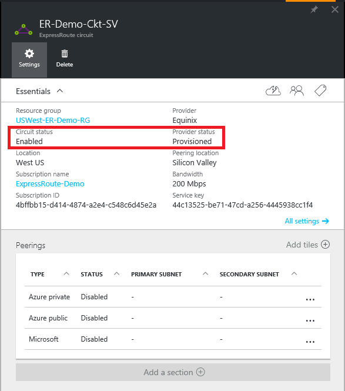

2. Configure Azure private peering for the circuit. Make sure that you have the following items before you proceed with the next steps:

	- A /30 subnet for the primary link. This must not be part of any address space reserved for virtual networks.
	- A /30 subnet for the secondary link. This must not be part of any address space reserved for virtual networks.
	- A valid VLAN ID to establish this peering on. Ensure that no other peering in the circuit uses the same VLAN ID.
	- AS number for peering. You can use both 2-byte and 4-byte AS numbers. You can use a private AS number for this peering. Ensure that you are not using 65515.
	- An MD5 hash if you choose to use one. **This is optional**.

3. Select the Azure Private peering row, as shown below.
	
	
	

4. Configure private peering. The image below shows a configuration example.

	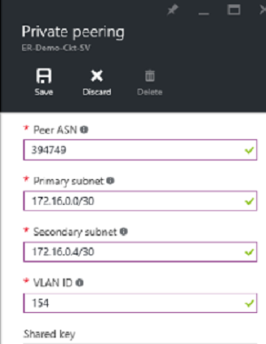

	
5. Save the configuration once you have specified all parameters. Once the configuration has been accepted successfully, you will see something similar to the example below.

	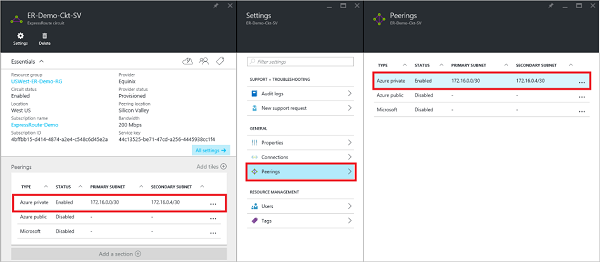
	

### To view Azure private peering details

You can view the properties of Azure private peering by selecting the peering.

### To update Azure private peering configuration

You can select the row for peering and modify the peering properties. 

### To delete Azure private peering

You can remove your peering configuration by selecting the delete icon as shown below.

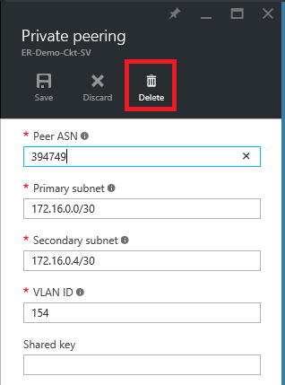

## Azure public peering

This section provides instructions on how to create, get, update, and delete the Azure public peering configuration for an ExpressRoute circuit. 

### To create Azure public peering

1. Configure ExpressRoute circuit. Ensure that the circuit is fully provisioned by the connectivity provider before continuing further.

	

2. Configure Azure public peering for the circuit. Make sure that you have the following items before you proceed with the next steps:

	- A /30 subnet for the primary link. 
	- A /30 subnet for the secondary link. 
	- All IP addresses used to setup this peering must be valid public IPv4 addresses.
	- A valid VLAN ID to establish this peering on. Ensure that no other peering in the circuit uses the same VLAN ID.
	- AS number for peering. You can use both 2-byte and 4-byte AS numbers.
	- An MD5 hash if you choose to use one. **This is optional**.

3. Select the Azure public peering row, as shown below.
	
	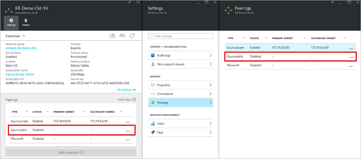
	

4. Configure public peering. The image below shows a configuration example.

	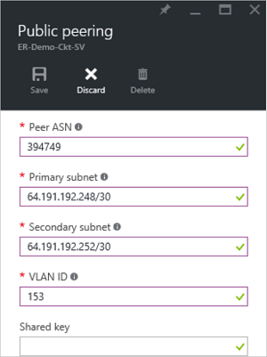

	
5. Save the configuration once you have specified all parameters. Once the configuration has been accepted successfully, you will see something similar to the example below.

	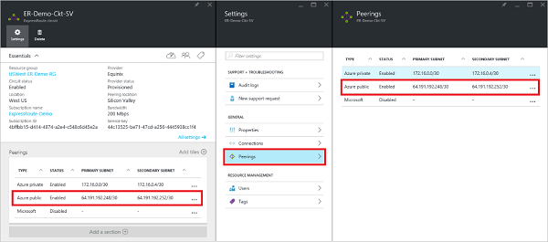
	

### To view Azure public peering details

You can view the properties of Azure public peering by selecting the peering.

### To update Azure public peering configuration

You can select the row for peering and modify the peering properties. 

### To delete Azure public peering

You can remove your peering configuration by selecting the delete icon as shown below.

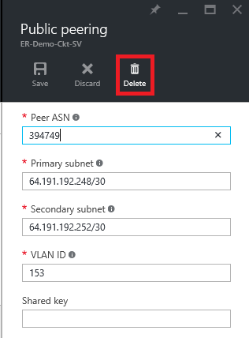

## Microsoft peering

This section provides instructions on how to create, get, update, and delete the Microsoft peering configuration for an ExpressRoute circuit. 

### To create Microsoft peering

1. Configure ExpressRoute circuit. Ensure that the circuit is fully provisioned by the connectivity provider before continuing further.

	

2. Configure Microsoft peering for the circuit. Make sure that you have the following information before you proceed.

	- A /30 subnet for the primary link. This must be a valid public IPv4 prefix owned by you and registered in an RIR / IRR.
	- A /30 subnet for the secondary link. This must be a valid public IPv4 prefix owned by you and registered in an RIR / IRR.
	- A valid VLAN ID to establish this peering on. Ensure that no other peering in the circuit uses the same VLAN ID.
	- AS number for peering. You can use both 2-byte and 4-byte AS numbers.
	- **Advertised prefixes:** You must provide a list of all prefixes you plan to advertise over the BGP session. Only public IP address prefixes are accepted. You can send a comma separated list if you plan to send a set of prefixes. These prefixes must be registered to you in an RIR / IRR.
	- **Customer ASN:** If you are advertising prefixes that are not registered to the peering AS number, you can specify the AS number to which they are registered. **This is optional**.
	- **Routing Registry Name:** You can specify the RIR / IRR against which the AS number and prefixes are registered. **This is optional.**
	- An MD5 hash, if you choose to use one. **This is optional.**
	
3. You can select the peering you wish to configure as shown below. Select the Microsoft peering row.
	
	
	

4.  Configure Microsoft peering. The image below shows a configuration example.

	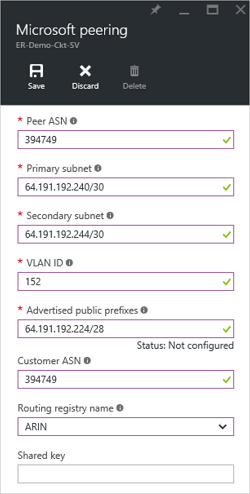

	
5. Save the configuration once you have specified all parameters. 

	If your circuit gets to a validation needed state (as shown below), you must open a support ticket to show proof of ownership of the prefixes to our support team.	
	
	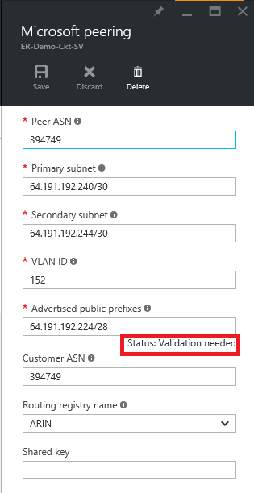

	You can open a support ticket directly from the portal as shown below 	
	
	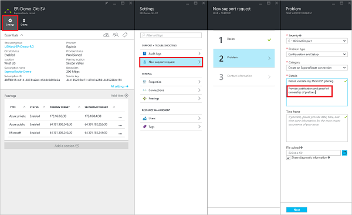

6. Once the configuration has been accepted successfully, you will see something similar to the example below.

	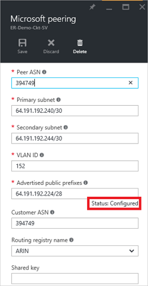
	

### To view Microsoft peering details

You can view the properties of Azure public peering by selecting the peering.

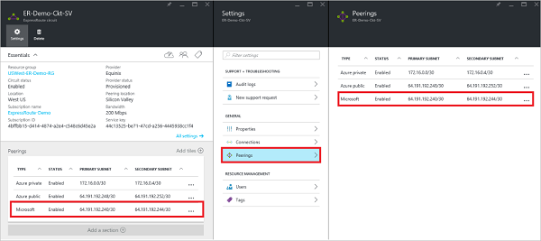

### To update Microsoft peering configuration

You can select the row for peering and modify the peering properties. 

### To delete Microsoft peering

You can remove your peering configuration by selecting the delete icon as shown below.

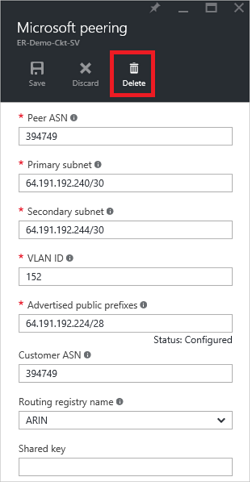

## Next steps

Next step, [Link a VNet to an ExpressRoute circuit](expressroute-howto-linkvnet-arm.md).

-  For more information about ExpressRoute workflows, see [ExpressRoute workflows](expressroute-workflows.md).

-  For more information about circuit peering, see [ExpressRoute circuits and routing domains](expressroute-circuit-peerings.md).

-  For more information about working with virtual networks, see [Virtual network overview](../virtual-network/virtual-networks-overview.md).

