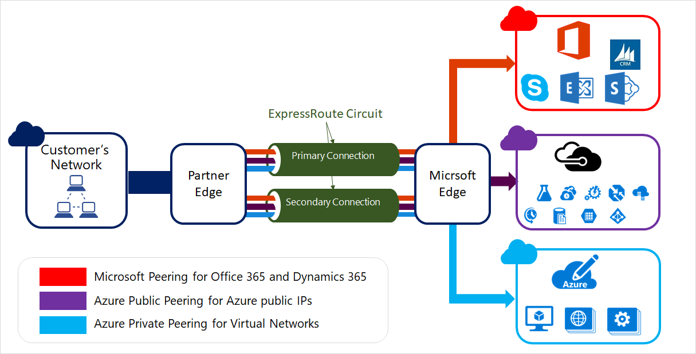

# What is Azure ExpressRoute?

> [!IMPORTANT]
> Public peering for ExpressRoute is being retired on **March 31, 2024**. For more information, see [**retirement notice**](https://azure.microsoft.com/updates/retirement-notice-migrate-from-public-peering-by-march-31-2024/).

ExpressRoute lets you extend your on-premises networks into the Microsoft cloud over a private connection with the help of a connectivity provider. With ExpressRoute, you can establish connections to Microsoft cloud services, such as Microsoft Azure and Microsoft 365.

Connectivity can be from an any-to-any (IP VPN) network, a point-to-point Ethernet network, or a virtual cross-connection through a connectivity provider at a colocation facility. ExpressRoute connections don't go over the public Internet. This allows ExpressRoute connections to offer more reliability, faster speeds, consistent latencies, and higher security than typical connections over the Internet. For information on how to connect your network to Microsoft using ExpressRoute, see [ExpressRoute connectivity models](expressroute-connectivity-models.md).

> [!NOTE]
> In the context of ExpressRoute, the Microsoft Edge describes the edge routers on the Microsoft side of the ExpressRoute circuit. This is the ExpressRoute circuit's point of entry into Microsoft's network.
> 

## Key benefits

* Layer 3 connectivity between your on-premises network and the Microsoft Cloud through a connectivity provider. Connectivity can be from an any-to-any (IPVPN) network, a point-to-point Ethernet connection, or through a virtual cross-connection via an Ethernet exchange.
* Connectivity to Microsoft cloud services across all regions in the geopolitical region.
* Global connectivity to Microsoft services across all regions with the ExpressRoute premium add-on.
* Dynamic routing between your network and Microsoft via BGP.
* Built-in redundancy in every peering location for higher reliability.
* Connection uptime [SLA](https://azure.microsoft.com/support/legal/sla/).
* QoS support for Skype for Business.

For more information, see the [ExpressRoute FAQ](expressroute-faqs.md).

## Features

### Layer 3 connectivity

Microsoft uses BGP, an industry standard dynamic routing protocol, to exchange routes between your on-premises network, your instances in Azure, and Microsoft public addresses. We establish multiple BGP sessions with your network for different traffic profiles. More details can be found in the [ExpressRoute circuit and routing domains](expressroute-circuit-peerings.md) article.

### Redundancy

Each ExpressRoute circuit consists of two connections to two Microsoft Enterprise edge routers (MSEEs) at an [ExpressRoute Location](./expressroute-locations.md#expressroute-locations) from the connectivity provider or your network edge. Microsoft requires dual BGP connections from the connectivity provider or your network edge – one to each MSEE. You may choose not to deploy redundant devices/Ethernet circuits at your end. However, connectivity providers use redundant devices to ensure that your connections are handed off to Microsoft in a redundant manner.

### Connectivity to Microsoft cloud services

ExpressRoute connections enable access to the following services:
* Microsoft Azure services
* Microsoft 365 services

> [!NOTE]
> [!INCLUDE [expressroute-office365-include](../../includes/expressroute-office365-include.md)]
> 

For a detailed list of services supported over ExpressRoute, visit the [ExpressRoute FAQ](expressroute-faqs.md#microsoft-peering) page.

### Connectivity to all regions within a geopolitical region

You can connect to Microsoft from one of our [peering locations](expressroute-locations.md) and access regions within the same geopolitical region.

For example, if you connect to Microsoft in Amsterdam through ExpressRoute. You'll have access to all of  Microsoft cloud services hosted in North and West Europe. For an overview of the geopolitical regions, the associated Microsoft cloud regions, and corresponding ExpressRoute peering locations, see the [ExpressRoute partners and peering locations](expressroute-locations.md) article.

### Global connectivity with ExpressRoute Premium

You can enable [ExpressRoute Premium](expressroute-faqs.md#expressroute-premium) to extend connectivity across geopolitical boundaries. If you connect to Microsoft in Amsterdam through ExpressRoute, you'll have access to all of Microsoft cloud services hosted in every region across the globe. For example, you'll have access to services deployed in West US or Australian East the same way you access North and West Europe regions. National clouds are excluded.

### Local connectivity with ExpressRoute Local

You can transfer data cost-effectively by enabling the [Local SKU](expressroute-faqs.md#expressroute-local). With Local SKU, you can bring your data to an ExpressRoute location near the Azure region you want. With Local, Data transfer is included in the ExpressRoute port charge.

For peering location and supported Azure local region, see [providers by locations](expressroute-locations-providers.md#partners).

### Across on-premises connectivity with ExpressRoute Global Reach

You can enable ExpressRoute Global Reach to exchange data across your on-premises sites by connecting your ExpressRoute circuits. For example, if you have a private data center in California connected to an ExpressRoute circuit in Silicon Valley and another private data center in Texas connected to an ExpressRoute circuit in Dallas. With ExpressRoute Global Reach, you can connect your private data centers together through these two ExpressRoute circuits. Your cross data-center traffic will traverse through the Microsoft network.

For more information, see [ExpressRoute Global Reach](expressroute-global-reach.md).

### Rich connectivity partner ecosystem

ExpressRoute has a constantly growing ecosystem of connectivity providers and systems integrator partners. For the latest information, see [ExpressRoute partners and peering locations](expressroute-locations.md).

### Connectivity to national clouds

Microsoft operates isolated cloud environments for special geopolitical regions and customer segments. For a list of national clouds and providers, see [ExpressRoute partners and peering locations](expressroute-locations.md#national-cloud-environment).

### ExpressRoute Direct

ExpressRoute Direct provides customers the opportunity to connect directly into Microsoft’s global network at peering locations strategically distributed across the world. ExpressRoute Direct provides dual 100-Gbps connectivity, which supports Active/Active connectivity at scale.

Key features that ExpressRoute Direct provides include, but aren't limited to:

* Massive data ingestion into services like Azure Storage and Azure Cosmos DB.
* Physical isolation for industries that are regulated and require dedicated and isolated connectivity. For example: banks, governments, and retails.
* Granular control of circuit distribution based on business unit.

For more information, see [About ExpressRoute Direct](./expressroute-erdirect-about.md).

### Bandwidth options

You can purchase ExpressRoute circuits for a wide range of bandwidths. The supported bandwidths are listed as follows. Be sure to check with your connectivity provider to determine the bandwidths they support.

* 50 Mbps
* 100 Mbps
* 200 Mbps
* 500 Mbps
* 1 Gbps
* 2 Gbps
* 5 Gbps
* 10 Gbps

The built-in redundancy of your circuit is configured using primary and secondary connections, each of the procured bandwidth, to two Microsoft Enterprise Edge routers (MSEEs). The bandwidth available through your secondary connection can be used for more traffic if necessary. Since the secondary connection is meant for redundancy, it isn't guaranteed and shouldn't be used for extra traffic for a sustained period of time. If you plan to use only your primary connection to transmit traffic, the bandwidth for the connection is fixed, and attempting to oversubscribe it results in increased packet drops.

### Dynamic scaling of bandwidth

You can increase the ExpressRoute circuit bandwidth without having to tear down your connections. For more information, see [Modifying an ExpressRoute circuit](expressroute-howto-circuit-portal-resource-manager.md#modify).

### Flexible billing models

You can select a billing model that works best for you:

* **Unlimited data**. Billing is based on a monthly fee; all inbound and outbound data transfer is included free of charge.
* **Metered data**. Billing is based on a monthly fee; all inbound data transfer is free of charge. Outbound data transfer is charged per GB of data transfer. Data transfer rates vary by region.
* **ExpressRoute premium add-on**. ExpressRoute premium is an add-on to the ExpressRoute circuit. The ExpressRoute premium add-on provides the following capabilities: 
  * Increased route limits for Azure public and Azure private peering from 4,000 routes to 10,000 routes.
  * Global connectivity for services. An ExpressRoute circuit created in any region (excluding national clouds) will have access to resources across every other region in the world. For example, a virtual network created in West Europe can be accessed through an ExpressRoute circuit provisioned in Silicon Valley.
  * Increased number of VNet links per ExpressRoute circuit from 10 to a larger limit, depending on the bandwidth of the circuit.

## FAQ

For frequently asked questions about ExpressRoute, see [ExpressRoute FAQ](expressroute-faqs.md).

## What's new?

Subscribe to the RSS feed and view the latest ExpressRoute feature updates on the [Azure Updates](https://azure.microsoft.com/updates/?category=networking&query=ExpressRoute) page.

## Next steps

* [Learn module: Introduction to Azure ExpressRoute](/training/modules/intro-to-azure-expressroute).
* Review [ExpressRoute prerequisites](expressroute-prerequisites.md).
* Learn about [ExpressRoute connectivity models](expressroute-connectivity-models.md).
* Look for a service provider, see [ExpressRoute partners and peering locations](expressroute-locations.md).
