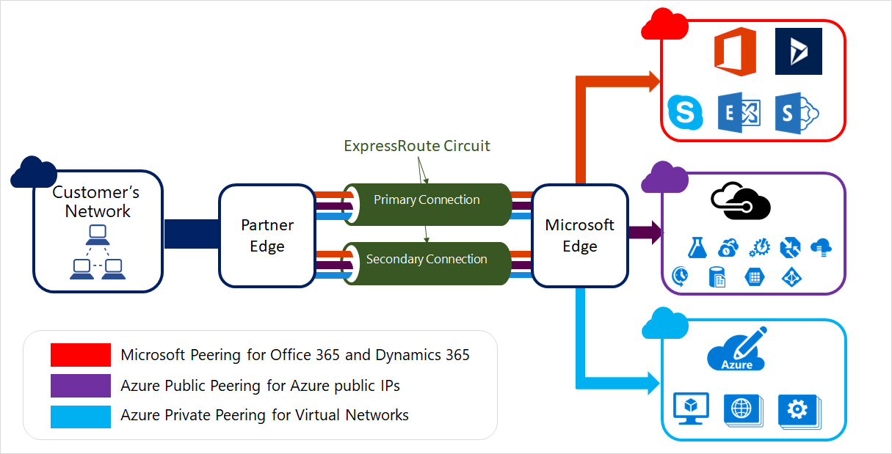
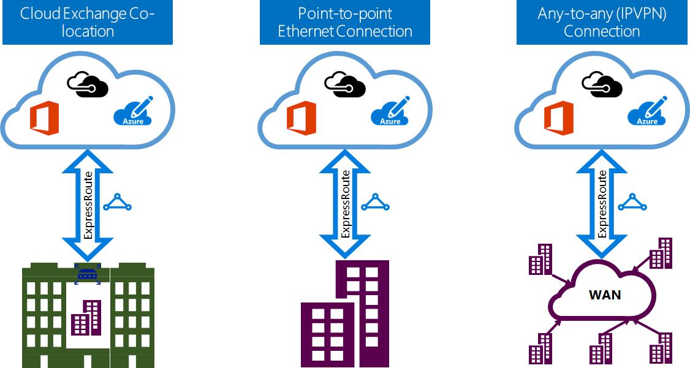

<properties 
   pageTitle="Introduction to ExpressRoute | Microsoft Azure"
   description="This page provides an overview of the ExpressRoute service, including how an ExpressRoute connection works."
   documentationCenter="na"
   services="expressroute"
   authors="cherylmc"
   manager="carmonm"
   editor=""/>
<tags 
   ms.service="expressroute"
   ms.devlang="na"
   ms.topic="get-started-article" 
   ms.tgt_pltfrm="na"
   ms.workload="infrastructure-services" 
   ms.date="06/13/2016"
   ms.author="cherylmc"/>

# ExpressRoute technical overview

Microsoft Azure ExpressRoute lets you extend your on-premises networks into the Microsoft cloud over a dedicated private connection facilitated by a connectivity provider. With ExpressRoute, you can establish connections to Microsoft cloud services, such as Microsoft Azure, Office 365, and CRM Online. Connectivity can be from an any-to-any (IP VPN) network, a point-to-point Ethernet network, or a virtual cross-connection through a connectivity provider at a co-location facility. ExpressRoute connections do not go over the public Internet. This allows ExpressRoute connections to offer more reliability, faster speeds, lower latencies, and higher security than typical connections over the Internet.  

**Key benefits include:**

- Layer 3 connectivity between your on-premises network and the Microsoft Cloud through a connectivity provider. Connectivity can be from an any-to-any (IPVPN) network, a point-to-point Ethernet connection, or through a virtual cross-connection via an Ethernet exchange.
- Connectivity to Microsoft cloud services across all regions in the geopolitical region.
- Global connectivity to Microsoft services across all regions with ExpressRoute premium add-on.
- Dynamic routing between your network and Microsoft over industry standard protocols (BGP).
- Built-in redundancy in every peering location for higher reliability.
- Connection uptime [SLA](https://azure.microsoft.com/support/legal/sla/).
- QoS and support for multiple classes of service for special applications, such as Skype for Business.

See the [ExpressRoute FAQ](expressroute-faqs.md) for more details.

## How can I connect my network to Microsoft using ExpressRoute?

You can create a connection between your on-premises network and the Microsoft cloud in three different ways:

### Co-located at a cloud exchange

If you are co-located in a facility with a cloud exchange, you can order virtual cross-connections to the Microsoft cloud through the co-location provider’s Ethernet exchange. Co-location providers can offer either Layer 2 cross-connections, or managed Layer 3 cross-connections between your infrastructure in the co-location facility and the Microsoft cloud.

### Point-to-point Ethernet connections 

You can connect your on-premises datacenters/offices to the Microsoft cloud through point-to-point Ethernet links. Point-to-point Ethernet providers can offer Layer 2 connections, or managed Layer 3 connections between your site and the Microsoft cloud.

### Any-to-any (IPVPN) networks

You can integrate your WAN with the Microsoft cloud. IPVPN providers (typically MPLS VPN) offer any-to-any connectivity between your branch offices and datacenters. The Microsoft cloud can be interconnected to your WAN to make it look just like any other branch office. WAN providers typically offer managed Layer 3 connectivity. ExpressRoute capabilities and features are all identical across all of the above connectivity models. 

Connectivity providers can offer one or more connectivity models. You can work with your connectivity provider to pick the model that works best for you.

## ExpressRoute features

ExpressRoute supports the following features and capabilities: 

### Layer 3 connectivity

Microsoft uses industry standard dynamic routing protocol (BGP) to exchange routes between your on-premises network, your instances in Azure, and Microsoft public addresses.  We establish multiple BGP sessions with your network for different traffic profiles. More details can be found in the [ExpressRoute circuit and routing domains](expressroute-circuit-peerings.md) article.

### Redundancy

Each ExpressRoute circuit consists of two connections to two Microsoft Enterprise edge routers (MSEEs) from the connectivity provider / your network edge. Microsoft will require dual BGP connection from the connectivity provider / your side – one to each MSEE. You may choose not to deploy redundant devices / Ethernet circuits at your end. However, connectivity providers use redundant devices to ensure that your connections are handed off to Microsoft in a redundant manner. A redundant Layer 3 connectivity configuration is a requirement for our [SLA](https://azure.microsoft.com/support/legal/sla/) to be valid. 

### Connectivity to Microsoft cloud services

[AZURE.INCLUDE [expressroute-office365-include](../../includes/expressroute-office365-include.md)]

ExpressRoute connections enable access to the following services:

- Microsoft Azure services
- Microsoft Office 365 services
- Microsoft CRM Online services 
 
You can visit the [ExpressRoute FAQ](expressroute-faqs.md) page for a detailed list of services supported over ExpressRoute.

### Connectivity to all regions within a geopolitical region

You can connect to Microsoft in one of our [peering locations](expressroute-locations.md) and have access to all regions within the geopolitical region. 

For example, if you connected to Microsoft in Amsterdam through ExpressRoute, you will have access to all Microsoft cloud services hosted in Northern Europe and Western Europe. Refer to the [ExpressRoute partners and peering locations](expressroute-locations.md) article for an overview of the geopolitical regions, associated Microsoft cloud regions, and corresponding ExpressRoute peering locations.

### Global connectivity with ExpressRoute premium add-on

You can enable the ExpressRoute premium add-on feature to extend connectivity across geopolitical boundaries. For example, if you are connected to Microsoft in Amsterdam through ExpressRoute, you will have access to all Microsoft cloud services hosted in all regions across the world (national clouds are excluded). You can access services deployed in South America or Australia the same way you access the North and West Europe regions.

### Rich connectivity partner ecosystem

ExpressRoute has a constantly growing ecosystem of connectivity providers and SI partners. You can refer to the [ExpressRoute providers and locations](expressroute-locations.md) article for the latest information.

### Connectivity to national clouds

Microsoft operates isolated cloud environments for special geopolitical regions and customer segments. Refer to the [ExpressRoute providers and locations](expressroute-locations.md) page for a list of national clouds and providers.

### Supported bandwidth options

You can purchase ExpressRoute circuits for a wide range of bandwidths. The list of supported bandwidths are listed below. Be sure to check with your connectivity provider to determine the list of supported bandwidths they provide.

- 50 Mbps
- 100 Mbps
- 200 Mbps
- 500 Mbps
- 1 Gbps
- 2 Gbps
- 5 Gbps
- 10 Gbps

### Dynamic scaling of bandwidth

You have the ability to increase the ExpressRoute circuit bandwidth (on a best effort basis) without having to tear down your connections. 

### Flexible billing models

You can pick a billing model that works best for you. Choose between the billing models listed below. Refer to the [ExpressRoute FAQ](expressroute-faqs.md) page for more details. 

- **Unlimited data**. The ExpressRoute circuit is charged based on a monthly fee, and all inbound and outbound data transfer is included free of charge. 
- **Metered data**. The ExpressRoute circuit is charged based on a monthly fee. All inbound data transfer is free of charge. Outbound data transfer is charged per GB of data transfer. Data transfer rates vary by region.
- **ExpressRoute premium add-on**. The ExpressRoute premium is an add-on over the ExpressRoute circuit. The ExpressRoute premium add-on provides the following capabilities: 
	- Increased route limits for Azure public and Azure private peering from 4,000 routes to 10,000 routes.
	- Global connectivity for services. An ExpressRoute circuit created in any region (excluding national clouds) will have access to resources across any other region in the world. For example, a virtual network created in West Europe can be accessed through an ExpressRoute circuit provisioned in Silicon Valley.
	- Increased number of VNet links per ExpressRoute circuit from 10 to a larger limit, depending on the bandwidth of the circuit.

## Next steps

- Learn about ExpressRoute connections and routing domains. See [ExpressRoute circuits and routing domains](expressroute-circuit-peerings.md).
- Find a service provider. See [ExpressRoute partners and peering locations](expressroute-locations.md).
- Ensure that all prerequisites are met. See [ExpressRoute prerequisites](expressroute-prerequisites.md).
- Refer to the requirements for [Routing](expressroute-routing.md), [NAT](expressroute-nat.md) and [QoS](expressroute-qos.md).
- Configure your ExpressRoute connection.
	- [Create an ExpressRoute circuit](expressroute-howto-circuit-classic.md)
	- [Configure routing](expressroute-howto-routing-classic.md)
	- [Link a VNet to an ExpressRoute circuit](expressroute-howto-linkvnet-classic.md)
