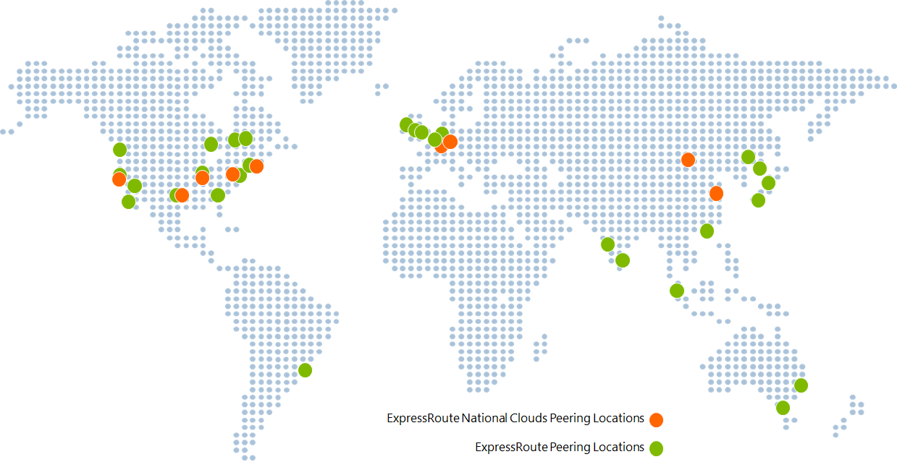

<properties
   pageTitle="ExpressRoute locations | Microsoft Azure"
   description="This article provides a detailed overview of locations where services are offered and how to connect to Azure regions."
   services="expressroute"
   documentationCenter="na"
   authors="cherylmc"
   manager="carolz"
   editor="" />
<tags
   ms.service="expressroute"
   ms.devlang="na"
   ms.topic="get-started-article"
   ms.tgt_pltfrm="na"
   ms.workload="infrastructure-services"
   ms.date="09/22/2015"
   ms.author="cherylmc" />

# ExpressRoute partners and peering locations

The tables in this article provide information on ExpressRoute connectivity providers, ExpressRoute geographical coverage, Microsoft cloud services supported over ExpressRoute, and ExpressRoute System Integrators (SIs).

## ExpressRoute connectivity providers

ExpressRoute is supported across all Azure regions and locations. The following map provides a list of Azure regions and ExpressRoute locations. ExpressRoute locations refer to those where Microsoft peers with several service providers.

You will have access to Azure services across all regions within a geopolitical region if you connected to at least one ExpressRoute location within the geopolitical region. The following table provides a map of Azure regions to ExpressRoute locations within a geopolitical region.

|**Geopolitical region**|**Azure regions**|**ExpressRoute locations**|
|---|---|---|
|**US**|All US Regions - East US, West US, East US 2, Central US, South Central US, North Central US|Atlanta, Chicago, Dallas, Los Angeles, New York, Seattle, Silicon Valley, Washington DC|
|**South America**|Brazil South|Sao Paulo|
|**Europe**|North Europe, West Europe|Amsterdam, London|
|**Asia**|East Asia, Southeast Asia|Hong Kong, Singapore|
|**Japan**|Japan West, Japan East|Tokyo|
|**Australia**|Australia Southeast, Australia East|Melbourne, Sydney|
|**India**|India West, India Central, India South|Chennai, Mumbai|

The table below provides information on regions and geopolitical boundaries for national clouds.

|**Geopolitical region**|**Azure regions**|**ExpressRoute locations**|
|---|---|---|---|
|**US Government cloud**|US Government|Iowa, Virginia|Ashburn, Chicago|

Connectivity across geopolitical regions is not supported on the standard ExpressRoute SKU. You will need to enable the ExpressRoute premium add-on to support global connectivity. Connectivity to national cloud environments is not supported. You can work with your connectivity provider if such a need arises.

## Connectivity provider locations

### Production Azure

| **Service provider**  |**Microsoft Azure** | **Office 365** | **Locations** |
|-----------------------|--------------------|----------------|---------------|
| **[Aryaka Networks]( http://www.aryaka.com/)** | Supported | Not Supported | Silicon Valley, Singapore, Washington DC |
| **[AT&T NetBond]( https://www.synaptic.att.com/clouduser/html/productdetail/ATT_NetBond.htm)** | Supported | Supported | Amsterdam, London+, Dallas, Silicon Valley, Washington DC |
| **[British Telecom]( http://www.globalservices.bt.com/uk/en/news/bt_to_provide_connectivity_to_microsoft_azure)** | Supported | Supported | Amsterdam, London, Silicon Valley+, Washington DC |
|**China Telecom Global** | Coming Soon | Not Supported | Hong Kong+ |
| **[Colt]( http://www.colt.net/uk/en/news/colt-announces-dedicated-cloud-access-for-microsoft-azure-services-en.htm)**  |  Supported | Not Supported | Amsterdam, London |
| **Comcast** | Supported | Not Supported | Silicon Valley, Washington DC |
| **[Equinix](http://www.equinix.com/partners/microsoft-azure/)** | Supported | Supported | Amsterdam, Atlanta, Chicago, Dallas, Hong Kong, London, Los Angeles, Melbourne, New York, Sao Paulo, Seattle, Silicon Valley, Singapore, Sydney, Tokyo, Washington DC |
| **[Internet Initiative Japan Inc. - IIJ](http://www.iij.ad.jp/en/news/pressrelease/2013/pdf/Azure_E.pdf)** |  Supported | Not Supported | Tokyo |
| **[InterCloud]( https://www.intercloud.com/)** | Supported | Not Supported | Amsterdam, London, Singapore, Washington DC |
| **Internet Solutions - Cloud Connect** | Supported | Not Supported | Amsterdam, London |
| **Interxion** | Supported | Not Supported | Amsterdam |
| **[Level 3 Communications]( http://your.level3.com/LP=882?WT.tsrc=02192014LP882AzureVanityAzureText)** | Supported | Not Supported | Amsterdam, Chicago, Dallas, London, Seattle, Silicon Valley, Washington DC |
| **Megaport** | Supported | Not Supported | Melbourne, Sydney |
| **MTN** | Supported | Not Supported | London |
| **NTT Communications** | Supported | Not Supported | London+, Tokyo |
| **NEXTDC** | Supported | Not Supported | Melbourne, Sydney+ |
| **[Orange]( http://www.orange-business.com/)** | Supported | Not Supported | Amsterdam, London, Silicon Valley, Washington DC |
| **PCCW Global Limited** | Supported | Not Supported | Hong Kong |
| **[SingTel]( http://info.singtel.com/about-us/news-releases/singtel-provide-secure-private-access-microsoft-azure-public-cloud)** |  Supported | Not Supported | Singapore |
| **[Tata Communications](http://www.tatacommunications.com/lp/izo/azure/azure_index.html)** | Supported | Supported | Amsterdam, Chennai+, Hong Kong, London, Mumbai+, Singapore |
| **[TeleCity Group]( http://www.telecitygroup.com/investor-centre/news_details.htm?locid=03100500400b00d&xml)** | Supported | Supported | Amsterdam, London |
| **[Telstra Corporation]( http://www.telstra.com.au/business-enterprise/network-services/networks/cloud-direct-connect/)** | Supported | Not Supported | Melbourne+, Sydney |
| **[Verizon](http://www.verizonenterprise.com/products/networking/secure-cloud-interconnect/)** | Supported | Supported | London, Hong Kong, Silicon Valley, Sydney, Tokyo, Washington DC |
| **[Zayo Group]( http://www.zayo.com/)** | Supported | Not Supported | Chicago, Silicon Valley, Washington DC |

 **+** denotes coming soon

### National cloud environments

#### US Government cloud

| **Service provider**  |**Microsoft Azure** | **Office 365** | **Locations** |
|-----------------------|--------------------|----------------|---------------|
| **[AT&T NetBond]( https://www.synaptic.att.com/clouduser/html/productdetail/ATT_NetBond.htm)** | Coming Soon | Not Supported | Chicago+, Washington DC+ |
| **[Equinix](http://www.equinix.com/partners/microsoft-azure/)** | Coming Soon | Not Supported | Chicago,  Washington DC |
| **[Level 3 Communications - IPVPN]( http://your.level3.com/LP=882?WT.tsrc=02192014LP882AzureVanityAzureText)** | Coming Soon | Not Supported | Chicago, Washington DC |
| **[Verizon](http://news.verizonenterprise.com/2014/04/secure-cloud-interconnect-solutions-enterprise/)** | Supported | Not Supported | Chicago, Washington DC |

## Connectivity through service providers not listed

If your connectivity provider is not listed in previous sections, you can still create a connection.

- Check with your connectivity provider to see if they are connected to any of the exchanges in the table above. You can check the following links to gather more information about services offered by exchange providers. Several connectivity providers are already connected to Ethernet exchanges.

	- [Equinix Cloud Exchange](http://www.equinix.com/services/interconnection-connectivity/cloud-exchange/)
	- [TeleCity CloudIX](http://www.telecitygroup.com/colocation-services/cloud-ix.htm)
	- [InterXion](http://www.interxion.com/)
	- [NextDC](http://www.nextdc.com/)
	- [CoreSite](http://www.coresite.com/)
- Have your connectivity provider extend your network to the peering location of choice.
	- Ensure that your connectivity provider extends your connectivity in a highly available manner so that there are no single points of failure.
- Order an ExpressRoute circuit with the exchange as your connectivity provider to connect to Microsoft.
	- Follow steps in [Create an ExpressRoute circuit](expressroute-howto-circuit-classic.md) to set up connectivity.

|**Connectivity provider**|**Exchange**|**Peering locations**|
|---|---|---|
|**[XO Communications](http://www.xo.com/)**|Equinix|Silicon Valley|

## ExpressRoute system integrators

Enabling private connectivity to fit your needs can be challenging, based on the scale of your network. You can work with any of the system integrators listed in the following table to assist you with onboarding to ExpressRoute.

|**System integrator**|**Continent**|
|---|---|
|**[Nimbo](http://www.nimbo.com/)**|US||
|**[Dotnet Solutions](http://www.dotnetsolutions.co.uk/)**|EMEA|

## Next steps

- For more information about ExpressRoute, see the [ExpressRoute FAQ](expressroute-faqs.md).
- Ensure that all prerequisites are met. See [ExpressRoute prerequisites](expressroute-prerequisites.md).
