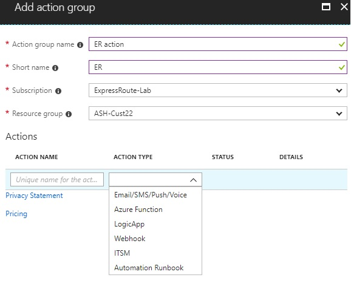
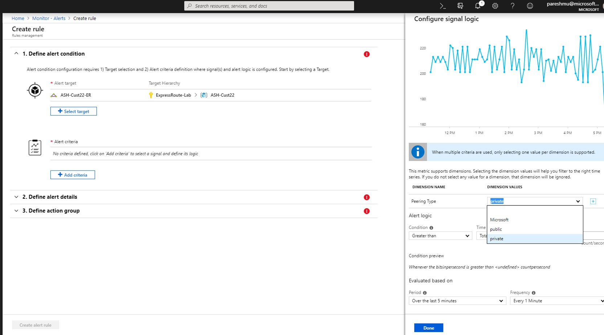
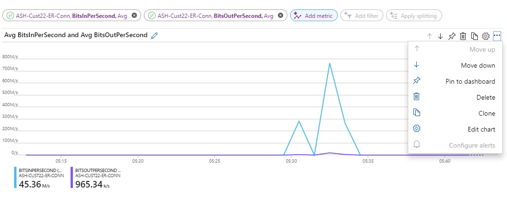

# ExpressRoute monitoring, metrics, and alerts

Azure Monitor is one stop shop for all metrics, alerting, diagnostic logs across all of Azure. 

## Circuit metrics

## Metrics per peering : private/ public/ Microsoft peering in bits/second

 

### You can only select Inbound or Outbound Metrics

**(missing file)**

## ExpressRoute gateway connections in bits/seconds

 

## Alerts for ExpressRoute gateway connections

1. Navigate to Azure Monitor and click **Alerts**.

   "alerts"

2. Click **+Select Target** and select the ExpressRoute gateway connection resource.

   "target"
3. Define the alert details.

   "details"
  
4. Define the action group.

   "action group"

  Add action group.

   "add action group"
  
 

  
  

  

  

## Next steps
* Configure your ExpressRoute connection.
  
  * [Create and modify a circuit](expressroute-howto-circuit-arm.md)
  * [Create and modify peering configuration](expressroute-howto-routing-arm.md)
  * [Link a VNet to an ExpressRoute circuit](expressroute-howto-linkvnet-arm.md)
