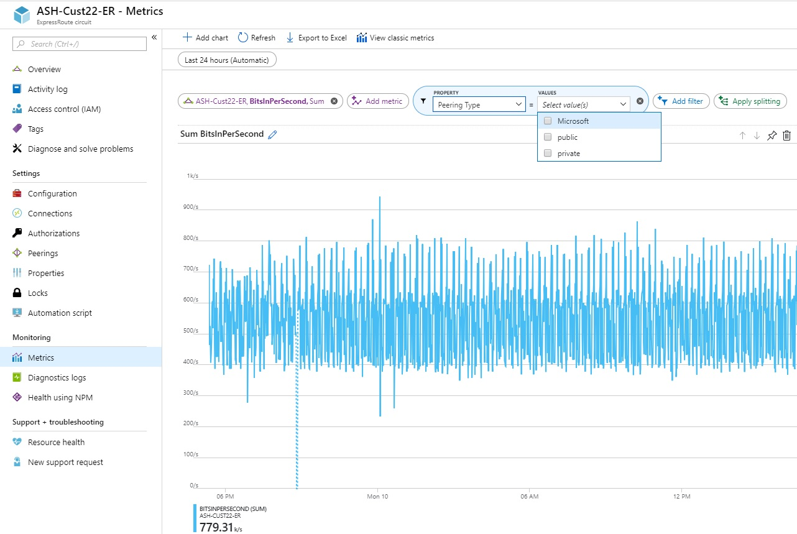
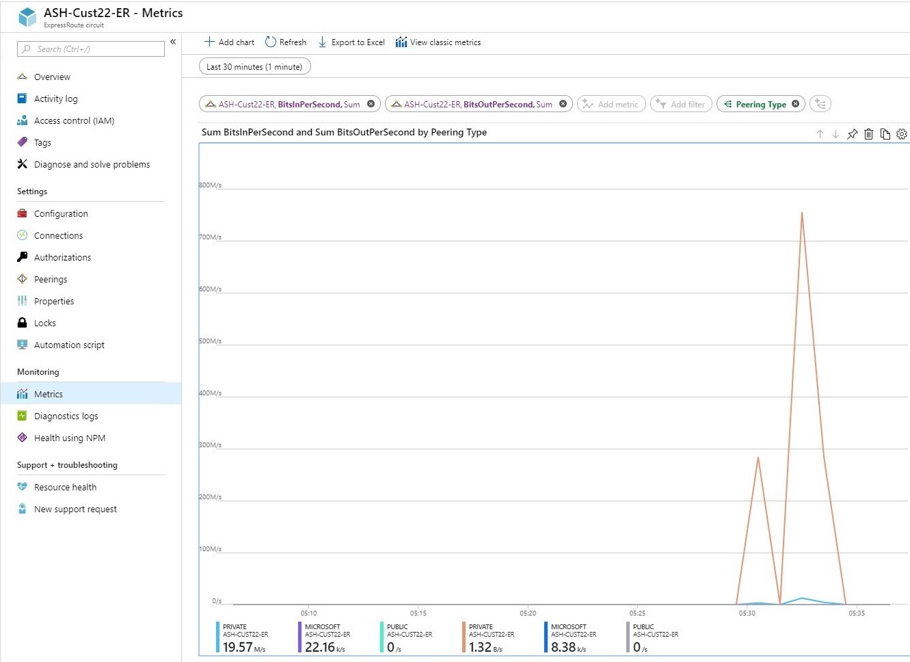
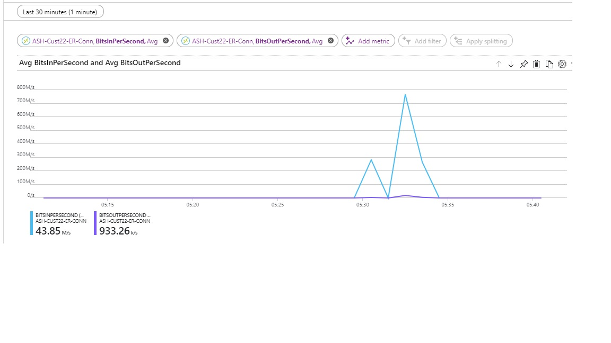
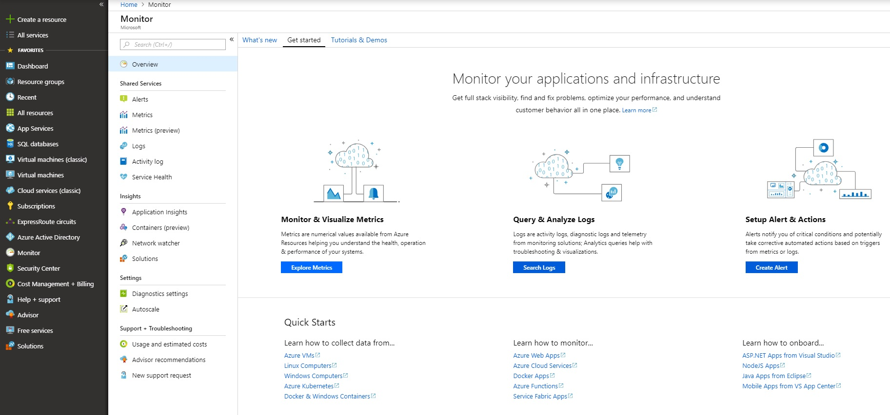
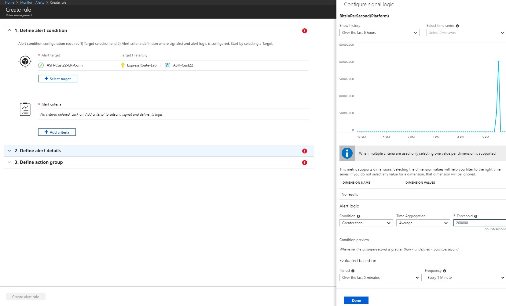
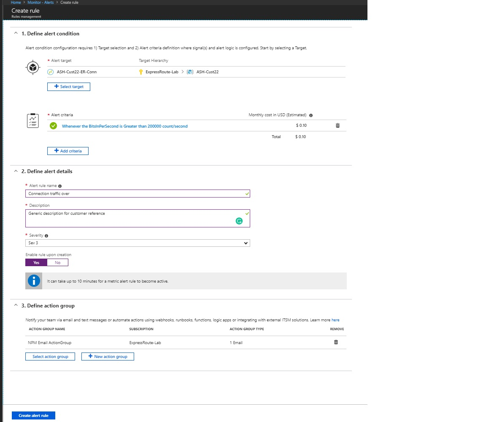
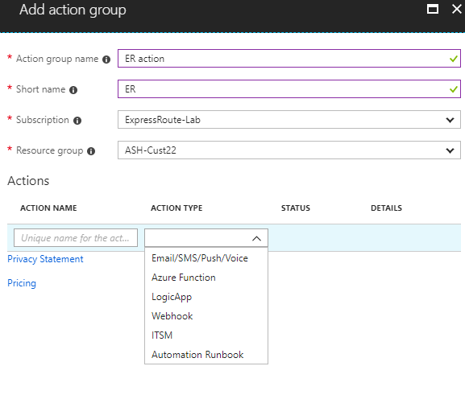
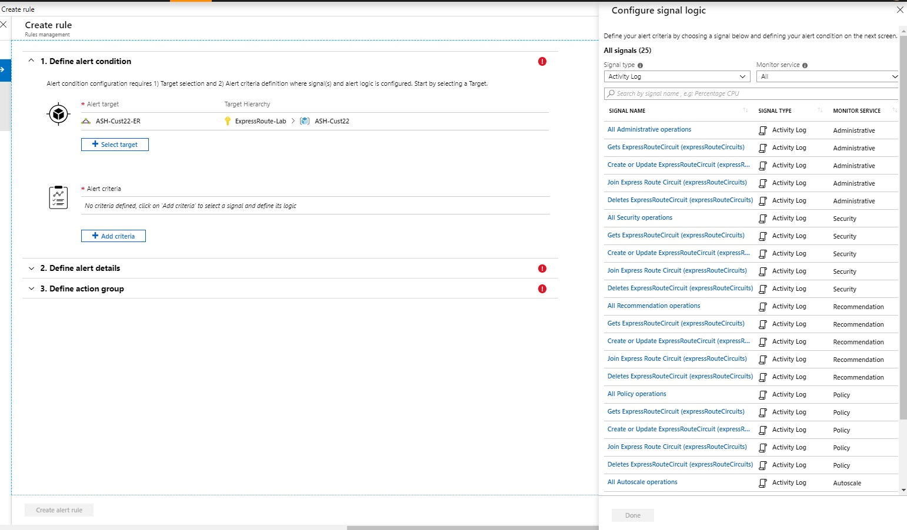

# ExpressRoute monitoring, metrics, and alerts

 This article helps you understand ExpressRoute monitoring, metrics, and alerts. Azure Monitor is one stop shop for all metrics, alerting, diagnostic logs across all of Azure.

## Circuit metrics

To navigate to **Metrics**, click the ExpressRoute page for the circuit that you want to monitor. Under **Monitoring** you can view the **Metrics**.

## Metrics per peering

You can view metrics for private, public, and Microsoft peering in bits/second.

 

## ExpressRoute gateway connections in bits/seconds

 

## Alerts for ExpressRoute gateway connections

1. In order to configure alerts, navigate to **Azure Monitor**, then click **Alerts**.

  

2. Click **+Select Target** and select the ExpressRoute gateway connection resource.

  
3. Define the alert details.

  

4. Define and add the action group.

  

## Alerts based on each peering

 

## Configure alerts for activity logs on circuits

In the **Alert Criteria**, you can select **Activity Log** for the Signal Type and select the Signal.

  

## Next steps
* Configure your ExpressRoute connection.
  
  * [Create and modify a circuit](expressroute-howto-circuit-arm.md)
  * [Create and modify peering configuration](expressroute-howto-routing-arm.md)
  * [Link a VNet to an ExpressRoute circuit](expressroute-howto-linkvnet-arm.md)
