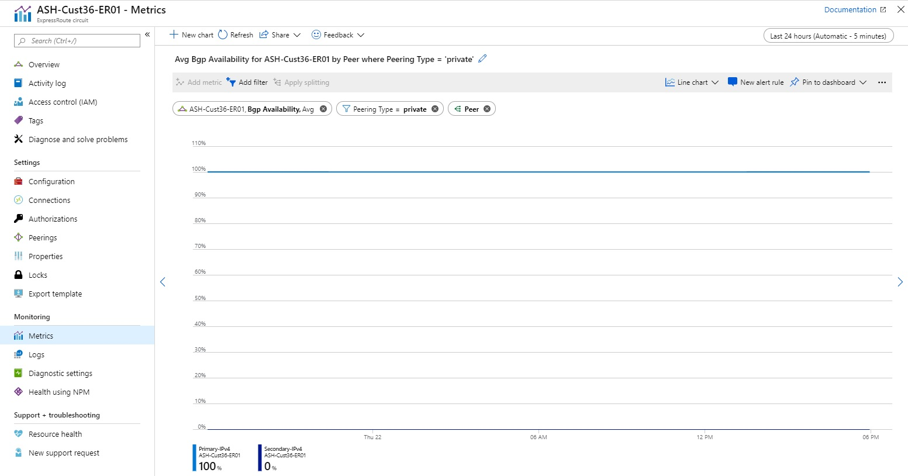
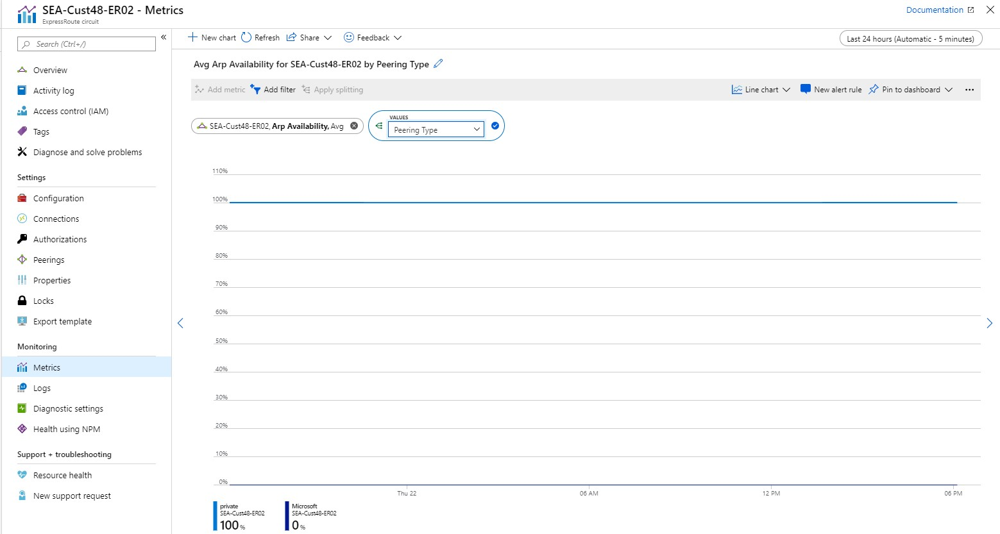
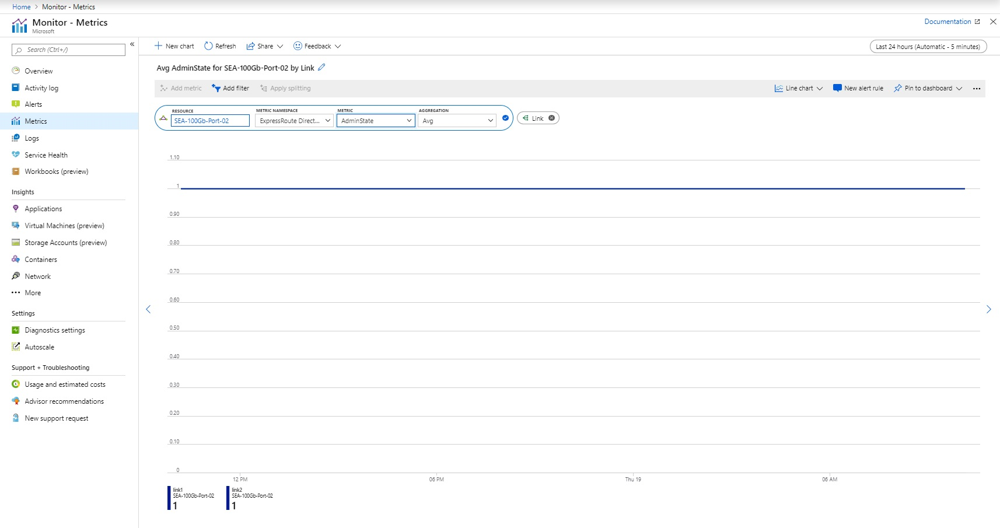
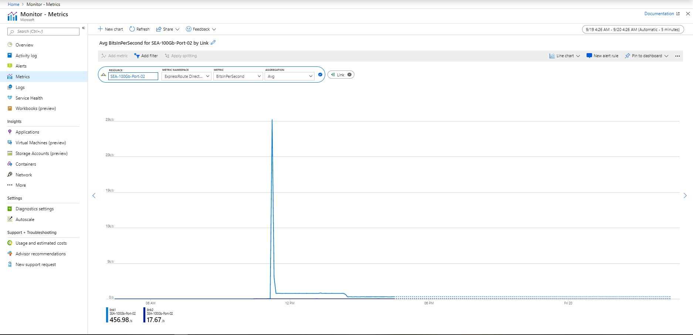
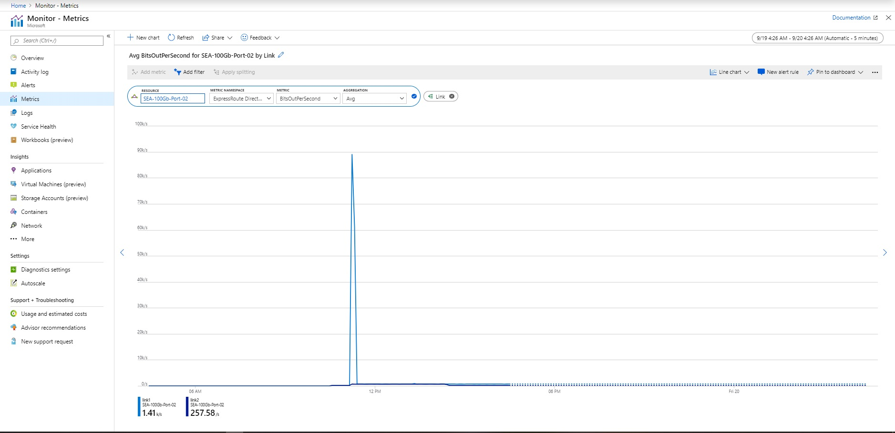
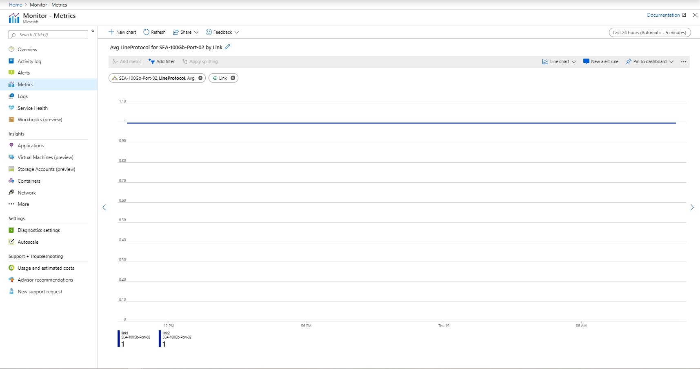
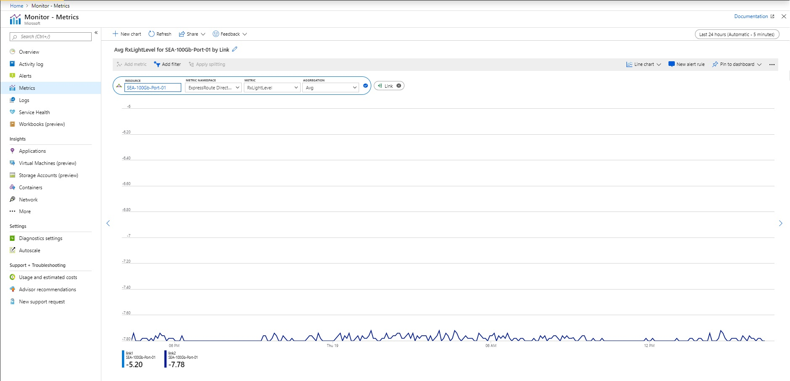
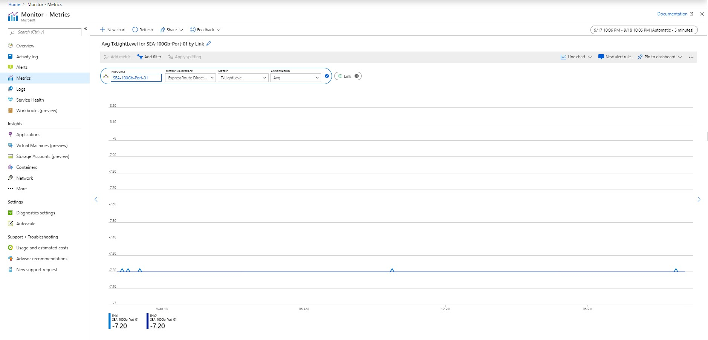

# ExpressRoute monitoring, metrics, and alerts

This article helps you understand ExpressRoute monitoring, metrics, and alerts using Azure Monitor. Azure Monitor is one stop shop for all metrics, alerting, diagnostic logs across all of Azure.
 
>[!NOTE]
>Using **Classic Metrics** is not recommended.
>

## ExpressRoute metrics

To view **Metrics**, navigate to the *Azure Monitor* page and click *Metrics*. To view **ExpressRoute** metrics, filter by Resource Type *ExpressRoute circuits*. To view **Global Reach** metrics, filter by Resource Type *ExpressRoute circuits* and select an ExpressRoute circuit resource that has Global Reach enabled. To view **ExpressRoute Direct** metrics, filter Resource Type by *ExpressRoute Ports*. 

Once a metric is selected, the default aggregation will be applied. Optionally, you can apply splitting, which will show the metric with different dimensions.

### Available Metrics
|**Metric**|**Category**|**Dimension(s)**|**Feature(s)**|
| --- | --- | --- | --- |
|ARP Availability|Availability|<ui><li>Peer (Primary/Secondary ExpressRoute router)</ui></li><ui><li> Peering Type (Private/Public/Microsoft)</ui></li>|ExpressRoute|
|Bgp Availability|Availability|<ui><li> Peer (Primary/Secondary ExpressRoute router)</ui></li><ui><li> Peering Type</ui></li>|ExpressRoute|
|BitsInPerSecond|Traffic|<ui><li> Peering Type (ExpressRoute)</ui></li><ui><li>Link (ExpressRoute Direct)</ui></li>| <li> ExpressRoute</li><li>ExpressRoute Direct|
|BitsOutPerSecond|Traffic| <ui><li>Peering Type (ExpressRoute)</ui></li><ui><li> Link (ExpressRoute Direct) | <ui><li>ExpressRoute<ui><li>ExpressRoute Direct</ui></li> |
|GlobalReachBitsInPerSecond|Traffic|<ui><li>Peered Circuit Skey (Service Key)</ui></li>|Global Reach|
|GlobalReachBitsOutPerSecond|Traffic|<ui><li>Peered Circuit Skey (Service Key)</ui></li>|Global Reach|
|AdminState|Physical Connectivity|Link|ExpressRoute Direct|
|LineProtocol|Physical Connectivity|Link|ExpressRoute Direct|
|RxLightLevel|Physical Connectivity|<ui><li>Link</ui></li><ui><li>Lane</ui></li>|ExpressRoute Direct|
|TxLightLevel|Physical Connectivity|<ui><li>Link</ui></li><ui><li>Lane</ui></li>|ExpressRoute Direct|
>[!NOTE]
>Using *GlobalGlobalReachBitsInPerSecond* and *GlobalGlobalReachBitsOutPerSecond* will only be visible if at least one Global Reach connection is established.
>

## Circuits metrics

### Bits In and Out - Metrics across all peerings

You can view metrics across all peerings on a given ExpressRoute circuit.

### Bits In and Out - Metrics per peering

You can view metrics for private, public, and Microsoft peering in bits/second.

 

### BGP Availability - Split by Peer  

You can view near to real-time availability of BGP across peerings and peers (Primary and Secondary ExpressRoute routers). This dashboard shows the Primary BGP session up for private peering and the Second BGP session down for private peering. 

 

### ARP Availability - Split by Peering  

You can view near to real-time availability of [ARP](https://docs.microsoft.com/azure/expressroute/expressroute-troubleshooting-arp-resource-manager) across peerings and peers (Primary and Secondary ExpressRoute routers). This dashboard shows the Private Peering ARP session up across both peers, but complete down for Microsoft peering across peerings. The default aggregation (Average) was utilized across both peers.  

 

## ExpressRoute Direct Metrics

### Admin State - Split by link
You can view the admin state for each link of the ExpressRoute Direct port pair.

### Bits In Per Second - Split by link
You can view the bits in per second across both links of the ExpressRoute Direct port pair. 

### Bits Out Per Second - Split by link
You can also view the bits out per second across both links of the ExpressRoute Direct port pair. 

### Line Protocol - Split by link
You can view the line protocol across each link of the ExpressRoute Direct port pair.

### Rx Light Level - Split by link
You can view the Rx light level (the light level that the ExpressRoute Direct port is **receiving**) for each port. Healthy Rx light levels generally fall within a range of -10 to 0 dBm

### Tx Light Level - Split by link
You can view the Tx light level (the light level that the ExpressRoute Direct port is **transmitting**) for each port. Healthy Tx light levels generally fall within a range of -10 to 0 dBm

## ExpressRoute gateway connections in bits/seconds

## Alerts for ExpressRoute gateway connections

1. In order to configure alerts, navigate to **Azure Monitor**, then click **Alerts**.

   

2. Click **+Select Target** and select the ExpressRoute gateway connection resource.

   
3. Define the alert details.

   

4. Define and add the action group.

   

## Alerts based on each peering

 

## Configure alerts for activity logs on circuits

In the **Alert Criteria**, you can select **Activity Log** for the Signal Type and select the Signal.

  
  
## Next steps

Configure your ExpressRoute connection.
  
  * [Create and modify a circuit](expressroute-howto-circuit-arm.md)
  * [Create and modify peering configuration](expressroute-howto-routing-arm.md)
  * [Link a VNet to an ExpressRoute circuit](expressroute-howto-linkvnet-arm.md)
