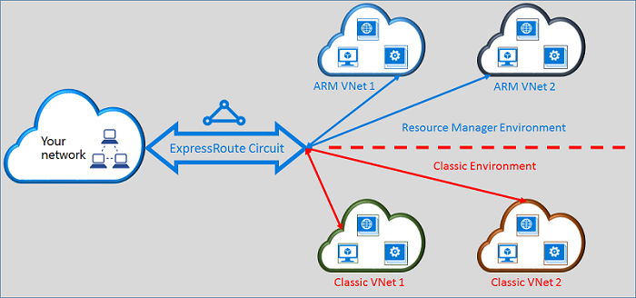

<properties
   pageTitle="Moving ExpressRoute circuits from classic to Resource Manager | Microsoft Azure"
   description="This page provides an overview of what you need to know about bridging the classic and the Resource Manager deployment models."
   documentationCenter="na"
   services="expressroute"
   authors="ganesr"
   manager="carmonm"
   editor=""/>
<tags
   ms.service="expressroute"
   ms.devlang="na"
   ms.topic="get-started-article"
   ms.tgt_pltfrm="na"
   ms.workload="infrastructure-services"
   ms.date="06/20/2016"
   ms.author="ganesr"/>

# Moving ExpressRoute circuits from the classic to the Resource Manager deployment model

This article provides an overview of what it means to move an Azure ExpressRoute circuit from the classic to the Azure Resource Manager deployment model.

[AZURE.INCLUDE [vpn-gateway-sm-rm](../../includes/vpn-gateway-classic-rm-include.md)]

You can use a single ExpressRoute circuit to connect to virtual networks that are deployed both in the classic and the Resource Manager deployment models. An ExpressRoute circuit, regardless of how it is created, can now link to virtual networks across both deployment models.

## ExpressRoute circuits that are created in the classic deployment model

ExpressRoute circuits that are created in the classic deployment model need to be moved to the Resource Manager deployment model first to enable connectivity to both the classic and the Resource Manager deployment models. There isn't connectivity loss or disruption when a connection is being moved. All circuit-to-virtual network links in the classic deployment model (within the same subscription and cross-subscription) are preserved.

After the move is completed successfully, the ExpressRoute circuit looks, performs, and feels exactly like an ExpressRoute circuit that was created in the Resource Manager deployment model. You can now create connections to virtual networks in the Resource Manager deployment model.

After an ExpressRoute circuit has been moved to the Resource Manager deployment model, you can manage the life cycle of the ExpressRoute circuit only by using the Resource Manager deployment model. This means that you can perform operations like adding/updating/deleting peerings, updating circuit properties (such as bandwidth, SKU, and billing type), and deleting circuits only in the Resource Manager deployment model. Refer to the section below on circuits that are created in the Resource Manager deployment model for further details on how you can manage access to both deployment models.

You do not have to involve your connectivity provider to perform the move.

## ExpressRoute circuits that are created in the Resource Manager deployment model

You can enable ExpressRoute circuits that are created in the Resource Manager deployment model to be accessible from both deployment models. Any ExpressRoute circuit in your subscription can be enabled to be accessed from both deployment models.

- ExpressRoute circuits that were created in the Resource Manager deployment model do not have access to the classic deployment model by default.
- ExpressRoute circuits that have been moved from the classic deployment model to the Resource manager deployment model are accessible from both deployment models by default.
- An ExpressRoute circuit always has access to the Resource Manager deployment model, regardless of whether it was created in the Resource Manager or classic deployment model. This means that you can create connections to virtual networks created in the Resource Manager deployment model by following instructions on [how to link virtual networks](expressroute-howto-linkvnet-arm.md).
- Access to the classic deployment model is controlled by the **allowClassicOperations** parameter in the ExpressRoute circuit.

>[AZURE.IMPORTANT] All quotas that are documented on the [service limits](../azure-subscription-service-limits.md) page apply. As an example, a standard circuit can have at most 10 virtual network links/connections across both the classic and the Resource Manager deployment models.

## Controlling access to the classic deployment model

You can enable a single ExpressRoute circuit to link to virtual networks in both deployment models by setting the **allowClassicOperations** parameter of the ExpressRoute circuit.

Setting **allowClassicOperations** to TRUE enables you to link virtual networks from both deployment models to the ExpressRoute circuit. You can link to virtual networks in the classic deployment model by following guidance on [how to link virtual networks in the classic deployment model](expressroute-howto-linkvnet-classic.md). You can link to virtual networks in the Resource Manager deployment model by following guidance on [how to link virtual networks in the Resource Manager deployment model](expressroute-howto-linkvnet-arm.md).

Setting **allowClassicOperations** to FALSE blocks access to the circuit from the classic deployment model. However, all virtual network links in the classic deployment model are preserved. In this case, the ExpressRoute circuit is not visible in the classic deployment model.

## Supported operations in the classic deployment model

The following classic operations are supported on an ExpressRoute circuit when **allowClassicOperations** is set to TRUE:

 - Get ExpressRoute circuit information
 - Create/update/get/delete virtual network links to classic virtual networks
 - Create/update/get/delete virtual network link authorizations for cross-subscription connectivity

You cannot perform the following classic operations when **allowClassicOperations** is set to TRUE:

 - Create/update/get/delete Border Gateway Protocol (BGP) peerings for Azure private, Azure public, and Microsoft peerings
 - Delete ExpressRoute circuits

## Communication between the classic and the Resource Manager deployment models

The ExpressRoute circuit acts like a bridge between the classic and the Resource Manager deployment models. Traffic between virtual machines in virtual networks in the classic deployment model and those in virtual networks in the Resource Manager deployment model flows through ExpressRoute if both virtual networks are linked to the same ExpressRoute circuit.

Aggregate throughput is limited by the throughput capacity of the virtual network gateway. Traffic does not enter the connectivity provider's networks or your networks in such cases. Traffic flow between the virtual networks is fully contained within the Microsoft network.

## Access to Azure public and Microsoft peering resources

You can continue to access resources that are typically accessible through Azure public peering and Microsoft peering without any disruption.  

## What's supported

This section describes what's supported for ExpressRoute circuits:

 - You can use a single ExpressRoute circuit to access virtual networks that are deployed in the classic and the Resource Manager deployment models.
 - You can move an ExpressRoute circuit from the classic to the Resource Manager deployment model. After it is moved, the ExpressRoute circuit looks, feels, and performs like any other ExpressRoute circuit that is created in the Resource Manager deployment model.
 - You can move only the ExpressRoute circuit. Circuit links, virtual networks, and VPN gateways cannot be moved through this operation.
 - After an ExpressRoute circuit has been moved to the Resource Manager deployment model, you can manage the life cycle of the ExpressRoute circuit only by using the Resource Manager deployment model. This means that you can perform operations like adding/updating/deleting peerings, updating circuit properties (such as bandwidth, SKU, and billing type), and deleting circuits only in the Resource Manager deployment model.
 - The ExpressRoute circuit acts like a bridge between the classic and the Resource Manager deployment models. Traffic between virtual machines in virtual networks in the classic deployment model and those in virtual networks in the Resource Manager deployment model flows through ExpressRoute if both virtual networks are linked to the same ExpressRoute circuit.
 - Cross-subscription connectivity is supported in both the classic and the Resource Manager deployment models.

## What's not supported

This section describes what's not supported for ExpressRoute circuits:

 - Moving circuit links, gateways, and virtual networks from the classic to the Resource Manager deployment model.
 - Managing the life cycle of an ExpressRoute circuit from the classic deployment model.
 - Role-Based Access Control (RBAC) support for the classic deployment model. You cannot perform RBAC controls to a circuit in the classic deployment model. Any administrator/coadministrator of the subscription can link or unlink virtual networks to the circuit.

## Configuration

Follow the instructions that are described in [Move an ExpressRoute circuit from the classic to the Resource Manager deployment model](expressroute-howto-move-arm.md).

## Next steps

- For workflow information, see [ExpressRoute circuit provisioning workflows and circuit states](expressroute-workflows.md).
- To configure your ExpressRoute connection:

	- [Create an ExpressRoute circuit](expressroute-howto-circuit-arm.md)
	- [Configure routing](expressroute-howto-routing-arm.md)
	- [Link a virtual network to an ExpressRoute circuit](expressroute-howto-linkvnet-arm.md)
