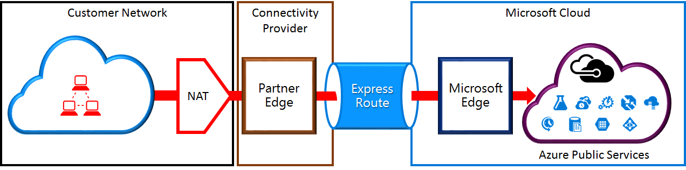
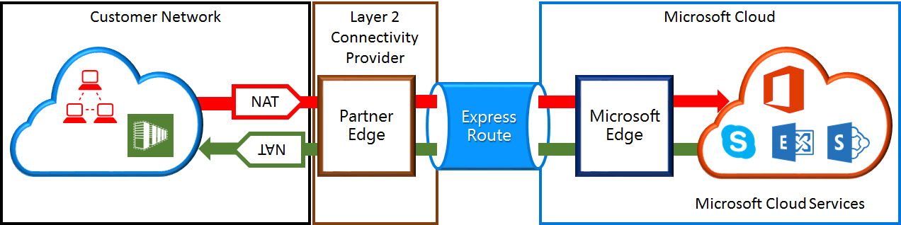

<properties
   pageTitle="NAT requirements for ExpressRoute circuits | Microsoft Azure"
   description="This page provides detailed requirements for configuring and managing NAT for ExpressRoute circuits."
   documentationCenter="na"
   services="expressroute"
   authors="cherylmc"
   manager="carmonm"
   editor=""/>
<tags
   ms.service="expressroute"
   ms.devlang="na"
   ms.topic="get-started-article"
   ms.tgt_pltfrm="na"
   ms.workload="infrastructure-services"
   ms.date="07/19/2016"
   ms.author="cherylmc"/>

# ExpressRoute NAT requirements

To connect to Microsoft cloud services using ExpressRoute, you’ll need to set up and manage NATs. Some connectivity providers offer setting up and managing NAT as a managed service. Check with your connectivity provider to see if they offer such a service. If not, you must adhere to the requirements described below. 

Review the [ExpressRoute circuits and routing domains](expressroute-circuit-peerings.md) page to get an overview of the various routing domains. To meet the public IP address requirements for Azure public and Microsoft peering, we recommend that you set up NAT between your network and Microsoft. This section provides a detailed description of the NAT infrastructure you need to set up.

## NAT requirements for Azure public peering

The Azure public peering path enables you to connect to all services hosted in Azure over their public IP addresses. These include services listed in the [ExpessRoute FAQ](expressroute-faqs.md) and any services hosted by ISVs on Microsoft Azure. Connectivity to Microsoft Azure services on public peering is always initiated from your network into the Microsoft network. Traffic destined to Microsoft Azure on public peering must be SNATed to valid public IPv4 addresses before they enter the Microsoft network. The figure below provides a high-level picture of how the NAT could be set up to meet the above requirement.

 

### NAT IP pool and route advertisements

You must ensure that traffic is entering the Azure public peering path with valid public IPv4 address. Microsoft must be able to validate the ownership of the IPv4 NAT address pool against a regional routing Internet registry (RIR) or an Internet routing registry (IRR). A check will be performed based on the AS number being peered with and the IP addresses used for the NAT. Refer to the [ExpressRoute routing requirements](expressroute-routing.md) page for information on routing registries.
 
There are no restrictions on the length of the NAT IP prefix advertised through this peering. You must monitor the NAT pool and ensure that you are not starved of NAT sessions.

>[AZURE.IMPORTANT] The NAT IP pool advertised to Microsoft must not be advertised to the Internet. This will break connectivity to other Microsoft services.

## NAT requirements for Microsoft peering

The Microsoft peering path lets you connect to Microsoft cloud services that are not supported through the Azure public peering path. The list of services includes Office 365 services, such as Exchange Online, SharePoint Online, Skype for Business, and CRM Online. Microsoft expects to support bi-directional connectivity on the Microsoft peering. Traffic destined to Microsoft cloud services must be SNATed to valid public IPv4 addresses before they enter the Microsoft network. Traffic destined to your network from Microsoft cloud services must be SNATed before they enter your network. The figure below provides a high-level picture of how the NAT should be setup for Microsoft peering.
 
 

#### Traffic originating from your network destined to Microsoft

- You must ensure that traffic is entering the Microsoft peering path with a valid public IPv4 address. Microsoft must be able to validate the owner of the IPv4 NAT address pool against the regional routing internet registry (RIR) or an internet routing registry (IRR). A check will be performed based on the AS number being peered with and the IP addresses used for the NAT. Refer to the [ExpressRoute routing requirements](expressroute-routing.md) page for information on routing registries.

- IP addresses used for the Azure public peering setup and other ExpressRoute circuits must not be advertised to Microsoft through the BGP session. There is no restriction on the length of the NAT IP prefix advertised through this peering.

	>[AZURE.IMPORTANT] The NAT IP pool advertised to Microsoft must not be advertised to the Internet. This will break connectivity to other Microsoft services.

#### Traffic originating from Microsoft destined to your network

- Certain scenarios require Microsoft to initiate connectivity to service endpoints hosted within your network. A typical example of the scenario would be connectivity to ADFS servers hosted in your network from Office 365. In such cases, you must leak appropriate prefixes from your network into the Microsoft peering. 

- You must SNAT traffic destined to IP addresses within your network from Microsoft. 

## Next steps

- Refer to the requirements for [Routing](expressroute-routing.md) and [QoS](expressroute-qos.md).
- For workflow information, see [ExpressRoute circuit provisioning workflows and circuit states](expressroute-workflows.md).
- Configure your ExpressRoute connection.

	- [Create an ExpressRoute circuit](expressroute-howto-circuit-classic.md)
	- [Configure routing](expressroute-howto-routing-classic.md)
	- [Link a VNet to an ExpressRoute circuit](expressroute-howto-linkvnet-classic.md)

