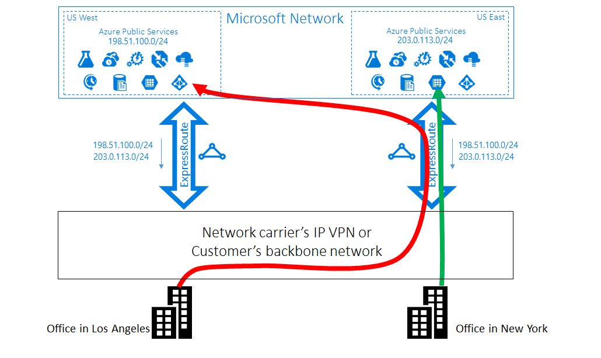

# Optimize ExpressRoute Routing

When you have multiple ExpressRoute circuits, you have more than one path to connect to Microsoft. As a result, suboptimal routing may happen - that is, your traffic may take a longer path to reach Microsoft, and Microsoft to your network. The longer the network path, the higher the latency. Latency has direct effect on application performance and user experience. This article illustrates this problem and explain how to optimize routing using the standard routing technologies.

## Path selection for Microsoft and Public peering

It's important to ensure that when utilizing Microsoft or Public peering that traffic flows over the desired path if you have one or more ExpressRoute circuits. You need to also ensure paths to the Internet use an Internet Exchange (IX) or Internet Service Provider (ISP). BGP utilizes a best path selection algorithm based on many factors including longest prefix match (LPM). To ensure that traffic destined for Azure through Microsoft or Public peering traverses the ExpressRoute path, you must implement the *Local Preference* attribute. This setting ensures that the path is always preferred on ExpressRoute. 

> [!NOTE]
> The default local preference is typically **100**. Higher local preferences are more preferred. 
>

Consider the following example scenario:

In the above example, to prefer ExpressRoute paths configure Local Preference as follows. 

**Cisco IOS-XE configuration from R1 perspective:**

- R1(config)#route-map prefer-ExR permit 10
- R1(config-route-map)#set local-preference 150

- R1(config)#router BGP 345
- R1(config-router)#neighbor 1.1.1.2 remote-as 12076
- R1(config-router)#neighbor 1.1.1.2 activate
- R1(config-router)#neighbor 1.1.1.2 route-map prefer-ExR in

**Junos configuration from R1 perspective:**

- user@R1# set protocols bgp group ibgp type internal
- user@R1# set protocols bgp group ibgp local-preference 150

## Suboptimal routing from customer to Microsoft

Let's take a close look at the routing problem by an example. Imagine you have two offices in the US, one in Los Angeles and one in New York. Your offices are connected on a Wide Area Network (WAN), which can be either your own backbone network or your service provider's IP VPN. You have two ExpressRoute circuits, one in US West and one in US East. Both are also connected on the WAN. Obviously, you have two paths to connect to the Microsoft network. 

Now imagine you have an Azure deployment, for example, an Azure App Service in both US West and US East. Your intention is to connect your users in Los Angeles to Azure US West and your users in New York to Azure US East. The reason for this set up is because your service admin advertises that users in each office access the nearby Azure services for optimal experiences. The plan works out well for the east coast users but not for the west coast users. 

The cause of the problem is on each ExpressRoute circuit, we advertise to on-premises both the prefix in Azure US East 23.100.0.0/16 and the prefix in Azure US West 13.100.0.0/16. If you don't know which prefix is from which region, you aren't able to treat it differently. Your WAN network may think both of the prefixes are closer to US East than US West and therefore route both office users to the ExpressRoute circuit in US East. In the end, you have many unhappy users in the Los Angeles office.

### Solution: use BGP Communities

To optimize routing for both office users, you need to know which prefix is from Azure US West and which from Azure US East. We encode this information by using [BGP Community values](expressroute-routing.md). We've assigned a unique BGP Community value to each Azure region, for example `12076:51004` for US East, `12076:51006` for US West. Now that you know which prefix is from which Azure region, you can configure which ExpressRoute circuit should be preferred. Since we use the BGP to exchange routing info, you can use BGP's Local Preference to influence routing. 

In our example, you can assign a higher local preference value to 13.100.0.0/16 in US West than in US East, and similarly, a higher local preference value to 23.100.0.0/16 in US East than in US West. This configuration makes sure that, when both paths to Microsoft are available, your users in Los Angeles takes the ExpressRoute circuit in US West to connect to Azure US West whereas your users in New York take the ExpressRoute in US East to Azure US East. Routing is optimized on both sides. 

> [!NOTE]
> The same technique, using Local Preference, can be applied to routing from customer to Azure virtual network when using private peering. Microsoft doesn't tag BGP community values to the prefixes advertised from Azure to your network. However, since you know which of your virtual network deployment is close to which of your office, you can configure your routers accordingly to prefer one ExpressRoute circuit over another.
>

## Suboptimal routing from Microsoft to customer

In this example, we have connections from Microsoft take a longer path to reach your network. In this case, you use on-premises Exchange servers and Exchange Online in a [hybrid environment](/exchange/exchange-hybrid). Your offices are connected to a WAN. You advertise the prefixes of your on-premises servers in both of your offices to Microsoft through two ExpressRoute circuits. 

Exchange Online initiates connections to the on-premises servers in cases such as mailbox migration. The connection to your Los Angeles office is routed to the ExpressRoute circuit in US East before traversing the entire continent back to the west coast. The cause of the problem is similar to the first one. Without any hint, the Microsoft network can't tell which on-premises prefix is close to US East and which one is close to US West. It happens to pick the wrong path to your office in Los Angeles.

### Solution: use AS PATH prepending

There are two solutions to the problem. The first is you simply advertise your on-premises prefix for your Los Angeles office 177.2.0.0/31 on the ExpressRoute circuit in US West. Then you advertise your on-premises prefix for your New York office, 177.2.0.2/31 on the ExpressRoute circuit in US East. As a result, there's only one path for Microsoft to connect to each of your offices. There's no ambiguity and routing is optimized. With this design, you need to think about your failover strategy. If the path to Microsoft through ExpressRoute goes down, you need to make sure that Exchange Online can still connect to your on-premises servers. 

The second solution is that you continue to advertise both of the prefixes on both ExpressRoute circuits, and in addition you give us a hint of which prefix is close to which one of your offices. Because we support BGP AS Path prepending, you can configure the AS Path for your prefix to influence routing. In this example, you can lengthen the AS PATH for 172.2.0.0/31 in US East so that we prefer the ExpressRoute circuit in US West for traffic destined for this prefix. Similarly you can lengthen the AS PATH for 172.2.0.2/31 in US West so that we prefer the ExpressRoute circuit in US East. Routing is optimized for both offices. With this design, if one ExpressRoute circuit is broken, Exchange Online can still reach you via another ExpressRoute circuit and your WAN. 

> [!IMPORTANT]
> We remove private AS numbers in the AS PATH for the prefixes received on Microsoft Peering when peering using a private AS number. You need to peer with a public AS and append public AS numbers in the AS PATH to influence routing for Microsoft Peering.
> 
> 

> [!NOTE]
> While the examples given here are for Microsoft and Public peerings, we do support the same capabilities for the Private peering. Also, the AS Path prepending works within one single ExpressRoute circuit, to influence the selection of the primary and secondary paths.
> 
> 

## Suboptimal routing between virtual networks

With ExpressRoute, you can enable Virtual Network to Virtual Network (which is also known as "VNet") communication by linking them to an ExpressRoute circuit. When you link them to multiple ExpressRoute circuits, suboptimal routing can happen between the VNets. Let's consider an example. You have two ExpressRoute circuits, one in US West and one in US East. In each region, you have two VNets. Your web servers are deployed in one VNet and application servers in the other. For redundancy, you link the two VNets in each region to both the local ExpressRoute circuit and the remote ExpressRoute circuit. As can be seen in the following diagram, from each VNet there are two paths to the other VNet. The VNets don't know which ExpressRoute circuit is local and which one is remote. Since Equal-Cost-Multi-Path (ECMP) routing is used to load-balance inter-VNet traffic, some traffic flows take the longer path and get routed at the remote ExpressRoute circuit.

### Solution: assign a high weight to local connection

The solution is simple. Since you know where the VNets and the circuits are, you can tell us which path each VNet should prefer. Specifically for this example, you assign a higher weight to the local connection than to the remote connection (see the configuration example [here](expressroute-howto-linkvnet-arm.md#modify-a-virtual-network-connection)). When a VNet receives the prefix of the other VNet on multiple connections, it prefers the connection with the highest weight to send traffic destined for that prefix.

> [!NOTE]
> You can also influence routing from VNet to your on-premises network, if you have multiple ExpressRoute circuits, by configuring the weight of a connection instead of applying AS PATH prepending, a technique described in the second scenario. For each prefix, we will always look at the connection weight before the AS Path length when deciding how to send traffic.
>

## Next steps

- Learn about [designing ExpressRoute for high availability](designing-for-high-availability-with-expressroute.md).
- Learn about [designing ExpressRoute for disaster recovery](designing-for-disaster-recovery-with-expressroute-privatepeering.md).
