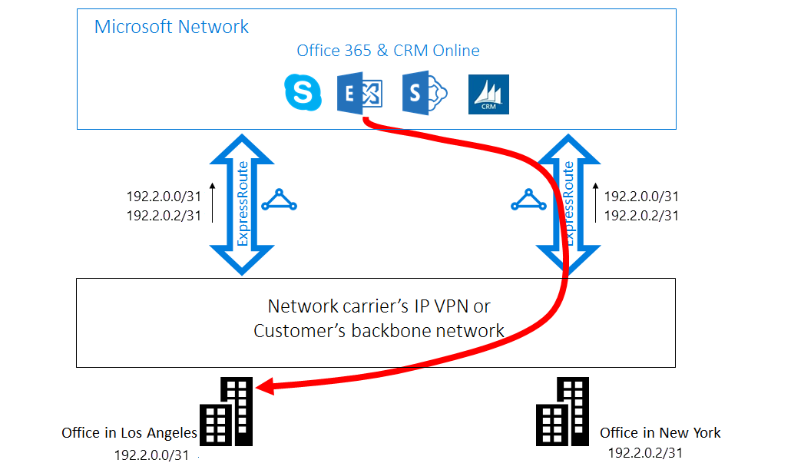

<properties
   pageTitle="Optimize ExpressRoute routing | Microsoft Azure"
   description="This page provides details on how to optimize routing when a customer has more than one ExpressRoute circuits that connect between Microsoft and the customer's corp network."
   documentationCenter="na"
   services="expressroute"
   authors="charwen"
   manager="carmonm"
   editor=""/>
<tags
   ms.service="expressroute"
   ms.devlang="na"
   ms.topic="get-started-article"
   ms.tgt_pltfrm="na"
   ms.workload="infrastructure-services"
   ms.date="06/07/2016"
   ms.author="charwen"/>

# Optimize ExpressRoute Routing
When you have multiple ExpressRoute circuits, you have more than one path to connect to Microsoft. As a result, suboptimal routing may happen - that is, your traffic may take a longer path to reach Microsoft, and Microsoft to your network. The longer the network path, the higher the latency. Latency has direct impact on application performance and user experience. This article will illustrate this problem and explain how to optimize routing using the standard routing technologies.

## Suboptimal routing case 1
Let's take a close look at the routing problem by an example. Imagine you have two offices in the US, one in Los Angeles and one in New York. Your offices are connected on a Wide Area Network (WAN), which can be either your own backbone network or your service provider's IP VPN. You have two ExpressRoute circuits, one in US West and one in US East, that are also connected on the WAN. Obviously, you have two paths to connect to the Microsoft network. Now imagine you have Azure deployment (e.g. Azure App Service) in both US West and US East. Your intention is to connect your users in Los Angeles to Azure US West and your users in New York to Azure US East because your service admin advertises that users in each office access the nearby Azure services for optimal experiences. Unfortunately, the plan works out well for the east coast users but not for the west coast users. The cause of the problem is the following. On each ExpressRoute circuit, we advertise to you both the prefix in Azure US East (23.100.0.0/16) and the prefix in Azure US West (13.100.0.0/16). If you don't know which prefix is from which region, you are not able to treat it differently. Your WAN network may think both of the prefixes are closer to US East than US West and therefore route both office users to the ExpressRoute circuit in US East. In the end, you will have many unhappy users in the Los Angeles office.

### Solution: use BGP Communities
To optimize routing for both office users, you need to know which prefix is from Azure US West and which from Azure US East. We encode this information by using [BGP Community values](expressroute-routing.md). We've assigned a unique BGP Community value to each Azure region, e.g. "12076:51004" for US East, "12076:51006" for US West. Now that you know which prefix is from which Azure region, you can configure which ExpressRoute circuit should be preferred. Because we use the BGP to exchange routing info,  you can use BGP's Local Preference to influence routing. In our example, you can assign a higher local preference value to 13.100.0.0/16 in US West than in US East, and similarly, a higher local preference value to 23.100.0.0/16 in US East than in US West. This configuration will make sure that, when both paths to Microsoft are available, your users in Los Angeles will take the ExpressRoute circuit in US West to connect to Azure US West whereas your users in New York take the ExpressRoute in US East to Azure US East. Routing is optimized on both sides. 

## Suboptimal routing case 2
Here is another example where connections from Microsoft take a longer path to reach your network. In this case, you use on-premises Exchange servers and Exchange Online in a [hybrid environment](https://technet.microsoft.com/library/jj200581%28v=exchg.150%29.aspx). Your offices are connected to a WAN. You advertise the prefixes of your on-premises servers in both of your offices to Microsoft through the two ExpressRoute circuits. Exchange Online will initiate connections to the on-premises servers in cases such as mailbox migration. Unfortunately, the connection to your Los Angeles office is routed to the ExpressRoute circuit in US East before traversing the entire continent back to the west coast. The cause of the problem is similar to the first one. Without any hint, the Microsoft network can't tell which customer prefix is close to US East and which one is close to US West. It happens to pick the wrong path to your office in Los Angeles.

### Solution: use AS PATH prepending
There are two solutions to the problem. The first one is that you simply advertise your on-premises prefix for your Los Angeles office, 177.2.0.0/31, on the ExpressRoute circuit in US West and your on-premises prefix for your New York office, 177.2.0.2/31, on the ExpressRoute circuit in US East. As a result, there is only one path for Microsoft to connect to each of your offices. There is no ambiguity and routing is optimized. With this design, you need to think about your failover strategy. In the event that the path to Microsoft via ExpressRoute is broken, you need to make sure that Exchange Online can still connect to your on-premises servers. 

The second solution is that you continue to advertise both of the prefixes on both ExpressRoute circuits, and in addition you give us a hint of which prefix is close to which one of your offices. Because we support BGP AS Path prepending, you can configure the AS Path for your prefix to influence routing. In this example, you can lengthen the AS PATH for 172.2.0.0/31 in US East so that we will prefer the ExpressRoute circuit in US West for traffic destined for this prefix (as our network will think the path to this prefix is shorter in the west). Similarly you can lengthen the AS PATH for 172.2.0.2/31 in US West so that we'll prefer the ExpressRoute circuit in US East. Routing is optimized for both offices. With this design, if one ExpressRoute circuit is broken, Exchange Online can still reach you via another ExpressRoute circuit and your WAN. 

>[AZURE.IMPORTANT] We remove private AS numbers in the AS PATH for the prefixes received on Microsoft Peering. You need to append public AS numbers in the AS PATH to influence routing for Microsoft Peering.

