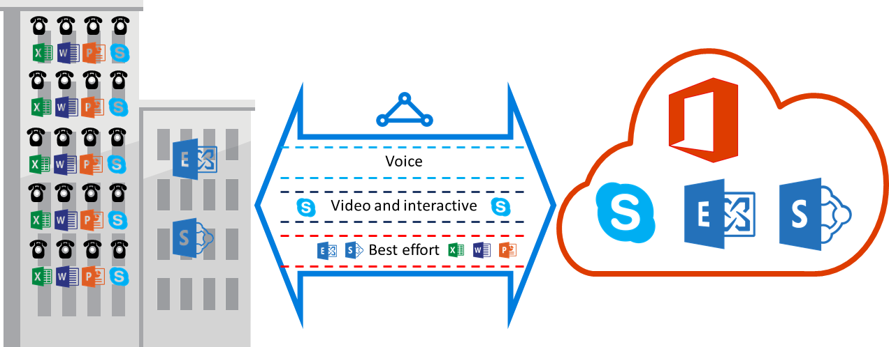

# ExpressRoute QoS requirements
Skype for Business has various workloads that require differentiated QoS treatment. If you plan to consume voice services through ExpressRoute, you should adhere to the requirements described below.

> [!NOTE]
> QoS requirements apply to the Microsoft peering only. The DSCP values in your network traffic received on Azure public peering and Azure private peering will be reset to 0. 
> 
> 

The following table provides a list of DSCP markings used by Microsoft Teams and Skype for Business. Refer to [Managing QoS for Skype for Business](https://docs.microsoft.com/SkypeForBusiness/manage/network-management/qos/managing-quality-of-service-QoS) for more information.

| **Traffic Class** | **Treatment (DSCP Marking)** | **Microsoft Teams and Skype for Business Workloads** |
| --- | --- | --- |
| **Voice** |EF (46) |Skype / Lync voice |
| **Interactive** |AF41 (34) |Video, VBSS |
| |AF21 (18) |App sharing | 
| **Default** |AF11 (10) |File transfer |
| |CS0 (0) |Anything else |

* You should classify the workloads and mark the right DSCP values. Follow the guidance provided [here](https://docs.microsoft.com/SkypeForBusiness/manage/network-management/qos/configuring-port-ranges-for-your-skype-clients#configure-quality-of-service-policies-for-clients-running-on-windows-10) on how to set DSCP markings in your network.
* You should configure and support multiple QoS queues within your network. Voice must be a standalone class and receive the EF treatment specified in [RFC 3246](https://www.ietf.org/rfc/rfc3246.txt). 
* You can decide the queuing mechanism, congestion detection policy, and bandwidth allocation per traffic class. But, the DSCP marking for Skype for Business workloads must be preserved. If you are using DSCP markings not listed above, e.g. AF31 (26), you must rewrite this DSCP value to 0 before sending the packet to Microsoft. Microsoft only sends packets marked with the DSCP value shown in the above table. 

## Next steps
* Refer to the requirements for [Routing](expressroute-routing.md) and [NAT](expressroute-nat.md).
* See the following links to configure your ExpressRoute connection.
  
  * [Create an ExpressRoute circuit](expressroute-howto-circuit-classic.md)
  * [Configure routing](expressroute-howto-routing-classic.md)
  * [Link a VNet to an ExpressRoute circuit](expressroute-howto-linkvnet-classic.md)

