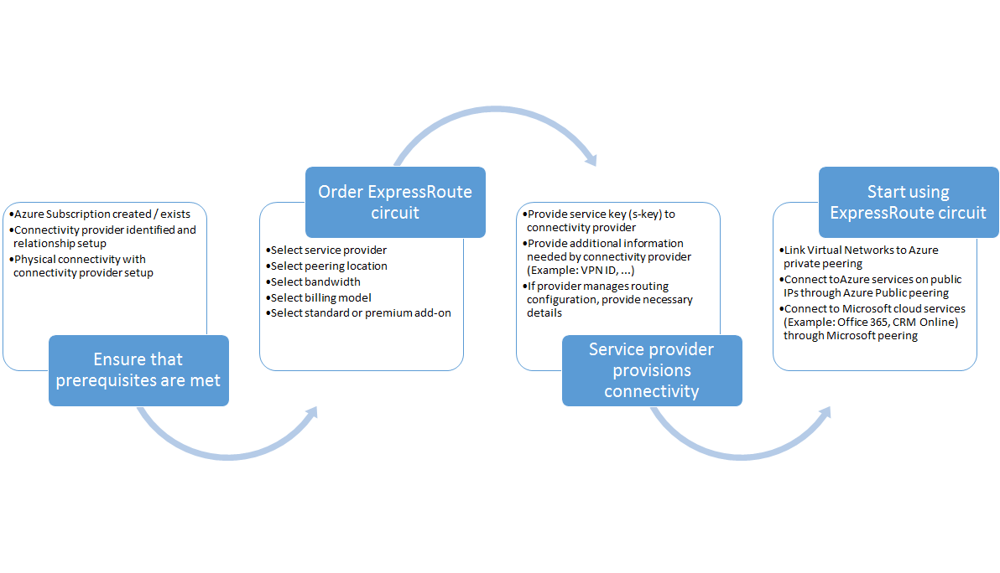
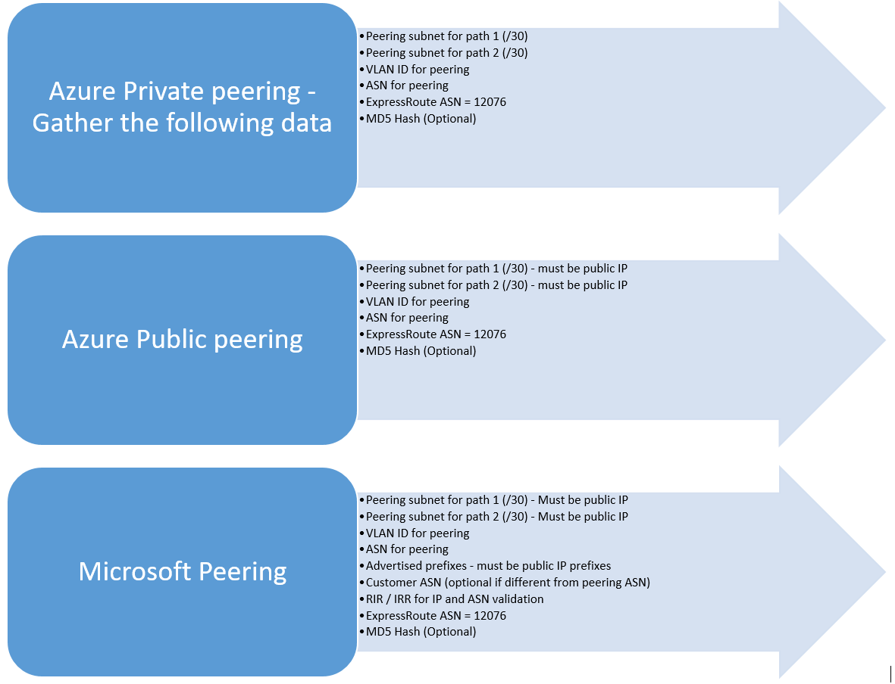

# ExpressRoute workflows for circuit provisioning and circuit states
This page walks you through the service provisioning and routing configuration workflows at a high level.

The following figure and corresponding steps show the tasks you must follow in order to have an ExpressRoute circuit provisioned end-to-end. 

1. Use PowerShell to configure an ExpressRoute circuit. Follow the instructions in the [Create ExpressRoute circuits](expressroute-howto-circuit-classic.md) article for more details.
2. Order connectivity from the service provider. This process varies. Contact your connectivity provider for more details about how to order connectivity.
3. Ensure that the circuit has been provisioned successfully by verifying the ExpressRoute circuit provisioning state through PowerShell. 
4. Configure routing domains. If your connectivity provider manages Layer 3 for you, they will configure routing for your circuit. If your connectivity provider only offers Layer 2 services, you must configure routing per guidelines described in the [routing requirements](expressroute-routing.md) and [routing configuration](expressroute-howto-routing-classic.md) pages.
   
   * Enable Azure private peering - Enable this peering to connect to VMs / cloud services deployed within virtual networks.

   * Enable Microsoft peering - Enable this to access Office 365 and Dynamics 365. Additionally, all Azure PaaS services are accessible through Microsoft peering.
     
     > [!IMPORTANT]
     > You must ensure that you use a separate proxy / edge to connect to Microsoft than the one you use for the Internet. Using the same edge for both ExpressRoute and the Internet will cause asymmetric routing and cause connectivity outages for your network.
     > 
     > 
     
     
5. Linking virtual networks to ExpressRoute circuits - You can link virtual networks to your ExpressRoute circuit. Follow instructions [to link VNets](expressroute-howto-linkvnet-arm.md) to your circuit. These VNets can either be in the same Azure subscription as the ExpressRoute circuit, or can be in a different subscription.

## ExpressRoute circuit provisioning states
Each ExpressRoute circuit has two states:

* Service provider provisioning state
* Status

Status represents Microsoft's provisioning state. This property is set to Enabled when you create an Expressroute circuit

The connectivity provider provisioning state represents the state on the connectivity provider's side. It can either be *NotProvisioned*, *Provisioning*, or *Provisioned*. The ExpressRoute circuit must be in Provisioned state for you to be able to use it.

### Possible states of an ExpressRoute circuit
This section lists out the possible states for an ExpressRoute circuit.

**At creation time**

You will see the ExpressRoute circuit in the following state as soon as you run the PowerShell cmdlet to create the ExpressRoute circuit.

    ServiceProviderProvisioningState : NotProvisioned
    Status                           : Enabled

**When connectivity provider is in the process of provisioning the circuit**

You will see the ExpressRoute circuit in the following state as soon as you pass the service key to the connectivity provider and they have started the provisioning process.

    ServiceProviderProvisioningState : Provisioning
    Status                           : Enabled

**When connectivity provider has completed the provisioning process**

You will see the ExpressRoute circuit in the following state as soon as the connectivity provider has completed the provisioning process.

    ServiceProviderProvisioningState : Provisioned
    Status                           : Enabled

Provisioned and Enabled is the only state the circuit can be in for you to be able to use it. If you are using a Layer 2 provider, you can configure routing for your circuit only when it is in this state.

**When connectivity provider is deprovisioning the circuit**

If you requested the service provider to deprovision the ExpressRoute circuit, you will see the circuit set to the following state after the service provider has completed the deprovisioning process.

    ServiceProviderProvisioningState : NotProvisioned
    Status                           : Enabled

You can choose to re-enable it if needed, or run PowerShell cmdlets to delete the circuit.  

> [!IMPORTANT]
> If you run the PowerShell cmdlet to delete the circuit when the ServiceProviderProvisioningState is Provisioning or Provisioned the operation will fail. Please work with your connectivity provider to deprovision the ExpressRoute circuit first and then delete the circuit. Microsoft will continue to bill the circuit until you run the PowerShell cmdlet to delete the circuit.
> 
> 

## Routing session configuration state
The BGP provisioning state lets you know if the BGP session has been enabled on the Microsoft edge. The state must be enabled for you to be able to use the peering.

It is important to check the BGP session state especially for Microsoft peering. In addition to the BGP provisioning state, there is another state called *advertised public prefixes state*. The advertised public prefixes state must be in *configured* state, both for the BGP session to be up and for your routing to work end-to-end. 

If the advertised public prefix state is set to a *validation needed* state, the BGP session is not enabled, as the advertised prefixes did not match the AS number in any of the routing registries. 

> [!IMPORTANT]
> If the advertised public prefixes state is in *manual validation* state, you must open a support ticket with [Microsoft support](https://portal.azure.com/?#blade/Microsoft_Azure_Support/HelpAndSupportBlade) and provide evidence that you own the IP addresses advertised along with the associated Autonomous System number.
> 
> 

## Next steps
* Configure your ExpressRoute connection.
  
  * [Create an ExpressRoute circuit](expressroute-howto-circuit-arm.md)
  * [Configure routing](expressroute-howto-routing-arm.md)
  * [Link a VNet to an ExpressRoute circuit](expressroute-howto-linkvnet-arm.md)

