# Configure Network Performance Monitor for ExpressRoute

This article helps you configure a Network Performance Monitor extension to monitor ExpressRoute. Network Performance Monitor (NPM) is a cloud-based network monitoring solution that monitors connectivity between Azure cloud deployments and on-premises locations (Branch offices, etc.). NPM is part of Azure Monitor logs. NPM offers an extension for ExpressRoute that lets you monitor network performance over ExpressRoute circuits that are configured to use private peering or Microsoft peering. When you configure NPM for ExpressRoute, you can detect network issues to identify and eliminate. This service is also available for Azure Government Cloud.

[!INCLUDE [azure-monitor-log-analytics-rebrand](../../includes/azure-monitor-log-analytics-rebrand.md)]

You can:

* Monitor loss and latency across various VNets and set alerts

* Monitor all paths (including redundant paths) on the network

* Troubleshoot transient and point-in-time network issues that are difficult to replicate

* Help determine a specific segment on the network that is responsible for degraded performance

* Get throughput per virtual network (If you have agents installed in each VNet)

* See the ExpressRoute system state from a previous point in time

## Workflow

Monitoring agents are installed on multiple servers, both on-premises and in Azure. The agents communicate with each other, but do not send data, they send TCP handshake packets. The communication between the agents allows Azure to map the network topology and path the traffic could take.

1. Create an NPM Workspace. This is the same as a Log Analytics workspace.
2. Install and configure software agents. (If you only want to monitor over Microsoft Peering, you do not need to install and configure software agents.): 
    * Install monitoring agents on the on-premises servers and the Azure VMs (for private peering).
    * Configure settings on the monitoring agent servers to allow the monitoring agents to communicate. (Open firewall ports, etc.)
3. Configure network security group (NSG) rules to allow the monitoring agent installed on Azure VMs to communicate with on-premises monitoring agents.
4. Set up monitoring: Auto-Discover and manage which networks are visible in NPM.

If you are already using Network Performance Monitor to monitor other objects or services, and you already have Workspace in one of the supported regions, you can skip Step 1 and Step 2, and begin your configuration with Step 3.

## Step 1: Create a Workspace

Create a workspace in the subscription that has the VNets link to the ExpressRoute circuit(s).

1. In the [Azure portal](https://portal.azure.com), select the Subscription that has the VNETs peered to your ExpressRoute circuit. Then, search the list of services in the **Marketplace** for 'Network Performance Monitor'. In the return, click to open the **Network Performance Monitor** page.

   >[!NOTE]
   >You can create a new workspace, or use an existing workspace. If you want to use an existing workspace, you must make sure that the workspace has been migrated to the new query language. [More information...](https://docs.microsoft.com/azure/log-analytics/log-analytics-log-search-upgrade)
   >

   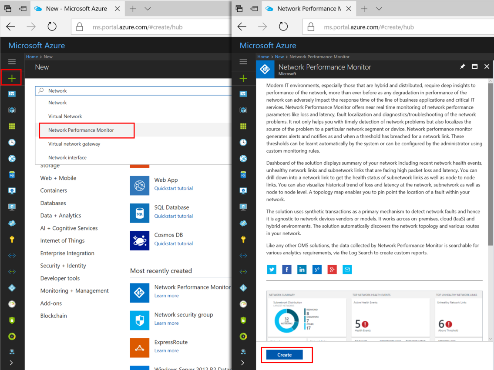  
2. At the bottom of the main **Network Performance Monitor** page, click **Create** to open **Network Performance Monitor - Create new solution** page. Click **Log Analytics Workspace - select a workspace** to open the Workspaces page. Click **+ Create New Workspace** to open the Workspace page.
3. On the **Log Analytics workspace** page, select **Create New**, then configure the following settings:

   * Log Analytics Workspace - Type a name for your Workspace.
   * Subscription - If you have multiple subscriptions, choose the one you want to associate with the new Workspace.
   * Resource group - Create a resource group, or use an existing one.
   * Location - This location is used to specify the location of the storage account that is used for the agent connection logs.
   * Pricing tier - Select the pricing tier.
  
     >[!NOTE]
     >The ExpressRoute circuit can be anywhere in the world. It doesn't have to be in the same region as the Workspace.
     >
  
     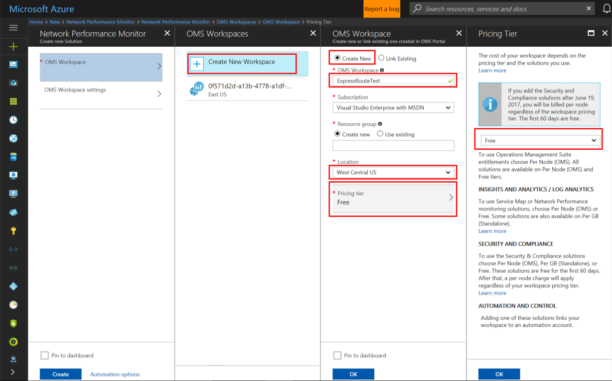  
4. Click **OK** to save and deploy the settings template. Once the template validates, click **Create** to deploy the Workspace.
5. After the Workspace has been deployed, navigate to the **NetworkMonitoring(name)** resource that you created. Validate the settings, then click **Solution requires additional configuration**.

   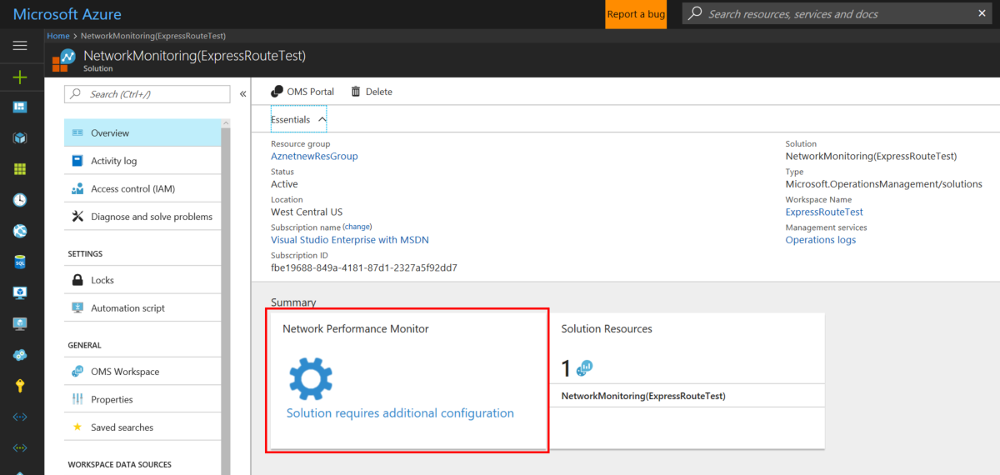

## Step 2: Install and configure agents

### 2.1: Download the agent setup file

1. Go to the **Common Settings** tab of the **Network Performance Monitor Configuration** page for your resource. Click the agent that corresponds to your server's processor from the **Install Log Analytics Agents** section, and download the setup file.
2. Next, copy the **Workspace ID** and **Primary Key** to Notepad.
3. From the **Configure Log Analytics Agents for monitoring using TCP protocol** section, download the Powershell Script. The PowerShell script helps you open the relevant firewall port for the TCP transactions.

   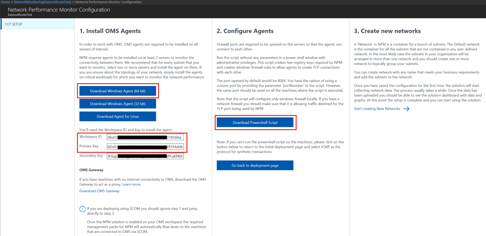

### 2.2: Install a monitoring agent on each monitoring server (on each VNET that you want to monitor)

We recommend that you install at least two agents on each side of the ExpressRoute connection for redundancy (for example, on-premises, Azure VNETs). The agent must be installed on a Windows Server (2008 SP1 or later). Monitoring ExpressRoute circuits using Windows Desktop OS and Linux OS is not supported. Use the following steps to install agents:
   
  >[!NOTE]
  >Agents pushed by SCOM (includes [MMA](https://technet.microsoft.com/library/dn465154(v=sc.12).aspx)) may not be able to consistently detect their location if they are hosted in Azure. We recommend that you do not use these agents in Azure VNETs to monitor ExpressRoute.
  >

1. Run **Setup** to install the agent on each server that you want to use for monitoring ExpressRoute. The server you use for monitoring can either be a VM, or on-premises, and must have Internet access. You need to install at least one agent on-premises, and one agent on each network segment that you want to monitor in Azure.
2. On the **Welcome** page, click **Next**.
3. On the **License Terms** page, read the license, and then click **I Agree**.
4. On the **Destination Folder** page, change or keep the default installation folder, and then click **Next**.
5. On the **Agent Setup Options** page, you can choose to connect the agent to Azure Monitor logs or Operations Manager. Or, you can leave the choices blank if you want to configure the agent later. After making your selection(s), click **Next**.

   * If you chose to connect to **Azure Log Analytics**, paste the **Workspace ID** and **Workspace Key** (Primary Key) that you copied into Notepad in the previous section. Then, click **Next**.

     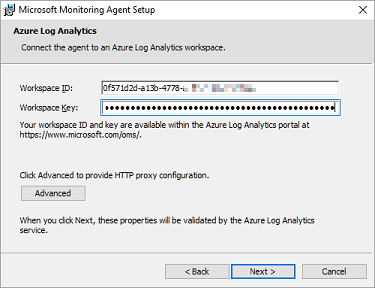
   * If you chose to connect to **Operations Manager**, on the **Management Group Configuration** page, type the **Management Group Name**, **Management Server**, and the **Management Server Port**. Then, click **Next**.

     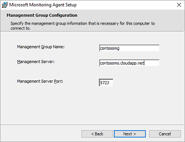
   * On the **Agent Action Account** page, choose either the **Local System** account, or  **Domain or Local Computer Account**. Then, click **Next**.

     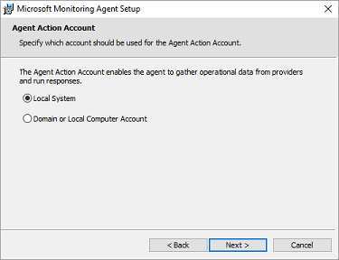
6. On the **Ready to Install** page, review your choices, and then click **Install**.
7. On the **Configuration completed successfully** page, click **Finish**.
8. When complete, the Microsoft Monitoring Agent appears in the Control Panel. You can review your configuration there, and verify that the agent is connected to Azure Monitor logs. When connected, the agent displays a message stating: **The Microsoft Monitoring Agent has successfully connected to the Microsoft Operations Management Suite service**.

9. Repeat this procedure for each VNET that you need to be monitored.

### 2.3: Configure proxy settings (optional)

If you are using a web proxy to access the Internet, use the following steps to configure proxy settings for the Microsoft Monitoring Agent. Perform these steps for each server. If you have many servers that you need to configure, you might find it easier to use a script to automate this process. If so, see [To configure proxy settings for the Microsoft Monitoring Agent using a script](../log-analytics/log-analytics-windows-agent.md).

To configure proxy settings for the Microsoft Monitoring Agent using the Control Panel:

1. Open the **Control Panel**.
2. Open **Microsoft Monitoring Agent**.
3. Click the **Proxy Settings** tab.
4. Select **Use a proxy server** and type the URL and port number, if one is needed. If your proxy server requires authentication, type the username and password to access the proxy server.

   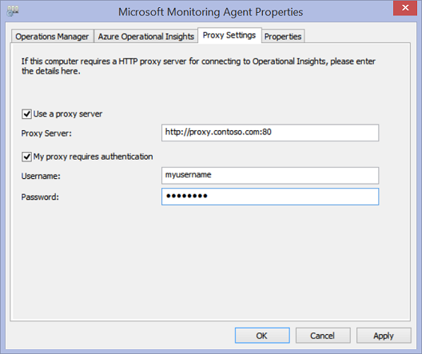

### 2.4: Verify agent connectivity

You can easily verify whether your agents are communicating.

1. On a server with the monitoring agent, open the **Control Panel**.
2. Open the **Microsoft Monitoring Agent**.
3. Click the **Azure Log Analytics** tab.
4. In the **Status** column, you should see that the agent connected successfully to Azure Monitor logs.

   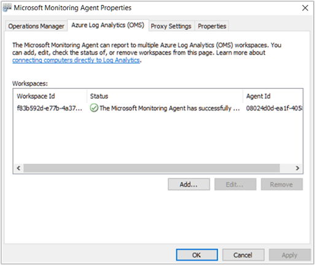

### 2.5: Open the firewall ports on the monitoring agent servers

To use the TCP protocol, you must open firewall ports to ensure that the monitoring agents can communicate.

You can run a PowerShell script to create the registry keys that are required by the Network Performance Monitor. This script also creates the Windows Firewall rules to allow monitoring agents to create TCP connections with each other. The registry keys created by the script specify whether to log the debug logs, and the path for the logs file. It also defines the agent TCP port used for communication. The values for these keys are automatically set by the script. You should not manually change these keys.

Port 8084 is opened by default. You can use a custom port by providing the parameter 'portNumber' to the script. However, if you do so, you must specify the same port for all the servers on which you run the script.

>[!NOTE]
>The 'EnableRules' PowerShell script configures Windows Firewall rules only on the server where the script is run. If you have a network firewall, you should make sure that it allows traffic destined for the TCP port being used by Network Performance Monitor.
>
>

On the agent servers, open a PowerShell window with administrative privileges. Run the [EnableRules](https://aka.ms/npmpowershellscript) PowerShell script (which you downloaded earlier). Don't use any parameters.

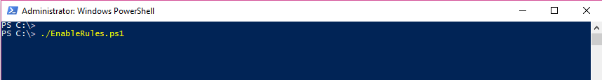

## Step 3: Configure network security group rules

To monitor agent servers that are in Azure, you must configure network security group (NSG) rules to allow TCP traffic on a port used by NPM for synthetic transactions. The default port is 8084. This allows a monitoring agent installed on an Azure VM to communicate with an on-premises monitoring agent.

For more information about NSG, see [Network Security Groups](../virtual-network/virtual-networks-create-nsg-arm-portal.md).

>[!NOTE]
>Make sure that you have installed the agents (both the on-premises server agent and the Azure server agent), and have run the PowerShell script before proceeding with this step.
>

## Step 4: Discover peering connections

1. Navigate to the Network Performance Monitor overview tile by going to the **All Resources** page, then click on the whitelisted NPM Workspace.

   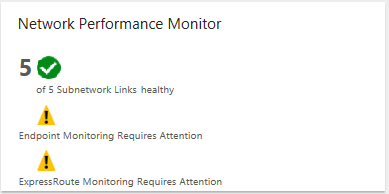
2. Click the **Network Performance Monitor** overview tile to bring up the dashboard. The dashboard contains an ExpressRoute page, which shows that ExpressRoute is in an 'unconfigured state'. Click **Feature Setup** to open the Network Performance Monitor configuration page.

   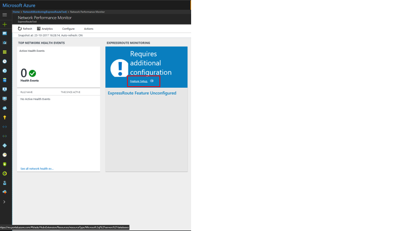
3. On the configuration page, navigate to the 'ExpressRoute Peerings' tab, located on the left side panel. Next, click **Discover Now**.

   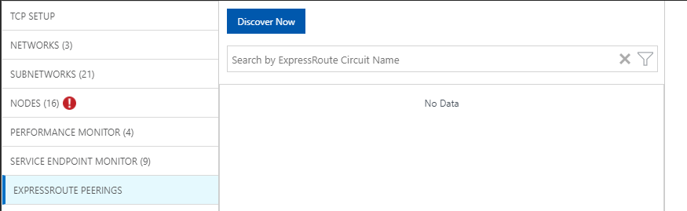
4. When discovery completes, you will see a list containing the following items:
   * All of the Microsoft peering connections in the ExpressRoute circuit(s) that are associated with this subscription.
   * All of the private peering connections that connect to the VNets associated with this subscription.
            
## Step 5: Configure monitors

In this section, you configure the monitors. Follow the steps for the type of peering that you want to monitor: **private peering**, or **Microsoft peering**.

### Private peering

For private peering, when discovery completes, you see will rules for unique **Circuit Name** and **VNet Name**. Initially, these rules are disabled.

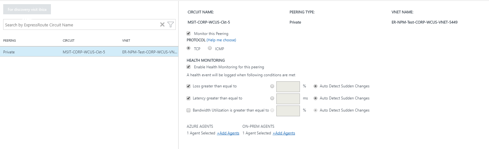

1. Check the **Monitor this peering** checkbox.
2. Select the checkbox **Enable Health Monitoring for this peering**.
3. Choose the monitoring conditions. You can set custom thresholds to generate health events by typing threshold values. Whenever the value of the condition goes above its selected threshold for the selected network/subnetwork pair, a health event is generated.
4. Click the ON-PREM AGENTS **Add Agents** button to add the on-premises servers from which you want to monitor the private peering connection. Make sure that you only choose agents that have connectivity to the Microsoft service endpoint that you specified in the section for Step 2. The on-premises agents must be able to reach the endpoint using the ExpressRoute connection.
5. Save the settings.
6. After enabling the rules and selecting the values and agents you want to monitor, there is a wait of approximately 30-60 minutes for the values to begin populating and the **ExpressRoute Monitoring** tiles to become available.

### Microsoft peering

For Microsoft peering, click the Microsoft peering connection(s) that you want to monitor, and configure the settings.

1. Check the **Monitor this peering** checkbox. 
2. (Optional) You can change the target Microsoft service endpoint. By default, NPM chooses a Microsoft service endpoint as the target. NPM monitors connectivity from your on-premises servers to this target endpoint through ExpressRoute. 
    * To change this target endpoint, click the **(edit)** link under **Target:**, and select another Microsoft service target endpoint from the list of URLs.
      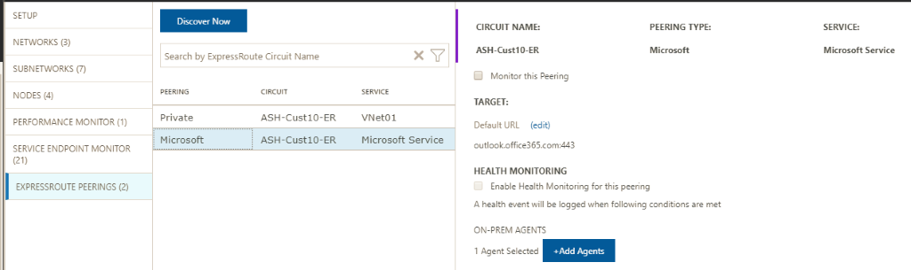 

    * You can use a custom URL or IP Address. This option is particularly relevant if you are using Microsoft peering to establish a connection to Azure PaaS services, such as Azure Storage, SQL databases, and Websites that are offered on public IP addresses. To do this, click the link **(Use custom URL or IP Address instead)** at the bottom of the URL list, then enter the public endpoint of your Azure PaaS service that is connected through the ExpressRoute Microsoft peering.
    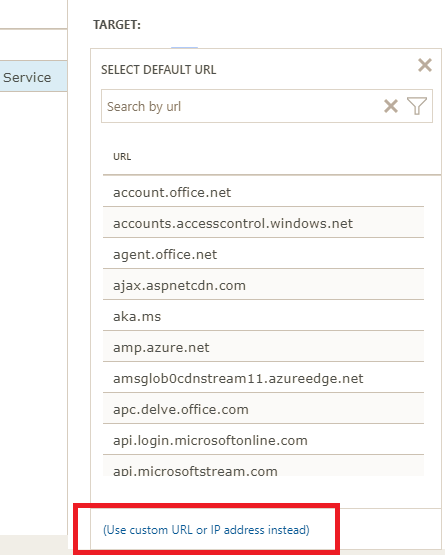 

    * If you are using these optional settings, make sure that only the Microsoft service endpoint is selected here. The endpoint must be connected to ExpressRoute and reachable by the on-premises agents.
3. Select the checkbox **Enable Health Monitoring for this peering**.
4. Choose the monitoring conditions. You can set custom thresholds to generate health events by typing threshold values. Whenever the value of the condition goes above its selected threshold for the selected network/subnetwork pair, a health event is generated.
5. Click the ON-PREM AGENTS **Add Agents** button to add the on-premises servers from which you want to monitor the Microsoft peering connection. Make sure that you only choose agents that have connectivity to the Microsoft service endpoints that you specified in the section for Step 2. The on-premises agents must be able to reach the endpoint using the ExpressRoute connection.
6. Save the settings.
7. After enabling the rules and selecting the values and agents you want to monitor, there is a wait of approximately 30-60 minutes for the values to begin populating and the **ExpressRoute Monitoring** tiles to become available.

## Step 6: View monitoring tiles

Once you see the monitoring tiles, your ExpressRoute circuits and connection resources are being monitored by NPM. You can click on Microsoft Peering tile to drill down on the health of Microsoft Peering connections.

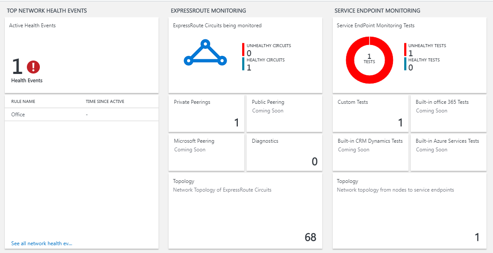

### Network Performance Monitor page

The NPM page contains a page for ExpressRoute that shows an overview of the health of ExpressRoute circuits and peerings.

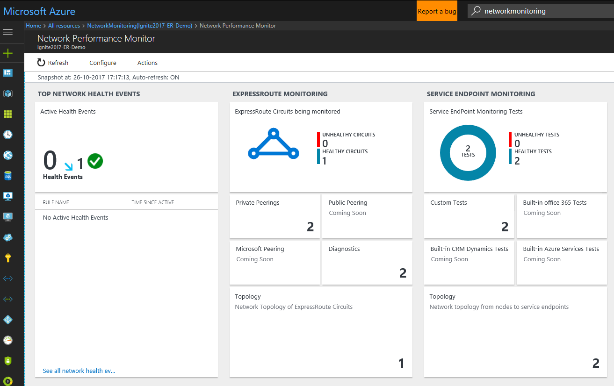

### List of circuits

To view a list of all monitored ExpressRoute circuits, click the **ExpressRoute circuits** tile. You can select a circuit and view its health state, trend charts for packet loss, bandwidth utilization, and latency. The charts are interactive. You can select a custom time window for plotting the charts. You can drag the mouse over an area on the chart to zoom in and see fine-grained data points.

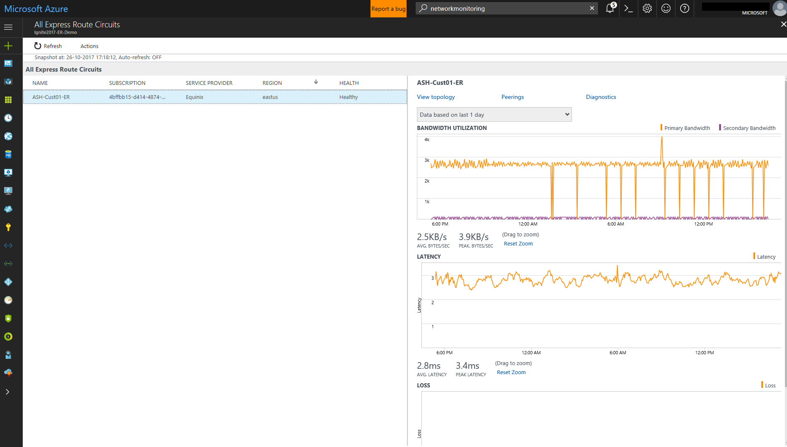

#### Trend of Loss, Latency, and Throughput

The bandwidth, latency, and loss charts are interactive. You can zoom into any section of these charts, using mouse controls. You can also see the bandwidth, latency, and loss data for other intervals by clicking **Date/Time**, located below the Actions button on the upper left.

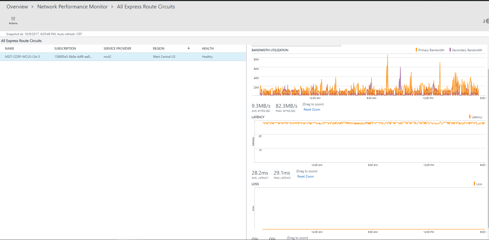

### Peerings list

To view list of all connections to virtual networks over private peering, click the **Private Peerings** tile on the dashboard. Here, you can select a virtual network connection and view its health state, trend charts for packet loss, bandwidth utilization, and latency.

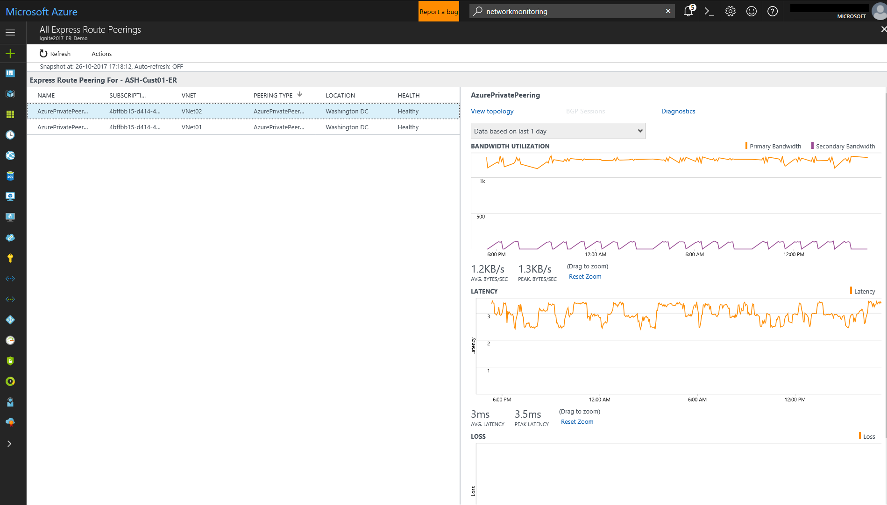

### Nodes view

To view list of all the links between the on-premises nodes and Azure VMs/Microsoft service endpoints for the chosen ExpressRoute peering connection, click **View node links**. You can view the health status of each link, as well as the trend of loss and latency associated with them.

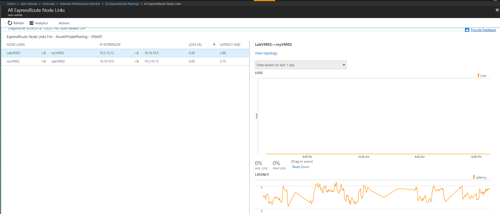

### Circuit topology

To view circuit topology, click the **Topology** tile. This takes you to the topology view of the selected circuit or peering. The topology diagram provides the latency for each segment on the network. Each layer 3 hop is represented by a node of the diagram. Clicking on a hop reveals more details about the hop.

You can increase the level of visibility to include on-premises hops by moving the slider bar below **Filters**. Moving the slider bar to the left or right, increases/decreases the number of hops in the topology graph. The latency across each segment is visible, which allows for faster isolation of high latency segments on your network.

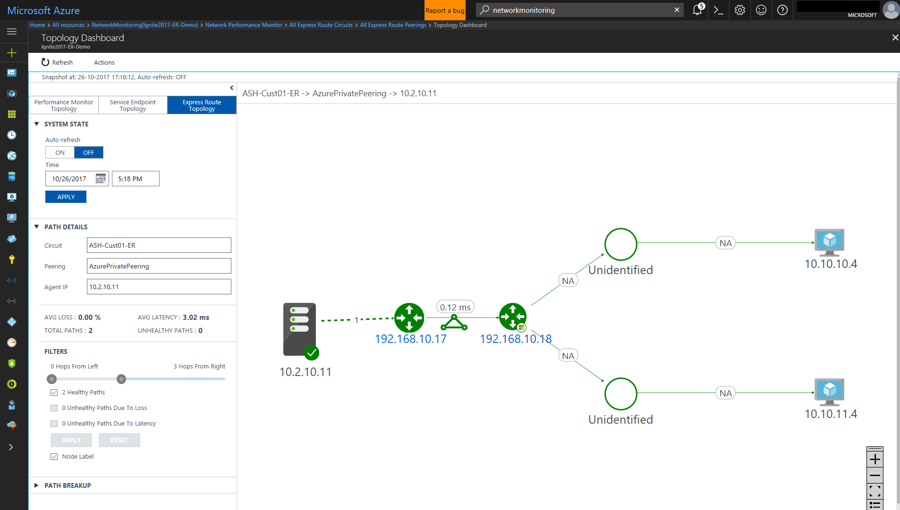

#### Detailed Topology view of a circuit

This view shows VNet connections.
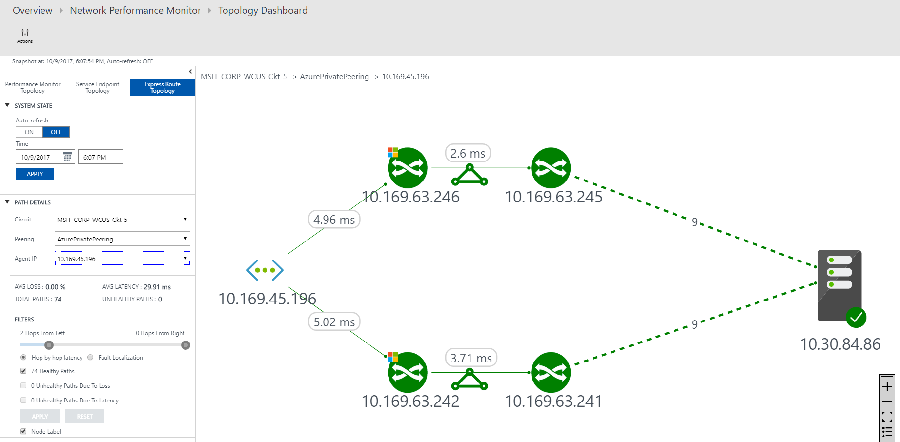
