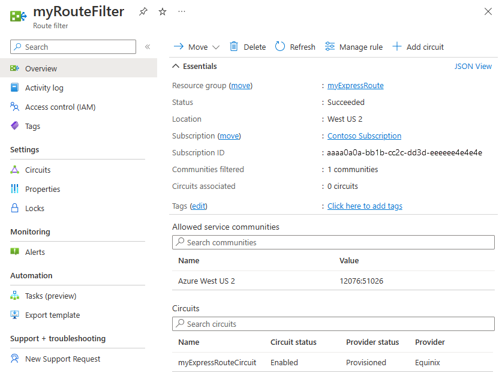

# Configure a site-to-site VPN over ExpressRoute Microsoft peering

This article helps you configure secure encrypted connectivity between your on-premises network and your Azure virtual networks (VNets) over an ExpressRoute private connection. You can use Microsoft peering to establish a site-to-site IPsec/IKE VPN tunnel between your selected on-premises networks and Azure VNets. Configuring a secure tunnel over ExpressRoute allows for data exchange with confidentiality, anti-replay, authenticity, and integrity.

>[!NOTE]
>When you set up site-to-site VPN over Microsoft peering, you are charged for the VPN gateway and VPN egress. For more information, see [VPN Gateway pricing](https://azure.microsoft.com/pricing/details/vpn-gateway).
>
>

[!INCLUDE [updated-for-az](../../includes/hybrid-az-ps.md)]

## <a name="architecture"></a>Architecture


  


For high availability and redundancy, you can configure multiple tunnels over the two MSEE-PE pairs of a ExpressRoute circuit and enable load balancing between the tunnels.

  

VPN tunnels over Microsoft peering can be terminated either using VPN gateway, or using an appropriate Network Virtual Appliance (NVA) available through Azure Marketplace. You can exchange routes statically or dynamically over the encrypted tunnels without exposing the route exchange to the underlying Microsoft peering. In the examples in this article, BGP (different from the BGP session used to create the Microsoft peering) is used to dynamically exchange prefixes over the encrypted tunnels.

>[!IMPORTANT]
>For the on-premises side, typically Microsoft peering is terminated on the DMZ and private peering is terminated on the core network zone. The two zones would be segregated using firewalls. If you are configuring Microsoft peering exclusively for enabling secure tunneling over ExpressRoute, remember to filter through only the public IPs of interest that are getting advertised via Microsoft peering.
>
>

## <a name="workflow"></a>Workflow

1. Configure Microsoft peering for your ExpressRoute circuit.
2. Advertise selected Azure regional public prefixes to your on-premises network via Microsoft peering.
3. Configure a VPN gateway and establish IPsec tunnels
4. Configure the on-premises VPN device.
5. Create the site-to-site IPsec/IKE connection.
6. (Optional) Configure firewalls/filtering on the on-premises VPN device.
7. Test and validate the IPsec communication over the ExpressRoute circuit.

## <a name="peering"></a>1. Configure Microsoft peering

To configure a site-to-site VPN connection over ExpressRoute, you must leverage ExpressRoute Microsoft peering.

* To configure a new ExpressRoute circuit, start with the [ExpressRoute prerequisites](expressroute-prerequisites.md) article, and then [Create and modify an ExpressRoute circuit](expressroute-howto-circuit-arm.md).

* If you already have an ExpressRoute circuit, but do not have Microsoft peering configured, configure Microsoft peering using the [Create and modify peering for an ExpressRoute circuit](expressroute-howto-routing-arm.md#msft) article.

Once you have configured your circuit and Microsoft peering, you can easily view it using the **Overview** page in the Azure portal.


## <a name="routefilter"></a>2. Configure route filters

A route filter lets you identify services you want to consume through your ExpressRoute circuit's Microsoft peering. It is essentially an allow list of all the BGP community values. 



In this example, the deployment is only in the *Azure West US 2* region. A route filter rule is added to allow only the advertisement of Azure West US 2 regional prefixes, which has the BGP community value *12076:51026*. You specify the regional prefixes that you want to allow by selecting **Manage rule**.

Within the route filter, you also need to choose the ExpressRoute circuits for which the route filter applies. You can choose the ExpressRoute circuits by selecting **Add circuit**. In the previous figure, the route filter is associated to the example ExpressRoute circuit.

### <a name="configfilter"></a>2.1 Configure the route filter

Configure a route filter. For steps, see [Configure route filters for Microsoft peering](how-to-routefilter-portal.md).

### <a name="verifybgp"></a>2.2 Verify BGP routes

Once you have successfully created Microsoft peering over your ExpressRoute circuit and associated a route filter with the circuit, you can verify the BGP routes received from MSEEs on the PE devices that are peering with the MSEEs. The verification command varies, depending on the operating system of your PE devices.

#### Cisco examples

This example uses a Cisco IOS-XE command. In the example, a virtual routing and forwarding (VRF) instance is used to isolate the peering traffic.

```
show ip bgp vpnv4 vrf 10 summary
```

The following partial output shows that 68 prefixes were received from the neighbor \*.243.229.34 with the ASN 12076 (MSEE):

```
...

Neighbor        V           AS MsgRcvd MsgSent   TblVer  InQ OutQ Up/Down  State/PfxRcd
X.243.229.34    4        12076   17671   17650    25228    0    0 1w4d           68
```

To see the list of prefixes received from the neighbor, use the following example:

```
sh ip bgp vpnv4 vrf 10 neighbors X.243.229.34 received-routes
```

To confirm that you are receiving the correct set of prefixes, you can cross-verify. The following Azure PowerShell command output lists the prefixes advertised via Microsoft peering for each of the services and for each of the Azure region:

```azurepowershell-interactive
Get-AzBgpServiceCommunity
```

## <a name="vpngateway"></a>3. Configure the VPN gateway and IPsec tunnels

In this section, IPsec VPN tunnels are created between the Azure VPN gateway and the on-premises VPN device. The examples use Cisco Cloud Service Router (CSR1000) VPN devices.

The following diagram shows the IPsec VPN tunnels established between on-premises VPN device 1, and the Azure VPN gateway instance pair. The two IPsec VPN tunnels established between the on-premises VPN device 2 and the Azure VPN gateway instance pair isn't illustrated in the diagram, and the configuration details are not listed. However, having additional VPN tunnels improves high availability.

  

Over the IPsec tunnel pair, an eBGP session is established to exchange private network routes. The following diagram shows the eBGP session established over the IPsec tunnel pair:

  

The following diagram shows the abstracted overview of the example network:

  

### About the Azure Resource Manager template examples

In the examples, the VPN gateway and the IPsec tunnel terminations are configured using an Azure Resource Manager template. If you are new to using Resource Manager templates, or to understand the Resource Manager template basics, see [Understand the structure and syntax of Azure Resource Manager templates](../azure-resource-manager/templates/template-syntax.md). The template in this section creates a greenfield Azure environment (VNet). However, if you have an existing VNet, you can reference it in the template. If you are not familiar with VPN gateway IPsec/IKE site-to-site configurations, see [Create a site-to-site connection](../vpn-gateway/vpn-gateway-create-site-to-site-rm-powershell.md).

>[!NOTE]
>You do not need to use Azure Resource Manager templates in order to create this configuration. You can create this configuration using the Azure portal, or PowerShell.
>
>

### <a name="variables3"></a>3.1 Declare the variables

In this example, the variable declarations correspond to the example network. When declaring variables, modify this section to reflect your environment.

* The variable **localAddressPrefix** is an array of on-premises IP addresses to terminate the IPsec tunnels.
* The **gatewaySku** determines the VPN throughput. For more information about gatewaySku and vpnType, see [VPN Gateway configuration settings](../vpn-gateway/vpn-gateway-about-vpn-gateway-settings.md#gwsku). For pricing, see [VPN Gateway pricing](https://azure.microsoft.com/pricing/details/vpn-gateway).
* Set the **vpnType** to **RouteBased**.

```json
"variables": {
  "virtualNetworkName": "SecureVNet",       // Name of the Azure VNet
  "azureVNetAddressPrefix": "10.2.0.0/24",  // Address space assigned to the VNet
  "subnetName": "Tenant",                   // subnet name in which tenants exists
  "subnetPrefix": "10.2.0.0/25",            // address space of the tenant subnet
  "gatewaySubnetPrefix": "10.2.0.224/27",   // address space of the gateway subnet
  "localGatewayName": "localGW1",           // name of remote gateway (on-premises)
  "localGatewayIpAddress": "X.243.229.110", // public IP address of the on-premises VPN device
  "localAddressPrefix": [
    "172.16.0.1/32",                        // termination of IPsec tunnel-1 on-premises 
    "172.16.0.2/32"                         // termination of IPsec tunnel-2 on-premises 
  ],
  "gatewayPublicIPName1": "vpnGwVIP1",    // Public address name of the first VPN gateway instance
  "gatewayPublicIPName2": "vpnGwVIP2",    // Public address name of the second VPN gateway instance 
  "gatewayName": "vpnGw",                 // Name of the Azure VPN gateway
  "gatewaySku": "VpnGw1",                 // Azure VPN gateway SKU
  "vpnType": "RouteBased",                // type of VPN gateway
  "sharedKey": "string",                  // shared secret needs to match with on-premises configuration
  "asnVpnGateway": 65000,                 // BGP Autonomous System number assigned to the VPN Gateway 
  "asnRemote": 65010,                     // BGP Autonmous Syste number assigned to the on-premises device
  "bgpPeeringAddress": "172.16.0.3",      // IP address of the remote BGP peer on-premises
  "connectionName": "vpn2local1",
  "vnetID": "[resourceId('Microsoft.Network/virtualNetworks', variables('virtualNetworkName'))]",
  "gatewaySubnetRef": "[concat(variables('vnetID'),'/subnets/','GatewaySubnet')]",
  "subnetRef": "[concat(variables('vnetID'),'/subnets/',variables('subnetName'))]",
  "api-version": "2017-06-01"
},
```

### <a name="vnet"></a>3.2 Create virtual network (VNet)

If you are associating an existing VNet with the VPN tunnels, you can skip this step.

```json
{
  "apiVersion": "[variables('api-version')]",
  "type": "Microsoft.Network/virtualNetworks",
  "name": "[variables('virtualNetworkName')]",
  "location": "[resourceGroup().location]",
  "properties": {
    "addressSpace": {
      "addressPrefixes": [
        "[variables('azureVNetAddressPrefix')]"
      ]
    },
    "subnets": [
      {
        "name": "[variables('subnetName')]",
        "properties": {
          "addressPrefix": "[variables('subnetPrefix')]"
        }
      },
      {
        "name": "GatewaySubnet",
        "properties": {
          "addressPrefix": "[variables('gatewaySubnetPrefix')]"
        }
      }
    ]
  },
  "comments": "Create a Virtual Network with Subnet1 and Gatewaysubnet"
},
```

### <a name="ip"></a>3.3 Assign public IP addresses to VPN gateway instances
 
Assign a public IP address for each instance of a VPN gateway.

```json
{
  "apiVersion": "[variables('api-version')]",
  "type": "Microsoft.Network/publicIPAddresses",
    "name": "[variables('gatewayPublicIPName1')]",
    "location": "[resourceGroup().location]",
    "properties": {
      "publicIPAllocationMethod": "Dynamic"
    },
    "comments": "Public IP for the first instance of the VPN gateway"
  },
  {
    "apiVersion": "[variables('api-version')]",
    "type": "Microsoft.Network/publicIPAddresses",
    "name": "[variables('gatewayPublicIPName2')]",
    "location": "[resourceGroup().location]",
    "properties": {
      "publicIPAllocationMethod": "Dynamic"
    },
    "comments": "Public IP for the second instance of the VPN gateway"
  },
```

### <a name="termination"></a>3.4 Specify the on-premises VPN tunnel termination (local network gateway)

The on-premises VPN devices are referred to as the **local network gateway**. The following json snippet also specifies remote BGP peer details:

```json
{
  "apiVersion": "[variables('api-version')]",
  "type": "Microsoft.Network/localNetworkGateways",
  "name": "[variables('localGatewayName')]",
  "location": "[resourceGroup().location]",
  "properties": {
    "localNetworkAddressSpace": {
      "addressPrefixes": "[variables('localAddressPrefix')]"
    },
    "gatewayIpAddress": "[variables('localGatewayIpAddress')]",
    "bgpSettings": {
      "asn": "[variables('asnRemote')]",
      "bgpPeeringAddress": "[variables('bgpPeeringAddress')]",
      "peerWeight": 0
    }
  },
  "comments": "Local Network Gateway (referred to your on-premises location) with IP address of remote tunnel peering and IP address of remote BGP peer"
},
```

### <a name="creategw"></a>3.5 Create the VPN gateway

This section of the template configures the VPN gateway with the required settings for an active-active configuration. Keep in mind the following requirements:

* Create the VPN gateway with a **"RouteBased"** VpnType. This setting is mandatory if you want to enable the BGP routing between the VPN gateway, and the VPN on-premises.
* To establish VPN tunnels between the two instances of the VPN gateway and a given on-premises device in active-active mode, the **"activeActive"** parameter is set to **true** in the Resource Manager template. To understand more about highly available VPN gateways, see [Highly available VPN gateway connectivity](../vpn-gateway/vpn-gateway-highlyavailable.md).
* To configure eBGP sessions between the VPN tunnels, you must specify two different ASNs on either side. It is preferable to specify private ASN numbers. For more information, see [Overview of BGP and Azure VPN gateways](../vpn-gateway/vpn-gateway-bgp-overview.md).

```json
{
"apiVersion": "[variables('api-version')]",
"type": "Microsoft.Network/virtualNetworkGateways",
"name": "[variables('gatewayName')]",
"location": "[resourceGroup().location]",
"dependsOn": [
  "[concat('Microsoft.Network/publicIPAddresses/', variables('gatewayPublicIPName1'))]",
  "[concat('Microsoft.Network/publicIPAddresses/', variables('gatewayPublicIPName2'))]",
  "[concat('Microsoft.Network/virtualNetworks/', variables('virtualNetworkName'))]"
],
"properties": {
  "ipConfigurations": [
    {
      "properties": {
        "privateIPAllocationMethod": "Dynamic",
        "subnet": {
          "id": "[variables('gatewaySubnetRef')]"
        },
        "publicIPAddress": {
          "id": "[resourceId('Microsoft.Network/publicIPAddresses',variables('gatewayPublicIPName1'))]"
        }
      },
      "name": "vnetGtwConfig1"
    },
    {
      "properties": {
        "privateIPAllocationMethod": "Dynamic",
        "subnet": {
          "id": "[variables('gatewaySubnetRef')]"
        },
        "publicIPAddress": {
          "id": "[resourceId('Microsoft.Network/publicIPAddresses',variables('gatewayPublicIPName2'))]"
        }
      },
          "name": "vnetGtwConfig2"
        }
      ],
      "sku": {
        "name": "[variables('gatewaySku')]",
        "tier": "[variables('gatewaySku')]"
      },
      "gatewayType": "Vpn",
      "vpnType": "[variables('vpnType')]",
      "enableBgp": true,
      "activeActive": true,
      "bgpSettings": {
        "asn": "[variables('asnVpnGateway')]"
      }
    },
    "comments": "VPN Gateway in active-active configuration with BGP support"
  },
```

### <a name="ipsectunnel"></a>3.6 Establish the IPsec tunnels

The final action of the script creates IPsec tunnels between the Azure VPN gateway and the on-premises VPN device.

```json
{
  "apiVersion": "[variables('api-version')]",
  "name": "[variables('connectionName')]",
  "type": "Microsoft.Network/connections",
  "location": "[resourceGroup().location]",
  "dependsOn": [
    "[concat('Microsoft.Network/virtualNetworkGateways/', variables('gatewayName'))]",
    "[concat('Microsoft.Network/localNetworkGateways/', variables('localGatewayName'))]"
  ],
  "properties": {
    "virtualNetworkGateway1": {
      "id": "[resourceId('Microsoft.Network/virtualNetworkGateways', variables('gatewayName'))]"
    },
    "localNetworkGateway2": {
      "id": "[resourceId('Microsoft.Network/localNetworkGateways', variables('localGatewayName'))]"
    },
    "connectionType": "IPsec",
    "routingWeight": 0,
    "sharedKey": "[variables('sharedKey')]",
    "enableBGP": "true"
  },
  "comments": "Create a Connection type site-to-site (IPsec) between the Azure VPN Gateway and the VPN device on-premises"
  }
```

## <a name="device"></a>4. Configure the on-premises VPN device

The Azure VPN gateway is compatible with many VPN devices from different vendors. For configuration information and devices that have been validated to work with VPN gateway, see [About VPN devices](../vpn-gateway/vpn-gateway-about-vpn-devices.md).

When configuring your VPN device, you need the following items:

* A shared key. This is the same shared key that you specify when creating your site-to-site VPN connection. The examples use a basic shared key. We recommend that you generate a more complex key to use.
* The Public IP address of your VPN gateway. You can view the public IP address by using the Azure portal, PowerShell, or CLI. To find the Public IP address of your VPN gateway using the Azure portal, navigate to Virtual network gateways, then click the name of your gateway.

Typically eBGP peers are directly connected (often over a WAN connection). However, when you are configuring eBGP over IPsec VPN tunnels via ExpressRoute Microsoft peering, there are multiple routing domains between the eBGP peers. Use the **ebgp-multihop** command to establish the eBGP neighbor relationship between the two not-directly connected peers. The integer that follows ebgp-multihop command specifies the TTL value in the BGP packets. The command **maximum-paths eibgp 2** enables load balancing of traffic between the two BGP paths.

### <a name="cisco1"></a>Cisco CSR1000 example

The following example shows the configuration for Cisco CSR1000 in a Hyper-V virtual machine as the on-premises VPN device:

```
!
crypto ikev2 proposal az-PROPOSAL
 encryption aes-cbc-256 aes-cbc-128 3des
 integrity sha1
 group 2
!
crypto ikev2 policy az-POLICY
 proposal az-PROPOSAL
!
crypto ikev2 keyring key-peer1
 peer azvpn1
  address 52.175.253.112
  pre-shared-key secret*1234
 !
!
crypto ikev2 keyring key-peer2
 peer azvpn2
  address 52.175.250.191
  pre-shared-key secret*1234
 !
!
!
crypto ikev2 profile az-PROFILE1
 match address local interface GigabitEthernet1
 match identity remote address 52.175.253.112 255.255.255.255
 authentication remote pre-share
 authentication local pre-share
 keyring local key-peer1
!
crypto ikev2 profile az-PROFILE2
 match address local interface GigabitEthernet1
 match identity remote address 52.175.250.191 255.255.255.255
 authentication remote pre-share
 authentication local pre-share
 keyring local key-peer2
!
crypto ikev2 dpd 10 2 on-demand
!
!
crypto ipsec transform-set az-IPSEC-PROPOSAL-SET esp-aes 256 esp-sha-hmac
 mode tunnel
!
crypto ipsec profile az-VTI1
 set transform-set az-IPSEC-PROPOSAL-SET
 set ikev2-profile az-PROFILE1
!
crypto ipsec profile az-VTI2
 set transform-set az-IPSEC-PROPOSAL-SET
 set ikev2-profile az-PROFILE2
!
!
interface Loopback0
 ip address 172.16.0.3 255.255.255.255
!
interface Tunnel0
 ip address 172.16.0.1 255.255.255.255
 ip tcp adjust-mss 1350
 tunnel source GigabitEthernet1
 tunnel mode ipsec ipv4
 tunnel destination 52.175.253.112
 tunnel protection ipsec profile az-VTI1
!
interface Tunnel1
 ip address 172.16.0.2 255.255.255.255
 ip tcp adjust-mss 1350
 tunnel source GigabitEthernet1
 tunnel mode ipsec ipv4
 tunnel destination 52.175.250.191
 tunnel protection ipsec profile az-VTI2
!
interface GigabitEthernet1
 description External interface
 ip address x.243.229.110 255.255.255.252
 negotiation auto
 no mop enabled
 no mop sysid
!
interface GigabitEthernet2
 ip address 10.0.0.1 255.255.255.0
 negotiation auto
 no mop enabled
 no mop sysid
!
router bgp 65010
 bgp router-id interface Loopback0
 bgp log-neighbor-changes
 network 10.0.0.0 mask 255.255.255.0
 network 10.1.10.0 mask 255.255.255.128
 neighbor 10.2.0.228 remote-as 65000
 neighbor 10.2.0.228 ebgp-multihop 5
 neighbor 10.2.0.228 update-source Loopback0
 neighbor 10.2.0.228 soft-reconfiguration inbound
 neighbor 10.2.0.228 filter-list 10 out
 neighbor 10.2.0.229 remote-as 65000	
 neighbor 10.2.0.229 ebgp-multihop 5
 neighbor 10.2.0.229 update-source Loopback0
 neighbor 10.2.0.229 soft-reconfiguration inbound
 maximum-paths eibgp 2
!
ip route 0.0.0.0 0.0.0.0 10.1.10.1
ip route 10.2.0.228 255.255.255.255 Tunnel0
ip route 10.2.0.229 255.255.255.255 Tunnel1
!
```

## <a name="firewalls"></a>5. Configure VPN device filtering and firewalls (optional)

Configure your firewall and filtering according to your requirements.

## <a name="testipsec"></a>6. Test and validate the IPsec tunnel

The status of IPsec tunnels can be verified on the Azure VPN gateway by Powershell commands:

```azurepowershell-interactive
Get-AzVirtualNetworkGatewayConnection -Name vpn2local1 -ResourceGroupName myRG | Select-Object  ConnectionStatus,EgressBytesTransferred,IngressBytesTransferred | fl
```

Example output:

```azurepowershell
ConnectionStatus        : Connected
EgressBytesTransferred  : 17734660
IngressBytesTransferred : 10538211
```

To check the status of the tunnels on the Azure VPN gateway instances independently, use the following example:

```azurepowershell-interactive
Get-AzVirtualNetworkGatewayConnection -Name vpn2local1 -ResourceGroupName myRG | Select-Object -ExpandProperty TunnelConnectionStatus
```

Example output:

```azurepowershell
Tunnel                           : vpn2local1_52.175.250.191
ConnectionStatus                 : Connected
IngressBytesTransferred          : 4877438
EgressBytesTransferred           : 8754071
LastConnectionEstablishedUtcTime : 11/04/2017 17:03:30

Tunnel                           : vpn2local1_52.175.253.112
ConnectionStatus                 : Connected
IngressBytesTransferred          : 5660773
EgressBytesTransferred           : 8980589
LastConnectionEstablishedUtcTime : 11/04/2017 17:03:13
```

You can also check the tunnel status on your on-premises VPN device.

Cisco CSR1000 example:

```
show crypto session detail
show crypto ikev2 sa
show crypto ikev2 session detail
show crypto ipsec sa
```

Example output:

```
csr1#show crypto session detail

Crypto session current status

Code: C - IKE Configuration mode, D - Dead Peer Detection
K - Keepalives, N - NAT-traversal, T - cTCP encapsulation
X - IKE Extended Authentication, F - IKE Fragmentation
R - IKE Auto Reconnect

Interface: Tunnel1
Profile: az-PROFILE2
Uptime: 00:52:46
Session status: UP-ACTIVE
Peer: 52.175.250.191 port 4500 fvrf: (none) ivrf: (none)
      Phase1_id: 52.175.250.191
      Desc: (none)
  Session ID: 3
  IKEv2 SA: local 10.1.10.50/4500 remote 52.175.250.191/4500 Active
          Capabilities:DN connid:3 lifetime:23:07:14
  IPSEC FLOW: permit ip 0.0.0.0/0.0.0.0 0.0.0.0/0.0.0.0
        Active SAs: 2, origin: crypto map
        Inbound:  #pkts dec'ed 279 drop 0 life (KB/Sec) 4607976/433
        Outbound: #pkts enc'ed 164 drop 0 life (KB/Sec) 4607992/433

Interface: Tunnel0
Profile: az-PROFILE1
Uptime: 00:52:43
Session status: UP-ACTIVE
Peer: 52.175.253.112 port 4500 fvrf: (none) ivrf: (none)
      Phase1_id: 52.175.253.112
      Desc: (none)
  Session ID: 2
  IKEv2 SA: local 10.1.10.50/4500 remote 52.175.253.112/4500 Active
          Capabilities:DN connid:2 lifetime:23:07:17
  IPSEC FLOW: permit ip 0.0.0.0/0.0.0.0 0.0.0.0/0.0.0.0
        Active SAs: 2, origin: crypto map
        Inbound:  #pkts dec'ed 668 drop 0 life (KB/Sec) 4607926/437
        Outbound: #pkts enc'ed 477 drop 0 life (KB/Sec) 4607953/437
```

The line protocol on the Virtual Tunnel Interface (VTI) does not change to "up" until IKE phase 2 has completed. The following command verifies the security association:

```
csr1#show crypto ikev2 sa

IPv4 Crypto IKEv2  SA

Tunnel-id Local                 Remote                fvrf/ivrf            Status
2         10.1.10.50/4500       52.175.253.112/4500   none/none            READY
      Encr: AES-CBC, keysize: 256, PRF: SHA1, Hash: SHA96, DH Grp:2, Auth sign: PSK, Auth verify: PSK
      Life/Active Time: 86400/3277 sec

Tunnel-id Local                 Remote                fvrf/ivrf            Status
3         10.1.10.50/4500       52.175.250.191/4500   none/none            READY
      Encr: AES-CBC, keysize: 256, PRF: SHA1, Hash: SHA96, DH Grp:2, Auth sign: PSK, Auth verify: PSK
      Life/Active Time: 86400/3280 sec

IPv6 Crypto IKEv2  SA

csr1#show crypto ipsec sa | inc encaps|decaps
    #pkts encaps: 177, #pkts encrypt: 177, #pkts digest: 177
    #pkts decaps: 296, #pkts decrypt: 296, #pkts verify: 296
    #pkts encaps: 554, #pkts encrypt: 554, #pkts digest: 554
    #pkts decaps: 746, #pkts decrypt: 746, #pkts verify: 746
```

### <a name="verifye2e"></a>Verify end-to-end connectivity between the inside network on-premises and the Azure VNet

If the IPsec tunnels are up and the static routes are correctly set, you should be able to ping the IP address of the remote BGP peer:

```
csr1#ping 10.2.0.228
Type escape sequence to abort.
Sending 5, 100-byte ICMP Echos to 10.2.0.228, timeout is 2 seconds:
!!!!!
Success rate is 100 percent (5/5), round-trip min/avg/max = 5/5/5 ms

#ping 10.2.0.229
Type escape sequence to abort.
Sending 5, 100-byte ICMP Echos to 10.2.0.229, timeout is 2 seconds:
!!!!!
Success rate is 100 percent (5/5), round-trip min/avg/max = 4/5/6 ms
```

### <a name="verifybgp"></a>Verify the BGP sessions over IPsec

On the Azure VPN gateway, verify the status of BGP peer:

```azurepowershell-interactive
Get-AzVirtualNetworkGatewayBGPPeerStatus -VirtualNetworkGatewayName vpnGtw -ResourceGroupName SEA-C1-VPN-ER | ft
```

Example output:

```azurepowershell
  Asn ConnectedDuration LocalAddress MessagesReceived MessagesSent Neighbor    RoutesReceived State    
  --- ----------------- ------------ ---------------- ------------ --------    -------------- -----    
65010 00:57:19.9003584  10.2.0.228               68           72   172.16.0.10              2 Connected
65000                   10.2.0.228                0            0   10.2.0.228               0 Unknown  
65000 07:13:51.0109601  10.2.0.228              507          500   10.2.0.229               6 Connected
```

To verify the list of network prefixes received via eBGP from the VPN concentrator on-premises, you can filter by attribute "Origin":

```azurepowershell-interactive
Get-AzVirtualNetworkGatewayLearnedRoute -VirtualNetworkGatewayName vpnGtw -ResourceGroupName myRG  | Where-Object Origin -eq "EBgp" |ft
```

In the example output, the ASN 65010 is the BGP autonomous system number in the VPN on-premises.

```azurepowershell
AsPath LocalAddress Network      NextHop     Origin SourcePeer  Weight
------ ------------ -------      -------     ------ ----------  ------
65010  10.2.0.228   10.1.10.0/25 172.16.0.10 EBgp   172.16.0.10  32768
65010  10.2.0.228   10.0.0.0/24  172.16.0.10 EBgp   172.16.0.10  32768
```

To see the list of advertised routes:

```azurepowershell-interactive
Get-AzVirtualNetworkGatewayAdvertisedRoute -VirtualNetworkGatewayName vpnGtw -ResourceGroupName myRG -Peer 10.2.0.228 | ft
```

Example output:

```azurepowershell
AsPath LocalAddress Network        NextHop    Origin SourcePeer Weight
------ ------------ -------        -------    ------ ---------- ------
       10.2.0.229   10.2.0.0/24    10.2.0.229 Igp                  0
       10.2.0.229   172.16.0.10/32 10.2.0.229 Igp                  0
       10.2.0.229   172.16.0.5/32  10.2.0.229 Igp                  0
       10.2.0.229   172.16.0.1/32  10.2.0.229 Igp                  0
65010  10.2.0.229   10.1.10.0/25   10.2.0.229 Igp                  0
65010  10.2.0.229   10.0.0.0/24    10.2.0.229 Igp                  0
```

Example for the on-premises Cisco CSR1000:

```
csr1#show ip bgp neighbors 10.2.0.228 routes
BGP table version is 7, local router ID is 172.16.0.10
Status codes: s suppressed, d damped, h history, * valid, > best, i - internal,
              r RIB-failure, S Stale, m multipath, b backup-path, f RT-Filter,
              x best-external, a additional-path, c RIB-compressed,
              t secondary path,
Origin codes: i - IGP, e - EGP, ? - incomplete
RPKI validation codes: V valid, I invalid, N Not found

     Network          Next Hop            Metric LocPrf Weight Path
 *>   10.2.0.0/24      10.2.0.228                             0 65000 i
 r>   172.16.0.1/32    10.2.0.228                             0 65000 i
 r>   172.16.0.2/32    10.2.0.228                             0 65000 i
 r>   172.16.0.3/32   10.2.0.228                             0 65000 i

Total number of prefixes 4
```

The list of networks advertised from the on-premises Cisco CSR1000 to the Azure VPN gateway can be listed using the following command:

```
csr1#show ip bgp neighbors 10.2.0.228 advertised-routes
BGP table version is 7, local router ID is 172.16.0.10
Status codes: s suppressed, d damped, h history, * valid, > best, i - internal,
              r RIB-failure, S Stale, m multipath, b backup-path, f RT-Filter,
              x best-external, a additional-path, c RIB-compressed,
              t secondary path,
Origin codes: i - IGP, e - EGP, ? - incomplete
RPKI validation codes: V valid, I invalid, N Not found

     Network          Next Hop            Metric LocPrf Weight Path
 *>   10.0.0.0/24      0.0.0.0                  0         32768 i
 *>   10.1.10.0/25     0.0.0.0                  0         32768 i

Total number of prefixes 2
```

## Next steps

* [Configure Network Performance Monitor for ExpressRoute](how-to-npm.md)

* [Add a site-to-site connection to a VNet with an existing VPN gateway connection](../vpn-gateway/vpn-gateway-howto-multi-site-to-site-resource-manager-portal.md)
