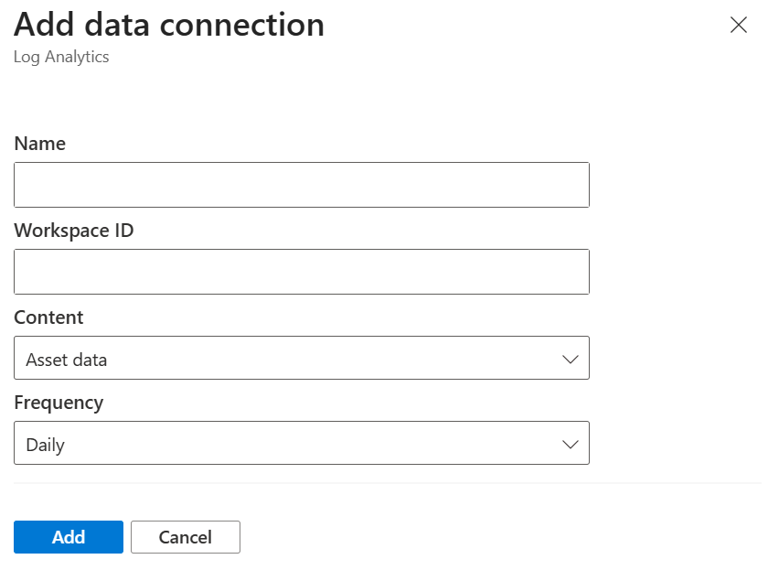

# Use data connections

This article discusses the data connections feature in Microsoft Defender External Attack Surface Management (Defender EASM).

## Overview
Defender EASM now offers data connections to help you seamlessly integrate your attack surface data into other Microsoft solutions to supplement existing workflows with new insights. You must get data from Defender EASM into the other security tools you use for remediation purposes to make the best use of your attack surface data.

The data connector sends Defender EASM asset data to two different platforms: Log Analytics and Azure Data Explorer. You need to export Defender EASM data to either tool. Data connections are subject to the pricing model for each respective platform.

[Log Analytics](/azure/sentinel/overview) provides security information and event management and security orchestration, automation, and response capabilities. Defender EASM asset or insights information can be used in Log Analytics to enrich existing workflows with other security data. This information can supplement firewall and configuration information, threat intelligence, and compliance data to provide visibility into your external-facing infrastructure on the open internet.

You can:

- Create or enrich security incidents.
- Build investigation playbooks.
- Train machine learning algorithms.
- Trigger remediation actions.

[Azure Data Explorer](/azure/data-explorer/data-explorer-overview) is a big data analytics platform that helps you analyze high volumes of data from various sources with flexible customization capabilities. Defender EASM asset and insights data can be integrated to use visualization, query, ingestion, and management capabilities within the platform.

Whether you're building custom reports with Power BI or hunting for assets that match precise KQL queries, exporting Defender EASM data to Azure Data Explorer enables you to use your attack surface data with endless customization potential.

## Data content options

Defender EASM data connections offer you the ability to integrate two different kinds of attack surface data into the tool of your choice. You can elect to migrate asset data, attack surface insights, or both data types. Asset data provides granular details about your entire inventory. Attack surface insights provide immediately actionable insights based on Defender EASM dashboards.

To accurately present the infrastructure that matters most to your organization, both content options only include assets in the **Approved** inventory state.

**Asset data**: The Asset Data option sends data about all your inventory assets to the tool of your choice. This option is best for use cases where the granular underlying metadata is key to your Defender EASM integration. Examples include Microsoft Sentinel or customized reporting in Azure Data Explorer. You can export high-level context on every asset in inventory and granular details specific to the particular asset type.

This option doesn't provide any predetermined insights about the assets. Instead, it offers an expansive amount of data so that you can find the customized insights you care about most.

**Attack surface insights**: Attack surface insights provide an actionable set of results based on the key insights delivered through dashboards in Defender EASM. This option provides less granular metadata on each asset. It categorizes assets based on the corresponding insights and provides the high-level context required to investigate further. This option is ideal if you want to integrate these predetermined insights into custom reporting workflows with data from other tools.

## Configuration overviews

This section presents general information on configuration.

### Access data connections
On the leftmost pane in your Defender EASM resource pane, under **Manage**, select **Data Connections**. This page displays the data connectors for both Log Analytics and Azure Data Explorer. It lists any current connections and provides the option to add, edit, or remove connections.

### Connection prerequisites
To successfully create a data connection, you must first ensure that you've completed the required steps to grant Defender EASM permission to the tool of your choice. This process enables the application to ingest your exported data. It also provides the authentication credentials needed to configure the connection.

## Configure Log Analytics permissions

1. Open the Log Analytics workspace that will ingest your Defender EASM data or [create a new workspace](/azure/azure-monitor/logs/quick-create-workspace?tabs=azure-portal).

1. On the leftmost pane, under **Settings**, select **Agents**.

   

1. Expand the **Log Analytics agent instructions** section to view your workspace ID and primary key. These values are used to set up your data connection.

Use of this data connection is subject to the pricing structure of Log Analytics. For more information, see [Azure Monitor pricing](https://azure.microsoft.com/pricing/details/monitor/).

## Configure Azure Data Explorer permissions

Ensure that the Defender EASM API service principal has access to the correct roles in the database where you want to export your attack surface data. First, ensure that your Defender EASM resource was created in the appropriate tenant because this action provisions the EASM API principal.

1. Open the Azure Data Explorer cluster that will ingest your Defender EASM data or [create a new cluster](/azure/data-explorer/create-cluster-database-portal).
1. On the leftmost pane, under **Data**, select **Databases**.
1. Select **Add Database** to create a database to house your Defender EASM data.

   

1. Name your database, configure retention and cache periods, and select **Create**.

   

1. After your Defender EASM database is created, select the database name to open the details page. On the leftmost pane, under **Overview**, select **Permissions**.
   To successfully export Defender EASM data to Azure Data Explorer, you must create two new permissions for the EASM API: **user** and **ingestor**.

   

1. Select **Add** and create a user. Search for **EASM API**, select the value, and choose **Select**.

1. Select **Add** to create an ingestor. Follow the same steps previously outlined to add the **EASM API** as an ingestor.

1. Your database is now ready to connect to Defender EASM. You need the cluster name, database name, and region when you configure your data connection.

## Add a data connection
You can connect your Defender EASM data to either Log Analytics or Azure Data Explorer. To do so, select **Add connection** for the appropriate tool from the **Data Connections** page.

A configuration pane opens on the right side of the **Data Connections** page. The following fields are required for each respective tool.

### Log Analytics

- **Name**: Enter a name for this data connection.
- **Workspace ID**: Enter the workspace ID for the Log Analytics instance where you want to export Defender EASM data.
- **API key**: Enter the API key for the Log Analytics instance.
- **Content**: Select to integrate asset data, attack surface insights, or both datasets.
- **Frequency**: Select the frequency that the Defender EASM connection uses to send updated data to the tool of your choice. Available options are daily, weekly, and monthly.

   

### Azure Data Explorer

- **Name**: Enter a name for this data connection.
- **Cluster name**: Enter the name of the Azure Data Explorer cluster where you want to export Defender EASM data.
- **Region**: Enter the region of the Azure Data Explorer cluster.
- **Database name**: Enter the name of the desired database.
- **Content**: Select to integrate asset data, attack surface insights, or both datasets.
- **Frequency**: Select the frequency that the Defender EASM connection uses to send updated data to the tool of your choice. Available options are daily, weekly, and monthly.

   

   After all fields are configured, select **Add** to create the data connection. At this point, the **Data Connections** page displays a banner that indicates the resource was successfully created. In 30 minutes, data begins to populate. After connections are created, they're listed under the applicable tool on the main **Data Connections** page.

## Edit or delete a data connection
You can edit or delete a data connection. For example, you might notice that a connection is listed as **Disconnected**. In this case, you need to reenter the configuration details to fix the issue.

To edit or delete a data connection:

1. Select the appropriate connection from the list on the main **Data Connections** page.

   

1. A page opens that provides more data about the connection. It displays the configurations you chose when you created the connection and any error messages. You also see the following data:

   - **Recurring on**: The day of the week or month that Defender EASM sends updated data to the connected tool.
   - **Created**: The date and time that the data connection was created.
   - **Updated**: The date and time that the data connection was last updated.

     

1. From this page, you can reconnect, edit, or delete your data connection.

   - **Reconnect**: Attempts to validate the data connection without any changes to the configuration. This option is best if you validated the authentication credentials used for the data connection.
   - **Edit**: Allows you to change the configuration for the data connection.
   - **Delete**: Deletes the data connection.

