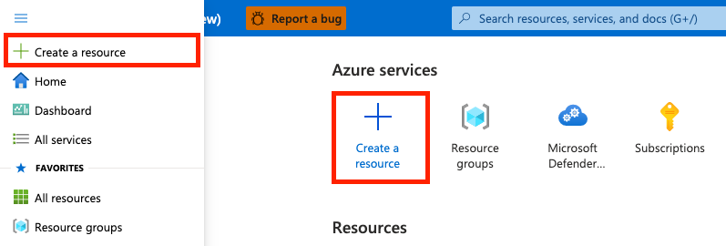

# Deploying the Defender EASM Azure resource

This article explains how to deploy the Microsoft Defender External Attack Surface Management (Defender EASM) Azure resource using the Azure Portal.

Deploying the EASM Azure resource involves two steps:

- Create a resource group
- Deploy the EASM resource to the resource group

## Prerequisites

Before you create a Defender EASM resource group, we recommend that you are familiar with how to access and use the [Microsoft Azure Portal](https://ms.portal.azure.com/) and read the [Defender EASM Overview article](index.md) for key context on the product. You will need:

- A valid Azure subscription or free Defender EASM trial account. If you don’t have an [Azure subscription](/azure/guides/developer/azure-developer-guide#understanding-accounts-subscriptions-and-billing), create an free Azure account before you begin.

- Your Azure account must have a contributor role assigned for you to create a resource. To get this role assigned to your account, follow the steps in the [Assign roles](/azure/role-based-access-control/role-assignments-steps) documentation, or contact your administrator.

## Create a resource group

1. To create a new resource group, first select **Resource groups** in the Azure portal.

    

2. Under Resource Groups, select **Create**:

    

3. Select or enter the following property values:

    - **Subscription**: Select an Azure subscription.
    - **Resource Group**: Give the resource group a name.
    - **Region**: Specify an Azure location. This location is where the resource group stores metadata about the resource. For compliance reasons, you may want to specify where that metadata is stored. In general, we recommend that you specify a location where most of your resources will be. Using the same location can simplify your template.

    

4. Select **Review + Create**.

5. Review the values, and then select **Create**.

6. Select **Refresh** to view the new resource group in the list.

## Deploy resources to a resource group

After you create a resource group, you can deploy resources to the group from the Marketplace. The Marketplace provides all services and pre-defined solutions available in Azure.

1. To start a deployment, select “Create a resource” in the Azure portal.

    

2. In the search box, type **Microsoft Defender EASM**, and then press Enter.

3. Select the **Create** button to create an EASM resource.

    

4. Select or enter the following property values:

    - **Subscription**: Select an Azure subscription.
    - **Resource Group**: Select the Resource Group created in the earlier step, or you can create a new one as part of the process of creating this resource.
    - **Name**: give the Defender EASM workspace a name.
    - **Region**: Select an Azure location.

    

5. Select **Review + Create**.

6. Review the values, and then select **Create**.

7. Select **Refresh** to see the status of the deployment and once finished you can go to the Resource to get started.

## Next steps

- [Using and managing discovery](using-and-managing-discovery.md)
- [Understanding dashboards](understanding-dashboards.md)