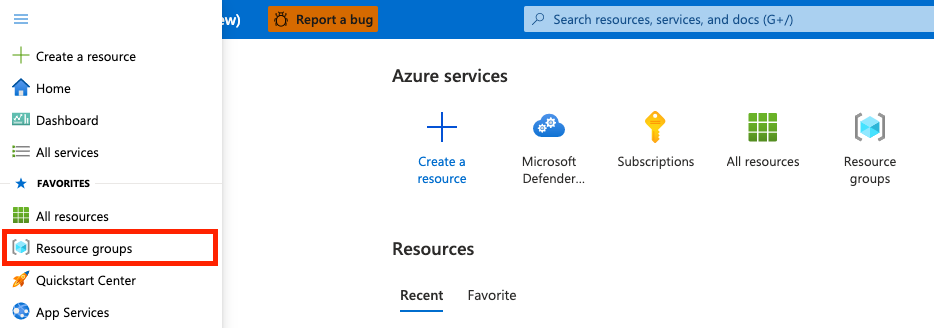
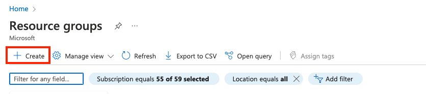
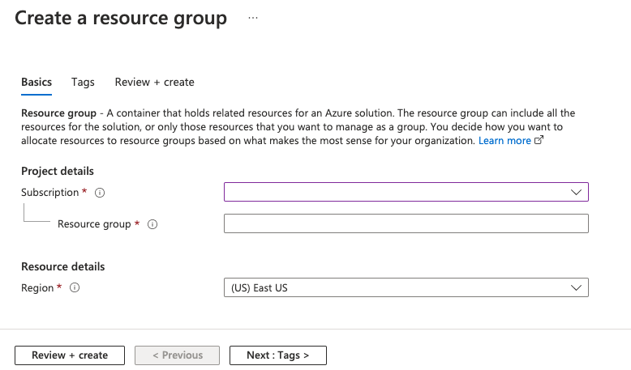
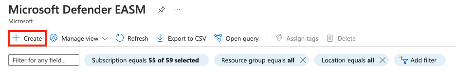
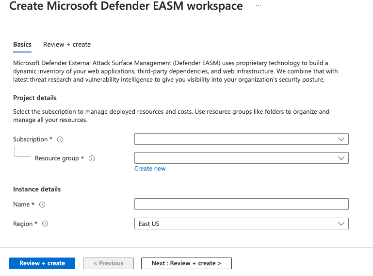

# Create a Defender EASM Azure resource

This article explains how to create a Microsoft Defender External Attack Surface Management (Defender EASM) Azure resource by using the Azure portal.

Creating the Defender EASM Azure resource involves two steps:

- Create a resource group.
- Create a Defender EASM resource in the resource group.

## Prerequisites

Before you create a Defender EASM resource group, become familiar with how to access and use the [Azure portal](https://portal.azure.com/). Also read the [Defender EASM Overview article](index.md) for key context on the product. You need:

- A valid Azure subscription or free Defender EASM trial account. If you don’t have an [Azure subscription](../guides/developer/azure-developer-guide.md#understanding-accounts-subscriptions-and-billing), create a free Azure account before you begin.
- A Contributor role assigned for you to create a resource. To get this role assigned to your account, follow the steps in the [Assign roles](../role-based-access-control/role-assignments-steps.md) documentation. Or you can contact your administrator.

## Create a resource group

1. To create a new resource group, select **Resource groups** in the Azure portal.

    

1. Under **Resource groups**, select **Create**.

    

1. Select or enter the following property values:

   - **Subscription**: Select an Azure subscription.
   - **Resource group**: Give the resource group a name.
   - **Region**: Specify an Azure location. This location is where the resource group stores metadata about the resource. For compliance reasons, you might want to specify where that metadata is stored. In general, we recommend that you specify a location where most of your resources will be. Using the same location can simplify your template. The following regions are supported:
      -  southcentralus
      -  eastus
      -  australiaeast
      -  westus3 
      -  swedencentral
      -  eastasia
      -  japaneast
      -  westeurope
      -  northeurope
      -  switzerlandnorth
      -  canadacentral
      -  centralus
      -  norwayeast
      -  francecentral

    

1. Select **Review + create**.

1. Review the values and select **Create**.

1. Select **Refresh** to view the new resource group in the list.

## Create resources in a resource group

After you create a resource group, you can create Defender EASM resources in the group by searching for Defender EASM in the Azure portal.

1. In the search box, enter **Microsoft Defender EASM** and select Enter.

1. Select **Create** to create a Defender EASM resource.

    

1. Select or enter the following property values:

   - **Subscription**: Select an Azure subscription.
   - **Resource group**: Select the resource group created in the earlier step. You can also create a new one as part of the process of creating this resource.
   - **Name**: Give the Defender EASM workspace a name.
   - **Region**: Select an Azure location. See the supported regions listed in the preceding section.

    

1. Select **Review + create**.

1. Review the values and select **Create**.

1. Select **Refresh** to see the status of the resource creation. Now you can go to the resource to get started.

## Next steps

- [Use and manage discovery](using-and-managing-discovery.md)
- [Understand dashboards](understanding-dashboards.md)
