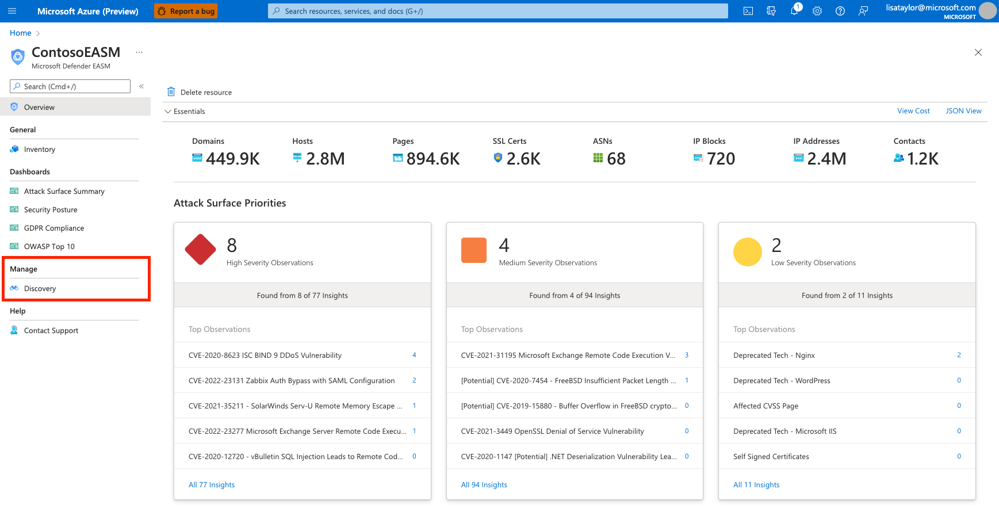
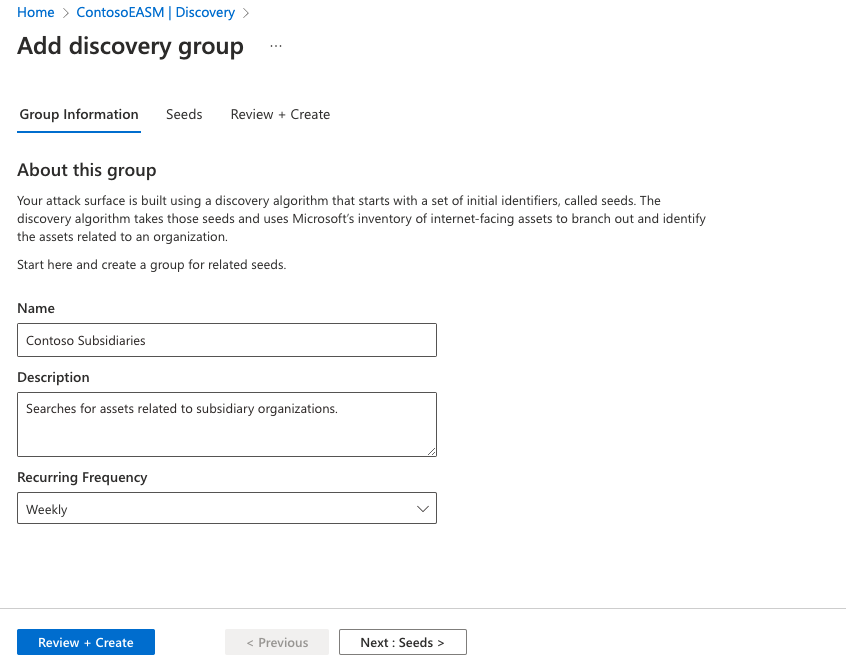
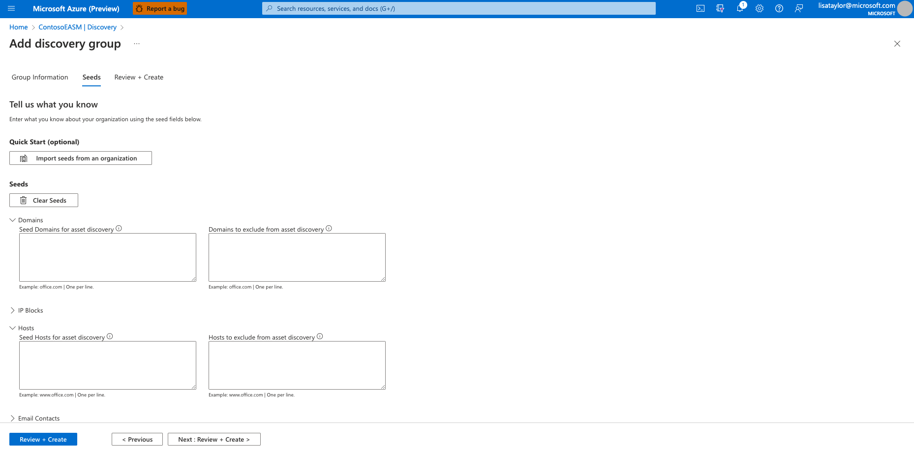
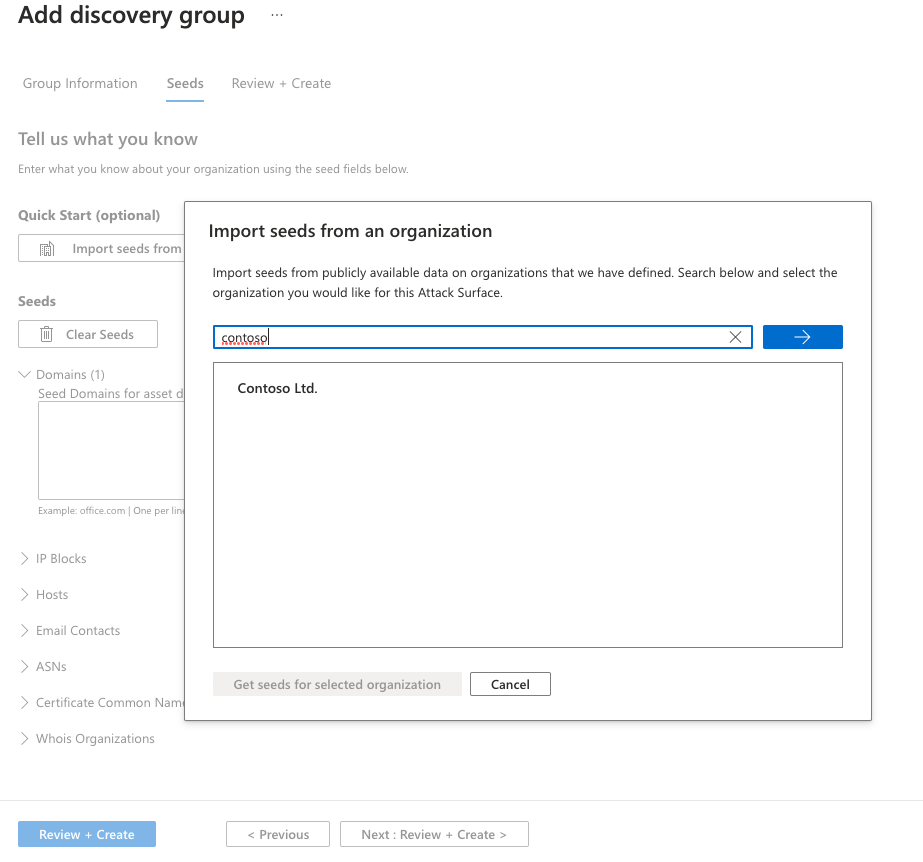
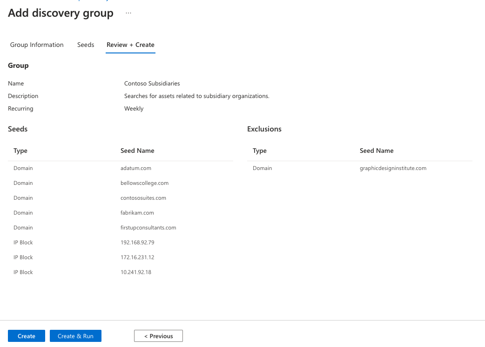

# Discovering your attack surface

## Prerequisites

Before completing this tutorial, see the [What is discovery?](what-is-discovery.md) and [Using and managing discovery](using-and-managing-discovery.md) articles to understand key concepts mentioned in this article.

## Accessing your automated attack surface

Microsoft has preemptively configured the attack surfaces of many organizations, mapping their initial attack surface by discovering infrastructure that’s connected to known assets. It's recommended that all users search for their organization’s attack surface before creating a custom attack surface and running other discoveries. This process enables users to quickly access their inventory as Defender EASM refreshes the data, adding more assets and recent context to your Attack Surface.

1. When first accessing your Defender EASM instance, select “Getting Started” in the “General” section to search for your organization in the list of automated attack surfaces.

2. Then select your organization from the list and click “Build my Attack Surface”.

At this point, the discovery runs in the background. If you selected a pre-configured Attack Surface from the list of available organizations, you will be redirected to the Dashboard Overview screen where you can view insights into your organization’s infrastructure in Preview Mode. Review these dashboard insights to become familiar with your Attack Surface as you wait for additional assets to be discovered and populated in your inventory. Read the [Understanding dashboards](understanding-dashboards.md) article for more information on how to derive insights from these dashboards.

If you notice any missing assets or have other entities to manage that may not be discovered through infrastructure clearly linked to your organization, you can elect to run customized discoveries to detect these outlier assets.

## Customizing discovery
Custom discoveries are ideal for organizations that require deeper visibility into infrastructure that may not be immediately linked to their primary seed assets. By submitting a larger list of known assets to operate as discovery seeds, the discovery engine will return a wider pool of assets. Custom discovery can also help organizations find disparate infrastructure that may relate to independent business units and acquired companies.

## Discovery groups
Custom discoveries are organized into Discovery Groups. They're independent seed clusters that comprise a single discovery run and operate on their own recurrence schedules. Users can elect to organize their Discovery Groups to delineate assets in whatever way best benefits their company and workflows. Common options include organizing by responsible team/business unit, brands or subsidiaries.

## Creating a discovery group

1. Select the **Discovery** panel under the **Manage** section in the left-hand navigation column.

     

2. This Discovery page shows your list of Discovery Groups by default. This list will be empty when you first access the platform. To run your first discovery, click **Add Discovery Group**.

     

3. First, name your new discovery group and add a description. The **Recurring Frequency** field allows you to schedule discovery runs for this group, scanning for new assets related to the designated seeds on a continuous basis. The default recurrence selection is **Weekly**; Microsoft recommends this cadence to ensure that your organization’s assets are routinely monitored and updated. For a single, one-time discovery run, select **Never**. However, we recommend that users keep the **Weekly** default cadence and instead turn off historical monitoring within their Discovery Group settings if they later decide to discontinue recurrent discovery runs.

    Select **Next: Seeds >**

    

4. Next, select the seeds that you’d like to use for this Discovery Group. Seeds are known assets that belong to your organization; the Defender EASM platform scans these entities, mapping their connections to other online infrastructure to create your Attack Surface.

     

    The **Quick Start** option lets you search for your organization in a list of pre-populated Attack Surfaces. You can quickly create a Discovery Group based on the known assets belonging to your organization. 

    
    

    Alternatively, users can manually input their seeds. Defender EASM accepts domains, IP blocks, hosts, email contacts, ASNs, and WhoIs organizations as seed values. You can also specify entities to exclude from asset discovery to ensure they aren't added to your inventory if detected. For example, this is useful for organizations that have subsidiaries that will likely be connected to their central infrastructure, but don't belong to your organization.

    Once your seeds have been selected, select **Review + Create**.

5. Review your group information and seed list, then select **Create & Run**.

     

You are then taken back to the main Discovery page that displays your Discovery Groups. Once your discovery run is complete, you can see new assets added to your Approved Inventory.

## Next steps
- [Understanding asset details](understanding-asset-details.md)
- [Understanding dashboards](understanding-dashboards.md)
