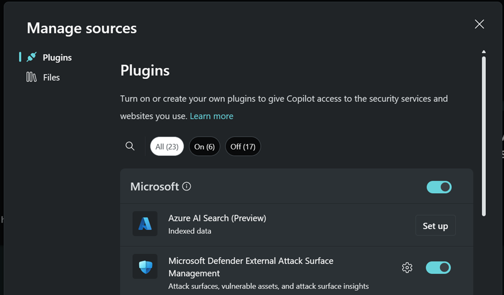
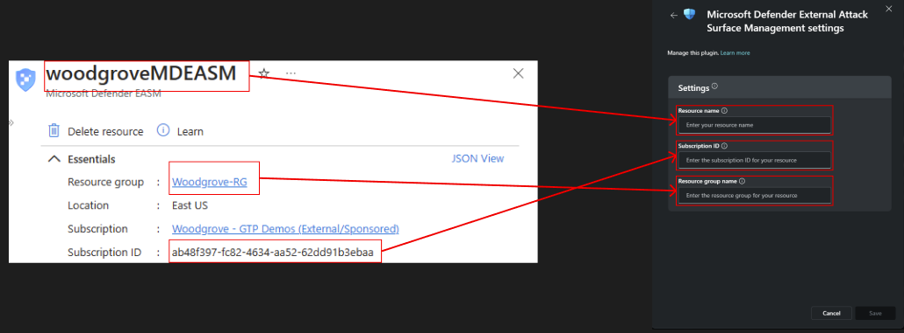

---
# required metadata

title: Copilot for Security and Defender EASM
description: You can use Copilot for Security to get information about your EASM data.
author: dandennis
ms.author: dandennis
ms.date: 10/25/2023
ms.topic: conceptual
ms.service: defender-easm
ms.localizationpriority: high

---

# Microsoft Copilot for Security and Defender EASM

Microsoft Defender External Attack Surface Management (Defender EASM) continuously discovers and maps your digital attack surface to provide an external view of your online infrastructure. This visibility enables security and IT teams to identify unknowns, prioritize risk, eliminate threats, and extend vulnerability and exposure control beyond the firewall. Attack Surface Insights are generated by analyzing vulnerability and infrastructure data to showcase the key areas of concern for your organization. 

Defender EASM’s integration with Copilot for Security enables users to interact with Microsoft’s discovered attack surfaces. These attack surfaces allow users to quickly understand their externally facing infrastructure and relevant, critical risks to their organization. They provide insight into specific areas of risk, including vulnerabilities, compliance, and security hygiene. For more information about Copilot for Security, go to [What is Microsoft Copilot for Security](/security-copilot/microsoft-security-copilot).

**Copilot for Security integrates with Defender EASM**.

Copilot for Security can surface insights from Defender EASM about an organization's attack surface. You can use the system features built into Copilot for Security, and use prompts to get more information. This information can help you understand your security posture and mitigate vulnerabilities.

This article introduces you to Copilot for Security and includes sample prompts that can help Defender EASM users.

## Connect Copilot to Defender EASM 

### Prerequisites

* Access to Copilot for Security, with permissions to activate new connections.

### Copilot  for Security connection 

1. Access [Copilot for Security](https://securitycopilot.microsoft.com/) and ensure you're authenticated.
1. Select the plugins icon on the upper-right side of the prompt input bar.

    
   
1. Locate Defender External Attack Surface Management under the “Microsoft” section and toggle on to connect.

    
   
4. If you would like Copilot for Security to pull data from your Microsoft Defender External Attack Surface Resource, click on the gear to open the plugin settings, and fill out the fields from your resource’s “Essentials” section on the Overview blade.

   

> [!NOTE] 
> Customers can still use Defender EASM skills if they have not purchased Defender EASM. See the Plugin capabilities reference section for more information. 

## Getting started 

Copilot for Security operates primarily with natural language prompts. When querying information from Defender EASM, you submit a prompt that guides Copilot for Security to select the Defender EASM plugin and invoke the relevant capability.  
For success with Copilot prompts, we recommend the following: 

- Ensure that you reference the company name in your first prompt. Unless otherwise specified, all future prompts will provide data about the initially specified company. 

- Be clear and specific with your prompts. You might get better results if you include specific asset names or metadata values (for example, CVE IDs) in your prompts.

  It might also help to add **Defender EASM** to your prompt, like:

  - **According to Defender EASM, what are my expired domains?**
  - **Tell me about Defender EASM high priority attack surface insights.**

- Experiment with different prompts and variations to see what works best for your use case. Chat AI models vary, so iterate and refine your prompts based on the results you receive.

- Copilot for Security saves your prompt sessions. To see the previous sessions, in Copilot for Security, go to the menu > **My sessions**. 

  For a walkthrough on Copilot for Security, including the pin and share feature, go to [Navigating Microsoft Copilot for Security](/security-copilot/navigating-security-copilot).

For more information on writing Copilot for Security prompts, go to [Microsoft Copilot for Security prompting tips](/security-copilot/prompting-tips).

## Plugin capabilities reference 

| Capability        | Description                     | Inputs                | Behaviors                              |
| ----------------- | ------------------------------- | --------------------- | -------------------------------------- |
| Get Attack Surface summary | Returns the attack surface summary for either the customer’s Defender EASM resource or a given company name. | **Example inputs:**   • Get attack surface for LinkedIn.     • Get my attack surface.    • What is the attack surface for Microsoft?     • What is my attack surface?    • What are the externally facing assets for Azure?    • What are my externally facing assets?       **Optional Inputs:**   • CompanyName | If your plugin is configured to an active Defender EASM resource and no other company is specified:    • Return attack surface summary for the customer’s Defender EASM resource.    If another company name is provided:   • If no exact for match for company name, returns a list of possible matches.    • If there's an exact match, return the attack surface summary for the given company name. |
| Get Attack Surface insights | Returns the attack surface insights for either the customer’s Defender EASM resource or a given company name.  | **Example inputs:**   • Get high priority attack surface insights for LinkedIn.   • Get my high priority attack surface insights.    • Get low priority attack surface insights for Microsoft.    • Get low priority attack surface insights.    • Do I have high priority vulnerabilities in my external attack surface for Azure?     **Required inputs:**   • PriorityLevel - the priority level must be 'high', 'medium' or 'low' (if not provided, it defaults to ‘high’)    **Optional Inputs:**   • CompanyName - the company name  | If your plugin is configured to an active Defender EASM resource and no other company is specified:    • Return attack surface insights for the customer’s Defender EASM resource.     If another company name is provided:   • If no exact for match for company name, returns a list of possible matches.   • If there's an exact match, return the attack surface insights for the given company name.  |
| Get assets affected by CVE | Returns the assets affected by a CVE for either the customer’s Defender EASM resource or a given company name.  | **Example inputs:**    • Get assets affected by CVE-2023-0012 for LinkedIn.    • Which assets are affected by CVE-2023-0012 for Microsoft?    • Is Azure’s external attack surface impacted by CVE-2023-0012?    • Get assets affected by CVE-2023-0012 for my attack surface.    • Which of my assets are affected by CVE-2023-0012?    • Is my external attack surface impacted by CVE-2023-0012?    **Required inputs:**   • CveId    **Optional inputs:**   • CompanyName | If your plugin is configured to an active Defender EASM resource and no other company is specified:    • If plugin settings aren't filled out, fail graciously and remind customers.    • If plugin settings are filled out, return the assets affected by a CVE for the customer’s Defender EASM resource.    If another company name is provided:   • If no exact for match for company name, returns a list of possible matches.    • If there's an exact match, return the assets affected by a CVE for the given company name.  |
| Get assets affected by CVSS | Returns the assets affected by a CVSS score for either the customer’s Defender EASM resource or a given company name.  | **Example inputs:**   • Get assets affected by high priority CVSS's in LinkedIn’s attack surface.   • How many assets have critical CVSS's for Microsoft?    • Which assets have critical CVSS's for Azure?    • Get assets affected by high priority CVSS's in my attack surface.    • How many of my assets have critical CVSS's?    • Which of my assets have critical CVSS's for?     **Required inputs:**   • CvssPriority (the CVSS priority must be critical, high, medium or low.    **Optional inputs:**   • CompanyName | If your plugin is configured to an active Defender EASM resource and no other company is specified:      • If plugin settings aren't filled out, fail graciously and remind customers.    •  If plugin settings are filled out, return the assets affected by a CVSS score for the customer’s Defender EASM resource.    If another company name is provided:   • If no exact for match for company name, returns a list of possible matches.    • If there's an exact match, return the assets affected by a CVSS score for the given company name.  | 
| Get expired domains | Returns the number of expired domains for either the customer’s Defender EASM resource or a given company name.  | **Example inputs:**   • How many domains are expired in LinkedIn’s attack surface?      • How many assets are using expired domains for Microsoft?     • How many domains are expired in my attack surface?      • How many of my assets are using expired domains for Microsoft?     **Optional inputs:**    • CompanyName | If your plugin is configured to an active Defender EASM resource and no other company is specified:   • return the number of expired domains for the customer’s Defender EASM resource      If another company name is provided:    • If no exact for match for company name, returns a list of possible matches.    • If there's an exact match, return the number of expired domains for the given company name.  |
| Get expired certificates | Returns the number of expired SSL certificates for either the customer’s Defender EASM resource or a given company name.  | **Example inputs:**    • How many SSL certificates are expired for LinkedIn?     • How many assets are using expired SSL certificates for Microsoft?    • How many SSL certificates are expired for my attack surface?     • What are my expired SSL certificates?      **Optional inputs:**   • CompanyName |  If your plugin is configured to an active Defender EASM resource and no other company is specified:    • return the number of SSL certificates for the customer’s Defender EASM resource.    If another company name is provided:   • If no exact for match for company name, returns a list of possible matches.    • If there's an exact match, return the number of SSL certificates for the given company name.  |
| Get SHA1 certificates | Returns the number of SHA1 SSL certificates for either the customer’s Defender EASM resource or a given company name.  | **Example inputs:**   • How many SSL SHA1 certificates are present for LinkedIn?     • How many assets are using SSL SHA1 for Microsoft?    • How many SSL SHA1 certificates are present for my attack surface?     • How many of my assets are using SSL SHA1?     **Optional inputs:**   • CompanyName |  If your plugin is configured to an active Defender EASM resource and no other company is specified:    • return the number of SHA1 SSL certificates for the customer’s Defender EASM resource     If another company name is provided:   • If no exact for match for company name, returns a list of possible matches.    • If there's an exact match, return the number of SHA1 SSL certificates for the given company name.  | 

## Switching between resource and company data 

Even though we have added resource integration for our skills, we still support pulling data from prebuilt attack surfaces for specific companies. To improve Copilot for Security’s accuracy in determining when a customer wants to pull from their attack surface or a prebuilt, company attack surface, we recommend using “my”, “my attack surface”, etc. to convey they want to use their resource and “their”, “{specific company name}”, etc. to convey they want a prebuilt attack surface. While this does improve the experience in a single session, we strongly recommend having two separate sessions to avoid any confusion. 

## Provide feedback

Your feedback on Copilot for Security generally, and the Defender EASM plugin specifically, is vital to guide current and planned development on the product. The optimal way to provide this feedback is directly in the product, using the feedback buttons at the bottom of each completed prompt. Select "Looks right," "Needs improvement" or "Inappropriate". We recommend “Looks right” when the result matches expectations, “Needs improvement” when it doesn't, and “Inappropriate” when the result is harmful in some way.  

Whenever possible, and especially when the result is “Needs improvement,” please write a few words explaining what we can do to improve the outcome. This also applies when you expected Copilot for Security to invoke the Defender EASM plugin, but another plugin was selected instead. 

## Data processing and privacy

When you interact with Copilot for Security to get Defender EASM data, Copilot pulls that data from Defender EASM. The prompts, the data that's retrieved, and the output shown in the prompt results is processed and stored within the Copilot for Security service.

For more information about data privacy in Copilot for Security, go to [Privacy and data security in Microsoft Copilot for Security](/security-copilot/privacy-data-security).

## Related articles

- [What is Microsoft Copilot for Security?](/security-copilot/microsoft-security-copilot)
- [Privacy and data security in Microsoft Copilot for Security](/security-copilot/privacy-data-security)
- [Query your attack surface with Defender EASM using Microsoft Copilot in Azure](/azure/copilot/query-attack-surface) 
