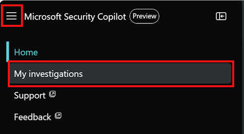

---
# required metadata

title: Security Copilot (preview) and Defender EASM
description: You can use Security Copilot to get information about your EASM data.
author: dandennis
ms.author: dandennis
ms.date: 10/25/2023
ms.topic: conceptual
ms.service: defender-easm
ms.localizationpriority: high

---

# Microsoft Security Copilot (preview) and Defender EASM

> [!IMPORTANT]
> The information in this article applies to the Microsoft Security Copilot Early Access Program, which is an invite-only paid preview program. Some information in this article relates to prereleased product, which may be substantially modified before it's commercially released. Microsoft makes no warranties, express or implied, with respect to the information provided in this article.

Security Copilot is a cloud-based AI platform that provides a natural language copilot experience. It can help support security professionals in different scenarios, like incident response, threat hunting, and intelligence gathering. For more information about what it can do, go to [What is Microsoft Security Copilot?](/security-copilot/microsoft-security-copilot).

**Security Copilot integrates with Defender EASM**.

Security Copilot can surface insights from Defender EASM about an organization's attack surface. You can use the system features built into Security Copilot, and use prompts to get more information. This information can help you understand your security posture and mitigate vulnerabilities.

This article introduces you to Security Copilot and includes sample prompts that can help Defender EASM users.

## Know before you begin

- Ensure that you reference the company name in your first prompt. Unless otherwise specified, all future prompts will provide data about the initially specified company. 

- Be clear and specific with your prompts. You might get better results if you include specific asset names or metadata values (e.g. CVE IDs) in your prompts.

  It might also help to add **Defender EASM** to your prompt, like:

  - **According to Defender EASM, what are my expired domains?**
  - **Tell me about Defender EASM high priority attack surface insights.**

- Experiment with different prompts and variations to see what works best for your use case. Chat AI models vary, so iterate and refine your prompts based on the results you receive.

- Security Copilot saves your prompt sessions. To see the previous sessions, in Security Copilot, go to the menu > **My investigations**:

   

  For a walkthrough on Security Copilot, including the pin and share feature, go to [Navigating Microsoft Security Copilot](/security-copilot/navigating-security-copilot).

For more information on writing Security Copilot prompts, go to [Microsoft Security Copilot prompting tips](/security-copilot/prompting-tips).

## Open Security Copilot

1. Go to [Microsoft Security Copilot](https://go.microsoft.com/fwlink/?linkid=2247989) and sign in with your credentials.
2. By default, Defender EASM should be enabled. To confirm, select **plugins** (bottom left corner):

    

    In **My plugins**, confirm Defender EASM is on. Close **Plugins**.

    > [!NOTE]
    > Some roles can enable or disable plugins, like Defender EASM. For more information, go to [Manage plugins in Microsoft Security Copilot](/security-copilot/manage-plugins).

3. Enter your prompt.

## Built-in system features

In Security Copilot, there are built in system features. These features can get data from the different plugins that are enabled.

To view the list of built-in system capabilities for Defender EASM, use the following steps:

1. In the prompt, enter **/**.
2. Select **See all system capabilities**.
3. In the Defender EASM section, you can:

    - Get attack surface summary.
    - Get attack surface insights.
    - Get assets affected by CVEs by priority or CVE ID.
    - Get assets by CVSS score.
    - Get expired domains.
    - Get expired SSL certificates.
    - Get SHA1 certificates. 

## Sample prompts for Defender EASM?

There are many prompts you can use to get information about your Defender EASM data. This section lists some ideas and examples.

### General information about your attack surface 

Get **general information** about your Defender EASM data, like an attack surface summary or insights about your inventory. 

**Sample prompts**:

- Get the external attack surface for my organization. 
- What are the high priority attack surface insights for my organization? 

### CVE vulnerability data 

Get details on **CVEs that are applicable to your inventory**.

**Sample prompts**:

- Is my external attack surface impacted by CVE-2023-21709?
- Get assets affected by high priority CVSS's in my attack surface.
- How many assets have critical CVSS's for my organization? 

### Domain and SSL certificate posture

Get information about **domain and SSL certificate posture**, like expired domains and usage of SHA1 certificates.

**Sample prompts**:

- How many domains are expired in my organization's attack surface?
- How many SSL certificates are expired for my organization?
- How many assets are using SSL SHA1 for my organization?
- Get list of expired SSL certificates.

## Provide feedback

Your feedback on the Defender EASM integration with Security Copilot helps with development. To provide feedback, in Security Copilot, use the feedback buttons at the bottom of each completed prompt. Your options are "Looks Right," "Needs Improvement" and "Inappropriate." 

Your options:

- **Confirm**: The results match expectations.
- **Off-target**: The results don't match expectations.
- **Report**: The results are harmful in some way.

Whenever possible, and when the result is **Off-target**, write a few words explaining what can be done to improve the outcome. If you entered Defender EASM-specific prompts and the results aren't EASM related, then include that information.

## Data processing and privacy

When you interact with the Security Copilot to get Defender EASM data, Security Copilot pulls that data from Defender EASM. The prompts, the data that's retrieved, and the output shown in the prompt results is processed and stored within the Security Copilot service.

For more information about data privacy in Security Copilot, go to [Privacy and data security in Microsoft Security Copilot](/security-copilot/privacy-data-security).

## Related articles

- [What is Microsoft Security Copilot?](/security-copilot/microsoft-security-copilot)
- [Privacy and data security in Microsoft Security Copilot](/security-copilot/privacy-data-security)
