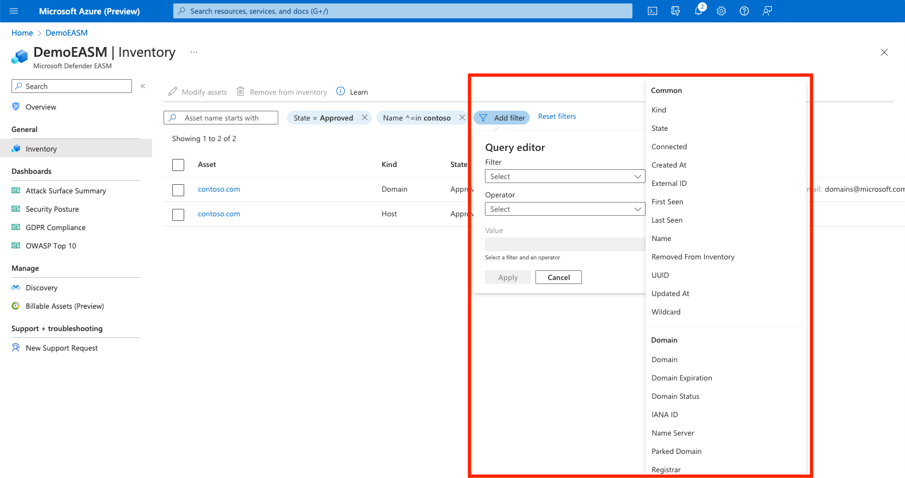
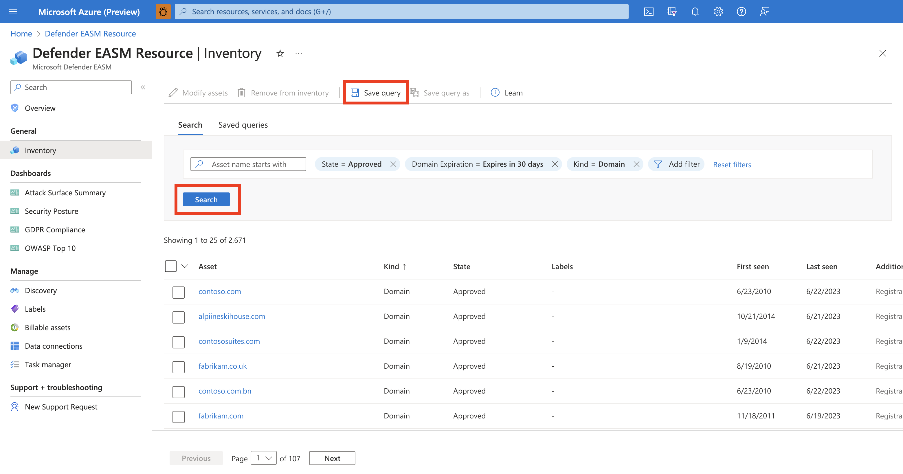
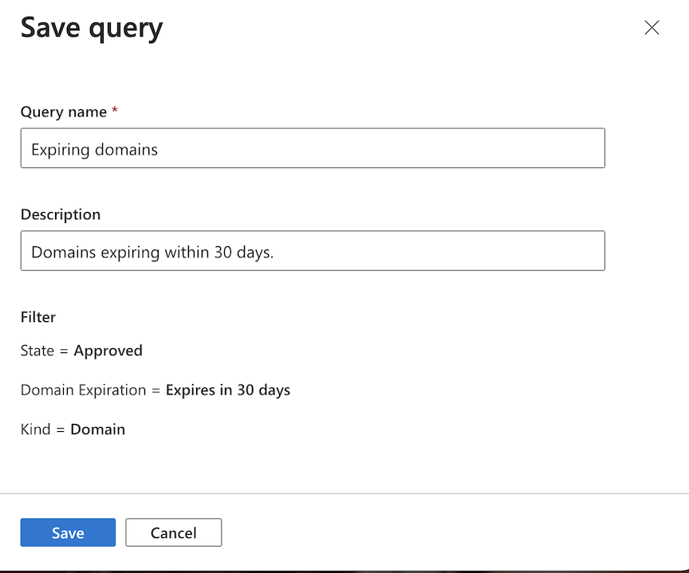
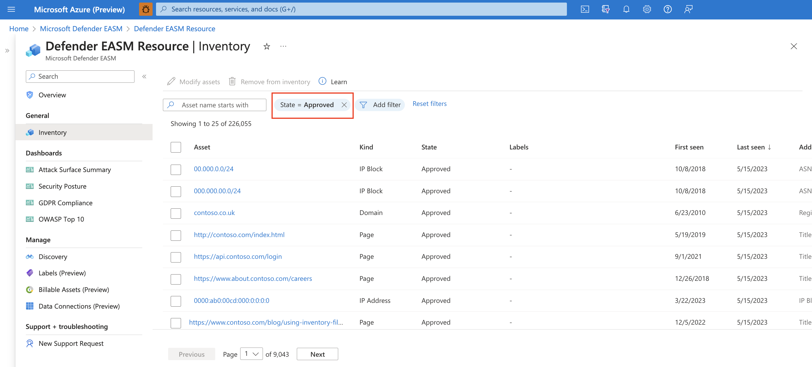
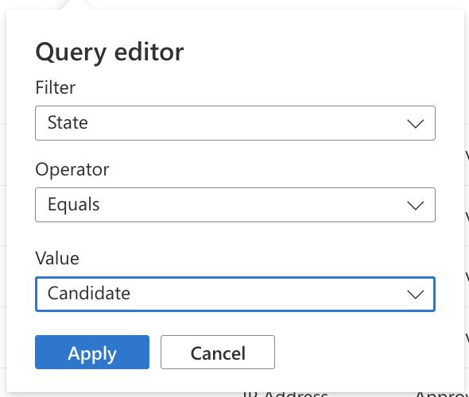
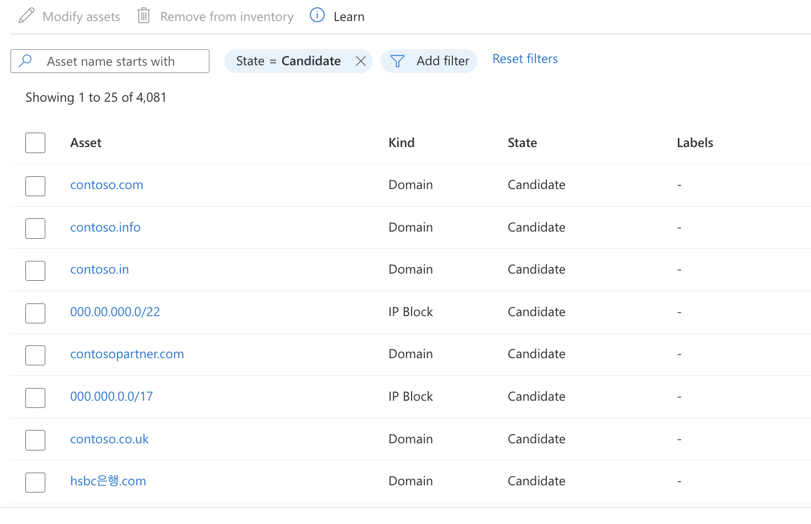
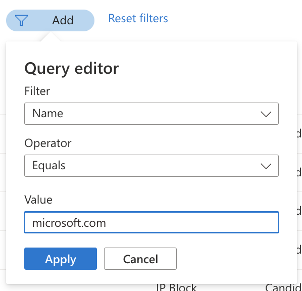
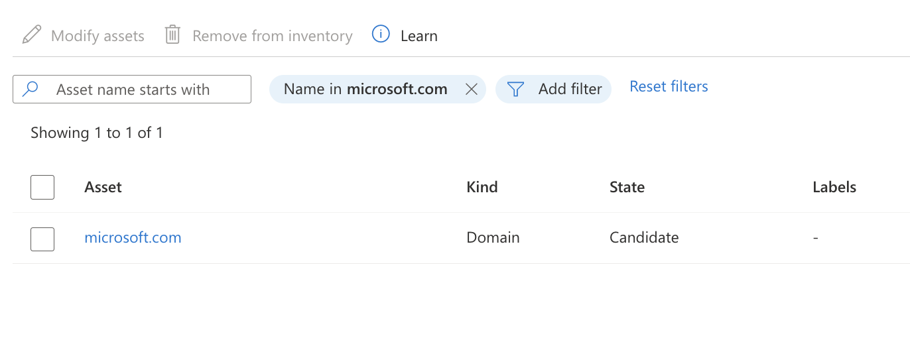

# Defender EASM inventory filters overview

This article outlines the filter functionality available in Microsoft Defender External Attack Surface Management (Defender EASM). Filtering helps you find specific subsets of inventory assets based on selected parameters. This article outlines each filter and operator and provides guidance on input options that yield the best results. It also explains how to save queries for easy accessibility to the filtered results.

## How it works

Inventory filters allow you to access a specific subset of data that meets your search parameters. You can apply as many filters as you need to obtain the results you want.

By default, the **Inventory** screen displays only **Approved** inventory assets. Assets in an alternative state are hidden. This filter can be removed if you want to view assets in a different state. Other states are **Candidate**, **Dependency**, and **Requires investigation**.

Removing the **Approved** inventory filter is useful when you need to:

- Review potential new assets.
- Investigate a third-party dependency issue.
- See a complete view of all potential owned assets when you conduct a search.

Defender EASM offers various filters to obtain results of differing levels of granularity. With some filters, you can select value options from a dropdown list. Others require you to manually enter the value you want.

## Saved queries

You can save queries of interest to quickly access the resulting asset list. This feature is beneficial if you need to search for a particular subset of assets on a routine basis. It's also helpful if you need to easily refer to a specific filter configuration at a later time. Saved filters help you easily access the assets you care about most based on highly customizable parameters.

To save a query:

1. First, carefully select the filters to produce the results you want. For more information on the applicable filters for each kind of asset, see the "Next steps" section. In this example, you're searching for domains that expire within 30 days that require renewal. Select **Search**.

    

1. Review the resulting assets. If you're satisfied with the selected filters and want to save the query, select **Save query**.
  
1. Name your query and provide a description. Query names can't be edited after the initial setup, but descriptions can be changed at a later time. Select **Save**. A banner appears that confirms the query was saved.

    

1. To view your saved filters, select the **Saved queries** tab at the top of the inventory list page. Any saved queries are visible in the top section. Selecting **Open query** filters your inventory by the designated parameters. From this page, you can also edit or delete saved queries.

    

## Operators

Inventory filters can be used with the following operators. Some operators aren't available for every filter. Some operators are hidden if they aren't logically applicable to the specific filter.

| Operator                   | Description                                                                                                                                                                                                                                                        |
|----------------------------|:-------------------------------------------------------------------------------------------------------------------------------------------------------------------------------------------------------------------------------------------------------------------|
| `Equals`                   | Returns results that exactly match the search value.  This filter only returns results for one value at a time. For filters that populate a dropdown list of options, only one option can be selected at a time. To select multiple values, see the `In` operator. |
| `Not Equals`               | Returns results where the field doesn't exactly match the search value.                                                                                                                                                                                            |
| `Starts with`              | Returns results where the field starts with the search value.                                                                                                                                                                                                      |
| `Does not start with`      | Returns results where the field doesn't start with the search value.                                                                                                                                                                                               |
| `Matches`                  | Returns results where a tokenized term in the field exactly matches the search value.                                                                                                                                                                              |
| `Does not match`           | Returns results where a tokenized term in the field doesn't exactly match the search value.                                                                                                                                                                        |
| `In`                       | Returns results where the field exactly matches one of the search values. For dropdown lists, multiple options can be selected.                                                                                                                                    |
| `Not In`                   | Returns results where the field doesn't exactly match any of the search values. Multiple options can be selected. Manually input fields exclude results that match an exact value.                                                                                 |
| `Starts with in`           | Returns results where the field starts with one of the search values.                                                                                                                                                                                              |
| `Does not start with in`   | Returns results where the field doesn't start with any of the search values.                                                                                                                                                                                       |
| `Matches in`               | Returns results where a tokenized term in the field exactly matches one of the search values.                                                                                                                                                                      |
| `Does not match in`        | Returns results where a tokenized term in the field doesn't exactly match any of the search values.                                                                                                                                                                |
| `Contains`                 | Returns results where the field content contains the search value.                                                                                                                                                                                                 |
| `Does Not Contain`         | Returns results where the field content doesn't contain the search value.                                                                                                                                                                                          |
| `Contains in`              | Returns results where the field content contains one of the search values.                                                                                                                                                                                         |
| `Does Not Contain In`      | Returns results where a tokenized term in the field content doesn't contain any of the search values.                                                                                                                                                              |
| `Empty`                    | Returns assets that don't return any value for the specified filter.                                                                                                                                                                                               |
| `Not Empty`                | Returns all assets that return a value for the specified filter, regardless of the value.                                                                                                                                                                          |
| `Greater Than or Equal To` | Returns results that are greater than or equal to a numerical value. Includes dates.                                                                                                                                                                               |
| `Between`                  | Returns results within a numerical range. Includes date ranges.                                                                                                                                                                                                    |

## Common filters

These filters apply to all kinds of assets within an inventory. You can use these filters when you search for a wider range of assets. For a list of filters for specific kinds of assets, see the "Next steps" section.

### Defined value filters

 The following filters provide a dropdown list of options that you can select. The available values are predefined.

| Filter name            | Description                                                                                                                | Selectable values                                                                                         | Available operators                                            |
|------------------------|----------------------------------------------------------------------------------------------------------------------------|-----------------------------------------------------------------------------------------------------------|----------------------------------------------------------------|
| Kind                   | Filters by specific web property types that comprise your inventory.                                                       | ASN, Contact, Domain, Host, IP Address, IP Block, Page, SSL Cert                                          | `Equals`, `Not Equals`, `In`, `Not In`, `Empty`, `Not Empty`   |
| State                  | The state assigned to assets to distinguish their relevance to your organization and how Defender EASM monitors them.      | Approved, Candidate, Dependency, Monitor only, Requires investigation                                     |                                                                |
| Removed from Inventory | The method by which an asset was removed from inventory.                                                                   | Archived, Dismissed                                                                                       |                                                                |
| Created At             | Filters by the date that an asset was created in your inventory.                                                           | Date range via calendar dropdown                                                                          | `Greater Than or Equal To`, `Less Than or Equal To`, `Between` |
| First Seen             | Filters by the date that an asset was first observed by the Defender EASM detection system.                                | Date range via calendar dropdown                                                                          |                                                                |
| Last Seen              | Filters by the date that an asset was last observed by the Defender EASM detection system.                                 | Date range via calendar dropdown                                                                          |                                                                |
| Labels                 | Filters for labels manually applied to inventory assets.                                                                   | Accepts freeform responses, but also offers a dropdown of labels available in your Defender EASM resource |                                                                |
| Updated At             | Filters by the date that asset data was last updated in inventory.                                                         | Date range via calendar dropdown                                                                          |                                                                |
| Wildcard               | A wildcard DNS record answers DNS requests for subdomains that haven't already been defined. An example is  *.contoso.com. | True, False                                                                                               | `Equals`, `Not Equals`                                         |

### Freeform filters

The following filters require you to manually enter the value you want to use for your search. Many of these values are case sensitive.  

| Filter name | Description                                                       | Value format                                                                                                                                        | Applicable operators                                                                                                                                                                                                                                                                 |
|-------------|-------------------------------------------------------------------|-----------------------------------------------------------------------------------------------------------------------------------------------------|--------------------------------------------------------------------------------------------------------------------------------------------------------------------------------------------------------------------------------------------------------------------------------------|
| UUID        | The universally unique identifier assigned to a particular asset. | acabe677-f0c6-4807-ab4e-3a59d9e66b22                                                                                                                | `Equals`, `Not Equals`, `In`, `Not In`                                                                                                                                                                                                                                               |
| Name        | The name of an asset.                                             | Must align to the format of the asset name as listed in inventory. For instance, a host would appear as mail.contoso.com or an IP as 192.168.92.73. | `Equals`, `Not Equals`, `Starts with`, `Does not start with`, `In`, `Not In`, `Starts with in`, `Does not start with in`                                                                                                                                                             |
| External ID | An identifier provided by a third party.                          | Typically a numerical value.                                                                                                                        | `Equals`, `Not Equals`, `Starts with`, `Does not start with`, `Matches`, `Does not match`, `In`, `Not In`, `Starts with in`, `Does not start with in`, `Matches in`, `Does not match in`, `Contains`, `Does Not Contain`, `Contains In`, `Does Not Contain In`, `Empty`, `Not Empty` |

## Filter for assets outside your approved inventory

1. On the leftmost pane, select **Inventory** to view your inventory.

1. To remove the **Approved** inventory filter, select the **X** next to the **State = Approved** filter. Your inventory list expands to include assets in other states, such as **Dismissed**.

   

1. Use the inventory filters to identify the assets you want to find. You might want to review all assets in the **Candidate** state. You can also add any assets that are important to your organization to the **Approved** inventory.

   
   

1. Or you might need to find a single specific asset that you want to add to the **Approved** inventory. To discover a specific asset, apply a filter to search for the name.

   
   

1. When your inventory list shows the unapproved assets you were searching for, you can modify the assets. For more information on how to update assets, see [Modifying inventory assets](labeling-inventory-assets.md).

## Next steps

- [Understand asset details](understanding-asset-details.md)
- [ASN asset filters](asn-asset-filters.md)
- [Contact asset filters](contact-asset-filters.md)
- [Domain asset filters](domain-asset-filters.md)
- [Host asset filters](host-asset-filters.md)
- [IP address asset filters](ip-address-asset-filters.md)
- [IP block asset filters](ip-block-asset-filters.md)
- [Page asset filters](page-asset-filters.md)
- [SSL certificate asset filters](ssl-certificate-asset-filters.md)
