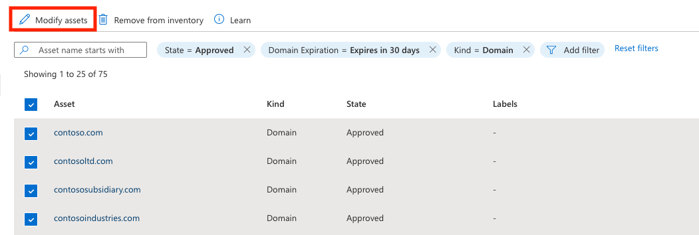

# Labeling inventory assets 

Labels help you organize your attack surface and apply business context in a highly customizable way; you can apply any text label to a subset of assets to group assets and better operationalize your inventory. Customers commonly categorize assets that:  

- have recently come under your organization’s ownership through a merger or acquisition  
- require compliance monitoring 
- are owned by a specific business unit in their organization 
- are impacted by a specific vulnerability that requires mitigation 
- relate to a particular brand owned by the organization  
- were added to your inventory within a specific time range  
- Labels are free-form text fields, so you can create a label for any use case that applies to your organization. 

## Apply labels 

Users can apply labels from both the inventory list and asset details pages.  You can apply labels to a single asset from the asset details page, or multiple assets from the inventory list page. The following sections describe how to apply labels from the two inventory views depending on your use case.  

### Inventory list page  

You should apply labels from the inventory list page if you want to update numerous assets at once. This process also allows you to refine your asset list based on filter parameters, helping you identify assets that should be categorized with the desired label. To apply labels from this page:  

1. Select the **Inventory** page from the left-hand navigation pane of your Defender EASM resource.  

2. Apply filters that will produce your intended results. In this example, we are looking for domains expiring within 30 days that require renewal. The applied label will help you more quickly access any expiring domains, simplifying the remediation process. This is a simple use case; users can apply as many filters as needed to obtain the specific results needed. For more information on filters, see the [Inventory filters overview](inventory-filters.md) article. 

3. Once your inventory list is filtered, select the assets that you wish to modify by adding a label. You can either select all using the checkbox next to the “Asset” table header, or individually select the assets you wish to label.  
 
4. Select **Modify assets**. 

5. This action opens a new “Modify Assets” pane on the right-hand side of your screen.  Select **Create a new label**. 

6. Determine the label name and display text values. The label name cannot be changed after you initially create the label, but the display text can be edited at a later time. The label name will be used to query for the label in the product interface or via API, so edits are disabled to ensure these queries work properly. To edit a label name, you need to delete the original label and create a new one.  
 
Select a color for your new label, then select **Add**. This action will navigate you back to the “Modify Assets” screen. 

7. Apply your new label to the assets. Click inside the “Add labels” text box to view a full list of available labels, or type inside the box to search by keyword. Once you have selected the label(s) you wish to apply, select **Update**. 

8. Allow a few moments for the labels to be applied. Once complete, the page will automatically refresh and display your asset list with the labels visible. A banner at the top of the screen will confirm that your labels have been applied.  

### Asset details page 

Users can also apply labels to a single asset from the asset details page. This is ideal for situations when assets need to be thoroughly reviewed before a label is applied.  
 

1. Select the **Inventory** page from the left-hand navigation pane of your Defender EASM resource. 
 
2. Select the specific asset to which you want to apply a label to open the asset details page. 
 
3. From this page, select **Modify asset**. 

4. Follow steps 5-7 as listed above in the “Inventory list page” section.  

5. Once complete, the asset details page will refresh, displaying the newly applied label and a banner that indicates the asset was successfully updated.  

## Modify, remove or delete labels

Users may remove a label from an asset by accessing the same “Modify asset” pane from either the inventory list or asset details view.  From the inventory list view, you can select multiple assets at once and then add or remove the desired label in one action.  

To modify the label itself or delete a label from the system, access the main Labels management page.  
 

1. Select the **Labels (Preview)** page under the **Manage** section in the left-hand navigation pane of your Defender EASM resource.

This page displays all the labels within your Defender EASM inventory. Please note that labels on this page may exist in the system but not be actively applied to any assets. You can also add new labels from this page.  

2. To edit a label, select the pencil icon in the **Actions** column of the label you wish to edit.  This action will open the right-hand pane that allows you to modify the name or color of a label. Once done, select **Update**.  

3. To remove a label, select the trash can icon from the **Actions** column of the label you wish to delete. A box will appear that asks you to confirm the removal of this label; select **Remove Label** to confirm.  

 
 
The Labels page will automatically refresh and the label will be removed from the list, as well as removed from any assets that had the label applied. A banner will appear to confirm the removal.  

## Filtering for labels 

Once you have labeled assets in your inventory, you can use inventory filters to retrieve a list of all assets with a specific label applied.  

1. Select the **Inventory** page from the left-hand navigation pane of your Defender EASM resource.  

2. Select **Add filter**.  
 
3. Select **Labels** from the Common filter section. Select an operator, then choose a label from the drop-down list of options. The example below is searching for a single label, but you can use the “In” operator to search for multiple labels. For more information on filters, see the [Inventory filters overview](inventory-filters.md)

4. Select **Apply**. The inventory list page will reload, displaying all assets that match your criteria.  

## Next steps  

- [Inventory filters overview](inventory-filters.md)
- [Understanding inventory assets](understanding-inventory-assets.md) 
- [Understanding asset details](understanding-asset-details.md)

