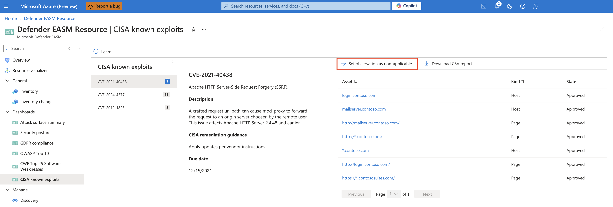
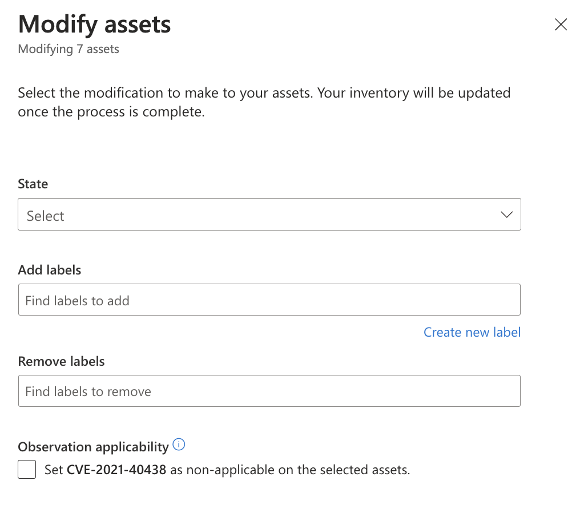
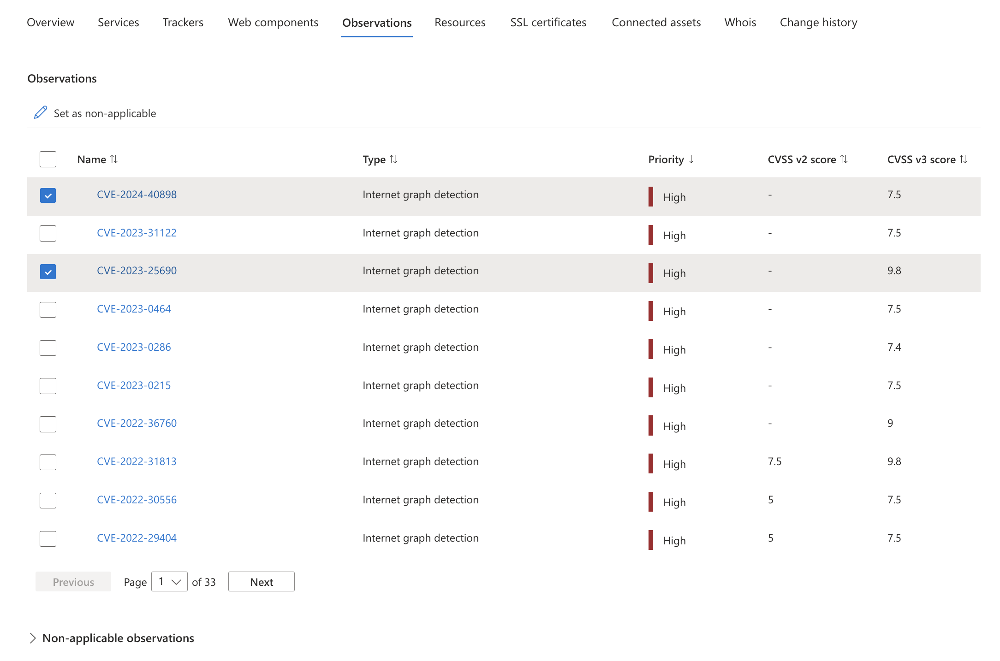
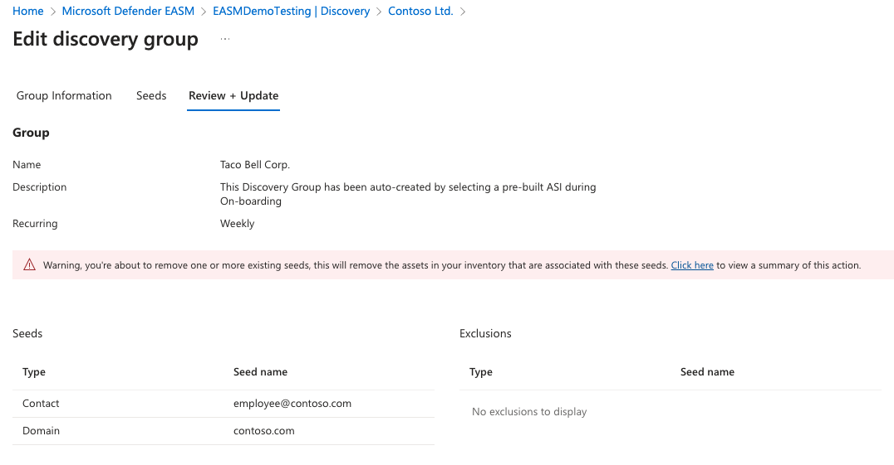
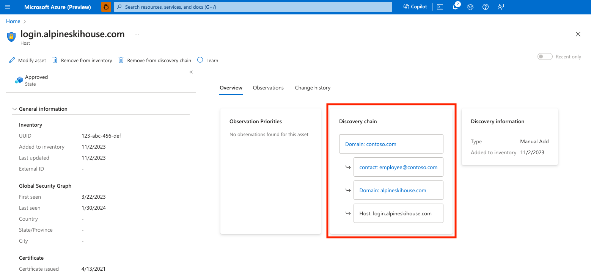
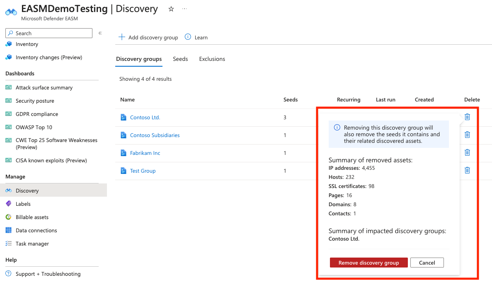

# Asset modification overview

This article outlines how to modify inventory assets. You can change the state of an asset, assign an external ID or apply labels to help provide context and use inventory data. You can also mark CVEs and other observations as non-applicable to remove them from your reported counts. You can also remove assets from their inventory in bulk based on the method with which they are discovered. For instance, users can remove a seed from a discovery group and elect to remove any assets that are discovered through a connection to this seed. This article describes all modification options available in Defender EASM, and outlines how to update assets and track any updates with the Task Manager.

### Label assets

Labels help you organize your attack surface and apply business context in a customizable way. You can apply any text label to a subset of assets to group assets and make better use of your inventory. Customers commonly categorize assets that:

- Have recently come under your organization's ownership through a merger or acquisition.
- Require compliance monitoring.
- Are owned by a specific business unit in their organization.
- Are affected by a specific vulnerability that requires mitigation.
- Relate to a particular brand owned by the organization.
- Were added to your inventory within a specific time range.
  

Labels are free form text fields, so you can create a label for any use case that applies to your organization.

### Change the state of an asset 

Users can also change the state of an asset. States help categorize your inventory based on their role in your organization. Users can switch between the following states: 
- **Approved Inventory**:	A part of your owned attack surface; an item that you're directly responsible for.
- **Dependency**:	Infrastructure owned by a third party but is part of your attack surface because it directly supports the operation of your owned assets. For example, you might depend on an IT provider to host your web content. While the domain, hostname, and pages would be part of your “Approved Inventory,” you may wish to treat the IP Address running the host as a “Dependency.”
- **Monitor Only**:	An asset that is relevant to your attack surface but isn't directly controlled by your organization, nor a technical dependency. For example, independent franchisees or assets belonging to related companies might be labeled as “Monitor Only” rather than “Approved Inventory” to separate the groups for reporting purposes.
- **Candidate**:	An asset that has some relationship to your organization's known seed assets but doesn't have a strong enough connection to immediately label it as “Approved Inventory.” These candidate assets must be manually reviewed to determine ownership.
- **Requires Investigation**:	A state similar to the “Candidate” states, but this value is applied to assets that require manual investigation to validate. This is determined based on our internally generated confidence scores that assess the strength of detected connections between assets. It doesn't indicate the infrastructure's exact relationship to the organization as much as it denotes that this asset was flagged as requiring extra review to determine how it should be categorized.

### Apply an External ID 

Users can also apply an external ID to an asset. This action is useful in situations when you employ multiple solutions for asset tracking, remediation activities or ownership monitoring; seeing any external IDs within Defender EASM helps you align this disparate asset information. External ID values can be numeric or alphanumeric and must be entered in text format. External IDs are also displayed within the Asset Details section. 

### Mark observation as non-applicable 

Many Defender EASM dashboards feature CVE data, bringing your attention to potential vulnerabilities based on the web component infrastructure that powers your attack surface. For instance, CVEs are listed on the Attack Surface summary dashboard, categorized by their potential severity. Upon investigating these CVEs, you might determine that some aren't relevant to your organization. This may be because you're running an unimpacted version of the web component, or your organization has different technical solutions in place to protect you from that specific vulnerability. 

From the drilldown view of any CVE-related chart, next to the "Download CSV report" button, you now have the option to set an observation as non-applicable. Clicking this value routes you to an inventory list of all assets associated to that observation, and you can then elect to mark all observations as non-applicable from this page. The actual change is either performed from the Inventory list view or from the Asset details page for a particular asset. 

## How to modify assets 

You can modify assets from both the inventory list and asset details pages. You can make changes to a single asset from the asset details page. You can make changes to a single asset or multiple assets from the inventory list page. The following sections describe how to apply changes from the two inventory views depending on your use case.

### Inventory list page

You should modify assets from the inventory list page if you want to update numerous assets at once. You can refine your asset list based on filter parameters. This process helps you to identify assets that should be categorized with the label, external ID or state change that you want. To modify assets from this page:

1. On the leftmost pane of your Microsoft Defender External Attack Surface Management (Defender EASM) resource, select **Inventory**.

2. Apply filters to produce your intended results. In this example, we're looking for domains that expire within 30 days that require renewal. The applied label helps you more quickly access any expiring domains to simplify the remediation process. You can apply as many filters as necessary to obtain the specific results that are needed. For more information on filters, see [Inventory filters overview](inventory-filters.md). For instances where you'd like to mark CVEs as non-applicable, the relevant dashbaord chart drilldown provides a link that directly routes you to this Inventory page with the correct filters applied. 

   

3. After your inventory list is filtered, select the dropdown by the checkbox next to the **Asset** table header. This dropdown gives you the option to select all results that match your query or the results on that specific page (up to 25). The **None** option clears all assets. You can also choose to select only specific results on the page by selecting the individual check marks next to each asset.

   

4. Select **Modify assets**.

   

5. On the **Modify Assets** pane that opens on the right side of your screen, you can quickly change various fields for the selected assets. For this example, you create a new label. Select **Create a new label**.

6. Determine the label name and display text values. The label name can't be changed after you initially create the label, but the display text can be edited at a later time. The label name is used to query for the label in the product interface or via API, so edits are disabled to ensure these queries work properly. To edit a label name, you need to delete the original label and create a new one.

   Select a color for your new label and select **Add**. This action takes you back to the **Modify Assets** screen.

   

7. Apply your new label to the assets. Click inside the **Add labels** text box to view a full list of available labels. Or you can type inside the box to search by keyword. After you select the labels you want to apply, select **Update**.

   

8. Allow a few moments for the labels to be applied. After the process is finished, you see a "Completed" notification. The page automatically refreshes and displays your asset list with the labels visible. A banner at the top of the screen confirms that your labels were applied.

   

### Asset details page

You can also modify a single asset from the asset details page. This option is ideal for situations when assets need to be thoroughly reviewed before a label or state change is applied.

1. On the leftmost pane of your Defender EASM resource, select **Inventory**.

2. Select the specific asset you want to modify to open the asset details page.

3. On this page, select **Modify asset**.

   

4. Follow steps 5 to 7 in the "Inventory list page" section.

5. The asset details page refreshes and displays the newly applied label or state change. A banner indicates that the asset was successfully updated.

## Modify, remove, or delete labels

Users can remove a label from an asset by accessing the same **Modify asset** pane from either the inventory list or asset details view. From the inventory list view, you can select multiple assets at once and then add or remove the desired label in one action.

To modify the label itself or delete a label from the system:

1. On the leftmost pane of your Defender EASM resource, select **Labels (Preview)**.

   

   This page displays all the labels within your Defender EASM inventory. Labels on this page might exist in the system but not be actively applied to any assets. You can also add new labels from this page.

2. To edit a label, select the pencil icon in the **Actions** column of the label you want to edit. A pane opens on the right side of your screen where you can modify the name or color of a label. Select **Update**.

3. To remove a label, select the trash can icon from the **Actions** column of the label you want to delete. Select **Remove Label**.

   

The **Labels** page automatically refreshes. The label is removed from the list and also removed from any assets that had the label applied. A banner confirms the removal.

## Mark observations as non-applicable 

While observations can be marked as non-applicable from the same "Modify assets" screens for other manual changes, you can also make these updates from the Observations tab in Asset details. The Observations tab features two tables: Observations and Non-appliable observations. All active observations determined to be "recent" within your attack surface are in the Observations table, whereas the Non-applicable observations table lists any observations that were manually marked as non-applicable or were determined by the system to no longer be applicable. To mark observations as non-applicable and therefore exclude that particular observation from dashboard counts, simply select the desired observations and click "Set as non-applicable."  These observations immediately disappear from the active Observations table and instead appear on the "Non-applicable observations" table. You can revert this change at any time by selection the relevant observations from this table and selecting "Set as applicable." 

   

## Task Manager and notifications

After a task is submitted, a notification confirms that the update is in progress. From any page in Azure, select the notification (bell) icon to see more information about recent tasks.

The Defender EASM system can take seconds to update a handful of assets or minutes to update thousands. You can use the Task Manager to check on the status of any modification tasks in progress. This section outlines how to access the Task Manager and use it to better understand the completion of submitted updates.

1. On the leftmost pane of your Defender EASM resource, select **Task Manager**.

   

2. This page displays all your recent tasks and their status. Tasks are listed as **Completed**, **Failed**, or **In Progress**. A completion percentage and progress bar also appear. To see more details about a specific task, select the task name. A pane opens on the right side of your screen that provides more information.

3. Select **Refresh** to see the latest status of all items in the Task Manager.

## Filter for labels

After you label assets in your inventory, you can use inventory filters to retrieve a list of all assets with a specific label applied.

1. On the leftmost pane of your Defender EASM resource, select **Inventory**.

2. Select **Add filter**.

3. Select **Labels** from the **Filter** dropdown list. Select an operator and choose a label from the dropdown list of options. The following example shows how to search for a single label. You can use the **In** operator to search for multiple labels. For more information on filters, see the [inventory filters overview](inventory-filters.md).

   

4. Select **Apply**. The inventory list page reloads and displays all assets that match your criteria.

## Asset chain-based management 

In some instances, you may wish to remove multiple assets at once based on the means with which they were discovered. For example, you may determine that a particular seed within a discovery group pulled in assets that are not relevant to your organization, or you may need to remove assets that relate to a subsidiary that is no longer under your purview. For this reason, Defender EASM offers the ability to remove the source entity and any assets "downstream" in the discovery chain. You can delete linked assets with the following three methods: 

- **Seed-based management:** users can delete a seed that was once included in a discovery group, removing all assets that were introduced to inventory through an observed connection to the specified seed. This method is useful when you can determine that a specific manually inputted seed resulted in undesired assets being added to inventory. 
- **Discovery chain management**: users can identify an asset within a discovery chain and delete it, simultaneously removing any assets discovered by that entity. Discovery is a recursive process; it scans seeds to identify new assets directly associated to these designated seeds, then continues to scan the newly discovered entities to unveil more connections. This deletion approach is useful when your discovery group is properly configured, but you need to remove a newly discovered asset and any assets brought into inventory by association to that entity. Consider your discovery group settings and designated seeds to be the "top" of your discovery chain; this deletion approach allows you to remove assets from the middle.
- **Discovery group management:** users can remove entire discovery groups and all assets that were introduced to inventory through this discovery group. This is useful when an entire discovery group is no longer applicable to your organization. For instance, you may have a discovery group that specifically searches for assets related to a subsidiary. If this subsidiary is no longer relevant to your organization, you can leverage asset chain-based management to delete all assets brought into inventory through that discovery group.

 You can still view removed assets in Defender EASM; simply filter your inventory list for assets in the "Archived" state. 

### Seed-based deletion 

You may decide that one of your initially designated discovery seeds should no longer be included in a discovery group.  The seed may no longer be relevant to your organization, or it might be bringing in more false positives than legitimate owned assets. In this situation, you can remove the seed from your Discovery Group to prevent it from being used in future discovery runs while simultaneously removing any assets that have been brought to inventory through the designated seed in the past. 

To perform a bulk removal based on a seed, route to the appropriate Discovery Group details page and click "Edit discovery group."  Follow the prompts to reach the Seeds page, and remove the problematic seed from the list. When you select "Review + Update", you'll see a warning that indicates that all assets discovered through the designated seed will be removed as well. Select "Update" or "Update & Run" to complete the deletion. 

### Discovery chain-based deletion 

In the following example, imagine that you've discovered an insecure login form on your Attack Surface Summary dashboard. Your investigation routes you to a host that does not appear to be owned by your organization. You view the asset details page for more information; upon reviewing the Discovery chain, you learn that the host was brought into inventory because the corresponding domain was registered using an employee's corporate email address that was also used to register approved business entities. 

In this situation, the initial discovery seed (the corporate domain) is still legitimate so we need to instead remove a problematic asset from the discovery chain. While we could perform the chain deletion from the contact email, we'll instead elect to remove everything associated to the personal domain registered to this employee so that Defender EASM will alert us of any other domains registered to that email address in the future. From the discovery chain, select this personal domain to view the asset details page. From this view, select "Remove from discovery chain" to remove the asset from your inventory, as well as all assets brought into inventory due to an observed connection to the personal domain. You need to confirm the removal of the asset and all downstream assets and are then presented with a summarized list of the other assets that are removed with this action. Select "Remove discovery chain" to confirm the bulk removal. 

### Discovery group deletion 

You may need to delete and entire discovery group and all the assets discovered through the group.  For instance, your company may have sold a subsidiary that no longer needs to be monitored. Users can delete discovery groups from the Discovery management page. To remove a discovery group and all related assets, select the trash bin icon next to the appropriate group in the list. You'll receive a warning that lists a summary of the assets that will be removed with this action. To confirm the deletion of the discovery group; and all related assets, select "Remove discovery group." 

  
## Next steps

- [Inventory filters overview](inventory-filters.md)
- [Understand inventory assets](understanding-inventory-assets.md)
- [Understand asset details](understanding-asset-details.md)
