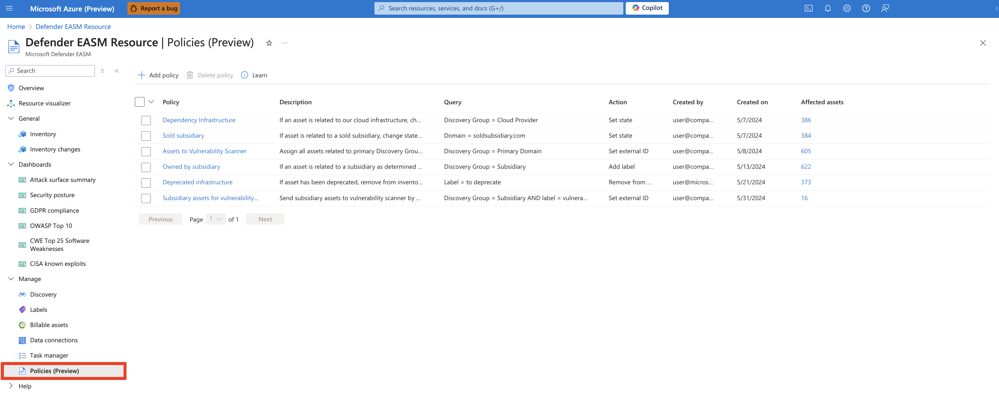
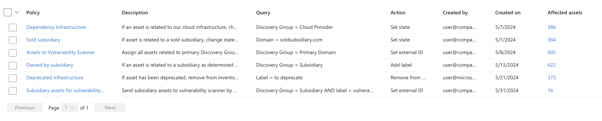
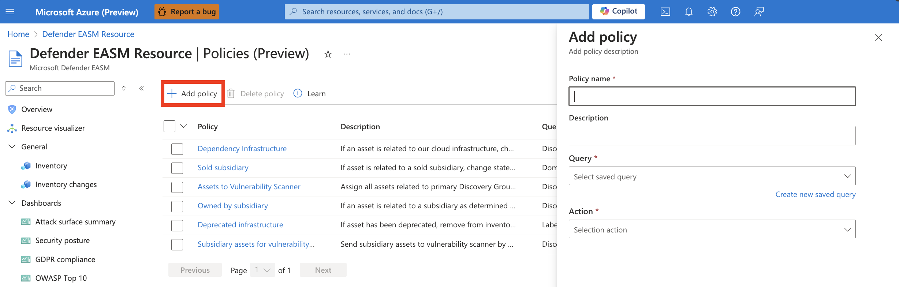

# Policy engine automation
The policy engine enables Defender External Attack Surface Management (Defender EASM) users to automate certain actions based on predetermined parameters. You can elect to label assets or change their states based on highly flexible query parameters to automate the curation of your attack surface.  Once defined, policies run automatically to ensure that your inventory is categorized according to your specific needs on a recurrent basis.  With the policy engine, you can apply business context to your inventory in bulk with minimal manual effort with the following actions:  
- Add or remove labels
- Set an external ID
- Set an asset state
- Remove from inventory  
 
## Accessing and understanding policies
To quickly access policy information, navigate to the dedicated Policies page in your Defender EASM resource. This page can be found under the **Manage** section of the left-hand navigation pane.  

This page displays a list of all active policies in your Defender EASM resource. This list view provides immediate access to key information about each policy, including:  
 - **Policy:** the designated name for the policy.
 - **Description:** the designated description for the policy, providing more context about the configuration and intended business value.
 - **Query:** the underlying quer(ies) that power each policy. Policy actions are applied specifically to assets that match these configured filter parameters.
 - **Action:** a description of the action that takes place when assets match the designated filter parameters. Actions include: add or remove labels, set state, set external ID, and remove from inventory.
 - **Created by:** the email alias of the Defender EASM user who created the policy.
 - **Created on:** the date that the policy was first created.
 - **Affected assets:** a count of all assets that were updated in accordance with the policy. Clicking the numerical count routes you to the inventory list view, filtered to display only the assets that match the underlying quer(ies) that power the policy.

  

## Create a policy

1. Navigate to the Policies page by selecting **Policies** from the **Manage** section of the left-hand navigation pane within your Defender EASM resource.
2. Select **+ Add Policy**. This action opens a right-hand pane to configure the policy.

   

3. Complete the listed fields to create your policy. First provide a name and description that explain the business context for the policy. You can't edit the name of the policy once it is created. While all other fields can be adjusted later, you will need to create a new policy if you wish to change the name.
4. Then select the query that triggers the policy; any assets that match the query parameters are automatically updated with the designated action. For instance, you may want to label all expiring entities (e.g. domains, SSL certificates) with a "needs renewal" label. You can create a saved query that searches for metadata that expires within 30 days or is already expired. You can then designate that the system applies a "needs renewal" label to all applicable assets.  You can either select to power the policy with a previously saved filter, or you can create a new query. All saved queries are visible within the dropdown, or select Create new saved query to configure new filter parameters. If you would like to view the assets that match your query before setting up a policy, it is recommended that you first create a saved query from the Inventory page.
5. Once all fields are configured, select Add to create your policy.

It takes newly created policies up to one week to apply changes to your inventory. Once the changes are implemented, you'll see them reflected in the Change history tab. You will also be able to see the impacted assets when using the Policy name filter on your inventory, and the Policies page lists an accurate count of impacted assets.  Pre-existing policies update any newly applicable assets within 5-7 days of the last run.  
   

## Edit or delete policies
Users can edit policies individually or delete one or more policies simultaneously.  

### Edit policies
To edit a policy, click on the policy name from the list view. This opens a right-hand pane that enables you to edit the policy configuration. Users can't edit the name of their policy, but all other fields are adjustable. Once you make your intended changes, select Update to save the policy.  

### Delete policies
You can delete policies individually or in bulk. From the main Policies page, select the polic(ies) that you’d like to delete by clicking the checkbox next to the policy name. Select “Remove policy” and confirm the removal. Deleting a policy will not revert any previously implemented actions, but it will stop the automated actions from taking place in the future. If you need to make one-time changes to the assets impacted by the policy, you can leverage the same saved query underlying the policy from the Inventory page to revert the changes.    

## Next steps
- [Understanding asset details](understanding-asset-details.md)
- [Understanding dashboards](understanding-dashboards.md)

