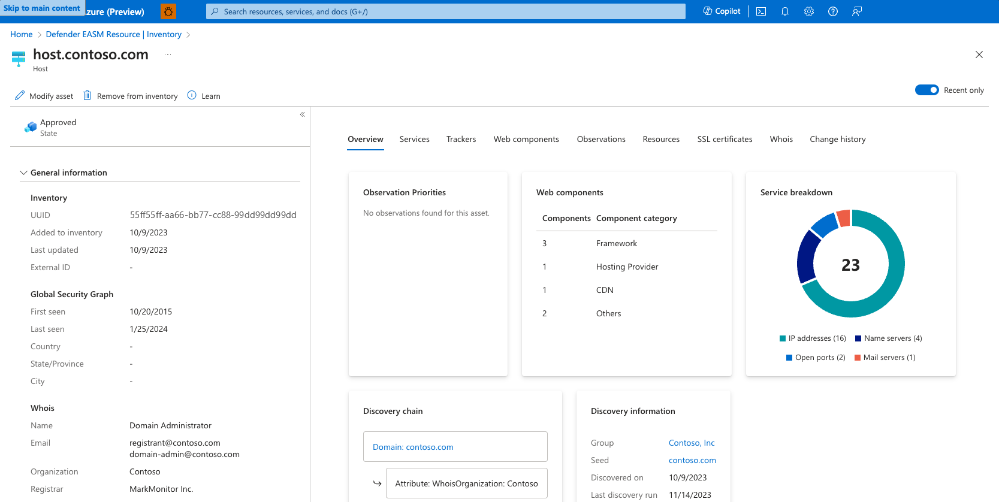

# Understand asset details

Microsoft Defender External Attack Surface Management (Defender EASM) frequently scans all inventory assets and collects robust contextual metadata that powers Attack Surface Insights. This data can also be viewed more granularly on the asset details page. The data that's provided changes depending on the asset type. For instance, the platform provides unique Whois data for domains, hosts, and IP addresses. It provides signature algorithm data for Secure Sockets Layer (SSL) certificates.

This article describes how to view and interpret the expansive data collected by Microsoft for each of your inventory assets. It defines this metadata for each asset type and explains how the insights derived from it can help you manage the security posture of your online infrastructure.

For more information, see [Understanding inventory assets](understanding-inventory-assets.md) to familiarize yourself with the key concepts mentioned in this article.

## Asset details summary view

You can view the asset details page for any asset by selecting its name from your inventory list. On the left pane of this page, you can view an asset summary that provides key information about that particular asset. This section primarily includes data that applies to all asset types, although more fields are available in some cases. For more information on the metadata provided for each asset type in the summary section, see the following chart.

### General information

This section includes high-level information that's key to understanding your assets at a glance. Most of these fields apply to all assets. This section can also include information that's specific to one or more asset types.

| Name | Definition | Asset types |
|--|--|--|
| Asset name | The name of an asset. | All |
| UUID | This 128-bit label represents the universally unique identifier (UUID) for the asset. | All |
| Added to inventory | The date that an asset was added to inventory, whether it was automatically added to the **Approved Inventory** state or it's in another state like **Candidate**.  | All |
| Last updated | The date that a manual user last updated the asset (for example, by making a state change or asset removal).  | All |
| External ID | A manually added External ID value.  | All |
| Status | The status of the asset within the RiskIQ system. Options include **Approved Inventory**, **Candidate**, **Dependencies**, or **Requires Investigation**. | All |
| First seen (Global Security Graph) | The date that Microsoft first scanned the asset and added it to the comprehensive Global Security Graph.  | All |
| Last seen (Global Security Graph) | The date that Microsoft most recently scanned the asset. | All |
| Discovered on | Indicates the creation date of the discovery group that detected the asset.  | All |
| Country | The country of origin detected for this asset. | All |
| State/Province | The state or province of origin detected for this asset. | All |
| City | The city of origin detected for this asset. | All |
| Whois name | The name associated with a Whois record. | Host |
| Whois email | The primary contact email in a Whois record. | Host |
| Whois organization | The listed organization in a Whois record. | Host |
| Whois registrar | The listed registrar in a Whois record. | Host |
| Whois name servers | The listed name servers in a Whois record. | Host |
| Certificate issued | The date when a certificate was issued. | SSL certificate |
| Certificate expires | The date when a certificate expires. | SSL certificate |
| Serial number | The serial number associated with an SSL certificate. | SSL certificate |
| SSL version | The version of SSL that the certificate was registered. | SSL certificate |
| Certificate key algorithm | The key algorithm used to encrypt the SSL certificate. | SSL certificate |
| Certificate key size | The number of bits in an SSL certificate key. | SSL certificate |
| Signature algorithm OID | The OID that identifies the hash algorithm used to sign the certificate request. | SSL certificate |
| Self-signed | Indicates whether the SSL certificate was self-signed.| SSL certificate |

### Network

The following IP address information provides more context about the use of the IP.

| Name | Definition | Asset types |
|--|--|--|
| Name server record | Any name servers detected on the asset. | IP address |
| Mail server record | Any mail servers detected on the asset. | IP address |
| IP blocks | The IP block that contains the IP address asset. | IP address |
| ASNs | The ASN associated with an asset. | IP address |

### Block information

The following data is specific to IP blocks and provides contextual information about its use.

| Name | Definition | Asset types |
|--|--|--|
| CIDR | The Classless Inter-Domain Routing (CIDR) for an IP block. | IP block |
| Network name | The network name associated to the IP block. | IP block |
| Organization name | The organization name found in the registration information for the IP block. | IP block |
| Org ID | The organization ID found in the registration information for the IP block. | IP block |
| ASNs | The ASN associated with the IP block. | IP block |
| Country | The country of origin as detected in the Whois registration information for the IP block. | IP block |

### Subject

The following data is specific to the subject (that is, the protected entity) associated with an SSL certificate.

| Name | Definition | Asset types |
|--|--|--|
| Common name | The Issuer Common Name of the subject of the SSL certificate. | SSL certificate |
| Alternate names | Any alternative common names for the subject of the SSL certificate.| SSL certificate |
| Organization name | The organization linked to the subject of the SSL certificate. | SSL certificate |
| Organization unit | Optional metadata that indicates the department within an organization that's responsible for the certificate. | SSL certificate |
| Locality | Denotes the city where the organization is located. | SSL certificate |
| Country | Denotes the country where the organization is located. | SSL certificate |
| State/Province | Denotes the state or province where the organization is located. | SSL certificate |

### Issuer

The following data is specific to the issuer of an SSL certificate.

| Name | Definition | Asset types |
|--|--|--|
| Common name | The common name of the issuer of the certificate. | SSL certificate |
| Alternate names | Any other names of the issuer. | SSL certificate |
| Organization name | The name of the organization that orchestrated the issue of a certificate. | SSL certificate |
| Organization unit | Other information about the organization that issued the certificate. | SSL certificate |

## Data tabs

On the rightmost pane of the asset details page, users can access more expansive data related to the selected asset. This data is organized in a series of categorized tabs. The available metadata tabs change depending on the type of asset you're viewing.

### Overview

The **Overview** tab provides more context to ensure that significant insights are quickly identifiable when you view the details of an asset. This section includes key discovery data for all asset types. It provides insight about how Microsoft maps the asset to your known infrastructure.

This section can also include dashboard widgets that visualize insights that are relevant to the asset type in question.

### Discovery chain

The discovery chain outlines the observed connections between a discovery seed and the asset. This information helps users visualize these connections and better understand why an asset was determined to belong to their organization.

In the example, you can see that the seed domain is tied to this asset through the contact email in its Whois record. That same contact email was used to register the IP block that includes this particular IP address asset.

### Discovery information

This section provides information about the process that's used to detect the asset. It includes information about the discovery seed that connects to the asset and the approval process.

Options include:
- **Approved inventory**: This option indicates the relationship between the seed and discovered asset was strong enough to warrant an automatic approval by the Defender EASM system. 
- **Candidate**: This option indicates that the asset required manual approval to be incorporated into your inventory.
- **Last discovery run**: This date indicates when the discovery group that initially detected the asset was last utilized for a discovery scan.

### IP reputation

The **IP reputation** tab displays a list of potential threats related to a given IP address. This section outlines any detected malicious or suspicious activity that relates to the IP address. This information is key to understanding the trustworthiness of your own attack surface. These threats can help organizations uncover past or present vulnerabilities in their infrastructure.

The Defender EASM IP reputation data displays instances when the IP address was detected on a threat list. For instance, the recent detection in the following example shows that the IP address relates to a host known to be running a cryptocurrency miner. This data was derived from a suspicious host list supplied by CoinBlockers. Results are organized by the **Last seen** date to show the most relevant detections first.

In this example, the IP address is present on an abnormally high number of threat feeds. This information indicates that the asset should be thoroughly investigated to prevent malicious activity in the future.

### Services

The **Services** tab is available for IP address, domain, and host assets. This section provides information on services observed to be running on the asset. It includes IP addresses, name and mail servers, and open ports that correspond with other types of infrastructure (for example, remote access services).

Defender EASM's services data is key to understanding the infrastructure that powers your asset. It can also alert you to resources that are exposed on the open internet that should be protected.

### IP addresses

This section provides insight on any IP addresses that are running on the asset's infrastructure. On the **Services** tab, Defender EASM provides the name of the IP address and the **First seen** and **Last seen** dates. The **Recent** column indicates whether the IP address was observed during the most recent scan of the asset. If there's no checkbox in this column, the IP address was seen in prior scans, but it isn't currently running on the asset.

### Mail servers

This section provides a list of any mail servers that are running on the asset. This information indicates that the asset is capable of sending emails. In this section, Defender EASM provides the name of the mail server and the **First seen** and **Last seen** dates. The **Recent** column indicates whether the mail server was detected during the most recent scan of the asset.

### Name servers

This section displays any name servers that are running on the asset to provide resolution for a host. In this section, Defender EASM provides the name of the mail server and the **First seen** and **Last seen** dates. The **Recent** column indicates whether the name server was detected during the most recent scan of the asset.

### Open ports

This section lists any open ports detected on the asset. Microsoft regularly scans around 230 distinct ports. This data is useful to identify any unsecured services that shouldn't be accessible from the open internet. These services include databases, IoT devices, and network services like routers and switches. It's also helpful in identifying shadow IT infrastructure or insecure remote access services.

In this section, Defender EASM provides the open port number, a description of the port, the last state it was observed in, and the **First seen** and **Last seen** dates. The **Recent** column indicates whether the port was observed as open during the most recent scan.

### Trackers

Trackers are unique codes or values found within webpages and often are used to track user interaction. These codes can be used to correlate a disparate group of websites to a central entity. Microsoft's tracker dataset includes IDs from providers like Google, Yandex, Mixpanel, New Relic, and Clicky and it continues to grow.

In this section, Defender EASM provides the tracker type (for example, GoogleAnalyticsID), the unique identifier value, and the **First seen** and **Last seen** dates.

### Web components

Web components are details that describe the infrastructure of an asset as observed through a Microsoft scan. These components provide a high-level understanding of the technologies used on the asset. Microsoft categorizes the specific components and includes version numbers when possible.

The **Web components** section provides the category, name, and version of the component and a list of any applicable CVEs that should be remediated. Defender EASM also provides **First seen** and **Last seen** date columns and a **Recent** column. A checked box indicates that this infrastructure was observed during the most recent scan of the asset.

Web components are categorized based on their function.

| Web component | Examples |
|--|--|
| Hosting Provider | hostingprovider.com |
| Server | Apache |
| DNS Server | ISC BIND |
| Data stores | MySQL, ElasticSearch, MongoDB |
| Remote access | OpenSSH, Microsoft Admin Center, Netscaler Gateway |
| Data Exchange | Pure-FTPd |
| Internet of things (IoT) | HP Deskjet, Linksys Camera, Sonos |
| Email server | ArmorX, Lotus Domino, Symantec Messaging Gateway |
| Network device | Cisco Router, Motorola WAP, ZyXEL Modem |
| Building control | Linear eMerge, ASI Controls Weblink, Optergy |

### Observation

The **Observation** tab displays any insights from the Attack Surface Priorities dashboard that pertain to the asset. These priorities can include:

- Critical CVEs.
- Known associations to compromised infrastructure.
- Use of deprecated technology.
- Infrastructure best-practice violations.
- Compliance issues.

For more information on observations, see [Understanding dashboards](understanding-dashboards.md). For each observation, Defender EASM provides the name of the observation, categorizes it by type, assigns a priority, and lists both CVSS v2 and v3 scores where applicable.

### Resources

The **Resources** tab provides insight on any JavaScript resources running on any page or host assets. When applicable to a host, these resources are aggregated to represent the JavaScript running on all pages on that host. This section provides an inventory of the JavaScript detected on each asset so that your organization has full visibility into these resources and can detect any changes.

Defender EASM provides the resource URL, resource host, MD5 value, and first-seen and last-seen dates to help organizations effectively monitor the use of JavaScript resources across their inventory.

### SSL certificates

Certificates are used to secure communications between a browser and a web server via SSL. use of certificates ensures that sensitive data in transit can't be read, tampered with, or forged. This section of Defender EASM lists any SSL certificates detected on the asset, including key data like the issue and expiry dates.

### Whois

The Whois protocol is used to query and respond to the databases that store data related to the registration and ownership of internet resources. Whois contains key registration data that can apply to domains, hosts, IP addresses, and IP blocks in Defender EASM. On the **Whois** data tab, Microsoft provides a robust amount of information associated with the registry of the asset.

The following fields are included in the table in the **Values** section on the **Whois** tab.

| Field | Description |
|--|--|
| Whois server | A server set up by an ICANN-accredited registrar to acquire up-to-date information about entities that are registered with it. |
| Registrar | The company whose service was used to register an asset. Popular registrars include GoDaddy, Namecheap, and HostGator. |
| Domain status | Any status for a domain as set by the registry. These statuses can indicate that a domain is pending delete or transfer by the registrar or is active on the internet. This field can also denote the limitations of an asset. For example, **Client delete prohibited** indicates that the registrar is unable to delete the asset. |
| Email | Any contact email addresses provided by the registrant. Whois allows registrants to specify the contact type. Options include administrative, technical, registrant, and registrar contacts. |
| Name | The name of a registrant, if provided. |
| Organization | The organization responsible for the registered entity. |
| Street | The street address for the registrant, if provided.|
| City | The city listed in the street address for the registrant, if provided. |
| State | The state listed in the street address for the registrant, if provided. |
| Postal code | The postal code listed in the street address for the registrant, if provided. |
| Country | The country listed in the street address for the registrant, if provided. |
| Phone | The phone number associated with a registrant contact, if provided. |
| Name servers | Any name servers associated with the registered entity. |

Many organizations opt to obfuscate their registry information. Sometimes contact email addresses end in *@anonymised.email*. This placeholder is used instead of a real contact address. Many fields are optional during registration configuration, so any field with an empty value wasn't included by the registrant.

## Next steps

- [Understand dashboards](understanding-dashboards.md)
- [Use and manage discovery](using-and-managing-discovery.md)
