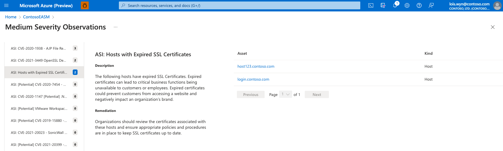

# Understanding dashboards

Microsoft Defender External Attack Surface Management (Defender EASM) offers a series of four dashboards designed to help users quickly surface valuable insights derived from their Approved inventory. These dashboards help organizations prioritize the vulnerabilities, risks and compliance issues that pose the greatest threat to their Attack Surface, making it easy to quickly mitigate key issues.

Defender EASM provides five dashboards:

- **Overview**: this dashboard is the default landing page when you access Defender EASM. It provides the key context that can help you familiarize yourself with your attack surface. 
- **Attack surface summary**: this dashboard summarizes the key observations derived from your inventory. It provides a high-level overview of your Attack Surface and the asset types that comprise it, and surfaces potential vulnerabilities by severity (high, medium, low). This dashboard also provides key context on the infrastructure that comprises your Attack Surface, providing insight into cloud hosting, sensitive services, SSL certificate and domain expiry, and IP reputation.
- **Security posture**: this dashboard helps organizations understand the maturity and complexity of their security program based on the metadata derived from assets in your Approved inventory. It is comprised of technical and non-technical policies, processes and controls that mitigate risk of external threats. This dashboard provides insight on CVE exposure, domain administration and configuration, hosting and networking, open ports, and SSL certificate configuration.
- **GDPR compliance**: this dashboard surfaces key areas of compliance risk based on the General Data Protection Regulation (GDPR) requirements for online infrastructure that’s accessible to European nations. This dashboard provides insight on the status of your websites, SSL certificate issues, exposed personal identifiable information (PII), login protocols, and cookie compliance.
- **OWASP Top 10**: this dashboard surfaces any assets that are vulnerable according to OWASP’s list of the most critical web application security risks. On this dashboard, organizations can quickly identify assets with broken access control, cryptographic failures, injections, insecure designs, security misconfigurations and other critical risks as defined by OWASP.

## Accessing dashboards

To access your Defender EASM dashboards, first navigate to your Defender EASM instance. In the left-hand navigation column, select the dashboard you’d like to view. You can access these dashboards from many pages in your Defender EASM instance from this navigation pane.

## Downloading chart data 

The data underlying any dashboard chart can be exported to a CSV file.  This is useful for those who wish to import Defender EASM data into third party tools, or work off a CSV file when remediating any issues.  To download chart data, first select the specific chart segment that contains the data you wish to download. Note that chart exports currently support individual chart segments; to download multiple segments from the same chart, you will need to export each individual segment. 

Selecting an individual chart segment will open a drilldown view of the data, listing any assets that comprise the segment count. At the top of this page, select **Download CSV report** to begin your export. If you are exporting a small number of assets, this action will directly download the CSV file to your machine. If you are exporting a large number of assets, this action will create a task manager notification where you can track the status of your export. 

Microsoft Excel enforces a character limit of 32,767 characters per cell. Some fields, like the "Last banner" column, may be improperly displayed due to this limitation. If you encounter an issue, try opening the file in another program that supports CSV files. 

## Attack surface summary

The Attack Surface summary dashboard is designed to provide a high-level summary of the composition of your Attack Surface, surfacing the key observations that should be addressed to improve your security posture. This dashboard identifies and prioritizes risks within an organization's assets by High, Medium, and Low severity and enables users to drill down into each section, accessing the list of impacted assets. Additionally, the dashboard reveals key details about your Attack Surface composition, cloud infrastructure, sensitive services, SSL and domain expiry timelines, and IP reputation.

Microsoft identifies organizations' attack surfaces through proprietary technology that discovers Internet-facing assets that belong to an organization based on infrastructure connections to some set of initially known assets. Data in the dashboard is updated daily based on new observations.

### Attack surface priorities

At the top of this dashboard, Defender EASM provides a list of security priorities organized by severity (high, medium, low). Large organizations’ attack surfaces can be incredibly broad, so prioritizing the key findings derived from our expansive data helps users quickly and efficiently address the most important exposed elements of their attack surface. These priorities can include critical CVEs, known associations to compromised infrastructure, use of deprecated technology, infrastructure best practice violations, or compliance issues.

Insight Priorities are determined by Microsoft’s assessment of the potential impact of each insight. For instance, high severity insights may include vulnerabilities that are new, exploited frequently, particularly damaging, or easily exploited by hackers with a lower skill level. Low severity insights may include use of deprecated technology that is no longer supported, infrastructure that will soon expire, or compliance issues that do not align with security best practices. Each insight contains suggested remediation actions to protect against potential exploits.

Insights that were recently added to the Defender EASM platform will be flagged with a "NEW" label on this dashboard. When we add new insights that impact assets in your Confirmed Inventory, the system will also deliver a push notification that routes you to a detailed view of this new insight with a list of the impacted assets. 

Some insights will be flagged with "Potential" in the title. A "Potential" insight occurs when Defender EASM is unable to confirm that an asset is impacted by a vulnerability. This is common when our scanning system detects the presence of a specific service but cannot detect the version number; for example, some services enable administrators to hide version information. Vulnerabilities are often associated with specific versions of the software, so manual investigation is required to determine whether the asset is impacted. Other vulnerabilities can be remediated by steps that Defender EASM is unable to detect. For instance, users can make recommended changes to service configurations or run backported patches. If an insight is prefaced with "Potential", the system has reason to believe that the asset is impacted by the vulnerability but is unable to confirm it for one of the above listed reasons. To manually investigate, please click the insight name to review remediation guidance that can help you determine whether your assets are impacted.

A user will usually decide to first investigate any High Severity Observations. You can click the top-listed observation to be directly routed to a list of impacted assets, or instead select “View All __ Insights” to see a comprehensive, expandable list of all potential observations within that severity group.

The Observations page features a list of all potential insights in the left-hand column. This list is sorted by the number of assets that are impacted by each security risk, displaying the issues that impact the greatest number of assets first. To view the details of any security risk, simply click on it from this list. 

This detailed view for any observation will include the title of the issue, a description, and remediation guidance from the Defender EASM team. In this example, the description explains how expired SSL certificates can lead to critical business functions becoming unavailable, preventing customers or employees from accessing web content and thus damaging your organization’s brand. The Remediation section provides advice on how to swiftly fix the issue; in this example, Microsoft recommends that you review the certificates associated with the impacted host assets, update the coinciding SSL certificate(s), and update your internal procedures to ensure that SSL certificates are updated in a timely manner.

Finally, the Asset section lists any entities that have been impacted by this specific security concern. In this example, a user will want to investigate the impacted assets to learn more about the expired SSL Certificate. You can click on any asset name from this list to view the Asset Details page.

From the Asset Details page, we’ll then click on the “SSL certificates” tab to view more information about the expired certificate. In this example, the listed certificate shows an “Expires” date in the past, indicating that the certificate is currently expired and therefore likely inactive. This section also provides the name of the SSL certificate which you can then send to the appropriate team within your organization for swift remediation.

### Attack surface composition

The following section provides a high-level summary of the composition of your Attack Surface. This chart provides counts of each asset type, helping users understand how their infrastructure is spread across domains, hosts, pages, SSL certificates, ASNs, IP blocks, IP addresses and email contacts.

Each value is clickable, routing users to their inventory list filtered to display only assets of the designated type. From this page, you can click on any asset to view more details, or you can add additional filters to narrow down the list according to your needs.

### Securing the cloud

This section of the Attack Surface Summary dashboard provides insight on the cloud technologies used across your infrastructure. As most organizations adapt to the cloud gradually, the hybrid nature of your online infrastructure can be difficult to monitor and manage. Defender EASM helps organizations understand the usage of specific cloud technologies across your Attack Surface, mapping cloud host providers to your confirmed assets to inform your cloud adoption program and ensure compliance with your organizations process.

For instance, your organization may have recently decided to migrate all cloud infrastructure to a single provider to simplify and consolidate their Attack Surface. This chart can help you identify assets that still need to be migrated. Each bar of the chart is clickable, routing users to a filtered list that displays the assets that comprise the chart value.

### Sensitive services

This section displays sensitive services detected on your Attack Surface that should be assessed and potentially adjusted to ensure the security of your organization. This chart highlights any services that have historically been vulnerable to attack or are common vectors of information leakage to malicious actors. Any assets in this section should be investigated, and Microsoft recommends that organizations consider alternative services with a better security posture to mitigate risk.

The chart is organized by the name of each service; clicking on any individual bar will return a list of assets that are running that particular service. The chart below is empty, indicating that the organization is not currently running any services that are especially susceptible to attack.

### SSL and domain expirations

These two expiration charts display upcoming SSL Certificate and Domain expirations, ensuring that an organization has ample visibility into upcoming renewals of key infrastructure. An expired domain can suddenly make key content inaccessible, and the domain could even be swiftly purchased by a malicious actor who intends to target your organization. An expired SSL Certificate leaves corresponding assets susceptible to attack.

Both charts are organized by the expiration timeframe, ranging from “greater than 90 days” to already expired. Microsoft recommends that organizations immediately renew any expired SSL certificates or domains, and proactively arrange the renewal of assets due to expire in 30-60 days.

### IP reputation

IP reputation data helps users understand the trustworthiness of your attack surface and identifying potentially compromised hosts. Microsoft develops IP reputation scores based on our proprietary data as well as IP information collected from external sources. We recommend further investigation of any IP addresses identified here, as a suspicious or malicious score associated with an owned asset indicates that the asset is susceptible to attack or has already been leveraged by malicious actors.

This chart is organized by the detection policy that triggered a negative reputation score. For instance, the DDOS value indicates that the IP address has been involved in a Distributed Denial-Of-Service attack. Users can click on any bar value to access a list of assets that comprise it. In the example below, the chart is empty which indicates all IP addresses in your inventory have satisfactory reputation scores.

## Security posture dashboard

The Security Posture dashboard helps organizations measure the maturity of their security program based on the status of assets in your Confirmed Inventory. It is comprised of technical and non-technical policies, processes and controls that mitigate the risk of external threats. This dashboard provides insight on CVE exposure, domain administration and configuration, hosting and networking, open ports, and SSL certificate configuration.

### CVE exposure

The first chart in the Security Posture dashboard relates to the management of an organization’s website portfolio. Microsoft analyzes website components such as frameworks, server software, and 3rd party plugins and then matches them to a current list of Common Vulnerability Exposures (CVEs) to identify vulnerability risks to your organization. The web components that comprise each website are inspected daily to ensure recency and accuracy.

It is recommended that users immediately address any CVE-related vulnerabilities, mitigating risk by updating your web components or following the remediation guidance for each CVE. Each bar on the chart is clickable, displaying a list of any impacted assets.

### Domains administration

This chart provides insight on how an organization manages their domains. Companies with a decentralized domain portfolio management program are susceptible to unnecessary threats, including domain hijacking, domain shadowing, email spoofing, phishing, and illegal domain transfers. A cohesive domain registration process mitigates this risk. For instance, organizations should use the same registrars and registrant contact information for their domains to ensure that all domains are mappable to the same entities. This helps ensure that domains don’t slip through the cracks as you update and maintain them.

Each bar of the chart is clickable, routing to a list of all assets that comprise the value.

### Hosting and networking

This chart provides insight on the security posture related to where an organization’s hosts are located. Risk associated with ownership of Autonomous systems depends on the size, maturity of an organization’s IT department.

Each bar of the chart is clickable, routing to a list of all assets that comprise the value.

### Domains configuration

This section helps organizations understand the configuration of their domain names, surfacing any domains that may be susceptible to unnecessary risk. Extensible Provisioning Protocol (EPP) domain status codes indicate the status of a domain name registration. All domains have at least one code, although multiple codes can apply to a single domain. This section is useful to understanding the policies in place to manage your domains, or missing policies that leave domains vulnerable.

For instance, the “clientUpdateProhibited” status code prevents unauthorized updates to your domain name; an organization must contact their registrar to lift this code and make any updates. The chart below searches for domain assets that do not have this status code, indicating that the domain is currently open to updates which can potentially result in fraud. Users should click any bar on this chart to view a list of assets that do not have the appropriate status codes applied to them so they can update their domain configurations accordingly.

### Open Ports

This section helps users understand how their IP space is managed, detecting services that are exposed on the open internet. Attackers commonly scan ports across the internet to look for known exploits related to service vulnerabilities or misconfigurations. Microsoft identifies these open ports to complement vulnerability assessment tools, flagging observations for review to ensure they are properly managed by your information technology team.

By performing basic TCP SYN/ACK scans across all open ports on the addresses in an IP space, Microsoft detects ports that may need to be restricted from direct access to the open internet. Examples include databases, DNS servers, IoT devices, routers and switches. This data can also be used to detect shadow IT assets or insecure remote access services. All bars on this chart are clickable, opening a list of assets that comprise the value so your organization can investigate the open port in question and remediate any risk.

### SSL configuration and organization

The SSL configuration and organization charts display common SSL-related issues that may impact functions of your online infrastructure.

For instance, the SSL configuration chart displays any detected configuration issues that can disrupt your online services. This includes expired SSL certificates and certificates using outdated signature algorithms like SHA1 and MD5, resulting in unnecessary security risk to your organization.

The SSL organization chart provides insight on the registration of your SSL certificates, indicating the organization and business units associated with each certificate. This can help users understand the designated ownership of these certificates; it is recommended that companies consolidate their organization and unit list when possible to help ensure proper management moving forward.

## GDPR compliance dashboard

The GDPR compliance dashboard presents an analysis of assets in your Confirmed Inventory as they relate to the requirements outlined in General Data Protection Regulation (GDPR). GDPR is a regulation in European Union (EU) law that enforces data protection and privacy standards for any online entities accessible to the EU. These regulations have become a model for similar laws outside of the EU, so it serves as an excellent guide on how to handle data privacy worldwide.

This dashboard analyzes an organization’s public-facing web properties to surface any assets that are potentially non-compliant with GDPR.

### Websites by status

This chart organizes your website assets by HTTP response status code. These codes indicate whether a specific HTTP request has been successfully completed or provides context as to why the site is inaccessible. HTTP codes can also alert you of redirects, server error responses, and client errors. The HTTP response “451” indicates that a website is unavailable for legal reasons. This may indicate that a site has been blocked for people in the EU because it does not comply with GDPR.

This chart organizes your websites by status code. Options include Active, Inactive, Requires Authorization, Broken, and Browser Error; users can click any component on the bar graph to view a comprehensive list of assets that comprise the value.

### Live sites with cert issues

This chart displays pages that are actively serving content and present users with a warning that the site is insecure. The user must manually accept the warning to view the content on these pages. This can occur for a variety of reasons; this chart organizes results by the specific reason for easy mitigation. Options include broken certificates, active certificate issues, requires authorization and browser certificate errors.

### SSL certificate expiration

This chart displays upcoming SSL Certificate expirations, ensuring that an organization has ample visibility into any upcoming renewals. An expired SSL Certificate leaves corresponding assets susceptible to attack and can make the content of a page inaccessible to the internet.

This chart is organized by the detected expiry window, ranging from already expired to expiring in over 90 days. Users can click any component in the bar graph to access a list of applicable assets, making it easy to send a list of certificate names to your IT Department for remediation. 

### Sites by certificate posture

This section analysis the signature algorithms that power an SSL certificate. SSL certificates can be secured with a variety of cryptographic algorithms; certain newer algorithms are considered more reputable and secure than older algorithms, so companies are advised to retire older algorithms like SHA-1.

Users can click any segment of the pie chart to view a list of assets that comprise the selected value. SHA256 is considered secure, whereas organizations should update any certificates using the SHA1 algorithm.

### Live PII sites by protocol 

The protection of personal identifiable information (PII) is a critical component to the General Data Protection Regulation. PII is defined as any data that can identify an individual, including names, addresses, birthdays, or email addresses. Any website that accepts this data through a form must be thoroughly secured according to GDPR guidelines. By analyzing the Document Object Model (DOM) of your pages, Microsoft identifies forms and login pages that may accept PII and should therefore be assessed according to European Union law. The first chart in this section displays live sites by protocol, identifying sites using HTTP versus HTTPS protocols. 

### Live PII sites by certificate posture

This chart displays live PII sites by their usage of SSL certificates. By referencing this chart, you can quickly understand the hashing algorithms used across your sites that contain personal identifiable information. 

### Login websites by protcol 

A login page is a page on a website where a user has the option to enter a username and password to gain access to services hosted on that site. Login pages have specific requirements under GDPR, so Defender EASM references the DOM of all scanned pages to search for code that correlates to a login. For instance, login pages must be secure to be compliant. This first chart displays Login websites by protocol (HTTP or HTTPS) and the second by certificate posture. 

### Cookie posture

A cookie is information in the form of a very small text file that is placed on the hard drive of the computer running a web browser when browsing a site. Each time a website is visited, the browser sends the cookie back to the server to notify the website of your previous activity. GDPR has specific requirements for obtaining consent to issue a cookie, and different storage regulations for first- versus third-party cookies.

## OWASP top 10 dashboard

The OWASP Top 10 dashboard is designed to provide insight on the most critical security recommendations as designated by OWASP, a reputable open-source foundation for web application security. This list is globally recognized as a critical resource for developers who want to ensure their code is secure. OWASP provides key information about their top 10 security risks, as well as guidance on how to avoid or remediate the issue. This Defender EASM dashboard looks for evidence of these security risks within your Attack Surface and surfaces them, listing any applicable assets and how to remediate the risk.

The current OWASP Top 10 Critical Securities list includes:

1. **Broken access control**: the failure of access control infrastructure that enforces policies such that users cannot act outside of their intended permissions.
2. **Cryptographic failure**: failures related to cryptography (or lack thereof) which often lead to the exposure of sensitive data.
3. **Injection**: applications vulnerable to injection attacks due to improper handling of data and other compliance-related issues.
4. **Insecure design**: missing or ineffective security measures that result in weaknesses to your application.
5. **Security misconfiguration**: missing or incorrect security configurations that are often the result of insufficiently defined configuration process.
6. **Vulnerable and outdated components**: outdated components that run the risk of added exposures in comparison to up-to-date software.
7. **Identification and authentication failures**: failure to properly confirm a user’s identity, authentication or session management to protect against authentication-related attacks.
8. **Software and data integrity failures**: code and infrastructure that does not protect against integrity violations, such as plugins from untrusted sources.
9. **Security logging and monitoring**: lack of proper security logging and alerting, or related misconfigurations, that can impact an organization’s visibility and subsequent accountability over their security posture.
10. **Server-side request forgery**: web applications that fetch a remote resource without validating the user-supplied URL.

This dashboard provides a description of each critical risk, information on why it matters, and remediation guidance alongside a list of any assets that are potentially impacted. For more information, see the [OWASP website](https://owasp.org/www-project-top-ten/).

## Next Steps

- [Understanding asset details](understanding-asset-details.md)
- [Using and managing discovery](using-and-managing-discovery.md)
