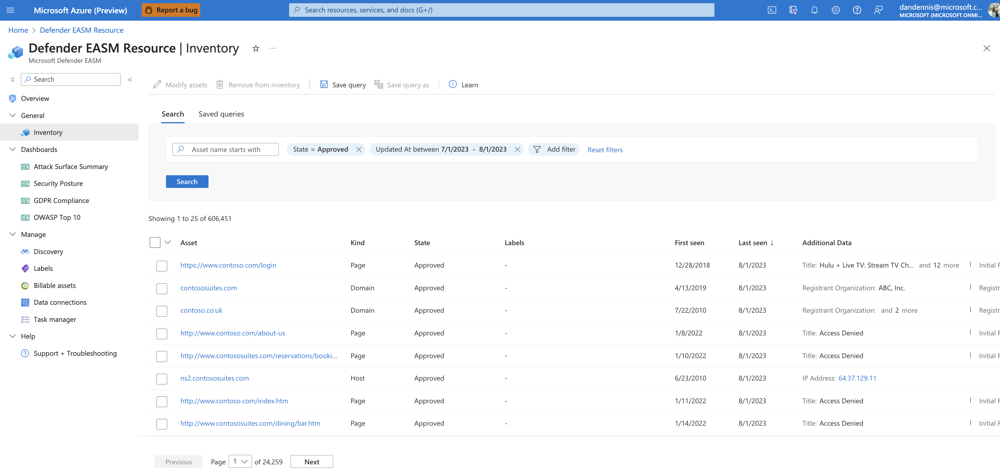

# Understanding inventory assets

## Overview

Microsoft's proprietary discovery technology recursively searches for infrastructure with observed connections to known legitimate assets (e.g. discovery "seeds") to make inferences about that infrastructure's relationship to the organization and uncover previously unknown and unmonitored properties.

Defender EASM includes the discovery of the following kinds of assets:

- Domains
- Hosts
- Pages
- IP Blocks
- IP Addresses
- Autonomous System Numbers (ASNs)
- SSL Certificates
- WHOIS Contacts

These asset types comprise your attack surface inventory in Defender EASM. This solution discovers externally facing assets that are exposed to the open internet outside of traditional firewall protection; they need to be monitored and maintained to minimize risk and improve an organization’s security posture. Microsoft Defender External Attack Surface Management (Defender EASM) actively discovers and monitors these assets, then surfacing key insights that help customers efficiently address any vulnerabilities to their organization.

## Asset states

All assets are labeled as one of the following states:

| State name | Description |
|--|--|
| Approved Inventory | A part of your owned attack surface; an item that you are directly responsible for. |
| Dependency | Infrastructure that is owned by a third party but is part of your attack surface because it directly supports the operation of your owned assets. For example, you might depend on an IT provider to host your web content. While the domain, hostname, and pages would be part of your “Approved Inventory,” you may wish to treat the IP Address running the host as a “Dependency.” |
| Monitor Only | An asset that is relevant to your attack surface but is neither directly controlled nor a technical dependency. For example, independent franchisees or assets belonging to related companies might be labeled as “Monitor Only” rather than “Approved Inventory” to separate the groups for reporting purposes. |
| Candidate | An asset that has some relationship to your organization's known seed assets but does not have a strong enough connection to immediately label it as “Approved Inventory.” These candidate assets must be manually reviewed to determine ownership. |
| Requires Investigation | A state similar to the “Candidate” states, but this value is applied to assets that require manual investigation to validate. This is determined based on our internally generated confidence scores that assess the strength of detected connections between assets. It does not indicate the infrastructure's exact relationship to the organization as much as it denotes that this asset has been flagged as requiring additional review to determine how it should be categorized. |

## Handling of different asset states

These asset states are uniquely processed and monitored to ensure that customers have clear visibility into the most critical assets by default. For instance, “Approved Inventory” assets are always represented in dashboard charts and are scanned daily to ensure data recency. All other kinds of assets are not included in dashboard charts by default; however, users can adjust their inventory filters to view assets in different states as needed. Similarly, "Candidate” assets are only scanned during the discovery process; it’s important to review these assets and change their state to “Approved Inventory” if they are owned by your organization.

## Next steps

- [Deploying the EASM Azure resource](deploying-the-defender-easm-azure-resource.md)
- [Understanding asset details](understanding-asset-details.md)
- [Using and managing discovery](using-and-managing-discovery.md)
