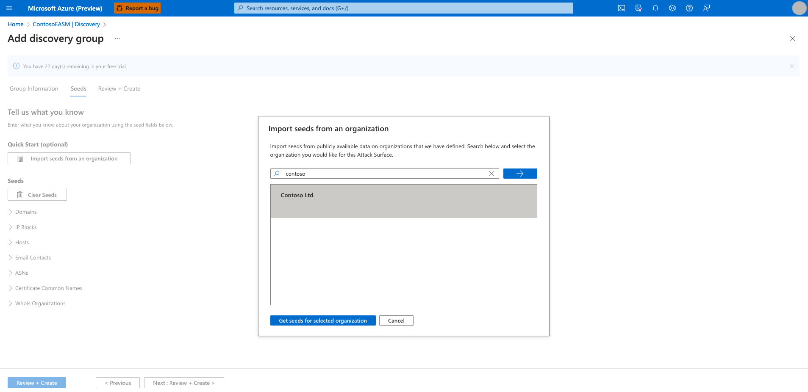
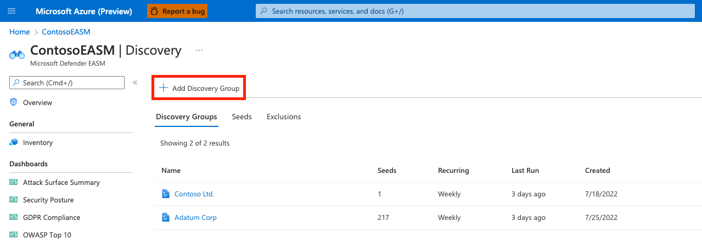
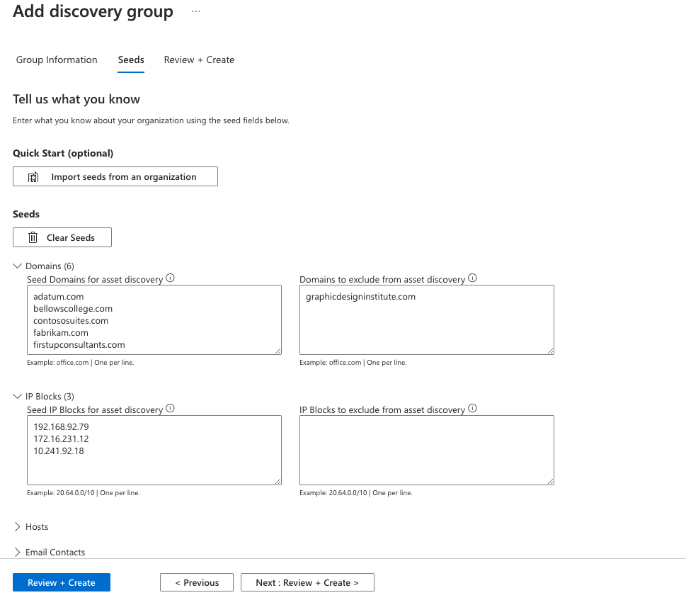
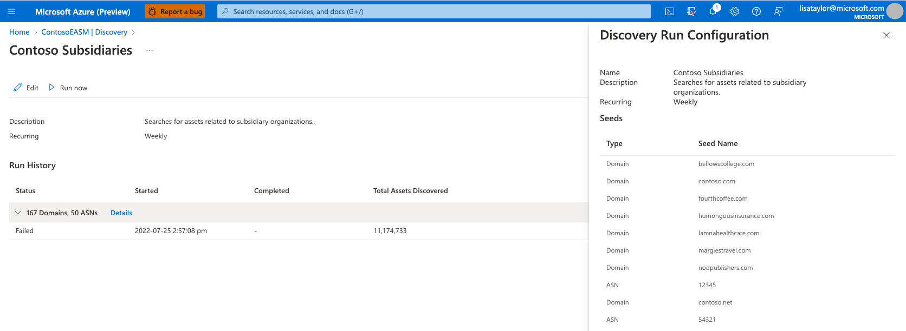
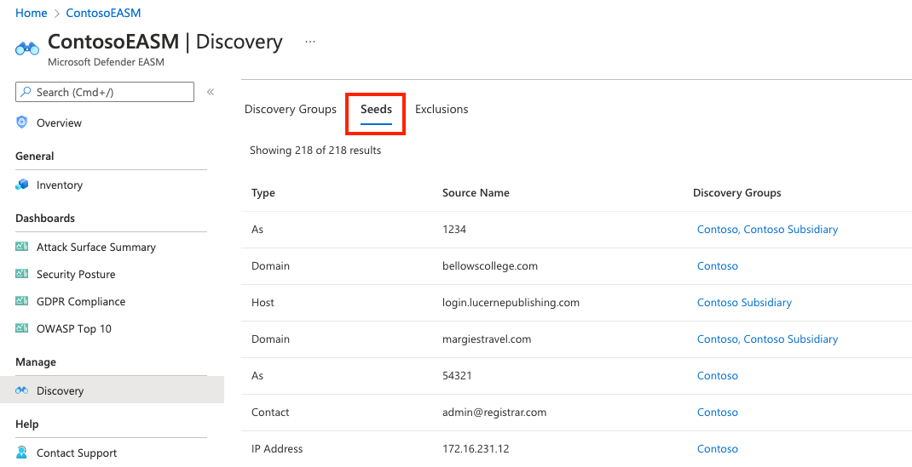

# Use and manage discovery

Microsoft Defender External Attack Surface Management (Defender EASM) relies on proprietary discovery technology to continuously define your organization's unique internet-exposed attack surface. Discovery scans the internet for assets owned by your organization to uncover previously unknown and unmonitored properties.

Discovered assets are indexed in your inventory to provide a dynamic system of record of web applications, third-party dependencies, and web infrastructure under your organization's management through a single pane of glass.

Before you run a custom discovery, see [What is discovery?](what-is-discovery.md) to understand the key concepts discussed here.

## Access your automated attack surface

Microsoft has preemptively configured the attack surfaces of many organizations, mapping their initial attack surface by discovering infrastructure that's connected to known assets.

We recommend that you search for your organization's attack surface before you create a custom attack surface and run other discoveries. This process enables you to quickly access your inventory as Defender EASM refreshes the data and adds more assets and recent context to your attack surface.

When you first access your Defender EASM instance, select **Getting Started** in the **General** section to search for your organization in the list of automated attack surfaces. Then choose your organization from the list and select **Build my Attack Surface**.

At this point, the discovery runs in the background. If you selected a preconfigured attack surface from the list of available organizations, you're redirected to the dashboard overview screen where you can view insights into your organization's infrastructure in Preview mode.

Review these dashboard insights to become familiar with your attack surface as you wait for more assets to be discovered and populated in your inventory. For more information on how to derive insights from these dashboards, see [Understand dashboards](understanding-dashboards.md).

You can run customized discoveries to detect outlier assets. For example, you might have missing assets. Or perhaps you have other entities to manage that might not be discovered through infrastructure that's clearly linked to your organization.

## Customize discovery

Custom discoveries are ideal if your organization requires deeper visibility into infrastructure that might not be immediately linked to your primary seed assets. By submitting a larger list of known assets to operate as discovery seeds, the discovery engine returns a wider pool of assets. Custom discovery can also help your organization find disparate infrastructure that might relate to independent business units and acquired companies.

### Discovery groups

Custom discoveries are organized into discovery groups. They're independent seed clusters that comprise a single discovery run and operate on their own recurrence schedules. You organize your discovery groups to delineate assets in whatever way best benefits your company and workflows. Common options include organizing by the responsible team or business unit, brands, or subsidiaries.

### Create a discovery group

1. On the leftmost pane, under **Manage**, select **Discovery**.

    

2. The **Discovery** page shows your list of discovery groups by default. This list is empty when you first access the platform. To run your first discovery, select **Add Discovery Group**.

    

3. Name your new discovery group and add a description. The **Recurring Frequency** field allows you to schedule discovery runs for this group by scanning for new assets related to the designated seeds on a continuous basis. The default recurrence selection is **Weekly**. We recommend this cadence to ensure that your organization's assets are routinely monitored and updated.

   For a single, one-time discovery run, select **Never**. We recommend that you keep the **Weekly** default cadence and instead turn off historical monitoring within your discovery group settings if you later decide to discontinue recurrent discovery runs.

4. Select **Next: Seeds**.

    

5. Select the seeds that you want to use for this discovery group. Seeds are known assets that belong to your organization. The Defender EASM platform scans these entities and maps their connections to other online infrastructure to create your attack surface.

    

    The **Quick Start** option lets you search for your organization in a list of prepopulated attack surfaces. You can quickly create a discovery group based on the known assets that belong to your organization.
   
    

    

    
    Alternatively, you can manually input your seeds. Defender EASM accepts organization names, domains, IP blocks, hosts, email contacts, ASNs, and Whois organizations as seed values.

   You can also specify entities to exclude from asset discovery to ensure they aren't added to your inventory if detected. For example, exclusions are useful for organizations that have subsidiaries that will likely be connected to their central infrastructure, but don't belong to their organization.

    After your seeds are selected, select **Review + Create**.

6. Review your group information and seed list and select **Create & Run**.

    

    You're taken back to the main Discovery page that displays your discovery groups. After your discovery run is finished, you see new assets added to your approved inventory.

### View and edit discovery groups

You can manage your discovery groups from the main **Discovery** page. The default view displays a list of all your discovery groups and some key data about each one. From the list view, you can see the number of seeds, recurrence schedule, last run date, and created date for each group.

 

Select any discovery group to view more information, edit the group, or kickstart a new discovery process.

### Run history

The discovery group details page contains the run history for the group. This section displays key information about each discovery run that was performed on the specific group of seeds. The **Status** column indicates whether the run is **In Progress**, **Complete**, or **Failed**. This section also includes **started** and **completed** timestamps and a count of all new assets added to your inventory after that particular discovery run. This count includes all assets brought into inventory, regardless of state or billable status. 

Run history is organized by the seed assets that were scanned during the discovery run. To see a list of the applicable seeds, select **Details**. A pane opens on the right of your screen that lists all the seeds and exclusions by kind and name.

 

### View seeds and exclusions

The **Discovery** page defaults to a list view of discovery groups, but you can also view lists of all seeds and excluded entities from this page. Select either tab to view a list of all the seeds or exclusions that power your discovery groups.

### Seeds

The seed list view displays seed values with three columns: **Type**, **Source Name**, and **Discovery Groups**. The **Type** field displays the category of the seed asset. The most common seeds are domains, hosts, and IP blocks. You can also use email contacts, ASNs, certificate common names, or Whois organizations.

The source name is the value that was input in the appropriate type box when you created the discovery group. The final column shows a list of discovery groups that use the seed. Each value is clickable and takes you to the details page for that discovery group.

When you input seeds, remember to validate the appropriate format for each entry. When you save the discovery group, the platform runs a series of validation checks and alerts you of any misconfigured seeds. For example, IP blocks should be input by network address (for example, the start of the IP range).

 

### Exclusions

Similarly, you can select the **Exclusions** tab to see a list of entities that were excluded from the discovery group. These assets won't be used as discovery seeds or be added to your inventory. Exclusions only affect future discovery runs for an individual discovery group.

The **Type** field displays the category of the excluded entity. The source name is the value that was input in the appropriate type box when you created the discovery group. The final column shows a list of discovery groups where this exclusion is present. Each value is clickable and takes you to the details page for that discovery group.

## Next steps

- [Discover your attack surface](discovering-your-attack-surface.md)
- [Understand asset details](understanding-asset-details.md)
- [Understand dashboards](understanding-dashboards.md)
