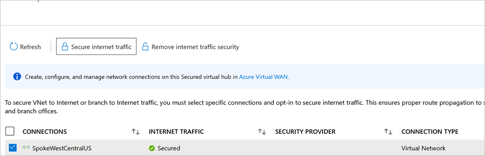

# Deploy a security partner provider

*Security partner providers* in Azure Firewall Manager allow you to use your familiar, best-in-breed third-party security-as-a-service (SECaaS) offerings to protect Internet access for your users.

To learn more about supported scenarios and best practice guidelines, see [What are security partner providers?](trusted-security-partners.md)

Integrated third-party Security as a service (SECaaS) partners are now available in all Azure public cloud regions. **Zscaler** integration will be generally available July 3, 2020. **Check Point** is a supported SECaaS partner and will be in preview on July 3, 2020. **iboss** integration will be generally available on July 31, 2020.

## Deploy a third-party security provider in a new hub

Skip this section if you are deploying a third-party provider into an existing hub.

1. Sign in to the Azure portal at https://portal.azure.com.
2. In **Search**, type **Firewall Manager** and select it under **Services**.
3. Navigate to **Getting Started**. Select **View secured virtual hubs**.
4. Select **Create new secured virtual hub**.
5. Enter you subscription and resource group, select a supported region, and add your hub and virtual WAN information. 
6. Select **Include VPN gateway to enable Security Partner Providers**.
7. Select the **Gateway scale units** appropriate for your requirements.
8. Select **Next: Azure Firewall**
   > [!NOTE]
   > Security partner providers connect to your hub using VPN Gateway tunnels. If you delete the VPN Gateway, the connections to your security partner providers are lost.
9. If you want to deploy Azure Firewall to filter private traffic along with third-party service provider to  filter Internet traffic, select a policy for Azure Firewall. See the [supported scenarios](trusted-security-partners.md#key-scenarios).
10. If you want to only deploy a third-party security provider in the hub, select **Azure Firewall: Enabled/Disabled** to set it to **Disabled**. 
11. Select  **Next: Security Partner Provider**.
12. Set **Security Partner Provider** to **Enabled**. 
13. Select a partner. 
14. Select **Next: Review + create**. 
15. Review the content and then select **Create**.

The VPN gateway deployment can take more than 30 minutes.

To verify that the hub has been created, navigate to Azure Firewall Manager->Secured Hubs. Select the hub->Overview page to show the partner name and the status as **Security Connection Pending**.

Once the hub is created and the security partner is set up, continue on to connect the security provider to the hub.

## Deploy a third-party security provider in an existing hub

You can also select an existing hub in a Virtual WAN and convert that to a *secured virtual hub*.

1. In **Getting Started**, select **View secured virtual hubs**.
2. Select **Convert existing hubs**.
3. Select a subscription and an existing hub. Follow rest of the steps to deploy a third-party provider in a new hub.

Remember that a VPN gateway must be deployed to convert an existing hub to secured hub with third-party providers.

## Configure third-party security providers to connect to a secured hub

To set up tunnels to your virtual hub’s VPN Gateway, third-party providers need access rights to your hub. To do this, associate a service principal with your subscription or resource group, and grant access rights. You then must give these credentials to the third-party using their portal.

### Create and authorize a service principal

1. Create Azure Active Directory (AD) service principal: You can skip the redirect URL. 

   [How to: Use the portal to create an Azure AD application and service principal that can access resources](../active-directory/develop/howto-create-service-principal-portal.md#register-an-application-with-azure-ad-and-create-a-service-principal)
2. Add access rights and scope for the service principal.
   [How to: Use the portal to create an Azure AD application and service principal that can access resources](../active-directory/develop/howto-create-service-principal-portal.md#register-an-application-with-azure-ad-and-create-a-service-principal)

   > [!NOTE]
   > You can limit access to only your resource group for more granular control.

### Visit partner portal

1. Follow your partner provided instructions to complete the setup. This includes submitting AAD information to detect and connect to the hub, update the egress policies, and check connectivity status and logs.

   - [Zscaler: Configure Microsoft Azure Virtual WAN integration](https://help.zscaler.com/zia/configuring-microsoft-azure-virtual-wan-integration).
   - [Check Point (preview): Configure Microsoft Azure Virtual WAN integration](https://sc1.checkpoint.com/documents/Infinity_Portal/WebAdminGuides/EN/CloudGuard-Connect-Azure-Virtual-WAN/Default.htm).
   - [iboss (preview): Configure Microsoft Azure Virtual WAN integration](https://www.iboss.com/blog/securing-microsoft-azure-with-iboss-saas-network-security). 
   
2. You can look at the tunnel creation status on the Azure Virtual WAN portal in Azure. Once the tunnels show **connected** on both Azure and the partner portal, continue with the next steps to set up routes to select which branches and VNets should send Internet traffic to the partner.

## Configure route settings

1. Browse to the Azure Firewall Manager -> Secured Hubs. 
2. Select a hub. The Hub status should now show **Provisioned** instead of **Security Connection Pending**.

   Ensure the third-party provider can connect to the hub. The tunnels on the VPN gateway should be in a **Connected** state. This state is more reflective of the connection health between the hub and the third-party partner, compared to previous status.
3. Select the hub, and navigate to **Route Settings**.

   When you deploy a third-party provider into the hub, it converts the hub into a *secured virtual hub*. This ensures that the third-party provider is advertising a 0.0.0.0/0 (default) route to the hub. However, VNet connections and sites connected to the hub don’t get this route unless you opt-in on which connections should get this default route.
4. Under **Internet traffic**, select **VNet-to-Internet** or **Branch-to-Internet** or both so routes are configured send via the third party.

   This only indicates which type of traffic should be routed to the hub, but it doesn’t affect the routes on VNets or branches yet. These routes are not propagated to all VNets/branches attached to the hub by default.
5. You must select **secure connections** and select the connections on which these routes should be set. This indicates which VNets/branches can start sending Internet traffic to the third-party provider.
6. From **Route settings**, select **Secure connections** under Internet traffic, then select the VNet or branches (*sites* in Virtual WAN) to be secured. Select **Secure Internet traffic**.
   
7. Navigate back to the hubs page. The hub’s **security partner provider** status should now be  **Secured**.

## Branch or VNet Internet traffic via third-party service

Next, you can check if VNet virtual machines or the branch site can access the Internet and validate that the traffic is flowing to the third-party service.

After finishing the route setting steps, the VNet virtual machines as well as the branch sites are sent a 0/0 to third party service route. You can't RDP or SSH into these virtual machines. To sign in, you can deploy the [Azure Bastion](../bastion/bastion-overview.md) service in a peered VNet.

## Next steps

- [Tutorial: Secure your cloud network with Azure Firewall Manager using the Azure portal](secure-cloud-network.md)