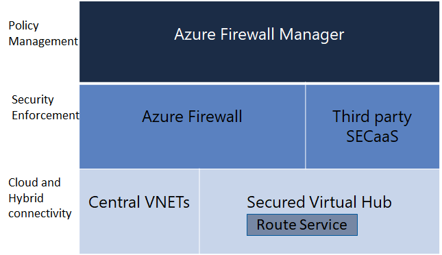

# What is Azure Firewall Manager?

Azure Firewall Manager is a security management service that provides central security policy and route management for cloud-based security perimeters. It works with [Azure Virtual WAN Hub](../virtual-wan/virtual-wan-about.md#resources), a  Microsoft-managed virtual network that lets you easily create hub and spoke architectures. When security and routing policies are associated with such a hub, it is referred to as a *[secured virtual hub](secured-virtual-hub.md)*. 

## Azure Firewall Manager Features

Azure Firewall Manager offers the following features:

### Hierarchical policies (global and local)​

You can use Firewall Manager to centrally manage firewall and route policy across multiple secured virtual hubs. Your central IT teams can author global firewall policies to enforce organization wide firewall policy across teams. Locally authored firewall policies allow a DevOps self-service model for better agility. 

### Centralized route management for traffic attraction​

You can use Azure Firewall for VNet to VNet traffic policies and micro-segmentation. To secure VNet to Internet traffic, you can use either Azure Firewall or third-party NSaaS (Network Security as a Service) providers. Firewall Manager automatically routes traffic to Azure Firewall or third-party NSaaS providers without the need to set up manual user defined routes.

### Integrated with third party NSaaS for advanced security

In addition to Azure Firewall, you can integrate third-party NSaaS (Security as a Service) providers to provide additional network protection for your VNet and branch Internet connections.

### Automated multiple Azure Firewall deployments​

You can centrally deploy and configure multiple Azure Firewall instances that span different Azure regions and subscriptions. 

## Known issues

Azure Firewall Manager has the following known issues:

|Issue  |Description  |Mitigation  |
|---------|---------|---------|

## Next steps

