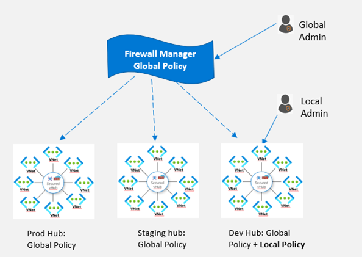

# What is Azure Firewall Manager Preview?

[!INCLUDE [Preview](../../includes/firewall-manager-preview-notice.md)]

Azure Firewall Manager Preview is a security management service that provides central security policy and route management for cloud-based security perimeters. It works with [Azure Virtual WAN Hub](../virtual-wan/virtual-wan-about.md#resources), a  Microsoft-managed resource that lets you easily create hub and spoke architectures. When security and routing policies are associated with such a hub, it is referred to as a *[secured virtual hub](secured-virtual-hub.md)*. 

## Azure Firewall Manager Preview features

Azure Firewall Manager Preview offers the following features:

### Central Azure Firewall deployment and configuration​

You can centrally deploy and configure multiple Azure Firewall instances that span different Azure regions and subscriptions. 

### Hierarchical policies (global and local)​

You can use Azure Firewall Manager Preview to centrally manage Azure Firewall policies across multiple secured virtual hubs. Your central IT teams can author global firewall policies to enforce organization wide firewall policy across teams. Locally authored firewall policies allow a DevOps self-service model for better agility.

### Integrated with third-party security-as-a-service for advanced security

In addition to Azure Firewall, you can integrate third-party security as a service (SECaaS) providers to provide additional network protection for your VNet and branch Internet connections.

- VNet to Internet (V2I) traffic filtering

   - Filter outbound virtual network traffic with your preferred third-party security provider.
   - Leverage advanced user-aware Internet protection for your cloud workloads running on Azure.

- Branch to Internet (B2I) traffic filtering

   Leverage your Azure connectivity and global distribution to easily add third-party filtering for branch to Internet scenarios.

For more information about trusted security providers, see [What are Azure Firewall Manager trusted security partners (preview)?](trusted-security-partners.md)

### Centralized route management

Easily route traffic to your secured hub for filtering and logging without the need to manually set up User Defined Routes (UDR) on spoke virtual networks. You can use third-party providers for Branch to Internet (B2I) traffic filtering, side by side with Azure Firewall for Branch to VNet (B2V), VNet to VNet (V2V) and VNet to Internet (V2I). You can also use third-party providers for V2I traffic filtering as long as Azure Firewall is not required for B2V or V2V. 

## Region availability

The following regions are supported for the public preview:

- West Europe, North Europe, France Central, France South, UK South, UK West
- Australia East, Australia Central, Australia Central 2, Australia Southeast
- Canada Central
- East US, West US, East US 2, South Central US, West US 2, Central US, North Central US, West Central US

Azure Firewall Policies can only be created in these regions, but they can be used across regions. For example, you can create a policy in West US, and use it in East US. 

## Known issues

Azure Firewall Manager Preview has the following known issues:

|Issue  |Description  |Mitigation  |
|---------|---------|---------|
|Manually created central VNets not supported|Currently, Azure Firewall Manager supports networks created with Virtual Hubs. Using your own manually created hub VNet is not yet supported.|For now, use Azure Firewall Manager with hub and spoke networks created with Virtual Hubs Currently investigating.
|Third-party filtering limitations|V2I traffic filtering with third-party providers is not supported with Azure Firewall B2V and V2V.|Currently investigating.|
|Traffic splitting not currently supported|Office 365 and Azure Public PaaS traffic splitting is not currently supported. As such, selecting a third-party provider for V2I or B2I also sends all Azure Public PaaS and Office 365 traffic via the partner service.|Currently investigating traffic splitting at the hub.
|One hub per region|You can't have more than one hub per region|Create multiple virtual WANs in a region.|
|Base policies must be in same region as local policy|Create all your local policies in the same region as the base policy. You can still apply a policy that was created in one region on a secured hub from another region.|Currently investigating.|

## Next steps

- Review [Azure Firewall Manager Preview deployment overview](deployment-overview.md)
- Learn about [secured Virtual Hubs](secured-virtual-hub.md).