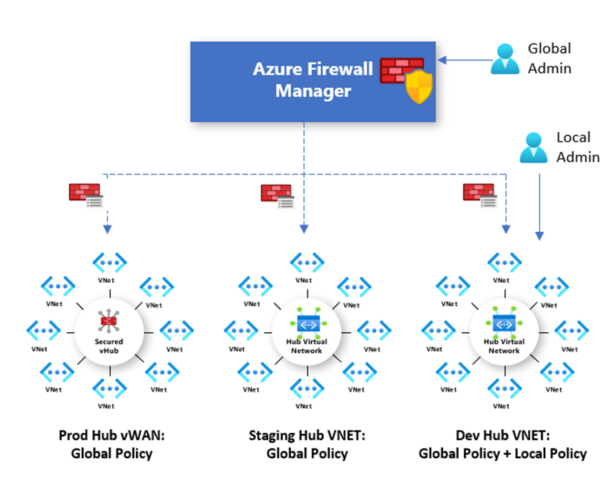

# Azure Firewall Manager policy overview

Firewall policy is an Azure resource that contains NAT, network, and application rule collections as well as Threat Intelligence settings. It's a global resource that can be used across multiple Azure Firewall instances in Secured Virtual Hubs and Hub Virtual Networks. Policies work across regions and subscriptions.

## Policy creation and association

A policy can be created and managed in multiple ways, including the Azure portal, REST API, templates, Azure PowerShell, and CLI.

You can also migrate existing rules from Azure Firewall using the portal or Azure PowerShell to create policies. For more information, see [How to migrate Azure Firewall configurations to Azure Firewall policy](migrate-to-policy.md). 

Policies can be associated with one or more virtual hubs or VNets. The firewall can be in any subscription associated with your account and in any region.

## Hierarchical policies

New policies can be created from scratch or inherited from existing policies. Inheritance allows DevOps to create local firewall policies on top of organization mandated base policy.

Policies created with non-empty parent policies inherit all rule collections from the parent policy. 
Network rule collections inherited from a parent policy are always prioritized above network rule collections defined as part of a new policy. The same logic also applies to application rule collections. However, network rule collections are always processed before application rule collections regardless of inheritance.

Threat Intelligence mode is also inherited from the parent policy. You can set your threat Intelligence mode to a different value to override this behavior, but you can't turn it off. It's only possible to override with a stricter value. For example, if your parent policy is set to **Alert only**, you can configure this local policy to **Alert and deny**.

Like Threat Intelligence mode, the Threat Intelligence allow list is inherited from the parent policy. The child policy can add additional IP addresses to the allow list.

NAT rule collections aren't inherited because they're specific to a given firewall.

With inheritance, any changes to the parent policy are automatically applied down to associated firewall child policies.

## Traditional rules and policies

Azure Firewall supports both traditional rules and policies. The following table compares policies and rules:

|         |Policy  |Rules  |
|---------|---------|---------|
|Contains     |NAT, Network, Application rules, custom DNS and DNS proxy settings, IP Groups, and Threat Intelligence settings (including allow list)|NAT, Network, and Application rules, custom DNS and DNS proxy settings, IP Groups, and Threat Intelligence settings (including allow list)|
|Protects     |Virtual hubs and Virtual Networks|Virtual Networks only|
|Portal experience     |Central management using Firewall Manager|Standalone firewall experience|
|Multiple firewall support     |Firewall Policy is a separate resource that can be used across firewalls|Manually export and import rules, or using third-party management solutions |
|Pricing     |Billed based on firewall association. See [Pricing](#pricing).|Free|
|Supported deployment mechanisms     |Portal, REST API, templates, Azure PowerShell, and CLI|Portal, REST API, templates, PowerShell, and CLI. |

## Pricing

Policies are billed based on firewall associations. A policy with zero or one firewall association is free of charge. A policy with multiple firewall associations is billed at a fixed rate. For more information, see [Azure Firewall Manager Pricing](https://azure.microsoft.com/pricing/details/firewall-manager/).

## Next steps

To learn how to deploy an Azure Firewall, see [Tutorial: Secure your cloud network with Azure Firewall Manager using the Azure portal](secure-cloud-network.md).
